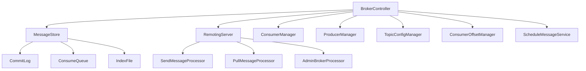
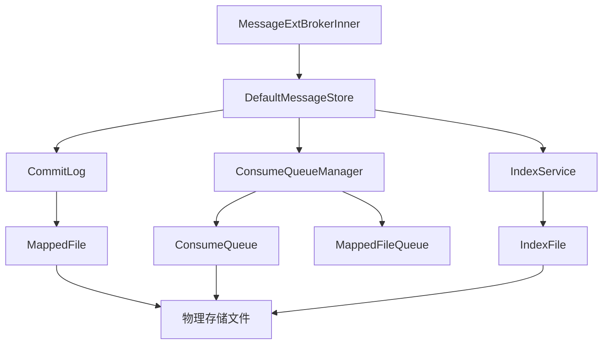
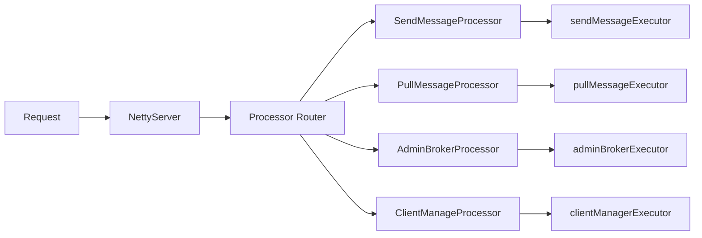
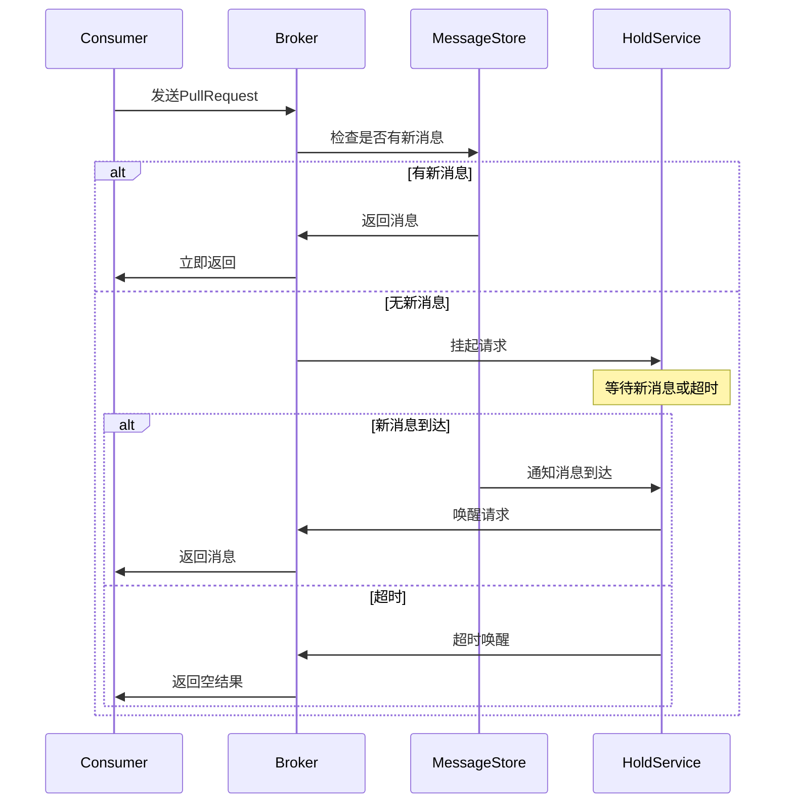

# RocketMQ Broker 模块架构分析

## 概述

RocketMQ Broker 模块是整个消息队列系统的核心存储与转发组件，负责消息的接收、存储、投递以及各种管理功能。Broker 作为消息存储的核心，采用了高性能的存储设计、完善的调度机制和灵活的扩展架构，为整个消息队列系统提供稳定可靠的服务。

## 目录结构

```
broker/
├── src/main/java/org/apache/rocketmq/broker/
│   ├── admin/                           # 管理功能
│   │   ├── BrokerAdmin.java            # Broker管理接口
│   │   ├── BrokerStats.java            # 统计信息
│   │   └── BrokerStatusManager.java    # 状态管理
│   ├── api/                            # 核心接口定义
│   │   ├── MessageListener.java        # 消息监听器
│   │   ├── SendMessageCallback.java    # 发送回调
│   │   └── TransactionListener.java    # 事务监听器
│   ├── client/                         # 客户端管理
│   │   ├── ConsumerConnection.java     # 消费者连接
│   │   ├── ConsumerGroupInfo.java      # 消费者组信息
│   │   ├── ConsumerManager.java        # 消费者管理器
│   │   ├── DefaultConsumerIdsChangeListener.java  # 消费者ID变化监听器
│   │   ├── ProducerConnection.java     # 生产者连接
│   │   ├── ProducerManager.java        # 生产者管理器
│   │   └── NetworkClient.java          # 网络客户端
│   ├── controller/                     # 核心控制器
│   │   ├── BrokerController.java       # Broker主控制器
│   │   └── BrokerFastController.java   # 快速控制器
│   ├── dledger/                        # DLedger相关（主从切换）
│   │   ├── DLedgerCommitLog.java       # DLedger提交日志
│   │   └── DLedgerRoleChangeHandler.java  # 角色变更处理器
│   ├── filter/                         # 消息过滤
│   │   ├── ConsumerFilterData.java     # 消费者过滤数据
│   │   ├── ExpressionForRetryMessageFilter.java  # 重试消息表达式过滤
│   │   ├── ExpressionMessageFilter.java  # 表达式消息过滤
│   │   └── ParserStrategy.java         # 解析策略
│   ├── hook/                           # 钩子机制
│   │   ├── SendMessageHook.java        # 发送消息钩子
│   │   ├── ConsumeMessageHook.java     # 消费消息钩子
│   │   └── FilterMessageHook.java      # 过滤消息钩子
│   ├── latency/                        # 延迟监控
│   │   ├── BrokerFastFailure.java      # Broker快速失败机制
│   │   └── BrokerLatencyFix.java       # 延迟修复
│   ├── loadbalance/                    # 负载均衡
│   │   ├── AllocateMessageQueueStrategy.java  # 分配策略
│   │   ├── AllocateMessageQueueAveragely.java  # 平均分配策略
│   │   └── AllocateMessageQueueByConfig.java   # 配置分配策略
│   ├── longpolling/                    # 长轮询
│   │   ├──NotifyMessageArrivingListener.java   # 消息到达通知监听器
│   │   ├── PullRequestHoldService.java         # 拉取请求保持服务
│   │   └── PullRequest.java                   # 拉取请求
│   ├── offset/                         # 消费偏移量管理
│   │   ├── ConsumerOffsetManager.java   # 消费者偏移量管理器
│   │   └── ConsumerOffsetRedisManager.java  # Redis偏移量管理器
│   ├── outapi/                         # 对外API
│   │   ├── BrokerOuterAPI.java         # Broker对外API
│   │   └── DefaultBrokerOuterAPI.java  # 默认实现
│   ├── plugin/                         # 插件系统
│   │   ├── AbstractPluginMessageStore.java    # 抽象插件消息存储
│   │   ├── MessageStorePlugin.java           # 消息存储插件
│   │   └── MessageStorePluginContext.java    # 插件上下文
│   ├── processor/                      # 请求处理器
│   │   ├── AbstractSendMessageProcessor.java  # 抽象发送消息处理器
│   │   ├── AdminBrokerProcessor.java          # 管理请求处理器
│   │   ├── ClientManageProcessor.java         # 客户端管理处理器
│   │   ├── ConsumerManageProcessor.java       # 消费者管理处理器
│   │   ├── EndTransactionProcessor.java       # 事务结束处理器
│   │   ├── PullMessageProcessor.java          # 拉取消息处理器
│   │   ├── QueryMessageProcessor.java         # 查询消息处理器
│   │   ├── SendMessageProcessor.java          # 发送消息处理器
│   │   ├── StatsBrokerProcessor.java          # 统计处理器
│   │   └── TransactionMessageProcessor.java   # 事务消息处理器
│   ├── quota/                          # 配额管理
│   │   └── IdentityQuotaManager.java   # 身份配额管理器
│   ├── schedule/                       # 调度任务
│   │   ├── BrokerStatsSchedule.java   # 统计调度
│   │   ├── CleanDataSchedule.java      # 清理数据调度
│   │   └── CleanCommitLogSchedule.java # 清理CommitLog调度
│   ├── slave/                          # 从Broker相关
│   │   ├── SlaveSynchronize.java       # 从节点同步
│   │   └── HAClient.java              # HA客户端
│   ├── subscription/                   # 订阅管理
│   │   ├── SubscriptionGroupManager.java      # 订阅组管理器
│   │   └── ManagerBroker.java         # 管理Broker
│   ├── topic/                          # 主题管理
│   │   ├── TopicConfig.java           # 主题配置
│   │   ├── TopicConfigManager.java    # 主题配置管理器
│   │   ├── TopicQueueMappingManager.java  # 主题队列映射管理器
│   │   └── TopicRouteInfo.java        # 主题路由信息
│   ├── transaction/                    # 事务消息
│   │   ├── TransactionalMessageBridge.java     # 事务消息桥接
│   │   ├── TransactionalMessageCheckService.java # 事务消息检查服务
│   │   ├── TransactionalMessageService.java      # 事务消息服务
│   │   └── TransactionValueOperator.java        # 事务值操作器
│   ├── util/                          # 工具类
│   │   ├── BrokerUtil.java           # Broker工具类
│   │   ├── InetSocketAddressUtil.java # 网络地址工具
│   │   └── TopAddressUtils.java       # 地址工具
│   └── BrokerStartup.java             # Broker启动类
└── src/test/java/                     # 测试代码
```

## 架构设计

### 1. 整体架构思想

RocketMQ Broker 模块采用了**分层架构**和**模块化设计**的理念：

- **职责分离**：每个组件负责特定的功能，通过接口进行通信
- **高并发设计**：基于异步处理和线程池隔离
- **存储优化**：顺序写、零拷贝等高性能存储技术
- **可扩展性**：插件机制支持功能扩展
- **高可用性**：主从复制、DLedger支持

### 2. 核心架构组件

#### 2.1 BrokerController - 核心控制器



`BrokerController` 是整个 Broker 的核心调度中心：

```java
public class BrokerController {
    // 核心组件
    private final MessageStore messageStore;                    // 消息存储
    private final RemotingServer remotingServer;                // 远程服务
    private final RemotingServer fastRemotingServer;            // 快速远程服务
    private final ConsumerManager consumerManager;              // 消费者管理
    private final ProducerManager producerManager;              // 生产者管理
    private final TopicConfigManager topicConfigManager;        // 主题配置管理
    private final ConsumerOffsetManager consumerOffsetManager;  // 消费偏移管理

    // 线程池
    private final ExecutorService sendMessageExecutor;          // 发送消息线程池
    private final ExecutorService pullMessageExecutor;          // 拉取消息线程池
    private final ExecutorService adminBrokerExecutor;          // 管理请求线程池
    private final ExecutorService clientManagerExecutor;        // 客户端管理线程池

    // 调度服务
    private final ScheduledExecutorService scheduledExecutorService;
}
```

**设计亮点**：

1. **统一管理**：集中管理所有核心组件的生命周期
2. **线程池隔离**：不同类型的请求使用独立的线程池，避免相互影响
3. **调度管理**：定时处理各种后台任务
4. **组件协调**：协调各组件之间的交互

#### 2.2 消息存储架构

##### 2.2.1 存储层次结构



##### 2.2.2 存储核心组件

**CommitLog - 提交日志**：
```java
public class CommitLog {
    // 核心字段
    private final MappedFileQueue mappedFileQueue;    // 文件队列
    private final FlushCommitLogService flushCommitLogService;  // 刷盘服务
    private final ThreadLocal<MessageExtBatchEncoder> batchEncoder; // 批量编码器

    // 存储消息
    public PutMessageResult putMessage(final MessageExtBrokerInner msg);
}
```

**ConsumeQueue - 消费队列**：
```java
public class ConsumeQueue {
    // 核心字段
    private final String topic;                    // 主题
    private final int queueId;                     // 队列ID
    private final MappedFileQueue mappedFileQueue; // 文件队列

    // 存储索引信息
    public void putMessagePositionInfoWrapper(DispatchRequest request);
}
```

**存储设计精髓**：

1. **顺序写**：所有消息顺序写入CommitLog，最大化磁盘I/O性能
2. **索引分离**：ConsumeQueue存储消费索引，与实际消息分离
3. **内存映射**：使用MappedFile实现零拷贝
4. **异步刷盘**：支持同步和异步两种刷盘模式

#### 2.3 请求处理架构

##### 2.3.1 处理器体系



##### 2.3.2 核心处理器

**SendMessageProcessor - 消息发送处理器**：
```java
public class SendMessageProcessor extends AbstractSendMessageProcessor {
    @Override
    public RemotingCommand processRequest(ChannelHandlerContext ctx,
                                        RemotingCommand request) {
        // 处理同步消息发送
        RemotingCommand response = handleSendMessage(ctx, request);
        return response;
    }

    private RemotingCommand handleSendMessage(ChannelHandlerContext ctx,
                                            RemotingCommand request) {
        // 消息验证
        // 存储消息
        // 返回响应
    }
}
```

**PullMessageProcessor - 消息拉取处理器**：
```java
public class PullMessageProcessor implements NettyRequestProcessor {
    @Override
    public RemotingCommand processRequest(ChannelHandlerContext ctx,
                                        RemotingCommand request) {
        // 解析拉取请求
        PullMessageRequestHeader requestHeader =
            (PullMessageRequestHeader) request.decodeCommandCustomHeader(PullMessageRequestHeader.class);

        // 查找消息
        GetMessageResult getMessageResult =
            this.brokerController.getMessageStore().getMessage(requestHeader);

        // 构建响应
        return response;
    }
}
```

#### 2.4 长轮询架构

##### 2.4.1 长轮询流程



##### 2.4.2 PullRequestHoldService

```java
public class PullRequestHoldService extends ServiceThread {
    // 挂起的拉取请求
    private final ConcurrentHashMap<String/* topic@queueId */,
        ArrayList<PullRequest>> pullRequestTable = new ConcurrentHashMap<>();

    @Override
    public void run() {
        while (!this.isStopped()) {
            // 等待通知或超时
            waitForRunning(5 * 1000);

            // 检查挂起的请求
            checkHoldRequest();
        }
    }

    public void notifyMessageArriving(final String topic, final int queueId,
                                     final long maxOffset) {
        // 通知消息到达
        String key = topic + "@" + queueId;
        ArrayList<PullRequest> requestList = pullRequestTable.get(key);
        if (requestList != null) {
            // 唤醒等待的请求
            notifyMessageArriving(requestList);
        }
    }
}
```

### 3. 高性能设计

#### 3.1 存储优化

- **顺序写**：CommitLog顺序写入，避免随机写性能瓶颈
- **零拷贝**：使用MappedFile实现内存映射，减少数据拷贝
- **批量处理**：支持消息批量发送和接收
- **异步刷盘**：支持异步刷盘提高吞吐量

#### 3.2 并发控制

- **线程池隔离**：不同类型请求使用独立线程池
- **读写分离**：ConsumeQueue的读写分离设计
- **无锁数据结构**：大量使用ConcurrentHashMap等无锁结构
- **信号量限流**：通过信号量控制并发访问

#### 3.3 内存管理

- **内存池**：复用对象减少GC压力
- **堆外内存**：DirectBuffer减少JVM堆内存使用
- **缓存机制**：热点消息缓存提高访问速度

### 4. 可靠性设计

#### 4.1 持久化机制

- **同步/异步刷盘**：支持两种刷盘模式
- **主从复制**：支持主从同步保证数据不丢失
- **DLedger**：基于Raft协议的主从切换机制

#### 4.2 故障恢复

- **文件恢复**：启动时从CommitLog恢复ConsumeQueue
- **重试机制**：发送失败的消息支持重试
- **HA切换**：主节点故障时从节点自动切换

### 5. 扩展性设计

#### 5.1 插件机制

```java
public abstract class MessageStorePlugin {
    // 存储前处理
    public abstract PutMessageResult beforePut(MessageStorePluginContext context,
                                              PutMessageResult result);

    // 存储后处理
    public abstract PutMessageResult afterPut(MessageStorePluginContext context,
                                             PutMessageResult result);
}
```

#### 5.2 钩子机制

- **SendMessageHook**：消息发送钩子
- **ConsumeMessageHook**：消息消费钩子
- **FilterMessageHook**：消息过滤钩子

### 6. 监控与管理

#### 6.1 统计信息

- **消息吞吐量**：TPS、QPS统计
- **存储状态**：磁盘使用、文件大小
- **连接信息**：客户端连接数、状态

#### 6.2 管理功能

- **主题管理**：创建、更新、删除主题
- **消费者管理**：消费者组管理、偏移量查询
- **系统管理**：Broker状态、配置修改

### 7. 设计模式应用

Broker模块广泛使用了多种设计模式：

1. **单例模式**：BrokerController保证全局唯一
2. **模板方法模式**：AbstractSendMessageProcessor定义处理流程
3. **观察者模式**：消息到达通知机制
4. **策略模式**：不同的存储策略
5. **责任链模式**：CommitLogDispatcher调度链
6. **工厂模式**：MessageStoreFactory
7. **代理模式**：AbstractPluginMessageStore
8. **门面模式**：BrokerController作为统一入口

### 8. 架构优势

1. **高性能**：顺序写、零拷贝、异步处理
2. **高可靠性**：持久化、主从复制、故障恢复
3. **高扩展性**：插件机制、钩子机制
4. **易管理**：丰富的管理接口和监控功能
5. **低延迟**：长轮询、批量处理、内存映射

### 9. 总结

RocketMQ Broker 模块是一个设计精良、性能优异的消息存储与转发系统。它采用了分层架构和模块化设计，通过多种优化技术实现了高性能和高可靠性。模块具有良好的扩展性，支持插件化扩展和功能增强。完善的监控和管理功能使其能够满足大规模分布式系统的需求。

通过合理的架构设计和优化的存储机制，Broker 模块成为 RocketMQ 能够支撑海量消息处理的核心组件。