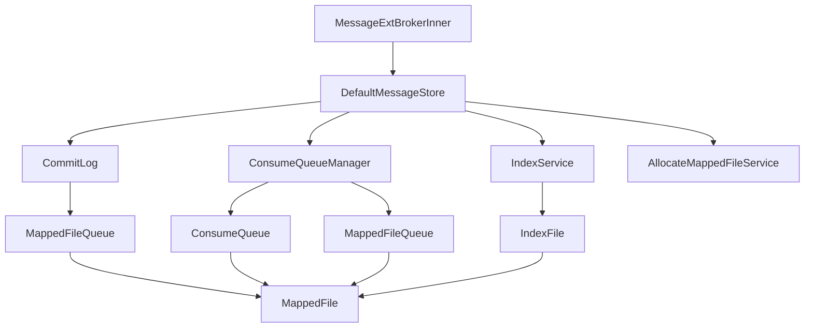

# Broker 模块核心组件分析

## 1. BrokerController - 核心控制器

### 1.1 组件概述

`BrokerController` 是 Broker 模块的核心控制器，负责统一管理所有组件的生命周期和协调各组件之间的交互。它采用门面模式，为整个 Broker 系统提供统一的控制入口。

### 1.2 核心职责

```java
public class BrokerController {
    // === 存储管理 ===
    private final MessageStore messageStore;                    // 消息存储核心

    // === 网络通信 ===
    private final RemotingServer remotingServer;                // 远程服务服务器
    private final RemotingServer fastRemotingServer;            // 快速响应服务器

    // === 客户端管理 ===
    private final ConsumerManager consumerManager;              // 消费者管理器
    private final ProducerManager producerManager;              // 生产者管理器
    private final ClientHousekeepingService clientHousekeepingService;  // 客户端保活服务

    // === 配置管理 ===
    private final TopicConfigManager topicConfigManager;        // 主题配置管理
    private final ConsumerOffsetManager consumerOffsetManager;  // 消费偏移管理
    private final SubscriptionGroupManager subscriptionGroupManager;  // 订阅组管理

    // === 事务消息 ===
    private final TransactionalMessageService transactionalMessageService;  // 事务消息服务
    private final TransactionalMessageCheckService transactionalMessageCheckService;  // 事务检查服务

    // === 调度服务 ===
    private final ScheduledExecutorService scheduledExecutorService;
    private final BrokerStatsManager brokerStatsManager;       // 统计管理
    private final MessageStoreConfig messageStoreConfig;       // 存储配置
}
```

### 1.3 核心方法分析

#### 1.3.1 初始化流程

```java
public boolean initialize() {
    // 1. 初始化消息存储
    boolean result = this.messageStore.load();
    if (!result) {
        return false;
    }

    // 2. 注册处理器
    this.registerProcessor();

    // 3. 初始化定时任务
    initialTransaction();
    initialAcl();
    initialSslContext();
    initialRpcHooks();

    return true;
}
```

**初始化流程设计精髓**：

1. **存储优先**：优先初始化存储组件，确保数据完整性
2. **功能分离**：不同功能的初始化相互独立
3. **配置驱动**：根据配置决定启动哪些功能模块

#### 1.3.2 处理器注册

```java
private void registerProcessor() {
    // 发送消息处理器 - 使用独立线程池
    SendMessageProcessor sendProcessor = new SendMessageProcessor(this);
    this.remotingServer.registerProcessor(RequestCode.SEND_MESSAGE, sendProcessor,
        this.sendMessageExecutor);
    this.remotingServer.registerProcessor(RequestCode.SEND_MESSAGE_V2, sendProcessor,
        this.sendMessageExecutor);

    // 拉取消息处理器 - 使用独立线程池
    PullMessageProcessor pullProcessor = new PullMessageProcessor(this);
    this.remotingServer.registerProcessor(RequestCode.PULL_MESSAGE, pullProcessor,
        this.pullMessageExecutor);
    this.fastRemotingServer.registerProcessor(RequestCode.PULL_MESSAGE, pullProcessor,
        this.pullMessageExecutor);

    // 管理请求处理器 - 使用独立线程池
    AdminBrokerProcessor adminProcessor = new AdminBrokerProcessor(this);
    this.remotingServer.registerProcessor(RequestCode.GET_BROKER_RUNTIME_INFO,
        adminProcessor, this.adminBrokerExecutor);
    this.remotingServer.registerProcessor(RequestCode.UPDATE_NAMESRV_CONFIG,
        adminProcessor, this.adminBrokerExecutor);

    // 客户端管理处理器 - 使用共享线程池
    ClientManageProcessor clientProcessor = new ClientManageProcessor(this);
    this.remotingServer.registerProcessor(RequestCode.HEART_BEAT,
        clientProcessor, this.clientManagerExecutor);
    this.remotingServer.registerProcessor(RequestCode.UNREGISTER_CLIENT,
        clientProcessor, this.clientManagerExecutor);

    // 消费者管理处理器
    ConsumerManageProcessor consumerProcessor = new ConsumerManageProcessor(this);
    this.remotingServer.registerProcessor(RequestCode.GET_CONSUMER_LIST_BY_GROUP,
        consumerProcessor, this.consumerManageExecutor);
}
```

**处理器注册设计亮点**：

1. **线程池隔离**：不同类型的请求使用不同线程池，避免相互影响
2. **双服务器支持**：普通请求和快速请求使用不同服务器
3. **精细化分类**：根据请求类型和优先级分配到不同线程池

#### 1.3.3 启动流程

```java
public void start() throws Exception {
    // 1. 启动消息存储
    this.messageStore.start();

    // 2. 启动远程服务器
    this.remotingServer.start();
    this.fastRemotingServer.start();

    // 3. 启动文件监听服务
    FileWatchService fileWatchService = new FileWatchService(
        new String[] {
            this.messageStoreConfig.getStorePathCommitLog(),
            this.messageStoreConfig.getStorePathConsumeQueue()
        },
        this.scheduledExecutorService);
    fileWatchService.start();

    // 4. 启动定时任务
    this.brokerStatsManager.start();
    this.brokerFastFailure.start();
    this.brokerOuterAPI.start();

    // 5. 启动保活服务
    this.clientHousekeepingService.start();

    // 6. 启动事务服务
    this.transactionalMessageCheckService.start();
}
```

### 1.4 设计模式应用

- **门面模式**：为复杂的子系统提供统一接口
- **单例模式**：每个Broker实例只有一个Controller
- **模板方法模式**：定义标准的启动、停止流程
- **观察者模式**：通知各个组件状态变化

## 2. MessageStore - 消息存储核心

### 2.1 组件概述

`MessageStore` 是 Broker 的消息存储核心接口，负责消息的持久化存储、查询和管理。默认实现为 `DefaultMessageStore`，还支持基于 DLedger 的分布式存储实现。

### 2.2 存储架构设计



### 2.3 核心组件详解

#### 2.3.1 CommitLog - 提交日志

```java
public class CommitLog {
    // 核心字段
    private final MappedFileQueue mappedFileQueue;              // 文件队列
    private final FlushCommitLogService flushCommitLogService;  // 刷盘服务
    private final ThreadLocal<MessageExtBatchEncoder> batchEncoder; // 批量编码器

    // 关键配置
    private final int mappedFileSize;              // 文件大小
    private final int commitLogLeastPages;         // 提交最少页数
    private final int flushLeastPages;             // 刷盘最少页数

    /**
     * 存储消息的核心方法
     */
    public PutMessageResult putMessage(final MessageExtBrokerInner msg) {
        // 1. 设置消息时间戳
        msg.setStoreTimestamp(System.currentTimeMillis());

        // 2. 设置消息CRC校验
        msg.setBodyCRC(UtilAll.crc32(msg.getBody()));

        // 3. 返回结果处理
        return mappedFileQueue.appendMessages(msg);
    }

    /**
     * 恢复消息
     */
    public void recover() {
        // 从最后一个文件开始恢复
        MappedFile mappedFile = this.mappedFileQueue.getLastMappedFile();

        if (mappedFile != null) {
            // 检查文件是否需要恢复
            if (mappedFile.isFull()) {
                // 创建新文件
                mappedFile = this.mappedFileQueue.getLastMappedFile(0);
            }

            // 恢复文件中的消息
            doRecover(mappedFile);
        }
    }
}
```

**CommitLog 设计精髓**：

1. **顺序写**：所有消息顺序写入，最大化磁盘I/O性能
2. **批量编码**：使用ThreadLocal避免线程冲突
3. **异步刷盘**：支持同步和异步两种刷盘模式
4. **文件管理**：自动创建和切换文件

#### 2.3.2 ConsumeQueue - 消费队列

```java
public class ConsumeQueue {
    // 核心字段
    private final String topic;                    // 主题名称
    private final int queueId;                     // 队列ID
    private final MappedFileQueue mappedFileQueue; // 文件队列
    private final String storePath;                // 存储路径

    // 每个条目的大小（8字节偏移量 + 4字节大小 + 8字节tagsCode）
    private static final int CQ_STORE_UNIT_SIZE = 20;

    /**
     * 存储消息位置信息
     */
    public void putMessagePositionInfoWrapper(DispatchRequest request) {
        // 最大重试次数
        final int maxRetries = 30;
        boolean canWrite = true;

        for (int i = 0; i < maxRetries && canWrite; i++) {
            try {
                // 将消息位置信息存储到ConsumeQueue
                this.putMessagePositionInfo(request.getCommitLogOffset(),
                    request.getMsgSize(), request.getTagsCode(),
                    request.getConsumeQueueOffset());

                canWrite = false;
            } catch (Exception e) {
                log.warn("write error, seq={}, topic={}, queueId={}",
                    request.getConsumeQueueOffset(), topic, queueId);
            }
        }
    }

    /**
     * 从指定偏移量开始获取消息
     */
    public SelectMappedBufferResult getIndexBuffer(final long startIndex) {
        // 计算文件位置
        int mappedFileSize = this.mappedFileSize;
        long offset = startIndex * CQ_STORE_UNIT_SIZE;

        if (offset >= this.getMinLogicOffset()) {
            // 获取对应的MappedFile
            MappedFile mappedFile = this.mappedFileQueue.findMappedFileByOffset(
                offset, offset == 0);

            if (mappedFile != null) {
                return mappedFile.selectMappedBuffer((int) (offset % mappedFileSize));
            }
        }

        return null;
    }
}
```

**ConsumeQueue 设计亮点**：

1. **索引分离**：与CommitLog分离，提高查询效率
2. **固定条目**：每个条目固定大小，支持随机访问
3. **快速定位**：通过偏移量快速定位消息位置
4. **读写分离**：支持并发读写操作

#### 2.3.3 IndexService - 索引服务

```java
public class IndexService {
    // 核心字段
    private final DefaultMessageStore defaultMessageStore;
    private final int hashSlotNum;                    // 哈希槽数量
    private final int indexNum;                       // 索引数量
    private final ConcurrentHashMap<String, IndexFile> indexFileTable; // 索引文件表

    /**
     * 构建消息索引
     */
    public void buildIndex(DispatchRequest req) {
        // 获取消息的keys
        List<String> keys = parseKeys(req.getKeys());

        if (!keys.isEmpty()) {
            // 为每个key建立索引
            for (String key : keys) {
                // 根据key和topic生成hash值
                int hashValue = key.hashCode();
                int slotPos = hashValue % this.hashSlotNum;

                // 获取或创建索引文件
                IndexFile indexFile = this.putAndGetIndexFile();

                // 在索引文件中添加条目
                indexFile.putKey(hashValue, key, req.getCommitLogOffset(),
                    req.getMsgSize(), System.currentTimeMillis());
            }
        }
    }

    /**
     * 根据key查询消息
     */
    public QueryOffsetResult queryOffset(String topic, String key,
                                       int maxNum, final long begin,
                                       final long end) {
        List<Long> phyOffsets = new ArrayList<>();
        long minLogicOffset = 0;
        long maxLogicOffset = 0;
        String topicIndexKey = this.buildKey(topic, key);

        // 遍历所有索引文件
        for (IndexFile f : this.indexFileTable.values()) {
            boolean first = true;

            // 在每个索引文件中查询
            while (true) {
                SelectMappedBufferResult sbr = f.selectByKey(
                    topicIndexKey, phyOffsets.size() >= maxNum, begin, end);

                if (sbr == null) {
                    break;
                }

                if (first) {
                    first = false;
                    if (f.getBeginTimestamp() < begin) {
                        minLogicOffset = f.getBeginTimestamp();
                    }
                    if (f.getEndTimestamp() > end) {
                        maxLogicOffset = f.getEndTimestamp();
                    }
                }

                // 读取物理偏移量
                phyOffsets.add(sbr.getByteBuffer().getLong());
                sbr.release();
            }
        }

        return new QueryOffsetResult(phyOffsets, minLogicOffset, maxLogicOffset);
    }
}
```

**IndexService 设计特点**：

1. **哈希索引**：使用哈希表快速定位消息
2. **多索引文件**：支持索引文件分片
3. **时间范围查询**：支持按时间范围查询消息
4. **复合查询**：支持topic+key的复合查询

### 2.4 存储优化技术

#### 2.4.1 内存映射（MappedFile）

```java
public class MappedFile {
    // 核心字段
    private MappedByteBuffer mappedByteBuffer;      // 内存映射缓冲区
    private String fileName;                        // 文件名
    private long fileFromOffset;                    // 文件起始偏移量
    private FileChannel fileChannel;                // 文件通道

    /**
     * 追加消息
     */
    public AppendMessageResult appendMessages(final MessageExt message,
                                            final AppendMessageCallback cb) {
        int currentPos = this.wrotePosition.get();

        if (currentPos < this.fileSize) {
            // 使用回调方法写入消息
            AppendMessageResult result =
                cb.doAppend(this.getFileFromOffset(), this.byteBuffer,
                           this.fileSize - currentPos, message);

            // 更新写入位置
            this.wrotePosition.addAndGet(result.getWroteBytes());

            return result;
        }

        // 文件已满，需要创建新文件
        log.error("MappedFile.appendMessages return null, file is full");
        return new AppendMessageResult(AppendMessageStatus.UNKNOWN_ERROR);
    }

    /**
     * 刷盘
     */
    public int flush(final int flushLeastPages) {
        if (this.isAbleToFlush(flushLeastPages)) {
            if (this.hold()) {
                int value = getReadPosition();
                try {
                    // 强制刷盘
                    this.mappedByteBuffer.force();
                } catch (final Throwable e) {
                    log.error("force error", e);
                }

                this.flushedPosition.set(value);
                this.release();
            } else {
                log.warn("in flush, hold failed, flush offset = {}",
                    this.flushedPosition.get());
                this.flushedPosition.set(getReadPosition());
            }
        }

        return this.getFlushedPosition();
    }
}
```

**MappedFile 优化要点**：

1. **零拷贝**：直接操作内存映射文件，避免数据拷贝
2. **批量刷盘**：支持批量刷盘提高效率
3. **并发控制**：使用CAS操作保证线程安全
4. **引用计数**：hold/release机制防止文件被提前删除

#### 2.4.2 异步刷盘机制

```java
public class FlushRealTimeService extends FlushCommitLogService {
    private static final int RUN_TIMES_ONE = 1;

    @Override
    public void run() {
        log.info(this.getServiceName() + " service started");

        while (!this.isStopped()) {
            boolean flushCommitLogTimed = CommitLog.this.defaultMessageStore
                .getMessageStoreConfig().isFlushCommitLogTimed();

            int interval = CommitLog.this.defaultMessageStore
                .getMessageStoreConfig().getFlushIntervalCommitLog();

            int flushPhysicQueueLeastPages = CommitLog.this.defaultMessageStore
                .getMessageStoreConfig().getFlushCommitLogLeastPages();

            int flushPhysicQueueThoroughInterval = CommitLog.this.defaultMessageStore
                .getMessageStoreConfig().getFlushCommitLogThoroughInterval();

            boolean printProgress = false;

            // 计算下次执行时间
            long currentTimeMillis = System.currentTimeMillis();

            if (currentTimeMillis >= (this.lastFlushTimestamp +
                                     flushPhysicQueueThoroughInterval)) {
                // 彻底刷盘
                this.lastFlushTimestamp = currentTimeMillis;
                printProgress = (printPeriodically && currentTimeMillis >=
                               (this.lastPrintTimestamp + PRINT_TIME));

                // 执行刷盘
                CommitLog.this.mappedFileQueue.flush(flushPhysicQueueLeastPages);
                printFlushProgress(printProgress);

                this.lastPrintTimestamp = currentTimeMillis;
            } else {
                // 定时刷盘
                printProgress = (printPeriodically && currentTimeMillis >=
                               (this.lastPrintTimestamp + PRINT_TIME));

                // 等待执行
                this.waitForRunning(interval);

                // 执行刷盘
                CommitLog.this.mappedFileQueue.flush(flushPhysicQueueLeastPages);
                printFlushProgress(printProgress);

                this.lastPrintTimestamp += interval;
            }
        }

        // 服务停止时，执行最后刷盘
        boolean result = false;
        log.warn("this service stopped, and begin to flush data to disk. ", result);
    }
}
```

**异步刷盘设计特点**：

1. **定时刷盘**：支持定时和触发两种刷盘模式
2. **彻底刷盘**：定期执行彻底刷盘保证数据安全
3. **进度监控**：提供刷盘进度监控
4. **优雅停止**：服务停止时确保数据全部刷盘

### 2.5 性能优化总结

1. **顺序写优化**：CommitLog顺序写入，避免随机写
2. **零拷贝技术**：使用内存映射减少数据拷贝
3. **批量处理**：支持消息批量处理
4. **异步化设计**：刷盘、索引构建等采用异步处理
5. **缓存机制**：热点数据缓存提高访问速度
6. **文件预分配**：提前分配文件避免运行时分配开销

这些优化技术使得 RocketMQ Broker 能够在高并发场景下保持优秀的性能表现。