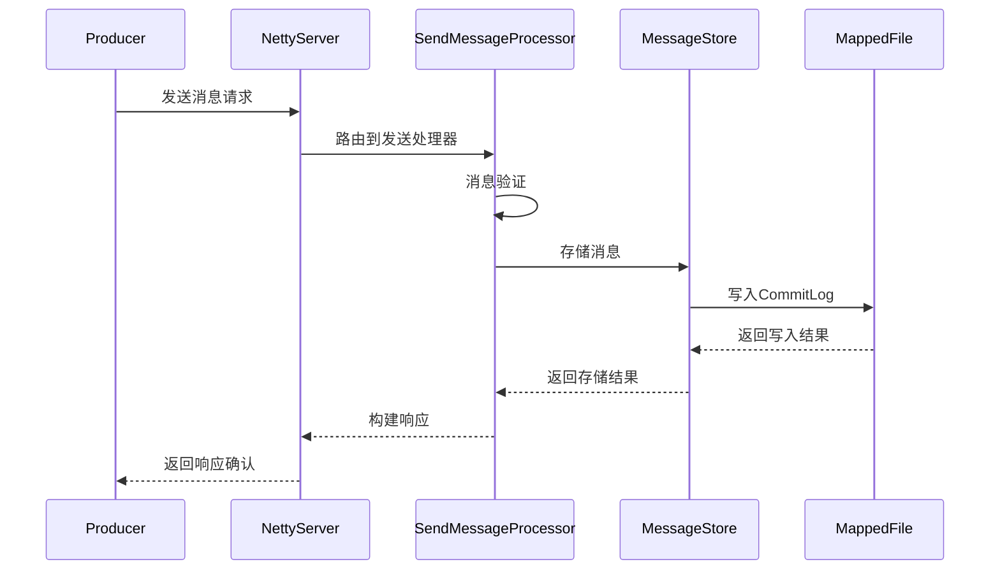
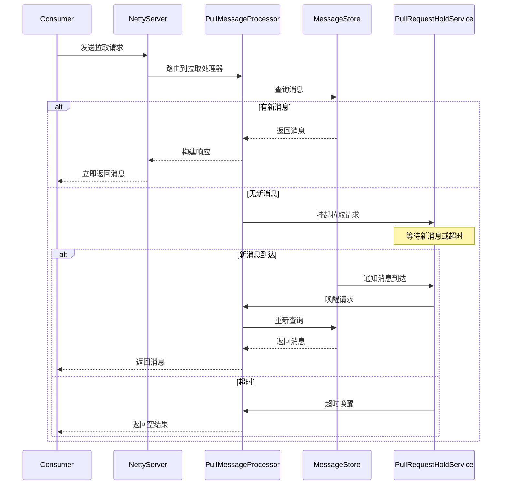
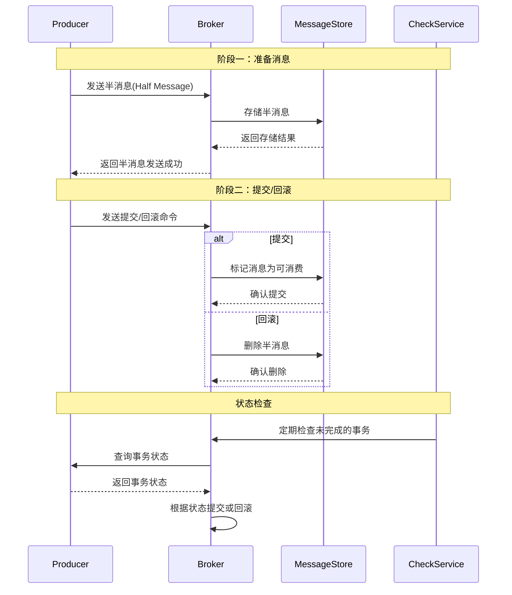

# Broker 模块核心功能分析

## 1. 消息发送功能

### 1.1 发送流程概述

消息发送是 Broker 的核心功能之一，涉及消息的接收、验证、存储和响应确认。整个流程采用了高性能的异步处理架构。



### 1.2 SendMessageProcessor - 发送处理器

```java
public class SendMessageProcessor extends AbstractSendMessageProcessor {

    @Override
    public RemotingCommand processRequest(ChannelHandlerContext ctx,
                                        RemotingCommand request) {
        // 解析请求头
        SendMessageRequestHeader requestHeader =
            (SendMessageRequestHeader) request.decodeCommandCustomHeader(SendMessageRequestHeader.class);

        // 设置消息上下文
        SendMessageContext mqtraceContext;
        mqtraceContext = buildMsgContext(ctx, requestHeader);

        // 开始消息追踪
        this.brokerController.getBrokerStatsManager().incTopicPutNums(
            requestHeader.getTopic());

        // 处理消息发送
        RemotingCommand response = this.handleSendMessage(ctx, request, mqtraceContext);

        // 结束消息追踪
        this.executeSendMessageHookAfter(response, mqtraceContext);

        return response;
    }

    private RemotingCommand handleSendMessage(ChannelHandlerContext ctx,
                                            RemotingCommand request,
                                            SendMessageContext mqtraceContext) {
        // 1. 解析请求
        SendMessageRequestHeader requestHeader =
            (SendMessageRequestHeader) request.decodeCommandCustomHeader(SendMessageRequestHeader.class);

        // 2. 执行前置钩子
        RemotingCommand response = preSend(ctx, request, requestHeader);
        if (response != null) {
            return response;
        }

        // 3. 处理消息发送
        response = handleSendMessageInner(ctx, request, requestHeader, mqtraceContext);

        // 4. 执行后置钩子
        this.executeSendMessageHookAfter(response, mqtraceContext);

        return response;
    }
}
```

### 1.3 消息验证机制

```java
protected RemotingCommand msgCheck(ChannelHandlerContext ctx,
                                  SendMessageRequestHeader requestHeader) {
    // 1. 检查Broker状态
    if (!this.brokerController.getBrokerConfig().isSendMessageWithVIPChannel()) {
        if (this.brokerController.getMessageStoreConfig().isRejectTransactionMessage()) {
            // 检查事务消息
            String tmpType = requestHeader.getProperty(MessageConst.PROPERTY_TRANSACTION_PREPARED);
            if (tmpType != null && Boolean.parseBoolean(tmpType)) {
                response.setCode(ResponseCode.SYSTEM_ERROR);
                response.setRemark("The broker[" + this.brokerController.getBrokerAddr()
                    + "] receiving transaction message is forbidden");
                return response;
            }
        }
    }

    // 2. 检查主题权限
    TopicConfig topicConfig =
        this.brokerController.getTopicConfigManager().selectTopicConfig(requestHeader.getTopic());
    if (null == topicConfig) {
        response.setCode(ResponseCode.TOPIC_NOT_EXIST);
        response.setRemark("topic[" + requestHeader.getTopic() + "] not exist");
        return response;
    }

    // 3. 检查队列ID
    int queueIdInt = requestHeader.getQueueId();
    int idValid = Math.max(queueIdInt, 0);
    idValid = Math.min(idValid, topicConfig.getWriteQueueNums() - 1);
    if (idValid != queueIdInt) {
        response.setCode(ResponseCode.SYSTEM_ERROR);
        response.setRemark("queueId[" + queueIdInt + "] is illegal, topic "
            + requestHeader.getTopic() + " queueId in broker must be 0.."
            + (topicConfig.getWriteQueueNums() - 1));
        return response;
    }

    return null;
}
```

### 1.4 批量消息发送

```java
private RemotingCommand sendBatchMessage(ChannelHandlerContext ctx,
                                       RemotingCommand request,
                                       SendMessageRequestHeader requestHeader) {
    // 1. 解码批量消息
    byte[] body = request.getBody();
    int sysFlag = requestHeader.getSysFlag();
    if (SysFlag.checkBatch(sysFlag)) {
        // 批量消息处理
        List<MessageExtBatch> messageExtBatchList =
            MessageDecoder.decodeMessages(body, true, requestHeader.getCompressed());

        // 2. 验证批量消息
        Iterator<MessageExtBatch> it = messageExtBatchList.iterator();
        while (it.hasNext()) {
            MessageExtBatch msg = it.next();

            // 检查消息体
            if (msg.getBody() == null || msg.getBody().length == 0) {
                response.setCode(ResponseCode.MESSAGE_ILLEGAL);
                response.setRemark("message body is empty");
                return response;
            }

            // 检查主题
            TopicValidator.validateTopic(msg.getTopic());

            // 检查消息大小
            if (msg.getBody().length > this.brokerController.getMessageStoreConfig()
                .getMaxMessageSize()) {
                response.setCode(ResponseCode.MESSAGE_ILLEGAL);
                response.setRemark("the message body size over max value, MAX: "
                    + this.brokerController.getMessageStoreConfig().getMaxMessageSize());
                return response;
            }
        }

        // 3. 批量存储
        PutMessageResult putMessageResult = this.brokerController.getMessageStore()
            .putMessages(messageExtBatchList);

        return handlePutMessageResult(putMessageResult, response, request, msg, mqtraceContext);
    } else {
        // 单个消息处理
        MessageExt msgInner = MessageDecoder.decode(bytes, true, requestHeader.getCompressed());
        // ... 单个消息处理逻辑
    }
}
```

## 2. 消息拉取功能

### 2.1 拉取流程概述

消息拉取功能支持同步和异步两种模式，并通过长轮询机制实现实时消息推送。



### 2.2 PullMessageProcessor - 拉取处理器

```java
public class PullMessageProcessor implements NettyRequestProcessor {

    @Override
    public RemotingCommand processRequest(final ChannelHandlerContext ctx,
                                        RemotingCommand request) {
        // 1. 解析请求
        PullMessageRequestHeader requestHeader =
            (PullMessageRequestHeader) request.decodeCommandCustomHeader(PullMessageRequestHeader.class);

        // 2. 获取消息
        GetMessageResult getMessageResult =
            this.brokerController.getMessageStore().getMessage(requestHeader);

        // 3. 处理结果
        if (getMessageResult != null) {
            // 构建响应
            response.setBody(getMessageResult.getMessageBufferList());
            response.setCode(ResponseCode.SUCCESS);
            response.setRemark(null);
        } else {
            // 没有消息，挂起请求
            response = handleNoMessage(ctx, request, requestHeader);
        }

        return response;
    }

    private RemotingCommand handleNoMessage(ChannelHandlerContext ctx,
                                          RemotingCommand request,
                                          PullMessageRequestHeader requestHeader) {
        // 1. 创建拉取请求
        PullRequest pullRequest = new PullRequest(
            requestHeader.getConsumerGroup(),
            requestHeader.getMessageQueue(),
            requestHeader.getQueueOffset(),
            requestHeader.getMaxMsgNums(),
            requestHeader.getSysFlag(),
            requestHeader.getCommitOffset(),
            requestHeader.getSuspendTimeoutMillisLong(),
            requestHeader.getSubscriptionData(),
            requestHeader.getMessageExpireTime()
        );

        // 2. 挂起请求
        this.brokerController.getPullRequestHoldService()
            .suspendPullRequest(pullRequest);

        // 3. 返回null，表示稍后响应
        return null;
    }
}
```

### 2.3 长轮询实现

```java
public class PullRequestHoldService extends ServiceThread {

    // 挂起的拉取请求映射表
    private final ConcurrentHashMap<String/* topic@queueId */,
        ArrayList<PullRequest>> pullRequestTable = new ConcurrentHashMap<>();

    @Override
    public void run() {
        log.info("{} service started", this.getServiceName());
        while (!this.isStopped()) {
            try {
                // 等待5秒
                waitForRunning(5 * 1000);

                // 检查挂起的请求
                this.checkHoldRequest();
            } catch (Exception e) {
                log.warn("pull request hold service run exception", e);
            }
        }

        log.info("{} service end", this.getServiceName());
    }

    private void checkHoldRequest() {
        // 遍历所有挂起的请求
        for (String key : this.pullRequestTable.keySet()) {
            String[] kArray = key.split("@");
            if (2 == kArray.length) {
                String topic = kArray[0];
                int queueId = Integer.parseInt(kArray[1]);

                // 获取最新偏移量
                final long maxOffset =
                    this.brokerController.getMessageStore().getMaxOffsetInQueue(topic, queueId);

                // 检查是否有新消息
                try {
                    this.notifyMessageArriving(topic, queueId, maxOffset);
                } catch (Exception e) {
                    log.error("check hold request failed. topic={}, queueId={}", topic, queueId, e);
                }
            }
        }
    }

    public void suspendPullRequest(final PullRequest pullRequest) {
        String key = pullRequest.getTopic() + "@" + pullRequest.getQueueId();
        ArrayList<PullRequest> requestList = this.pullRequestTable.get(key);
        if (requestList == null) {
            requestList = new ArrayList<>();
            this.pullRequestTable.put(key, requestList);
        }

        requestList.add(pullRequest);

        // 计算超时时间
        long suspendTimeMillis = pullRequest.getSuspendTimeoutMillisLong();
        long currentTimeMillis = System.currentTimeMillis();
        long deadlineTimeMillis = currentTimeMillis + suspendTimeMillis;

        // 添加到定时任务中
        this.brokerController.getPullRequestHoldService()
            .scheduleTimeoutPullRequest(pullRequest, deadlineTimeMillis);
    }

    public void notifyMessageArriving(final String topic, final int queueId,
                                     final long maxOffset) {
        String key = topic + "@" + queueId;
        ArrayList<PullRequest> requestList = this.pullRequestTable.get(key);
        if (requestList != null) {
            for (PullRequest pullRequest : requestList) {
                // 检查是否有新消息
                long newestOffset = maxOffset;
                if (newestOffset > pullRequest.getQueueOffset()) {
                    try {
                        // 获取消息
                        GetMessageResult getMessageResult =
                            this.brokerController.getMessageStore()
                                .getMessage(pullRequest);

                        if (getMessageResult != null && !getMessageResult.getMessageList().isEmpty()) {
                            // 响应客户端
                            final RemotingCommand response =
                                PullMessageProcessor.buildResponse(getMessageResult);

                            this.brokerController.getPullRequestHoldService()
                                .executeRequestWhenWakeup(pullRequest.getClientChannel(),
                                                        pullRequest.getRequestCommand(),
                                                        response);
                        }
                    } catch (Exception e) {
                        log.error("execute request when wakeup failed.", e);
                    }
                }
            }
        }
    }
}
```

## 3. 事务消息功能

### 3.1 事务消息流程

事务消息采用两阶段提交协议，保证消息的最终一致性。



### 3.2 TransactionalMessageService - 事务消息服务

```java
public class TransactionalMessageServiceImpl extends AbstractTransactionalMessageService {

    @Override
    public OperationResult prepareMessage(MessageExtBrokerInner messageInner) {
        // 1. 设置事务消息属性
        messageInner.setTopic(TransactionalMessageUtil.buildHalfTopic());
        messageInner.setQueueId(0);

        // 2. 设置消息属性
        String transactionId = messageInner.getProperty(MessageConst.PROPERTY_UNIQ_CLIENT_MESSAGE_ID_KEYIDX);
        if (transactionId == null) {
            transactionId = messageInner.getMsgId();
        }

        messageInner.setTransactionId(transactionId);
        messageInner.setSysFlag(TransactionalMessageUtil.resetTransactionValue(
            messageInner.getSysFlag(), MessageSysFlag.TRANSACTION_PREPARED_TYPE));

        // 3. 存储半消息
        PutMessageResult putMessageResult = this.brokerController.getMessageStore()
            .putMessage(messageInner);

        return new OperationResult(putMessageResult, null);
    }

    @Override
    public boolean commitMessage(EndTransactionRequestHeader requestHeader) {
        // 1. 查找半消息
        MessageExt msgExt = this.brokerController.getMessageStore()
            .lookupMessage(requestHeader.getCommitLogOffset());

        if (msgExt == null) {
            log.warn("Message not found in commit log. offset={}", requestHeader.getCommitLogOffset());
            return false;
        }

        // 2. 设置最终属性
        MessageExtBrokerInner msgInner = this.endMessageTransaction(msgExt);
        msgInner.setBody(msgExt.getBody());
        msgInner.setQueueId(requestHeader.getQueueId());
        msgInner.setSysFlag(MessageSysFlag.TRANSACTION_COMMIT_TYPE);
        msgInner.setTransactionId(requestHeader.getTranId());

        // 3. 恢复原始主题
        String topic = msgInner.getProperty(MessageConst.PROPERTY_REAL_TOPIC);
        String queueIdStr = msgInner.getProperty(MessageConst.PROPERTY_REAL_QUEUE_ID);
        msgInner.setTopic(topic);
        msgInner.setQueueId(Integer.parseInt(queueIdStr));

        // 4. 删除事务属性
        MessageAccessor.clearProperty(msgInner, MessageConst.PROPERTY_REAL_TOPIC);
        MessageAccessor.clearProperty(msgInner, MessageConst.PROPERTY_REAL_QUEUE_ID);

        // 5. 存储最终消息
        PutMessageResult putMessageResult = this.brokerController.getMessageStore()
            .putMessage(msgInner);

        return putMessageResult.isOK();
    }

    @Override
    public boolean rollbackMessage(EndTransactionRequestHeader requestHeader) {
        // 1. 查找半消息
        MessageExt msgExt = this.brokerController.getMessageStore()
            .lookupMessage(requestHeader.getCommitLogOffset());

        if (msgExt == null) {
            log.warn("Message not found in commit log. offset={}", requestHeader.getCommitLogOffset());
            return false;
        }

        // 2. 删除半消息
        this.brokerController.getMessageStore()
            .deleteMessage(new MessageExtBrokerInner(msgExt));

        return true;
    }
}
```

### 3.3 事务状态检查

```java
public class TransactionalMessageCheckService extends ServiceThread {

    @Override
    public void run() {
        log.info("Start transaction check service thread!");

        long checkInterval = brokerController.getBrokerConfig()
            .getTransactionTimeOut();
        long checkMax = brokerController.getBrokerConfig()
            .getTransactionCheckMax();

        while (!this.isStopped()) {
            try {
                // 检查时间间隔
                this.waitForRunning(checkInterval);

                // 执行事务检查
                long beginTime = System.currentTimeMillis();
                this.brokerController.getTransactionalMessageService().check();
                long costTime = System.currentTimeMillis() - beginTime;

                if (costTime > checkMax) {
                    log.warn("transaction check, too long! costTime={}", costTime);
                }
            } catch (Exception e) {
                log.warn("TransactionalMessageCheckService check exception", e);
            }
        }

        log.info("TransactionalMessageCheckService Service end!");
    }

    @Override
    public void check(long transactionTimeout, int checkMax) {
        // 1. 获取所有未完成的事务消息
        List<MessageExt> halfMessages = this.brokerController.getMessageStore()
            .getHalfMessages();

        // 2. 遍历检查每个事务消息
        for (MessageExt messageExt : halfMessages) {
            // 3. 检查消息是否超时
            if (System.currentTimeMillis() - messageExt.getStoreTimestamp()
                > transactionTimeout) {
                // 4. 向生产者查询事务状态
                int checkCount = 0;
                while (checkCount < checkMax) {
                    try {
                        // 发送检查请求
                        RemotingCommand checkResponse =
                            this.brokerController.getBrokerOuterAPI()
                                .checkProducerTransactionState(messageExt);

                        if (checkResponse != null) {
                            // 5. 处理检查结果
                            this.resolveCheckResult(checkResponse, messageExt);
                            break;
                        }
                    } catch (Exception e) {
                        log.warn("Check transaction state exception", e);
                    }

                    checkCount++;
                    try {
                        Thread.sleep(1000);
                    } catch (InterruptedException e) {
                        break;
                    }
                }

                // 6. 如果检查失败，回滚消息
                if (checkCount >= checkMax) {
                    log.warn("Transaction check failed. Rollback message. msgId={}",
                        messageExt.getMsgId());
                    this.rollbackMessage(messageExt);
                }
            }
        }
    }

    private void resolveCheckResult(RemotingCommand checkResponse, MessageExt halfMessage) {
        // 解析检查结果
        if (checkResponse.getCode() == ResponseCode.SUCCESS) {
            // 事务提交
            this.commitMessage(halfMessage);
        } else if (checkResponse.getCode() == ResponseCode.TRANSACTION_ROLLBACK) {
            // 事务回滚
            this.rollbackMessage(halfMessage);
        } else {
            // 事务状态未知，继续等待
            log.warn("Unknown transaction state. msgId={}", halfMessage.getMsgId());
        }
    }
}
```

## 4. 消息过滤功能

### 4.1 过滤机制概述

RocketMQ 支持基于 Tag 和 SQL 表达式的消息过滤机制，在 Broker 端和消费端都可以进行过滤。

### 4.2 表达式消息过滤

```java
public class ExpressionMessageFilter implements MessageFilter {

    private final SubscriptionData subscriptionData;
    private final ConsumerFilterData consumerFilterData;
    private final boolean consumerFilterDataVersion;
    private final FilterClassManager filterClassManager;

    @Override
    public boolean isMatchedByConsumeQueue(Long tagsCode, Long consumeQueueOffset,
                                         MessageExt msg) {
        // 1. Tag过滤
        if (subscriptionData.getTagsSet().isEmpty() && !subscriptionData.isClassFilterMode()) {
            return true;
        }

        // 2. 检查Tag
        if (!subscriptionData.getTagsSet().isEmpty()) {
            return subscriptionData.getTagsSet().contains(tagsCode.toString());
        }

        // 3. 类过滤模式
        if (subscriptionData.isClassFilterMode()) {
            String realTopic = msg.getTopic();
            String evalResult = null;

            try {
                // 使用过滤器类进行过滤
                evalResult = filterClassManager.findAndCompileFilter(
                    realTopic, consumerFilterData.getClassName(), consumerFilterData.getExpression());

                if (evalResult == null || evalResult.isEmpty()) {
                    return false;
                }

                // 计算过滤结果
                return this.eval(evalResult, msg);
            } catch (Exception e) {
                log.error("Message filter exception, topic={}, expression={}",
                    realTopic, consumerFilterData.getExpression(), e);
                return false;
            }
        }

        return false;
    }

    private boolean eval(final String evalResult, final MessageExt msg) {
        // 使用Java编译API动态执行过滤逻辑
        Class<?> filterClass = filterClassManager.loadClass(evalResult);
        Object instance = filterClass.newInstance();

        if (instance instanceof MessageFilter) {
            return ((MessageFilter) instance).isMatchedByConsumeQueue(null, null, msg);
        }

        return false;
    }
}
```

### 4.3 SQL表达式过滤

```java
public class SqlExpressionFilter {

    public boolean evaluate(String expression, Map<String, String> properties) {
        try {
            // 1. 解析SQL表达式
            SQLExpr expr = SQLUtils.parseSingleMysqlStatement(expression);

            // 2. 创建求值上下文
            SQLExprVisitorAdapter visitor = new SQLExprVisitorAdapter() {
                @Override
                public Object visit(SQLEqualExpr x) {
                    Object left = x.getLeft().accept(this);
                    Object right = x.getRight().accept(this);

                    if (left != null && right != null) {
                        return left.equals(right);
                    }
                    return false;
                }

                @Override
                public Object visit(SQLCharExpr x) {
                    return x.getText();
                }

                @Override
                public Object visit(SQLIdentifierExpr x) {
                    // 从消息属性中获取值
                    return properties.get(x.getName());
                }
            };

            // 3. 执行求值
            return (Boolean) expr.accept(visitor);
        } catch (Exception e) {
            log.error("SQL expression evaluate error", e);
            return false;
        }
    }
}
```

## 5. 顺序消息功能

### 5.1 顺序消息实现

顺序消息通过将相关消息发送到同一个队列来保证消息的顺序消费。

```java
public class MessageQueueSelector {

    /**
     * 选择消息队列
     */
    public MessageQueue select(final List<MessageQueue> mqs,
                              final Message msg, final Object arg) {
        // 1. 获取选择键
        String selectKey = null;
        if (arg instanceof String) {
            selectKey = (String) arg;
        } else if (arg instanceof Integer) {
            selectKey = String.valueOf(arg);
        } else {
            selectKey = msg.getKeys();
        }

        // 2. 计算哈希值
        int hashCode = selectKey.hashCode();

        // 3. 选择队列
        int index = Math.abs(hashCode) % mqs.size();

        return mqs.get(index);
    }
}

// Broker端确保单队列顺序处理
public class MessageLockManager {

    private final ConcurrentHashMap<String, ReentrantLock> messageLockTable =
        new ConcurrentHashMap<>();

    public ReentrantLock getLock(String topic, int queueId) {
        String key = topic + "_" + queueId;

        return messageLockTable.computeIfAbsent(key, k -> new ReentrantLock());
    }

    public void lock(String topic, int queueId) {
        getLock(topic, queueId).lock();
    }

    public void unlock(String topic, int queueId) {
        ReentrantLock lock = getLock(topic, queueId);
        if (lock.isHeldByCurrentThread()) {
            lock.unlock();
        }
    }
}
```

## 6. 延迟消息功能

### 6.1 延迟消息实现

延迟消息通过将消息暂存到特定队列，然后在指定时间投递到目标队列来实现。

```java
public class ScheduleMessageService extends ServiceThread {

    // 延迟级别映射
    private static final int QUEUE_LEVEL = 18;
    private static final String SCHEDULE_TOPIC = "SCHEDULE_TOPIC_XXXX";

    // 延迟时间级别
    private static final long[] DELAY_LEVEL = new long[] {
        1L, 5L, 10L, 30L, 1L * 60L, 2L * 60L, 3L * 60L, 4L * 60L, 5L * 60L,
        6L * 60L, 7L * 60L, 8L * 60L, 9L * 60L, 10L * 60L, 20L * 60L,
        30L * 60L, 1L * 60 * 60L, 2L * 60 * 60L
    };

    @Override
    public void run() {
        while (!this.isStopped()) {
            try {
                // 每100ms执行一次调度
                this.waitForRunning(100);

                // 处理延迟消息
                this.executeOnTimeup();
            } catch (Exception e) {
                log.error("ScheduleMessageService execute error", e);
            }
        }
    }

    private void executeOnTimeup() {
        for (int i = 0; i < QUEUE_LEVEL; i++) {
            // 1. 获取延迟队列
            ConsumeQueue cq =
                ScheduleMessageService.this.defaultMessageStore.findConsumeQueue(
                    SCHEDULE_TOPIC, i);

            if (cq != null) {
                // 2. 获取队列中的消息
                SelectMappedBufferResult buffer = cq.getIndexBuffer(
                    this.offsetTable.get(i));

                if (buffer != null) {
                    try {
                        // 3. 解析消息
                        long offsetPy = buffer.getByteBuffer().getLong();
                        int sizePy = buffer.getByteBuffer().getInt();
                        long tagsCode = buffer.getByteBuffer().getLong();

                        // 4. 计算是否到期
                        long now = System.currentTimeMillis();
                        long deliverTimestamp = this.computeDeliverTimestamp(i, tagsCode);

                        long count = 0;
                        for (; count < buffer.getSize() && count < 200; count += 20) {
                            if (now >= deliverTimestamp) {
                                // 5. 消息到期，投递到目标队列
                                MessageExt msgExt =
                                    ScheduleMessageService.this.defaultMessageStore.lookMessageByOffset(
                                        offsetPy, sizePy);

                                if (msgExt != null) {
                                    // 解析原始主题
                                    String originalTopic = msgExt.getProperty(MessageConst.PROPERTY_REAL_TOPIC);
                                    String originalQueueId = msgExt.getProperty(MessageConst.PROPERTY_REAL_QUEUE_ID);

                                    // 设置原始主题和队列
                                    MessageExtBrokerInner msgInner = new MessageExtBrokerInner();
                                    msgInner.setTopic(originalTopic);
                                    msgInner.setQueueId(Integer.parseInt(originalQueueId));
                                    msgInner.setBody(msgExt.getBody());
                                    msgInner.setFlag(msgExt.getFlag());
                                    msgInner.setBornTimestamp(msgExt.getBornTimestamp());
                                    msgInner.setBornHost(msgExt.getBornHost());
                                    msgInner.setStoreTimestamp(msgExt.getStoreTimestamp());
                                    msgInner.setStoreHost(msgExt.getStoreHost());
                                    msgInner.setReconsumeTimes(msgExt.getReconsumeTimes());

                                    // 投递消息
                                    PutMessageResult putMessageResult =
                                        ScheduleMessageService.this.defaultMessageStore.putMessage(msgInner);
                                }
                            } else {
                                // 消息未到期，继续等待
                                break;
                            }
                        }

                        // 更新偏移量
                        this.offsetTable.put(i, this.offsetTable.get(i) + count);
                    } finally {
                        buffer.release();
                    }
                }
            }
        }
    }

    private long computeDeliverTimestamp(final int delayLevel, final long tagsCode) {
        // 计算投递时间
        long delayTime = tagsCode;
        long deliverTimestamp = this.correctDeliverTimestamp(delayLevel, delayTime);
        return deliverTimestamp;
    }

    private long correctDeliverTimestamp(final int delayLevel, final long tagsCode) {
        long now = System.currentTimeMillis();
        long deliverTimestamp = now + DELAY_LEVEL[delayLevel - 1] * 1000;

        return deliverTimestamp;
    }
}
```

## 7. 总结

Broker 模块的核心功能设计体现了高性能、高可靠性和高可扩展性的特点：

1. **消息发送**：采用异步处理和批量优化，支持高并发消息写入
2. **消息拉取**：通过长轮询机制实现实时消息推送
3. **事务消息**：基于两阶段提交协议保证消息的最终一致性
4. **消息过滤**：支持 Tag 和 SQL 表达式的灵活过滤机制
5. **顺序消息**：通过队列选择和锁机制保证消息顺序
6. **延迟消息**：通过调度机制实现消息的定时投递

这些核心功能共同构成了 RocketMQ Broker 强大的消息处理能力。