# Broker 模块关系图

本文档描述 RocketMQ Broker 模块内部各组件之间的关系和交互。

## 1. 核心模块架构

### 1.1 BrokerController - 核心控制器
BrokerController 是 Broker 模块的核心，负责管理和协调所有其他组件：

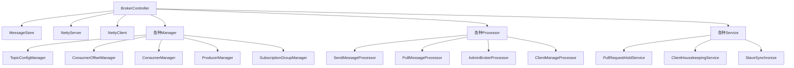

### 1.2 消息处理流程
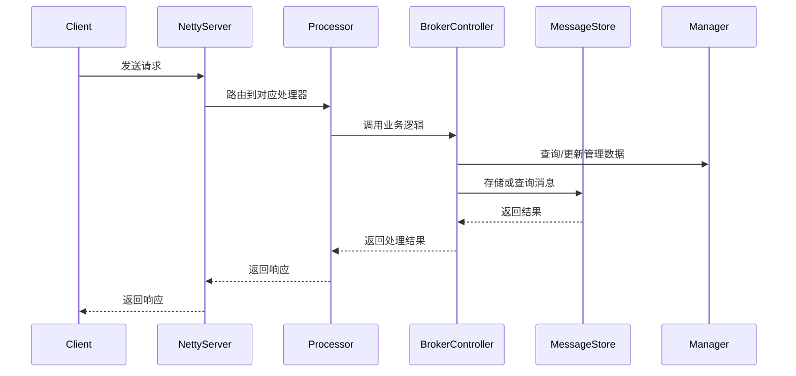

## 2. 存储模块关系

### 2.1 MessageStore 及相关组件
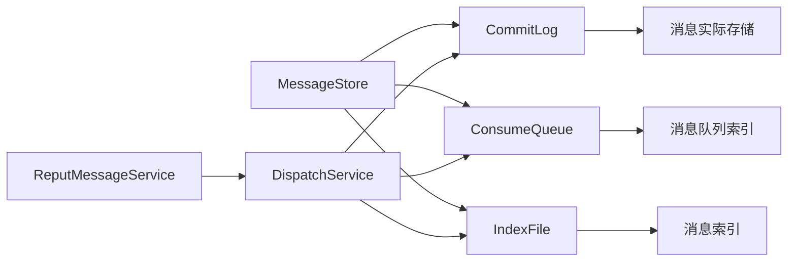

### 2.2 DLedger 集群存储
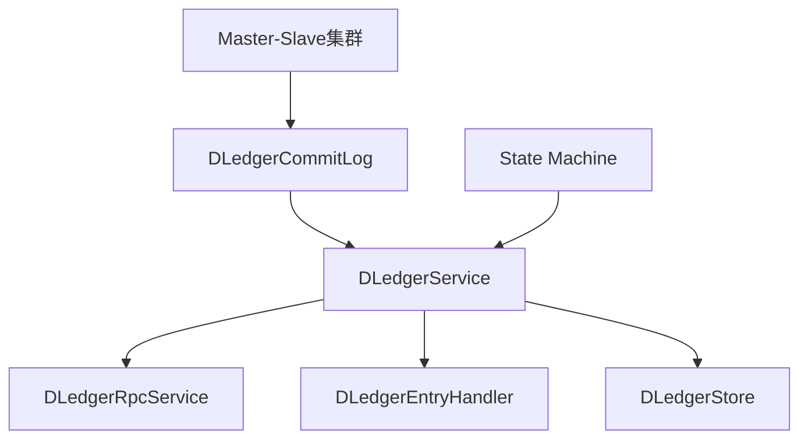

## 3. 客户端管理模块

### 3.1 Producer 和 Consumer 管理
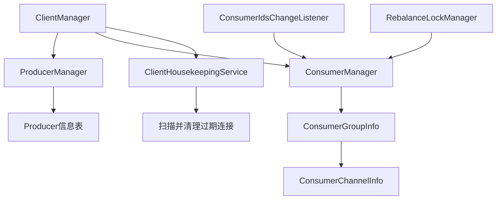

### 3.2 消费者组管理
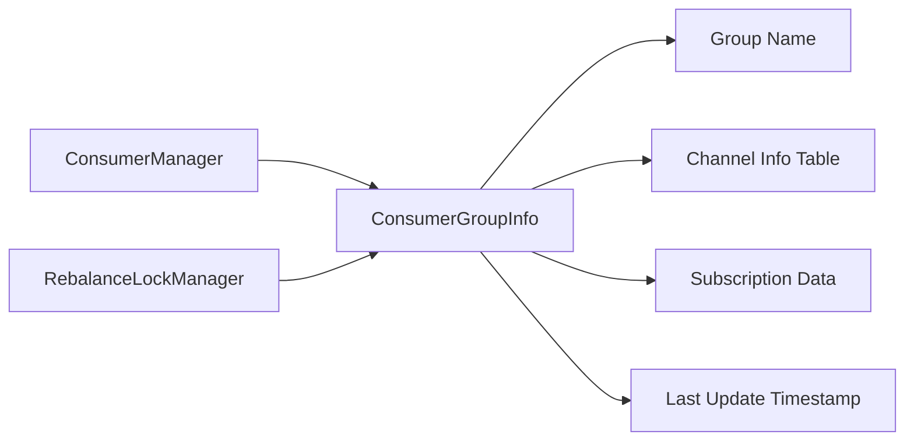

## 4. 消息处理模块

### 4.1 请求处理器架构
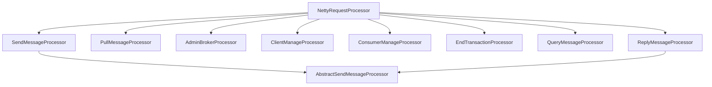

### 4.2 消息发送处理流程
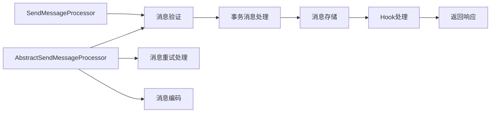

### 4.3 消息拉取处理流程
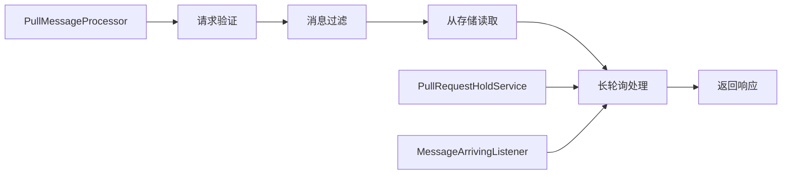

## 5. 配置管理模块

### 5.1 配置管理器关系
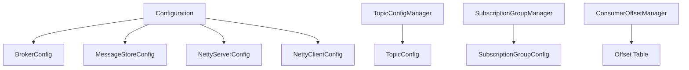

### 5.2 Topic 和订阅配置
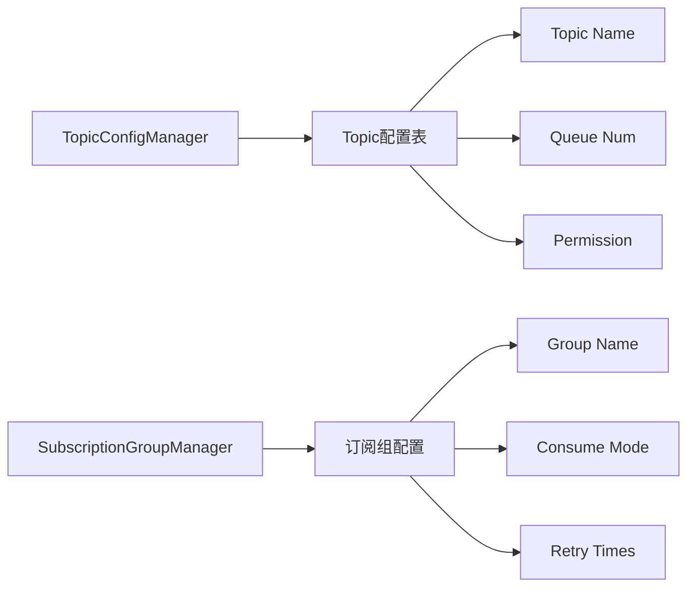

## 6. 长轮询模块

### 6.1 PullRequestHoldService
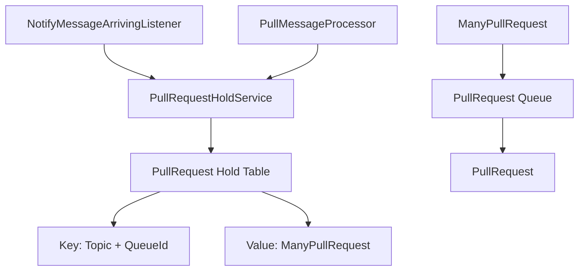

### 6.2 长轮询工作流程
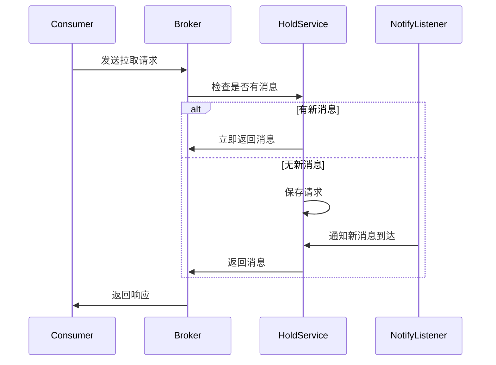

## 7. 事务消息模块

### 7.1 事务消息组件
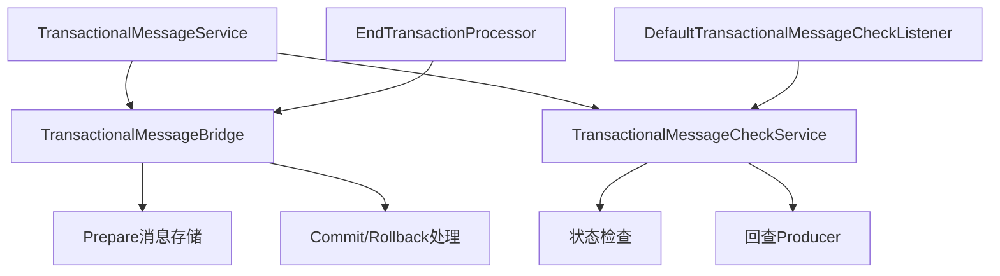

### 7.2 事务消息处理流程
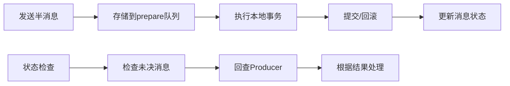

## 8. 主从同步模块

### 8.1 SlaveSynchronize
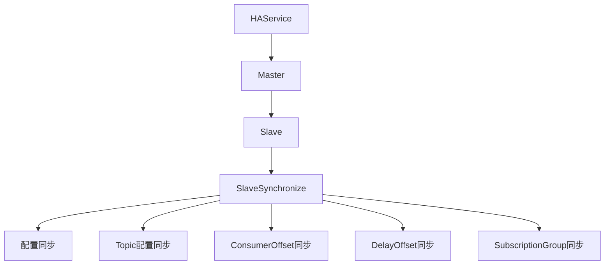

### 8.2 DLedger 集群
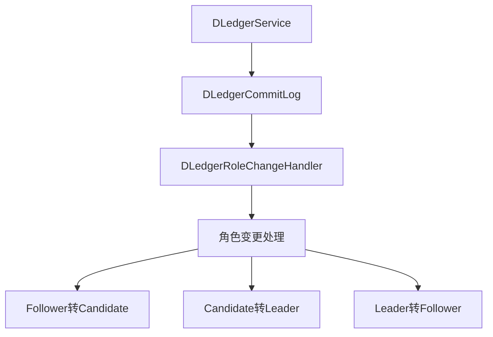

## 9. 过滤器模块

### 9.1 ConsumerFilterManager
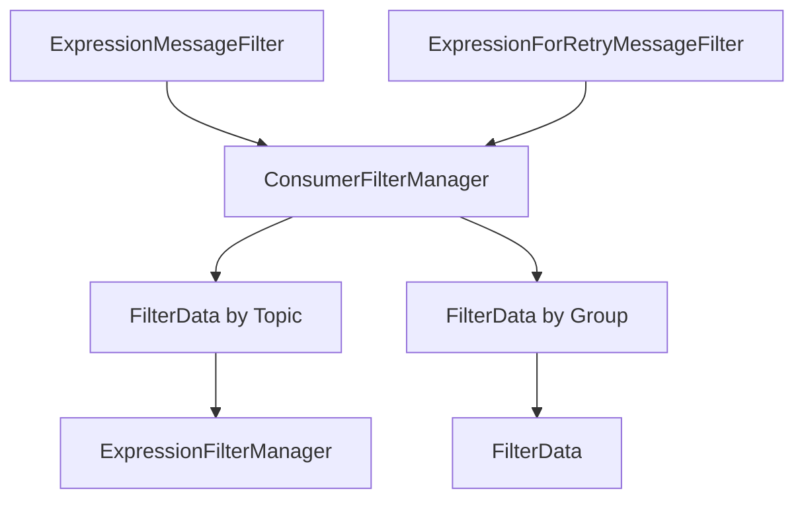

### 9.2 消息过滤流程
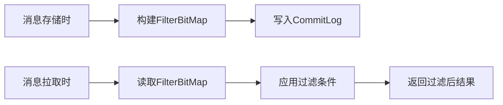

## 10. 监控和统计模块

### 10.1 BrokerStats
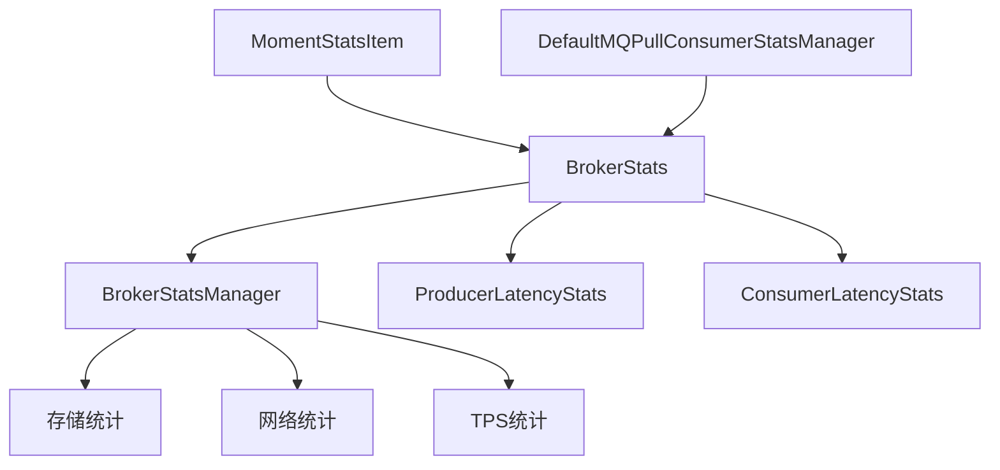

### 10.2 Lmq 特殊统计
```mermaid
graph LR
    A[LmqBrokerStatsManager] --> B[Lmq特有统计]
    B --> C[TopicConfigManager]
    B --> D[ConsumerOffsetManager]
    B --> E[SubscriptionGroupManager]
```

## 11. 线程池管理

### 11.1 线程池配置
```mermaid
graph TD
    A[BrokerFastFailure] --> B[Send线程池]
    A --> C[Pull线程池]
    A --> D[Reply线程池]
    A --> E[Query线程池]
    A --> F[ClientManager线程池]
    A --> G[ConsumerManager线程池]
    A --> H[Heartbeat线程池]

    I[BrokerFixedThreadPoolExecutor] --> B
    I --> C
    I --> D
    I --> E
```

### 11.2 任务队列管理
```mermaid
graph LR
    A[TaskQueue] --> B[SendThreadPoolQueue]
    A --> C[PutThreadPoolQueue]
    A --> D[PullThreadPoolQueue]
    A --> E[ReplyThreadPoolQueue]

    F[FutureTaskExt] --> A
```

## 12. 插件系统

### 12.1 MessageStorePlugin
```mermaid
graph TD
    A[MessageStorePluginContext] --> B[Plugin配置]
    A --> C[MessageStore实例]

    D[AbstractPluginMessageStore] --> A
    D --> E[插件Hook]

    F[MessageStoreFactory] --> D
```

### 12.2 ServiceProvider
```mermaid
graph LR
    A[ServiceProvider] --> B[加载插件]
    A --> C[管理插件生命周期]
    B --> D[ServiceLoader机制]
```

## 13. 错误处理和保护机制

### 13.1 BrokerFastFailure
```mermaid
graph TD
    A[BrokerFastFailure] --> B[线程池保护]
    A --> C[流量控制]

    B --> D[拒绝策略]
    B --> E[超时处理]

    C --> F[限流检查]
    C --> G[系统保护]
```

## 总结

Broker 模块的关系图展示了：

1. **分层架构**：清晰的分层设计，各层职责明确
2. **模块化设计**：功能模块独立，便于维护和扩展
3. **组件协作**：组件之间通过接口协作，降低耦合
4. **异步处理**：大量使用线程池和异步机制提高性能
5. **可扩展性**：通过插件机制支持功能扩展
6. **高可用性**：通过主从同步和DLedger保证高可用

这些模块和组件的有机组合，使 Broker 成为功能强大、性能优异、可靠性高的消息中间件核心组件。