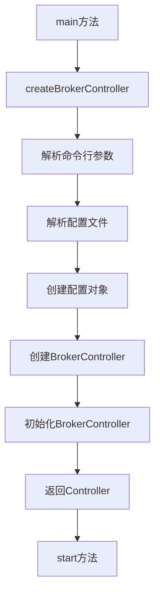
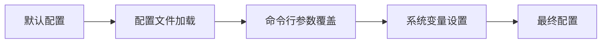
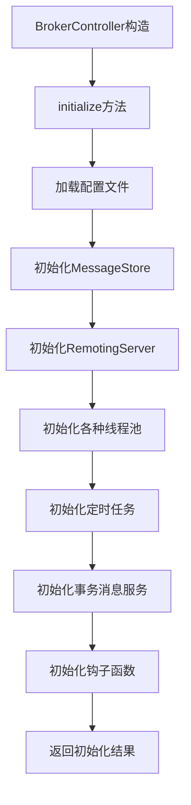
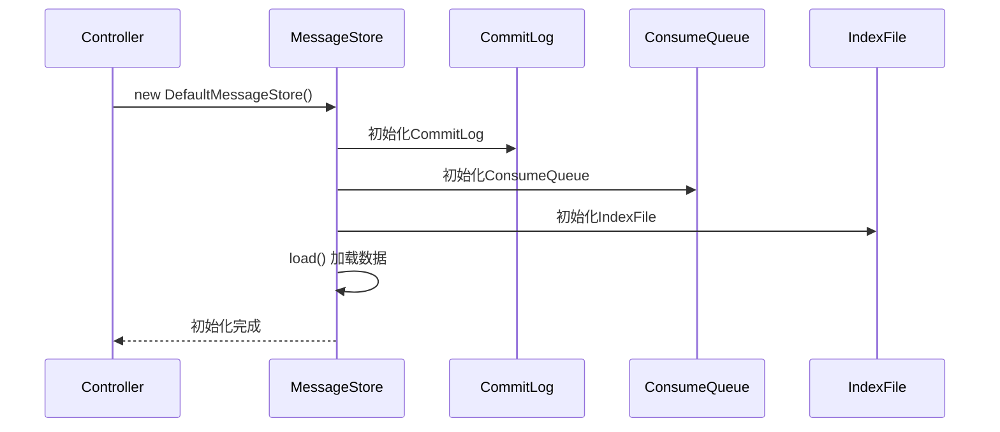
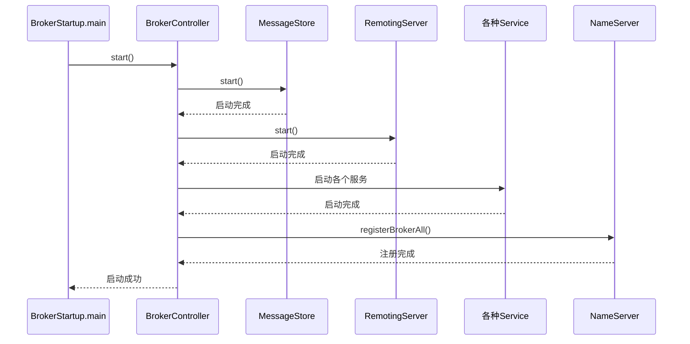
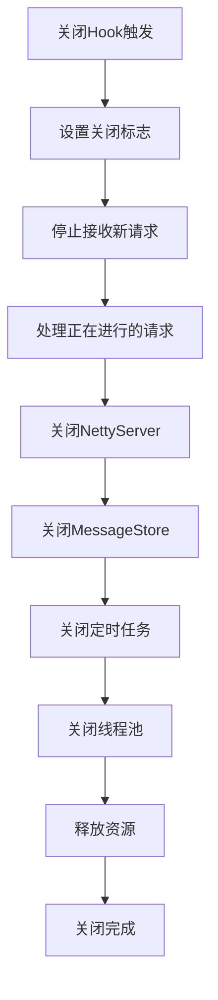

# Broker 启动流程分析

本文档详细分析 RocketMQ Broker 的启动过程，包括初始化、组件加载和服务启动等关键步骤。

## 1. 启动入口

### 1.1 BrokerStartup.main()
Broker 的启动入口是 `BrokerStartup` 类的 `main()` 方法：

```java
public static void main(String[] args) {
    start(createBrokerController(args));
}
```

启动流程分为两步：
1. **createBrokerController(args)**: 创建并初始化 BrokerController
2. **start(controller)**: 启动 Broker 服务

### 1.2 启动参数解析


## 2. 配置加载过程

### 2.1 创建配置对象
```java
// 在 createBrokerController 方法中
final BrokerConfig brokerConfig = new BrokerConfig();
final NettyServerConfig nettyServerConfig = new NettyServerConfig();
final NettyClientConfig nettyClientConfig = new NettyClientConfig();
final MessageStoreConfig messageStoreConfig = new MessageStoreConfig();
```

### 2.2 配置加载顺序


### 2.3 配置文件解析
```java
if (commandLine.hasOption('c')) {
    String file = commandLine.getOptionValue('c');
    if (file != null) {
        configFile = file;
        InputStream in = new BufferedInputStream(new FileInputStream(file));
        properties = new Properties();
        properties.load(in);

        properties2SystemEnv(properties);
        MixAll.properties2Object(properties, brokerConfig);
        MixAll.properties2Object(properties, nettyServerConfig);
        MixAll.properties2Object(properties, nettyClientConfig);
        MixAll.properties2Object(properties, messageStoreConfig);

        BrokerPathConfigHelper.setBrokerConfigPath(file);
        in.close();
    }
}
```

## 3. BrokerController 创建和初始化

### 3.1 BrokerController 构造
```java
final BrokerController controller = new BrokerController(
    brokerConfig,
    nettyServerConfig,
    nettyClientConfig,
    messageStoreConfig);
```

构造函数中初始化所有核心组件：
```java
public BrokerController(
    final BrokerConfig brokerConfig,
    final NettyServerConfig nettyServerConfig,
    final NettyClientConfig nettyClientConfig,
    final MessageStoreConfig messageStoreConfig) {

    // 配置对象
    this.brokerConfig = brokerConfig;
    this.nettyServerConfig = nettyServerConfig;
    this.nettyClientConfig = nettyClientConfig;
    this.messageStoreConfig = messageStoreConfig;

    // 管理器组件
    this.consumerOffsetManager = new ConsumerOffsetManager(this);
    this.topicConfigManager = new TopicConfigManager(this);
    this.consumerManager = new ConsumerManager(this);
    this.producerManager = new ProducerManager(this);
    // ... 其他管理器

    // 处理器组件
    this.sendMessageProcessor = new SendMessageProcessor(this);
    this.pullMessageProcessor = new PullMessageProcessor(this);
    // ... 其他处理器
}
```

### 3.2 初始化流程


### 3.3 initialize() 方法详解
```java
public boolean initialize() throws CloneNotSupportedException {
    // 1. 加载本地配置
    result = result && this.topicConfigManager.load();
    result = result && this.consumerOffsetManager.load();
    result = result && this.subscriptionGroupManager.load();
    result = result && this.consumerFilterManager.load();

    // 2. 初始化消息存储
    if (result) {
        this.messageStore =
            new DefaultMessageStore(this.messageStoreConfig, this.brokerStatsManager,
                this.messageArrivingListener, this.brokerConfig);

        // DLedger支持
        if (messageStoreConfig.isEnableDLegerCommitLog()) {
            DLedgerRoleChangeHandler roleChangeHandler = new DLedgerRoleChangeHandler(this);
            ((DLedgerCommitLog)((DefaultMessageStore) messageStore).getCommitLog()).getdLedgerServer()
                .getdLegerRoleChangeHandler().add(roleChangeHandler);
        }
    }

    // 3. 初始化Netty服务
    this.remotingServer = new NettyRemotingServer(this.nettyServerConfig, this.clientHousekeepingService);

    // 4. 初始化线程池
    this.sendMessageExecutor = new BrokerFixedThreadPoolExecutor(
        this.brokerConfig.getSendMessageThreadPoolNums(),
        this.brokerConfig.getSendMessageThreadPoolNums(),
        1000 * 60,
        TimeUnit.MILLISECONDS,
        this.sendThreadPoolQueue,
        new ThreadFactoryImpl("SendMessageThread_"));

    // 5. 注册处理器
    this.registerProcessor();

    // 6. 初始化定时任务
    initialTransaction();
    initialAcl();
    initialScheduleTasks();

    // 7. 初始化RPC钩子
    initialRpcHooks();

    return result;
}
```

## 4. 组件初始化详情

### 4.1 消息存储初始化


### 4.2 RemotingServer 初始化
```java
this.remotingServer = new NettyRemotingServer(this.nettyServerConfig, this.clientHousekeepingService);

// 设置端口
nettyServerConfig.setListenPort(10911);
nettyClientConfig.setListenPort(10909);
```

### 4.3 线程池初始化
```java
// 发送消息线程池
this.sendMessageExecutor = new BrokerFixedThreadPoolExecutor(
    this.brokerConfig.getSendMessageThreadPoolNums(),
    this.brokerConfig.getSendMessageThreadPoolNums(),
    1000 * 60,
    TimeUnit.MILLISECONDS,
    this.sendThreadPoolQueue,
    new ThreadFactoryImpl("SendMessageThread_"));

// 拉取消息线程池
this.pullMessageExecutor = new BrokerFixedThreadPoolExecutor(
    this.brokerConfig.getPullMessageThreadPoolNums(),
    this.brokerConfig.getPullMessageThreadPoolNums(),
    1000 * 60,
    TimeUnit.MILLISECONDS,
    this.pullThreadPoolQueue,
    new ThreadFactoryImpl("PullMessageThread_"));

// 查询消息线程池
this.queryMessageExecutor = new BrokerFixedThreadPoolExecutor(
    this.brokerConfig.getQueryMessageThreadPoolNums(),
    this.brokerConfig.getQueryMessageThreadPoolNums(),
    1000 * 60,
    TimeUnit.MILLISECONDS,
    this.queryThreadPoolQueue,
    new ThreadFactoryImpl("QueryMessageThread_"));
```

### 4.4 定时任务初始化
```java
private void initialScheduleTasks() {
    // 每60秒打印一次存储信息
    this.scheduledExecutorService.scheduleAtFixedRate(new Runnable() {
        @Override
        public void run() {
            try {
                BrokerController.this.getBrokerStats().record();
            } catch (Throwable e) {
                log.error("schedule record error.", e);
            }
        }
    }, initialDelay, period, TimeUnit.MILLISECONDS);

    // 每10秒持久化一次消费者偏移量
    this.scheduledExecutorService.scheduleAtFixedRate(new Runnable() {
        @Override
        public void run() {
            try {
                BrokerController.this.consumerOffsetManager.persist();
            } catch (Throwable e) {
                log.error("schedule persist consumerOffset error.", e);
            }
        }
    }, 1000 * 10, this.brokerConfig.getFlushConsumerOffsetInterval(), TimeUnit.MILLISECONDS);

    // 每10秒持久化一次订阅组配置
    this.scheduledExecutorService.scheduleAtFixedRate(new Runnable() {
        @Override
        public void run() {
            try {
                BrokerController.this.consumerOffsetManager.persist();
            } catch (Throwable e) {
                log.error("schedule persist consumerOffset error.", e);
            }
        }
    }, 1000 * 10, this.brokerConfig.getFlushConsumerOffsetInterval(), TimeUnit.MILLISECONDS);

    // 更多定时任务...
}
```

## 5. 服务启动流程

### 5.1 start() 方法
```java
public static BrokerController start(BrokerController controller) {
    try {
        controller.start();

        String tip = "The broker[" + controller.getBrokerConfig().getBrokerName() + ", "
            + controller.getBrokerAddr() + "] boot success. serializeType=" + RemotingCommand.getSerializeTypeConfigInThisServer();

        if (null != controller.getBrokerConfig().getNamesrvAddr()) {
            tip += " and name server is " + controller.getBrokerConfig().getNamesrvAddr();
        }

        log.info(tip);
        System.out.printf("%s%n", tip);
        return controller;
    } catch (Throwable e) {
        e.printStackTrace();
        System.exit(-1);
    }

    return null;
}
```

### 5.2 BrokerController.start() 详解
```java
public void start() throws Exception {
    // 1. 启动消息存储
    if (this.messageStore != null) {
        this.messageStore.start();
    }

    // 2. 启动Netty服务
    if (this.remotingServer != null) {
        this.remotingServer.start();
    }

    // 3. 启动客户端管理服务
    if (this.fastFail != null) {
        this.fastFail.start();
    }

    // 4. 启动长轮询服务
    if (this.pullRequestHoldService != null) {
        this.pullRequestHoldService.start();
    }

    // 5. 启动客户端保活服务
    if (this.clientHousekeepingService != null) {
        this.clientHousekeepingService.start();
    }

    // 6. 启动过滤服务
    if (this.filterServerManager != null) {
        this.filterServerManager.start();
    }

    // 7. 启动事务消息服务
    if (this.transactionalMessageService != null) {
        this.transactionalMessageService.start();
    }

    // 8. 启动统计服务
    if (this.brokerStatsManager != null) {
        this.brokerStatsManager.start();
    }

    // 9. 启动消息轨迹服务
    if (this.sendMessageHookList != null) {
        for (SendMessageHook hook : this.sendMessageHookList) {
            this.getSendMessageExecutor().registerSendMessageHook(hook);
        }
    }

    // 10. 注册到NameServer
    if (this.brokerConfig.getNamesrvAddr() != null) {
        this.brokerOuterAPI.start();
        this.brokerOuterAPI.registerBrokerAll(topicConfigTable,
            consumerOffsetTable,
            subscriptionGroupTable,
            this.brokerConfig.getBrokerName(),
            this.brokerConfig.getBrokerId(),
            needRegister,
            this.brokerConfig.getForceRegister());
    }
}
```

### 5.3 启动时序图


## 6. 关键服务启动详解

### 6.1 MessageStore 启动
```java
public void start() throws Exception {
    // 1. 启动CommitLog分发服务
    this.reputMessageService.start();

    // 2. 启动HA服务
    this.haService.start();

    // 3. 启动消息存储
    this.stop = false;
    this.flushCommitLogService.start();
    this.cleanCommitLogService.start();
    this.cleanConsumeQueueService.start();

    // 4. 启动统计服务
    this.storeStatsService.start();

    // 5. 启动文件监听服务
    this.addScheduleTask();
}
```

### 6.2 RemotingServer 启动
```java
public void start() {
    this.defaultEventExecutorGroup = new DefaultEventExecutorGroup(
        nettyServerConfig.getServerWorkerThreads(),
        new ThreadFactoryImpl("NettyServerCodecThread_"));

    prepareSharableHandlers();

    ServerBootstrap childHandler =
        this.serverBootstrap.group(this.eventLoopGroupBoss, this.eventLoopGroupSelector)
            .channel(useEpoll ? EpollServerSocketChannel.class : NioServerSocketChannel.class)
            .option(ChannelOption.SO_BACKLOG, 1024)
            .option(ChannelOption.SO_REUSEADDR, true)
            .option(ChannelOption.SO_KEEPALIVE, false)
            .childOption(ChannelOption.TCP_NODELAY, true)
            .childOption(ChannelOption.SO_SNDBUF, nettyServerConfig.getServerSocketSndBufSize())
            .childOption(ChannelOption.SO_RCVBUF, nettyServerConfig.getServerSocketRcvBufSize())
            .childOption(ChannelOption.WRITE_BUFFER_WATER_MARK,
                new WriteBufferWaterMark(nettyServerConfig.getWriteBufferLowWaterMark(),
                    nettyServerConfig.getWriteBufferHighWaterMark()))
            .localAddress(new InetSocketAddress(this.nettyServerConfig.getListenPort()))
            .childHandler(new ChannelInitializer<SocketChannel>() {
                @Override
                public void initChannel(SocketChannel ch) throws Exception {
                    ch.pipeline()
                        .addLast(defaultEventExecutorGroup,
                            new NettyEncoder(),
                            new NettyDecoder(),
                            new IdleStateHandler(0, 0,
                                nettyServerConfig.getServerChannelMaxIdleTimeSeconds()),
                            new NettyConnectManageHandler(),
                            new NettyServerHandler());
                }
            });

    try {
        ChannelFuture sync = this.serverBootstrap.bind().sync();
        InetSocketAddress addr = (InetSocketAddress) sync.channel().localAddress();
        this.port = addr.getPort();
    } catch (InterruptedException e1) {
        throw new RuntimeException("this.serverBootstrap.bind().sync() InterruptedException", e1);
    }

    if (this.channelEventListener != null) {
        this.nettyEventExecutor.start();
    }

    this.timer.scheduleAtFixedRate(new TimerTask() {
        @Override
        public void run() {
            try {
                NettyRemotingServer.this.scanResponseTable();
            } catch (Throwable e) {
                log.error("scanResponseTable exception", e);
            }
        }
    }, 1000 * 3, 1000);
}
```

### 6.3 注册到NameServer
```java
public void registerBrokerAll(final TopicConfigSerializeWrapper topicConfigWrapper,
    final List<String> filterServerList,
    final boolean oneway,
    final int timeoutMills) {

    List<RegisterBrokerResult> registerBrokerResultList =
        this.brokerOuterAPI.registerBrokerAll(
            clusterName,
            brokerAddr,
            brokerName,
            brokerId,
            haServerAddr,
            topicConfigWrapper,
            filterServerList,
            oneway,
            timeoutMills);

    for (RegisterBrokerResult result : registerBrokerResultList) {
        // 更新NameServer地址列表
        if (result.getKvTable() != null && result.getKvTable().getTable() != null) {
            for (String key : result.getKvTable().getTable().keySet()) {
                String value = result.getKvTable().getTable().get(key);
                if (value != null && value.length() > 0) {
                    Properties prop = new Properties();
                    prop.put(key, value);
                    this.brokerConfig.getProperties().putAll(prop);
                    MixAll.properties2Object(prop, this.brokerConfig);
                }
            }
        }
    }
}
```

## 7. 关闭Hook注册

### 7.1 ShutdownHook注册
```java
Runtime.getRuntime().addShutdownHook(new Thread(new Runnable() {
    private volatile boolean hasShutdown = false;
    private AtomicInteger shutdownTimes = new AtomicInteger(0);

    @Override
    public void run() {
        synchronized (this) {
            log.info("Shutdown hook was invoked, {}", this.shutdownTimes.incrementAndGet());
            if (!this.hasShutdown) {
                this.hasShutdown = true;
                long beginTime = System.currentTimeMillis();
                controller.shutdown();
                long consumingTimeTotal = System.currentTimeMillis() - beginTime;
                log.info("Shutdown hook over, consuming total time(ms): {}", consumingTimeTotal);
            }
        }
    }
}, "ShutdownHook"));
```

### 7.2 优雅关闭流程


## 8. 启动常见问题

### 8.1 配置验证
1. **rocketmqHome环境变量检查**
```java
if (null == brokerConfig.getRocketmqHome()) {
    System.out.printf("Please set the %s variable in your environment to match the location of the RocketMQ installation", MixAll.ROCKETMQ_HOME_ENV);
    System.exit(-2);
}
```

2. **NameServer地址格式验证**
```java
String namesrvAddr = brokerConfig.getNamesrvAddr();
if (null != namesrvAddr) {
    try {
        String[] addrArray = namesrvAddr.split(";");
        for (String addr : addrArray) {
            RemotingUtil.string2SocketAddress(addr);
        }
    } catch (Exception e) {
        System.out.printf(
            "The Name Server Address[%s] illegal, please set it as follows, \"127.0.0.1:9876;192.168.0.1:9876\"%n",
            namesrvAddr);
        System.exit(-3);
    }
}
```

3. **Broker角色和ID验证**
```java
switch (messageStoreConfig.getBrokerRole()) {
    case ASYNC_MASTER:
    case SYNC_MASTER:
        brokerConfig.setBrokerId(MixAll.MASTER_ID);
        break;
    case SLAVE:
        if (brokerConfig.getBrokerId() <= 0) {
            System.out.printf("Slave's brokerId must be > 0");
            System.exit(-3);
        }
        break;
    default:
        break;
}
```

### 8.2 目录权限检查
Broker启动时会检查以下目录的写权限：
- store目录
- log目录
- 配置文件目录

### 8.3 端口占用检查
- 10911: 主端口
- 10912: HA监听端口
- 10909: 客户端端口

## 9. 启动日志分析

### 9.1 关键日志输出
```log
2021-07-20 10:00:00 INFO main - The broker[broker-a, 192.168.1.100:10911] boot success. serializeType=JSON and name server is 192.168.1.101:9876
```

日志包含关键信息：
- broker名称
- broker地址
- 序列化类型
- name server地址

### 9.2 启动失败常见原因
1. **端口被占用**
2. **内存不足**
3. **磁盘空间不足**
4. **配置文件错误**
5. **NameServer连接失败**

## 10. 总结

Broker启动流程的关键步骤：

1. **配置加载**：从配置文件和命令行参数加载配置
2. **组件初始化**：初始化所有管理器和处理器
3. **服务启动**：按依赖关系启动各个服务
4. **注册上报**：向NameServer注册信息
5. **健康检查**：确保所有组件正常工作

整个启动过程设计精良，通过分层初始化、依赖检查、优雅关闭等机制，确保Broker能够稳定可靠地启动和运行。