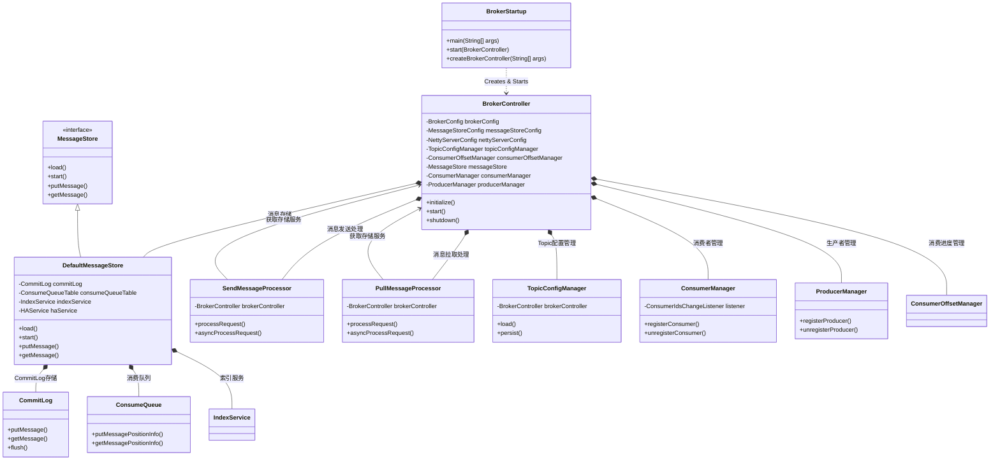

# RocketMQ Broker 核心架构

RocketMQ Broker 的核心架构是围绕 `BrokerController` 构建的，它作为消息存储和转发的核心组件，负责处理生产者消息投递、消费者消息拉取以及消息的持久化存储。

## 核心组件依赖图

## Broker 核心组件说明

### 1. **BrokerController** (核心控制器)
- **功能**: Broker 的核心控制器，负责初始化、启动和关闭所有组件
- **职责**:
  - 管理配置对象 (BrokerConfig, MessageStoreConfig, NettyServerConfig)
  - 初始化和管理各种管理器 (TopicConfigManager, ConsumerManager, ProducerManager)
  - 创建和管理线程池 (发送、拉取、查询等)
  - 注册请求处理器
  - 管理与 NameServer 的连接

### 2. **DefaultMessageStore** (消息存储引擎)
- **功能**: 负责消息的持久化存储和检索
- **核心组件**:
  - **CommitLog**: 存储所有消息的主体数据
  - **ConsumeQueue**: 存储消息在 CommitLog 中的索引信息
  - **IndexService**: 提供基于 Key 的消息索引功能
  - **HAService**: 主从复制服务
- **关键操作**:
  - `putMessage()`: 存储消息
  - `getMessage()`: 检索消息
  - `load()`: 启动时加载存储数据

### 3. **SendMessageProcessor** (消息发送处理器)
- **功能**: 处理来自 Producer 的消息投递请求
- **核心流程**:
  - 消息校验 (Topic、权限等)
  - 消息存储 (调用 MessageStore.putMessage())
  - 响应构建和返回

### 4. **PullMessageProcessor** (消息拉取处理器)
- **功能**: 处理来自 Consumer 的消息拉取请求
- **核心流程**:
  - 消费者权限校验
  - 从 ConsumeQueue 获取消息位置
  - 从 CommitLog 读取消息数据
  - 消息过滤和返回

### 5. **TopicConfigManager** (Topic 配置管理器)
- **功能**: 管理 Topic 的配置信息
- **职责**:
  - 加载和持久化 Topic 配置
  - 提供 Topic 配置查询服务
  - 支持动态创建 Topic

### 6. **ConsumerManager** (消费者管理器)
- **功能**: 管理连接到 Broker 的所有消费者
- **职责**:
  - 消费者注册和注销
  - 消费者心跳检测
  - 消费者状态管理
  - 消费者组信息维护

### 7. **ProducerManager** (生产者管理器)
- **功能**: 管理连接到 Broker 的所有生产者
- **职责**:
  - 生产者注册和注销
  - 生产者心跳检测
  - 生产者状态管理

## 启动流程依赖图

## 消息存储架构图

## 线程池架构图

## 核心依赖层级总结

1. **配置层**: `BrokerConfig`, `MessageStoreConfig`, `NettyServerConfig`
2. **控制层**: `BrokerController` (中央协调器)
3. **管理层**: `TopicConfigManager`, `ConsumerOffsetManager`, `ConsumerManager`, `ProducerManager`
4. **存储层**: `DefaultMessageStore`, `CommitLog`, `ConsumeQueue`, `IndexService`
5. **处理层**: `SendMessageProcessor`, `PullMessageProcessor`, 各种业务处理器
6. **网络层**: `NettyRemotingServer`, 线程池
7. **调度层**: `ScheduledExecutorService`, 各种定时任务

## 关键依赖特点

- **分层存储**: CommitLog 存储完整消息，ConsumeQueue 存储索引，提高查询效率
- **异步处理**: 消息存储支持同步和异步两种模式
- **高并发**: 通过多种线程池处理不同类型的请求
- **高可用**: 支持主从复制和消息故障恢复
- **可扩展**: 支持插件化的消息存储实现

## 数据流向

- **消息发送**: Producer → Netty → SendMessageProcessor → MessageStore → CommitLog
- **消息拉取**: Consumer → Netty → PullMessageProcessor → ConsumeQueue → CommitLog
- **消息索引**: MessageStore → IndexService → Index文件