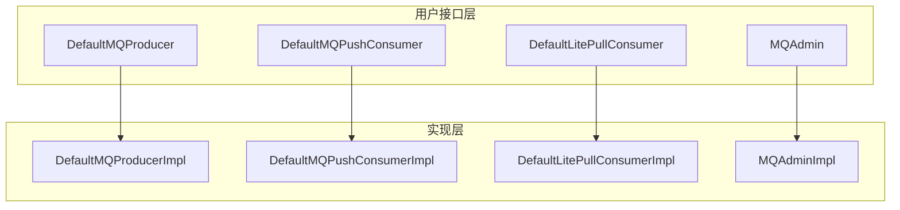
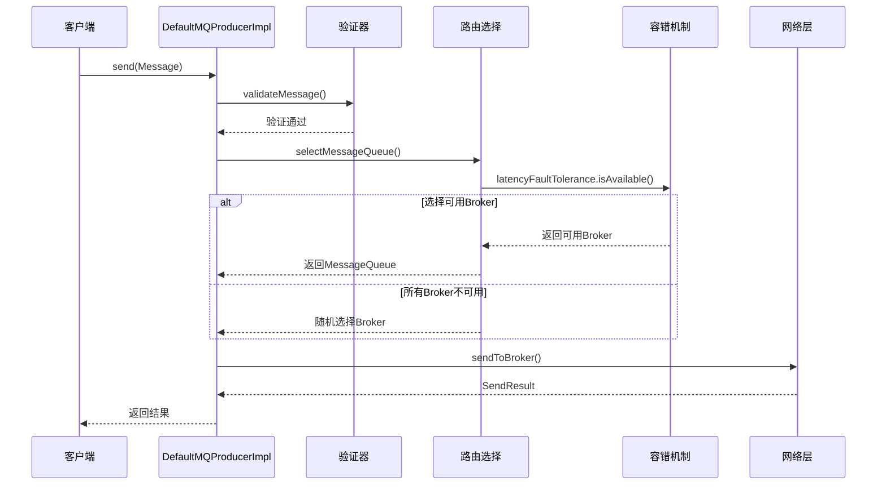

# RocketMQ Client 模块架构分析

## 概述

RocketMQ Client 模块是整个消息队列系统的客户端核心，提供了完整的生产者和消费者功能。该模块采用分层架构设计，通过清晰的抽象和接口，支持同步、异步、单向等多种消息发送方式，以及推送、拉取等多种消费模式。

## 目录结构

```
client/
├── src/main/java/org/apache/rocketmq/client/
│   ├── admin/                         # 管理接口
│   │   └── MQAdminExtInner.java       # 管理扩展内部接口
│   ├── common/                        # 通用组件
│   │   ├── ClientErrorCode.java       # 客户端错误码
│   │   └── ThreadLocalIndex.java      # 线程本地索引
│   ├── consumer/                      # 消费者接口和实现
│   │   ├── DefaultMQPullConsumer.java # 拉取消费者默认实现
│   │   ├── DefaultMQPushConsumer.java # 推送消费者默认实现
│   │   ├── DefaultLitePullConsumer.java # 轻量级拉取消费者
│   │   ├── LitePullConsumer.java      # 轻量级拉取消费者接口
│   │   ├── MQConsumer.java           # 消费者基础接口
│   │   ├── MQPullConsumer.java       # 拉取消费者接口
│   │   ├── MQPushConsumer.java       # 推送消费者接口
│   │   ├── listener/                 # 消息监听器
│   │   │   ├── ConsumeConcurrentlyContext.java
│   │   │   ├── ConsumeConcurrentlyStatus.java
│   │   │   ├── ConsumeOrderlyContext.java
│   │   │   ├── ConsumeOrderlyStatus.java
│   │   │   ├── MessageListener.java
│   │   │   ├── MessageListenerConcurrently.java
│   │   │   └── MessageListenerOrderly.java
│   │   ├── rebalance/                # 负载均衡策略
│   │   │   ├── AbstractAllocateMessageQueueStrategy.java
│   │   │   ├── AllocateMessageQueueAveragely.java
│   │   │   ├── AllocateMessageQueueAveragelyByCircle.java
│   │   │   ├── AllocateMessageQueueByConfig.java
│   │   │   ├── AllocateMessageQueueByMachineRoom.java
│   │   │   └── AllocateMessageQueueConsistentHash.java
│   │   ├── store/                    # 偏移量存储
│   │   │   ├── LocalFileOffsetStore.java
│   │   │   ├── OffsetStore.java
│   │   │   └── RemoteBrokerOffsetStore.java
│   │   ├── AllocateMessageQueueStrategy.java # 队列分配策略接口
│   │   ├── MessageListener.java      # 消息监听器接口
│   │   ├── MessageQueueListener.java # 消息队列监听器
│   │   ├── MessageSelector.java      # 消息选择器
│   │   ├── PullCallback.java         # 拉取回调
│   │   ├── PullResult.java           # 拉取结果
│   │   └── PullStatus.java           # 拉取状态
│   ├── impl/                         # 核心实现
│   │   ├── CommunicationMode.java    # 通信模式枚举
│   │   ├── FindBrokerResult.java     # Broker查找结果
│   │   ├── ClientRemotingProcessor.java # 客户端远程处理器
│   │   ├── MQAdminImpl.java          # 管理实现
│   │   ├── MQClientAPIImpl.java      # 客户端API实现
│   │   ├── MQClientInstance.java     # 客户端实例
│   │   ├── consumer/                 # 消费者实现
│   │   │   ├── ConsumeMessageConcurrentlyService.java # 并发消费服务
│   │   │   ├── ConsumeMessageOrderlyService.java     # 顺序消费服务
│   │   │   ├── ConsumeMessageService.java           # 消费服务接口
│   │   │   ├── DefaultMQPullConsumerImpl.java       # 拉取消费者实现
│   │   │   ├── DefaultMQPushConsumerImpl.java       # 推送消费者实现
│   │   │   ├── DefaultLitePullConsumerImpl.java     # 轻量级拉取消费者实现
│   │   │   ├── MQConsumerInner.java                 # 消费者内部接口
│   │   │   ├── ProcessQueue.java                    # 处理队列
│   │   │   ├── PullAPIWrapper.java                  # 拉取API封装
│   │   │   ├── PullMessageService.java              # 拉取消息服务
│   │   │   ├── PullRequest.java                     # 拉取请求
│   │   │   ├── RebalanceImpl.java                   # 重平衡实现
│   │   │   ├── RebalanceLitePullImpl.java           # 轻量级拉取重平衡
│   │   │   ├── RebalancePullImpl.java               # 拉取重平衡
│   │   │   ├── RebalancePushImpl.java               # 推送重平衡
│   │   │   ├── RebalanceService.java                # 重平衡服务
│   │   │   └── AssignedMessageQueue.java            # 分配的消息队列
│   │   └── producer/                # 生产者实现
│   │       ├── DefaultMQProducerImpl.java  # 默认生产者实现
│   │       ├── MQProducerInner.java       # 生产者内部接口
│   │       └── TopicPublishInfo.java      # 主题发布信息
│   ├── latency/                       # 延迟容错
│   │   ├── LatencyFaultTolerance.java  # 延迟容错接口
│   │   └── LatencyFaultToleranceImpl.java # 延迟容错实现
│   ├── log/                          # 日志组件
│   │   └── ClientLogger.java          # 客户端日志
│   ├── producer/                     # 生产者接口和配置
│   │   ├── DefaultMQProducer.java     # 默认生产者
│   │   ├── LocalTransactionExecuter.java # 本地事务执行器
│   │   ├── LocalTransactionState.java    # 本地事务状态
│   │   ├── MQProducer.java              # 生产者接口
│   │   ├── RequestCallback.java         # 请求回调
│   │   ├── RequestResponseFuture.java   # 请求响应Future
│   │   ├── SendCallback.java            # 发送回调
│   │   ├── SendResult.java              # 发送结果
│   │   ├── SendStatus.java              # 发送状态
│   │   ├── TransactionListener.java     # 事务监听器
│   │   ├── TransactionMQProducer.java   # 事务生产者
│   │   ├── TransactionSendResult.java   # 事务发送结果
│   │   ├── MessageQueueSelector.java    # 消息队列选择器
│   │   ├── selector/                    # 队列选择策略
│   │   │   ├── SelectMessageQueueByHash.java
│   │   │   ├── SelectMessageQueueByMachineRoom.java
│   │   │   └── SelectMessageQueueByRandom.java
│   │   └── RequestFutureHolder.java     # 请求Future持有者
│   ├── stat/                          # 统计组件
│   │   └── ConsumerStatsManager.java  # 消费者统计管理器
│   ├── trace/                         # 消息轨迹
│   │   ├── AsyncTraceDispatcher.java  # 异步轨迹分发器
│   │   ├── TraceBean.java             # 轨迹Bean
│   │   ├── TraceConstants.java        # 轨迹常量
│   │   ├── TraceContext.java          # 轨迹上下文
│   │   ├── TraceDataEncoder.java      # 轨迹数据编码器
│   │   ├── TraceDispatcher.java       # 轨迹分发器
│   │   ├── TraceDispatcherType.java   # 轨迹分发器类型
│   │   ├── TraceTransferBean.java     # 轨迹传输Bean
│   │   ├── TraceType.java             # 轨迹类型
│   │   ├── TraceView.java             # 轨迹视图
│   │   └── hook/                      # 轨迹钩子
│   │       ├── ConsumeMessageOpenTracingHookImpl.java
│   │       ├── ConsumeMessageTraceHookImpl.java
│   │       ├── EndTransactionOpenTracingHookImpl.java
│   │       ├── EndTransactionTraceHookImpl.java
│   │       ├── SendMessageOpenTracingHookImpl.java
│   │       └── SendMessageTraceHookImpl.java
│   ├── utils/                         # 工具类
│   │   └── MessageUtil.java           # 消息工具
│   ├── AccessChannel.java             # 访问通道
│   ├── ClientConfig.java              # 客户端配置
│   ├── MQAdmin.java                   # 管理接口
│   ├── MQHelper.java                  # 客户端助手
│   └── QueryResult.java               # 查询结果
└── src/test/java/                     # 测试代码
```

## 架构设计

### 1. 整体架构思想

RocketMQ Client 模块采用了经典的**分层架构**和**门面模式**的设计思想：

- **门面模式**：为复杂的内部实现提供简单易用的外部接口
- **策略模式**：支持多种负载均衡、消息选择、队列选择策略
- **工厂模式**：统一的客户端实例创建和管理
- **观察者模式**：消息监听器和钩子机制
- **模板方法模式**：统一的客户端配置和生命周期管理

### 2. 分层架构详解

#### 2.1 接口门面层 (Facade Layer)



##### 2.1.1 DefaultMQProducer - 生产者门面

```java
public class DefaultMQProducer extends ClientConfig implements MQProducer {
    private final DefaultMQProducerImpl defaultMQProducerImpl;

    // 核心发送方法
    public SendResult send(Message msg) throws MQClientException;
    public void send(Message msg, SendCallback sendCallback) throws MQClientException;
    public void sendOneway(Message msg) throws MQClientException;
    public TransactionSendResult sendMessageInTransaction(Message msg, LocalTransactionExecuter tranExecuter, Object arg);
}
```

**设计特点**：
- **简洁的API**：屏蔽内部复杂性，提供易用的接口
- **多种发送模式**：同步、异步、单向、事务
- **重载方法**：支持不同的使用场景
- **配置继承**：继承 `ClientConfig` 的基础配置

##### 2.1.2 DefaultMQPushConsumer - 推送消费者门面

```java
public class DefaultMQPushConsumer extends ClientConfig implements MQPushConsumer {
    private final DefaultMQPushConsumerImpl defaultMQPushConsumerImpl;

    // 核心订阅方法
    public void subscribe(String topic, String subExpression) throws MQClientException;
    public void registerMessageListener(MessageListenerConcurrently listener);
    public void registerMessageListener(MessageListenerOrderly listener);

    // 生命周期管理
    public void start() throws MQClientException;
    public void shutdown();
}
```

**核心功能**：
- **消息订阅**：支持标签和SQL表达式过滤
- **消息监听**：并发和顺序两种处理模式
- **自动管理**：自动拉取消息、自动提交偏移量
- **负载均衡**：自动参与队列重平衡

##### 2.1.3 DefaultLitePullConsumer - 轻量级拉取消费者

```java
public class DefaultLitePullConsumer extends ClientConfig implements LitePullConsumer {
    private final DefaultLitePullConsumerImpl defaultLitePullConsumerImpl;

    // 手动拉取消息
    public List<MessageExt> poll(long timeout);

    // 队列分配
    public void assign(Collection<MessageQueue> messageQueues);
    public void setAutoCommit(boolean autoCommit);

    // 订阅管理
    public void subscribe(String topic, String subExpression) throws MQClientException;
    public void unsubscribe(String topic);
}
```

**设计理念**：
- **手动控制**：用户主动控制消息拉取时机
- **灵活消费**：支持指定队列消费
- **轻量级**：比传统拉取消费者更简单易用
- **偏移量控制**：支持自动和手动提交

#### 2.2 核心实现层 (Core Implementation Layer)

##### 2.2.1 MQClientInstance - 客户端实例管理

`MQClientInstance` 是整个客户端模块的核心协调器：

```java
public class MQClientInstance {
    // 核心组件
    private final MQClientAPIImpl mQClientAPIImpl;
    private final MQClientManager mQClientManager;

    // 服务管理
    private final PullMessageService pullMessageService;
    private final RebalanceService rebalanceService;
    private final DefaultMQProducer defaultMQProducer;

    // 数据管理
    private final ConcurrentHashMap<String, TopicPublishInfo> topicPublishInfoTable;
    private final ConcurrentHashMap<String, MQProducerInner> producerTable;
    private final ConcurrentHashMap<String, MQConsumerInner> consumerTable;

    // 定时任务
    private final ScheduledExecutorService scheduledExecutorService;
}
```

**核心职责**：

1. **网络连接管理**：
   - 维护与NameServer和Broker的连接
   - 定期心跳检测
   - 网络异常处理和重连

2. **路由信息管理**：
   - 从NameServer获取Topic路由信息
   - 缓存和更新路由信息
   - Broker故障检测和剔除

3. **服务协调**：
   - 管理PullMessageService（消息拉取服务）
   - 管理RebalanceService（重平衡服务）
   - 协调多个Producer和Consumer实例

4. **定时任务管理**：
   - 定期更新NameServer地址
   - 定期心跳检测
   - 定期持久化消费偏移量

##### 2.2.2 生产者实现架构

###### DefaultMQProducerImpl 核心设计

```java
public class DefaultMQProducerImpl implements MQProducerInner {
    // 核心组件
    private final MQClientInstance mQClientInstance;
    private final TopicPublishInfoCache topicPublishInfoCache;

    // 容错机制
    private final LatencyFaultTolerance<String> latencyFaultTolerance;

    // 发送验证
    private final Validators validators;

    // 钩子机制
    private final ArrayList<SendMessageHook> sendMessageHookList;
    private final RPCHook rpcHook;
}
```

**关键设计特点**：

1. **消息发送流程模板**：



2. **容错机制设计**：

- **延迟容错**：`LatencyFaultTolerance` 记录Broker响应延迟
- **故障隔离**：故障Broker被临时隔离，避免反复访问
- **自动恢复**：隔离的Broker在恢复后重新可用
- **降级策略**：无可用Broker时的随机选择策略

3. **发送模式支持**：

```java
// 同步发送
public SendResult send(Message msg, long timeout) throws MQClientException {
    // 1. 消息验证
    // 2. 路由选择
    // 3. 网络发送
    // 4. 结果处理
}

// 异步发送
public void send(Message msg, SendCallback sendCallback, long timeout) {
    // 1. 异步回调包装
    // 2. 线程池执行
    // 3. 结果通知
}

// 单向发送
public void sendOneway(Message msg) {
    // 不等待响应，只管发送
}
```

##### 2.2.3 消费者实现架构

###### DefaultMQPushConsumerImpl 设计

```java
public class DefaultMQPushConsumerImpl implements MQConsumerInner {
    // 核心组件
    private final MQClientInstance mQClientInstance;
    private final PullAPIWrapper pullAPIWrapper;
    private final OffsetStore offsetStore;
    private final RebalanceImpl rebalanceImpl;
    private final ConsumeMessageService consumeMessageService;

    // 消费状态管理
    private final ConcurrentHashMap<MessageQueue, ProcessQueue> processQueueTable;
    private final AtomicLong consumeTimes = new AtomicLong();
}
```

**核心设计亮点**：

1. **消息拉取与消费分离**：
   - `PullMessageService`：专门负责从Broker拉取消息
   - `ConsumeMessageService`：专门负责消息消费处理
   - 异步处理，提高并发性能

2. **ProcessQueue 管理机制**：

```java
public class ProcessQueue {
    // 消息缓存
    private final TreeMap<Long, MessageExt> msgTreeMap = new TreeMap<>();
    private final AtomicLong msgCount = new AtomicLong();

    // 消费状态
    private volatile boolean queueLockEnable = false;
    private volatile boolean dropped = false;

    // 消费管理
    private final LinkedList<ConsumeRequest> msgList = new LinkedList<>();
    private final AtomicLong consumingMsgOrderly = new AtomicLong();
}
```

**ProcessQueue 设计精髓**：
- **消息排序**：使用 `TreeMap` 按偏移量排序
- **并发控制**：通过锁机制保证消费顺序性
- **内存管理**：控制消息数量和内存占用
- **状态跟踪**：跟踪消息消费状态

3. **重平衡机制**：

```java
public abstract class RebalanceImpl {
    // 队列分配策略
    protected AllocateMessageQueueStrategy allocateMessageQueueStrategy;

    // 重平衡触发
    public void doRebalance() {
        // 1. 获取消费者组所有消费者
        // 2. 获取主题所有消息队列
        // 3. 执行队列分配策略
        // 4. 更新消费者队列分配
    }
}
```

**重平衡策略**：
- **平均分配**：`AllocateMessageQueueAveragely`
- **一致性哈希**：`AllocateMessageQueueConsistentHash`
- **机房优先**：`AllocateMessageQueueByMachineRoom`
- **配置指定**：`AllocateMessageQueueByConfig`

#### 2.3 消息处理层 (Message Processing Layer)

##### 2.3.1 并发消息处理

```java
public class ConsumeMessageConcurrentlyService implements ConsumeMessageService {
    // 消费线程池
    private final ThreadPoolExecutor consumeExecutor;

    // 消息处理
    public void submitConsumeRequest(
        final List<MessageExt> msgs,
        final ProcessQueue processQueue,
        final MessageQueue messageQueue,
        final boolean dispathToConsume) {

        // 批量消费处理
        final ConsumeRequest consumeRequest = new ConsumeRequest(msgs, processQueue, messageQueue);
        this.consumeExecutor.submit(consumeRequest);
    }
}
```

**并发处理特点**：
- **线程池隔离**：消费处理与网络I/O分离
- **批量处理**：支持批量消息消费
- **异步处理**：不阻塞主线程
- **失败重试**：支持消费失败重试机制

##### 2.3.2 顺序消息处理

```java
public class ConsumeMessageOrderlyService implements ConsumeMessageService {
    // 消息队列锁
    private final MessageQueueLock messageQueueLock = new MessageQueueLock();

    // 顺序消费
    public void submitConsumeRequest(
        final List<MessageExt> msgs,
        final ProcessQueue processQueue,
        final MessageQueue messageQueue,
        final boolean dispathToConsume) {

        // 获取队列锁，保证顺序性
        final Object lock = messageQueueLock.fetchLockObject(messageQueue);
        synchronized (lock) {
            // 顺序处理消息
        }
    }
}
```

**顺序处理保证**：
- **队列级别锁**：每个消息队列独立加锁
- **单线程消费**：一个队列同时只有一个线程消费
- **暂停恢复机制**：支持消费暂停和恢复
- **状态同步**：保证消费状态的一致性

### 3. 核心设计模式

#### 3.1 门面模式 (Facade Pattern)

**应用场景**：`DefaultMQProducer`、`DefaultMQPushConsumer`

**设计目的**：
- 简化复杂子系统的接口
- 提供统一的客户端入口
- 隔离内部实现细节

**实现示例**：
```java
// 门面类
public class DefaultMQProducer implements MQProducer {
    private final DefaultMQProducerImpl defaultMQProducerImpl;

    public SendResult send(Message msg) throws MQClientException {
        // 委托给实现类
        return defaultMQProducerImpl.send(msg);
    }
}
```

#### 3.2 策略模式 (Strategy Pattern)

**应用场景**：
- `AllocateMessageQueueStrategy`：队列分配策略
- `MessageQueueSelector`：队列选择策略
- `LatencyFaultTolerance`：容错策略

**设计优势**：
- 算法可插拔
- 易于扩展新策略
- 运行时切换策略

#### 3.3 模板方法模式 (Template Method Pattern)

**应用场景**：`ClientConfig`

**设计思想**：
```java
public abstract class ClientConfig {
    // 通用配置
    private String namesrvAddr;
    private String clientIP;
    private int sendMsgTimeout = 3000;

    // 配置模板方法
    public void updateClientConfig() {
        // 1. 验证配置
        validateConfig();
        // 2. 更新配置
        updateConfigInternal();
        // 3. 通知监听器
        notifyConfigChange();
    }
}
```

#### 3.4 观察者模式 (Observer Pattern)

**应用场景**：
- `MessageListener`：消息监听器
- 各种Hook机制：`SendMessageHook`、`ConsumeMessageHook`

**设计优势**：
- 解耦消息生产与消费
- 支持多个监听器
- 异步通知机制

#### 3.5 工厂模式 (Factory Pattern)

**应用场景**：`MQClientManager`

**设计实现**：
```java
public class MQClientManager {
    // 单例客户端实例管理
    private static final InternalLogger log = ClientLogger.getLog();
    private static final ConcurrentHashMap<String, MQClientInstance> factoryTable =
        new ConcurrentHashMap<>();

    private static final long LOCK_TIMEOUT_MILLIS = 3000;
    private static final Lock lock = new ReentrantLock();

    // 工厂方法
    public static MQClientManager getInstance() {
        return MQClientManagerHolder.instance;
    }

    // 获取或创建客户端实例
    public MQClientInstance getAndCreateMQClientInstance(final ClientConfig clientConfig) {
        String clientId = clientConfig.buildMQClientId();

        MQClientInstance instance = factoryTable.get(clientId);
        if (null == instance) {
            // 双重检查锁定
            lock.lock();
            try {
                instance = factoryTable.get(clientId);
                if (null == instance) {
                    instance = new MQClientInstance(clientConfig.cloneClientConfig(),
                        this.factoryIndexGenerator.getAndIncrement(), clientId);
                    factoryTable.put(clientId, instance);
                }
            } finally {
                lock.unlock();
            }
        }

        return instance;
    }
}
```

### 4. 高性能设计

#### 4.1 异步处理

- **异步发送**：`SendCallback` 机制，不阻塞发送线程
- **异步消费**：消息拉取与消费处理分离
- **线程池隔离**：I/O线程与业务线程分离

#### 4.2 批量处理

- **批量发送**：支持一次发送多条消息
- **批量消费**：支持一次处理多条消息
- **压缩优化**：批量消息自动压缩

#### 4.3 缓存机制

- **路由缓存**：`topicPublishInfoTable` 缓存Topic路由信息
- **连接复用**：复用网络连接，减少创建开销
- **对象池化**：减少对象创建和GC压力

#### 4.4 容错机制

- **延迟容错**：`LatencyFaultTolerance` 避免访问故障Broker
- **重试机制**：自动重试失败的操作
- **降级策略**：无可用服务时的降级处理

### 5. 可扩展性设计

#### 5.1 钩子机制

```java
// 发送消息钩子
public interface SendMessageHook {
    String hookName();
    void executeBefore(SendMessageContext context);
    void executeAfter(SendMessageContext context);
}

// 消费消息钩子
public interface ConsumeMessageHook {
    String hookName();
    void executeBefore(ConsumeMessageContext context);
    void executeAfter(ConsumeMessageContext context);
}
```

#### 5.2 自定义策略

- **自定义负载均衡**：实现 `AllocateMessageQueueStrategy`
- **自定义消息选择**：实现 `MessageSelector`
- **自定义队列选择**：实现 `MessageQueueSelector`

#### 5.3 拦截器机制

- **轨迹追踪**：通过Hook实现消息轨迹
- **监控埋点**：通过Hook实现性能监控
- **业务扩展**：通过Hook实现业务逻辑扩展

### 6. 可靠性设计

#### 6.1 消息可靠性

- **发送确认**：同步发送等待Broker确认
- **重试机制**：失败自动重试
- **事务消息**：分布式事务支持

#### 6.2 消费可靠性

- **偏移量管理**：自动和手动偏移量提交
- **消息去重**：防止重复消费
- **失败重试**：消费失败重试队列

#### 6.3 连接可靠性

- **心跳检测**：定期心跳保持连接
- **自动重连**：网络异常自动重连
- **故障转移**：Broker故障自动转移

### 7. 架构优势

1. **易用性**：门面模式提供简洁的API
2. **高性能**：异步处理和批量操作
3. **高可靠**：完善的容错和重试机制
4. **高扩展**：钩子机制和策略模式
5. **多模式**：支持多种发送和消费模式
6. **可观测**：完整的消息轨迹和监控机制

### 8. 总结

RocketMQ Client 模块是一个设计精良、功能完备的客户端实现。通过门面模式、策略模式、工厂模式等设计模式的巧妙运用，实现了功能丰富而又易于使用的客户端接口。

其分层架构设计清晰，各层职责明确，便于理解和维护。异步处理、批量操作、容错机制等设计保证了高性能和高可靠性。丰富的扩展点使得系统具有很好的可扩展性，能够满足各种复杂的业务需求。

这个模块的设计充分体现了现代分布式系统中客户端开发的最佳实践，是 RocketMQ 能够在大规模分布式场景下稳定运行的重要保障。