# RocketMQ Client 架构图

## 概述

本文档包含 RocketMQ Client 模块的详细架构图和设计图，帮助理解其整体结构、组件关系和核心流程。

## 1. 整体架构图

### 1.1 分层架构图

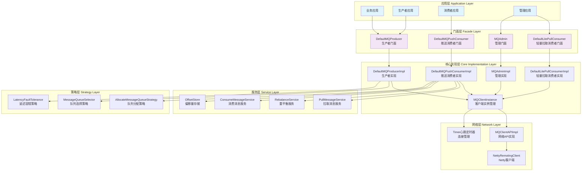
```mermaid
graph TB
    subgraph "应用层 Application Layer"
        A1[业务应用]
        A2[生产者应用]
        A3[消费者应用]
        A4[管理应用]
    end

    subgraph "门面层 Facade Layer"
        B1[DefaultMQProducer<br/>生产者门面]
        B2[DefaultMQPushConsumer<br/>推送消费者门面]
        B3[DefaultLitePullConsumer<br/>轻量拉取消费者门面]
        B4[MQAdmin<br/>管理门面]
    end

    subgraph "核心实现层 Core Implementation Layer"
        C1[DefaultMQProducerImpl<br/>生产者实现]
        C2[DefaultMQPushConsumerImpl<br/>推送消费者实现]
        C3[DefaultLitePullConsumerImpl<br/>轻量拉取消费者实现]
        C4[MQAdminImpl<br/>管理实现]
        C5[MQClientInstance<br/>客户端实例管理]
    end

    subgraph "服务层 Service Layer"
        D1[PullMessageService<br/>拉取消息服务]
        D2[RebalanceService<br/>重平衡服务]
        D3[ConsumeMessageService<br/>消费消息服务]
        D4[OffsetStore<br/>偏移量存储]
    end

    subgraph "策略层 Strategy Layer"
        E1[AllocateMessageQueueStrategy<br/>队列分配策略]
        E2[MessageQueueSelector<br/>队列选择策略]
        E3[LatencyFaultTolerance<br/>延迟容错策略]
    end

    subgraph "网络层 Network Layer"
        F1[MQClientAPIImpl<br/>网络API实现]
        F2[NettyRemotingClient<br/>Netty客户端]
        F3[Timer心跳定时器<br/>连接管理]
    end

    A1 --> B1
    A2 --> B1
    A3 --> B2
    A4 --> B3
    A4 --> B4

    B1 --> C1
    B2 --> C2
    B3 --> C3
    B4 --> C4

    C1 --> C5
    C2 --> C5
    C3 --> C5
    C4 --> C5

    C2 --> D1
    C2 --> D2
    C2 --> D3
    C2 --> D4

    C1 --> E2
    C1 --> E3
    C2 --> E1

    C5 --> F1
    F1 --> F2
    C5 --> F3

    style A1 fill:#e1f5fe
    style A2 fill:#e1f5fe
    style A3 fill:#e1f5fe
    style A4 fill:#e1f5fe
    style B1 fill:#f3e5f5
    style B2 fill:#f3e5f5
    style B3 fill:#f3e5f5
    style B4 fill:#f3e5f5
```

### 1.2 组件关系图

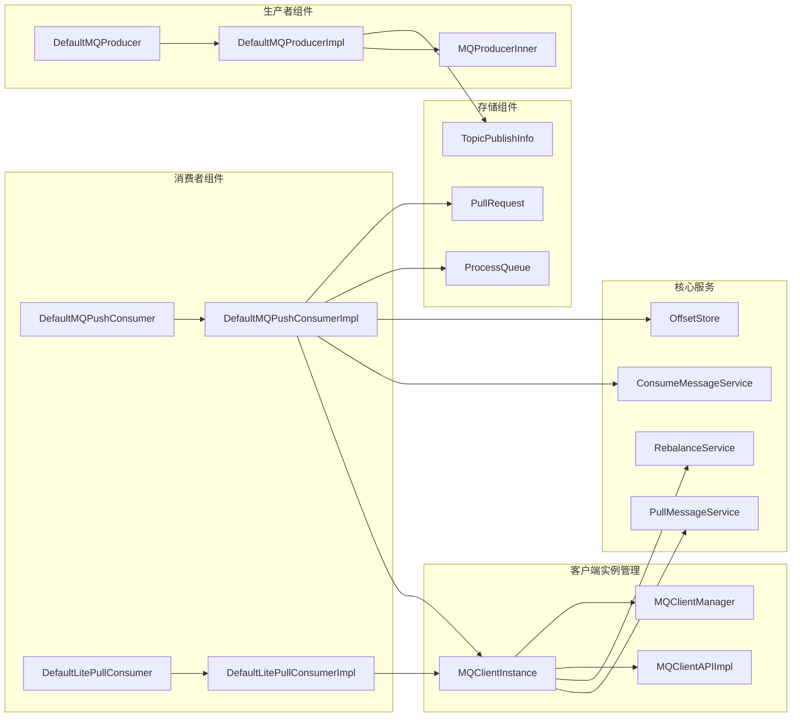
```mermaid
graph LR
    subgraph "客户端实例管理"
        CI[MQClientInstance]
        CM[MQClientManager]
        CA[MQClientAPIImpl]
    end

    subgraph "生产者组件"
        DP[DefaultMQProducer]
        DPP[DefaultMQProducerImpl]
        MQI[MQProducerInner]
    end

    subgraph "消费者组件"
        DC[DefaultMQPushConsumer]
        DCP[DefaultMQPushConsumerImpl]
        DLP[DefaultLitePullConsumer]
        DLPI[DefaultLitePullConsumerImpl]
    end

    subgraph "核心服务"
        PMS[PullMessageService]
        RS[RebalanceService]
        CMS[ConsumeMessageService]
        OS[OffsetStore]
    end

    subgraph "存储组件"
        PQ[ProcessQueue]
        RP[PullRequest]
        TPI[TopicPublishInfo]
    end

    DP --> DPP
    DC --> DCP
    DLP --> DLPI

    DPP --> MQI
    DCP --> CI
    DLPI --> CI

    CI --> PMS
    CI --> RS
    CI --> CA
    CI --> CM

    DCP --> CMS
    DCP --> OS
    DCP --> PQ
    DCP --> RP

    DPP --> TPI
```

## 2. 生产者架构图

### 2.1 生产者组件架构

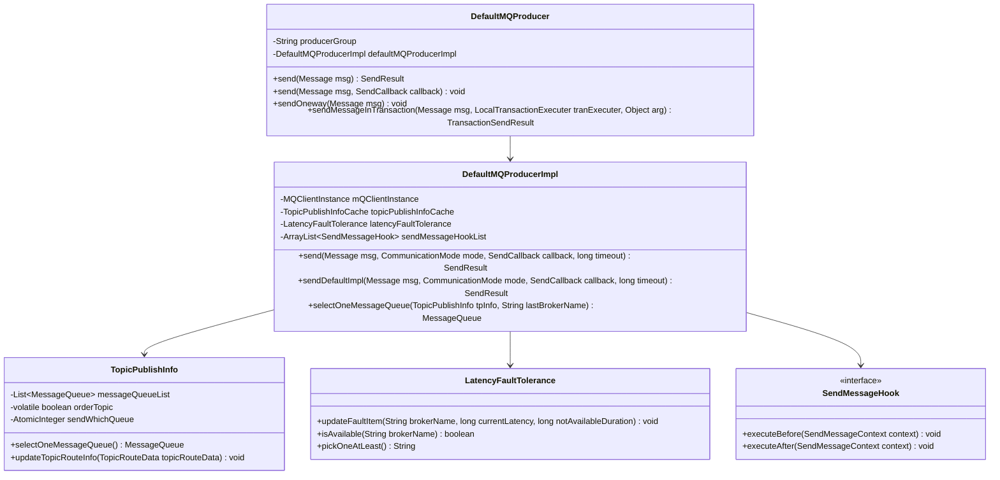
```mermaid
classDiagram
    class DefaultMQProducer {
        -String producerGroup
        -DefaultMQProducerImpl defaultMQProducerImpl
        +send(Message msg) SendResult
        +send(Message msg, SendCallback callback) void
        +sendOneway(Message msg) void
        +sendMessageInTransaction(Message msg, LocalTransactionExecuter tranExecuter, Object arg) TransactionSendResult
    }

    class DefaultMQProducerImpl {
        -MQClientInstance mQClientInstance
        -TopicPublishInfoCache topicPublishInfoCache
        -LatencyFaultTolerance latencyFaultTolerance
        -ArrayList~SendMessageHook~ sendMessageHookList
        +send(Message msg, CommunicationMode mode, SendCallback callback, long timeout) SendResult
        +sendDefaultImpl(Message msg, CommunicationMode mode, SendCallback callback, long timeout) SendResult
        +selectOneMessageQueue(TopicPublishInfo tpInfo, String lastBrokerName) MessageQueue
    }

    class TopicPublishInfo {
        -List~MessageQueue~ messageQueueList
        -volatile boolean orderTopic
        -AtomicInteger sendWhichQueue
        +selectOneMessageQueue() MessageQueue
        +updateTopicRouteInfo(TopicRouteData topicRouteData) void
    }

    class LatencyFaultTolerance {
        +updateFaultItem(String brokerName, long currentLatency, long notAvailableDuration) void
        +isAvailable(String brokerName) boolean
        +pickOneAtLeast() String
    }

    class SendMessageHook {
        <<interface>>
        +executeBefore(SendMessageContext context) void
        +executeAfter(SendMessageContext context) void
    }

    DefaultMQProducer --> DefaultMQProducerImpl
    DefaultMQProducerImpl --> TopicPublishInfo
    DefaultMQProducerImpl --> LatencyFaultTolerance
    DefaultMQProducerImpl --> SendMessageHook
```

### 2.2 消息发送流程图

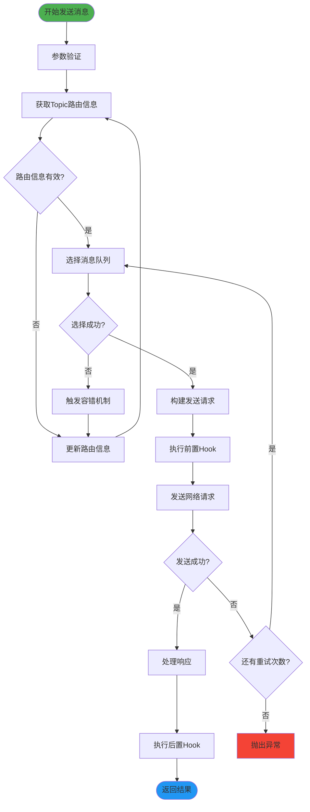
```mermaid
flowchart TD
    Start([开始发送消息]) --> Validate[参数验证]
    Validate --> GetRoute[获取Topic路由信息]
    GetRoute --> CheckRoute{路由信息有效?}

    CheckRoute -->|否| UpdateRoute[更新路由信息]
    UpdateRoute --> GetRoute

    CheckRoute -->|是| SelectQueue[选择消息队列]
    SelectQueue --> CheckQueue{选择成功?}

    CheckQueue -->|否| FaultTolerance[触发容错机制]
    FaultTolerance --> UpdateRoute

    CheckQueue -->|是| BuildRequest[构建发送请求]
    BuildRequest --> ExecuteHook[执行前置Hook]
    ExecuteHook --> SendRequest[发送网络请求]

    SendRequest --> Success{发送成功?}
    Success -->|是| ProcessResponse[处理响应]
    ProcessResponse --> PostHook[执行后置Hook]
    PostHook --> End([返回结果])

    Success -->|否| Retry{还有重试次数?}
    Retry -->|是| SelectQueue
    Retry -->|否| Exception[抛出异常]

    style Start fill:#4caf50
    style End fill:#2196f3
    style Exception fill:#f44336
```

## 3. 消费者架构图

### 3.1 推送消费者架构

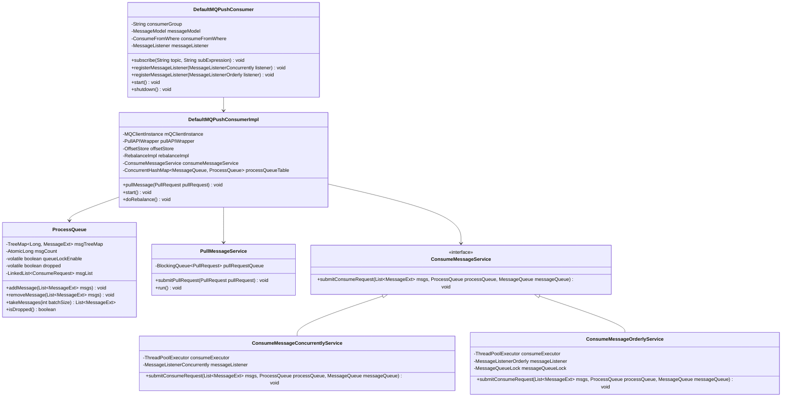
```mermaid
classDiagram
    class DefaultMQPushConsumer {
        -String consumerGroup
        -MessageModel messageModel
        -ConsumeFromWhere consumeFromWhere
        -MessageListener messageListener
        +subscribe(String topic, String subExpression) void
        +registerMessageListener(MessageListenerConcurrently listener) void
        +registerMessageListener(MessageListenerOrderly listener) void
        +start() void
        +shutdown() void
    }

    class DefaultMQPushConsumerImpl {
        -MQClientInstance mQClientInstance
        -PullAPIWrapper pullAPIWrapper
        -OffsetStore offsetStore
        -RebalanceImpl rebalanceImpl
        -ConsumeMessageService consumeMessageService
        -ConcurrentHashMap~MessageQueue, ProcessQueue~ processQueueTable
        +pullMessage(PullRequest pullRequest) void
        +start() void
        +doRebalance() void
    }

    class ProcessQueue {
        -TreeMap~Long, MessageExt~ msgTreeMap
        -AtomicLong msgCount
        -volatile boolean queueLockEnable
        -volatile boolean dropped
        -LinkedList~ConsumeRequest~ msgList
        +addMessage(List~MessageExt~ msgs) void
        +removeMessage(List~MessageExt~ msgs) void
        +takeMessages(int batchSize) List~MessageExt~
        +isDropped() boolean
    }

    class PullMessageService {
        -BlockingQueue~PullRequest~ pullRequestQueue
        +submitPullRequest(PullRequest pullRequest) void
        +run() void
    }

    class ConsumeMessageService {
        <<interface>>
        +submitConsumeRequest(List~MessageExt~ msgs, ProcessQueue processQueue, MessageQueue messageQueue) void
    }

    class ConsumeMessageConcurrentlyService {
        -ThreadPoolExecutor consumeExecutor
        -MessageListenerConcurrently messageListener
        +submitConsumeRequest(List~MessageExt~ msgs, ProcessQueue processQueue, MessageQueue messageQueue) void
    }

    class ConsumeMessageOrderlyService {
        -ThreadPoolExecutor consumeExecutor
        -MessageListenerOrderly messageListener
        -MessageQueueLock messageQueueLock
        +submitConsumeRequest(List~MessageExt~ msgs, ProcessQueue processQueue, MessageQueue messageQueue) void
    }

    DefaultMQPushConsumer --> DefaultMQPushConsumerImpl
    DefaultMQPushConsumerImpl --> ProcessQueue
    DefaultMQPushConsumerImpl --> PullMessageService
    DefaultMQPushConsumerImpl --> ConsumeMessageService
    ConsumeMessageService <|-- ConsumeMessageConcurrentlyService
    ConsumeMessageService <|-- ConsumeMessageOrderlyService
```

### 3.2 轻量级拉取消费者架构

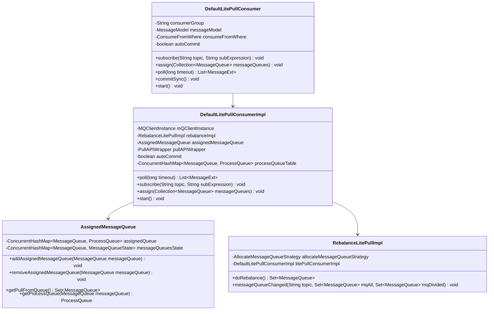
```mermaid
classDiagram
    class DefaultLitePullConsumer {
        -String consumerGroup
        -MessageModel messageModel
        -ConsumeFromWhere consumeFromWhere
        -boolean autoCommit
        +subscribe(String topic, String subExpression) void
        +assign(Collection~MessageQueue~ messageQueues) void
        +poll(long timeout) List~MessageExt~
        +commitSync() void
        +start() void
    }

    class DefaultLitePullConsumerImpl {
        -MQClientInstance mQClientInstance
        -RebalanceLitePullImpl rebalanceImpl
        -AssignedMessageQueue assignedMessageQueue
        -PullAPIWrapper pullAPIWrapper
        -boolean autoCommit
        -ConcurrentHashMap~MessageQueue, ProcessQueue~ processQueueTable
        +poll(long timeout) List~MessageExt~
        +subscribe(String topic, String subExpression) void
        +assign(Collection~MessageQueue~ messageQueues) void
        +start() void
    }

    class AssignedMessageQueue {
        -ConcurrentHashMap~MessageQueue, ProcessQueue~ assignedQueue
        -ConcurrentHashMap~MessageQueue, MessageQueueState~ messageQueuesState
        +addAssignedMessageQueue(MessageQueue messageQueue) void
        +removeAssignedMessageQueue(MessageQueue messageQueue) void
        +getPullFromQueue() Set~MessageQueue~
        +getProcessQueue(MessageQueue messageQueue) ProcessQueue
    }

    class RebalanceLitePullImpl {
        -AllocateMessageQueueStrategy allocateMessageQueueStrategy
        -DefaultLitePullConsumerImpl litePullConsumerImpl
        +doRebalance() Set~MessageQueue~
        +messageQueueChanged(String topic, Set~MessageQueue~ mqAll, Set~MessageQueue~ mqDivided) void
    }

    DefaultLitePullConsumer --> DefaultLitePullConsumerImpl
    DefaultLitePullConsumerImpl --> AssignedMessageQueue
    DefaultLitePullConsumerImpl --> RebalanceLitePullImpl
```

## 4. 重平衡架构图

### 4.1 重平衡流程图

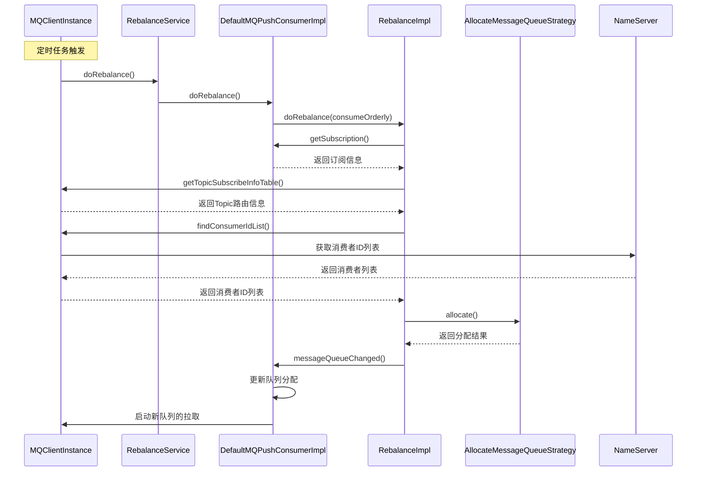
```mermaid
sequenceDiagram
    participant Client as MQClientInstance
    participant RebalanceService as RebalanceService
    participant Consumer as DefaultMQPushConsumerImpl
    participant RebalanceImpl as RebalanceImpl
    participant Allocator as AllocateMessageQueueStrategy
    participant NameServer as NameServer

    Note over Client: 定时任务触发
    Client->>RebalanceService: doRebalance()
    RebalanceService->>Consumer: doRebalance()

    Consumer->>RebalanceImpl: doRebalance(consumeOrderly)
    RebalanceImpl->>Consumer: getSubscription()
    Consumer-->>RebalanceImpl: 返回订阅信息

    RebalanceImpl->>Client: getTopicSubscribeInfoTable()
    Client-->>RebalanceImpl: 返回Topic路由信息

    RebalanceImpl->>Client: findConsumerIdList()
    Client->>NameServer: 获取消费者ID列表
    NameServer-->>Client: 返回消费者列表
    Client-->>RebalanceImpl: 返回消费者ID列表

    RebalanceImpl->>Allocator: allocate()
    Allocator-->>RebalanceImpl: 返回分配结果

    RebalanceImpl->>Consumer: messageQueueChanged()
    Consumer->>Consumer: 更新队列分配
    Consumer->>Client: 启动新队列的拉取
```

### 4.2 重平衡策略图

```mermaid
graph TB
    subgraph "重平衡策略选择"
        Strategy[策略选择]
    end

    subgraph "平均分配策略"
        Avg[AllocateMessageQueueAveragely]
        AvgLogic[计算公式：<br/>index = cidAll.indexOf(currentCID)<br/>mod = mqAll.size() % cidAll.size()<br/>averageSize = mqAll.size() / cidAll.size()]
        Avg --> AvgLogic
    end

    subgraph "循环分配策略"
        Circle[AllocateMessageQueueAveragelyByCircle]
        CircleLogic[循环分配<br/>依次轮询分配队列]
        Circle --> CircleLogic
    end

    subgraph "一致性哈希策略"
        Consistent[AllocateMessageQueueConsistentHash]
        ConsistentLogic[构建虚拟节点环<br/>基于哈希值分配]
        Consistent --> ConsistentLogic
    end

    subgraph "机房优先策略"
        MachineRoom[AllocateMessageQueueByMachineRoom]
        MachineRoomLogic[优先分配同机房<br/>跨机房作为备选]
        MachineRoom --> MachineRoomLogic
    end

    Strategy --> Avg
    Strategy --> Circle
    Strategy --> Consistent
    Strategy --> MachineRoom
```

## 5. 偏移量管理架构图

### 5.1 偏移量存储架构

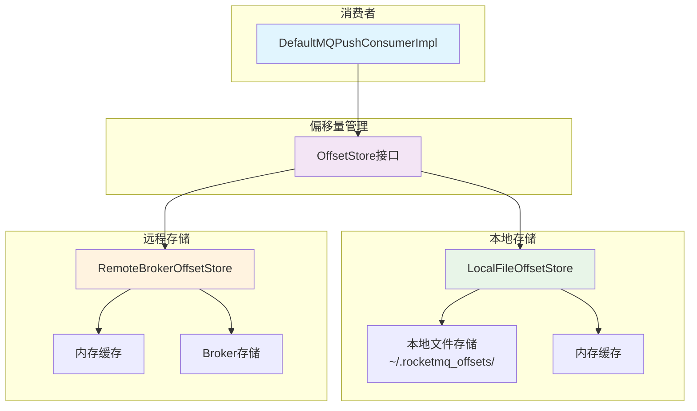
```mermaid
graph TD
    subgraph "消费者"
        Consumer[DefaultMQPushConsumerImpl]
    end

    subgraph "偏移量管理"
        OffsetStore[OffsetStore接口]
    end

    subgraph "本地存储"
        Local[LocalFileOffsetStore]
        LocalFile[本地文件存储<br/>~/.rocketmq_offsets/]
        LocalMemory[内存缓存]
        Local --> LocalFile
        Local --> LocalMemory
    end

    subgraph "远程存储"
        Remote[RemoteBrokerOffsetStore]
        RemoteCache[内存缓存]
        RemoteBroker[Broker存储]
        Remote --> RemoteCache
        Remote --> RemoteBroker
    end

    Consumer --> OffsetStore
    OffsetStore --> Local
    OffsetStore --> Remote

    style Consumer fill:#e1f5fe
    style OffsetStore fill:#f3e5f5
    style Local fill:#e8f5e8
    style Remote fill:#fff3e0
```

### 5.2 偏移量更新流程

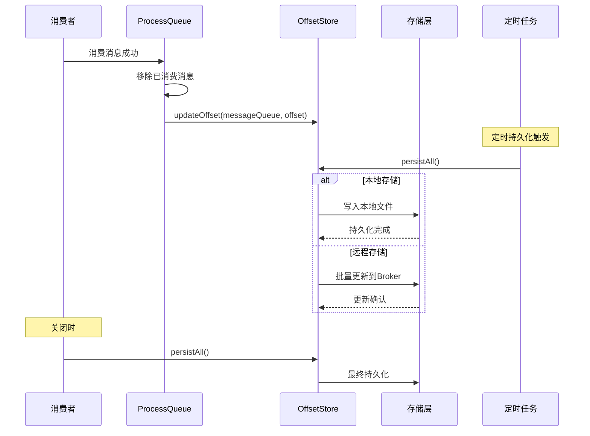
```mermaid
sequenceDiagram
    participant Consumer as 消费者
    participant ProcessQueue as ProcessQueue
    participant OffsetStore as OffsetStore
    participant Storage as 存储层
    participant ScheduledTask as 定时任务

    Consumer->>ProcessQueue: 消费消息成功
    ProcessQueue->>ProcessQueue: 移除已消费消息
    ProcessQueue->>OffsetStore: updateOffset(messageQueue, offset)

    Note over ScheduledTask: 定时持久化触发
    ScheduledTask->>OffsetStore: persistAll()

    alt 本地存储
        OffsetStore->>Storage: 写入本地文件
        Storage-->>OffsetStore: 持久化完成
    else 远程存储
        OffsetStore->>Storage: 批量更新到Broker
        Storage-->>OffsetStore: 更新确认
    end

    Note over Consumer: 关闭时
    Consumer->>OffsetStore: persistAll()
    OffsetStore->>Storage: 最终持久化
```

## 6. 线程模型架构图

### 6.1 生产者线程模型

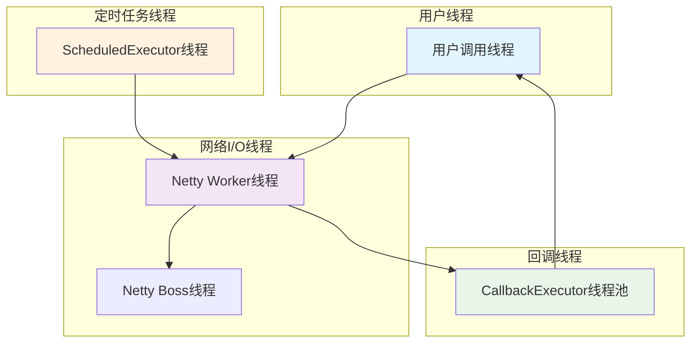
```mermaid
graph TB
    subgraph "用户线程"
        UserThread[用户调用线程]
    end

    subgraph "网络I/O线程"
        NettyWorker[Netty Worker线程]
        NettyBoss[Netty Boss线程]
    end

    subgraph "回调线程"
        CallbackExecutor[CallbackExecutor线程池]
    end

    subgraph "定时任务线程"
        ScheduledExecutor[ScheduledExecutor线程]
    end

    UserThread --> NettyWorker
    NettyWorker --> NettyBoss

    NettyWorker --> CallbackExecutor
    CallbackExecutor --> UserThread

    ScheduledExecutor --> NettyWorker

    style UserThread fill:#e1f5fe
    style NettyWorker fill:#f3e5f5
    style CallbackExecutor fill:#e8f5e8
    style ScheduledExecutor fill:#fff3e0
```

### 6.2 消费者线程模型

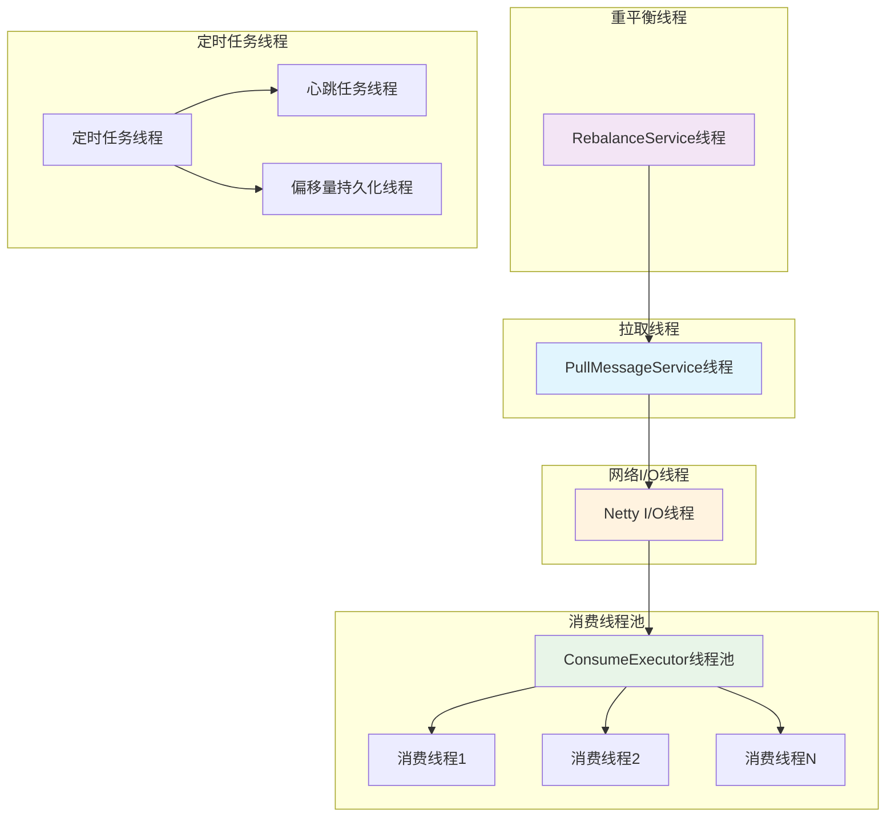
```mermaid
graph TB
    subgraph "拉取线程"
        PullMessageThread[PullMessageService线程]
    end

    subgraph "重平衡线程"
        RebalanceThread[RebalanceService线程]
    end

    subgraph "消费线程池"
        ConsumeExecutor[ConsumeExecutor线程池]
        ConsumeWorker1[消费线程1]
        ConsumeWorker2[消费线程2]
        ConsumeWorker3[消费线程N]
    end

    subgraph "网络I/O线程"
        NettyIO[Netty I/O线程]
    end

    subgraph "定时任务线程"
        ScheduledTask[定时任务线程]
        HeartbeatTask[心跳任务线程]
        OffsetPersistTask[偏移量持久化线程]
    end

    PullMessageThread --> NettyIO
    RebalanceThread --> PullMessageThread

    NettyIO --> ConsumeExecutor
    ConsumeExecutor --> ConsumeWorker1
    ConsumeExecutor --> ConsumeWorker2
    ConsumeExecutor --> ConsumeWorker3

    ScheduledTask --> HeartbeatTask
    ScheduledTask --> OffsetPersistTask

    style PullMessageThread fill:#e1f5fe
    style RebalanceThread fill:#f3e5f5
    style ConsumeExecutor fill:#e8f5e8
    style NettyIO fill:#fff3e0
```

## 7. 连接管理架构图

### 7.1 客户端连接管理

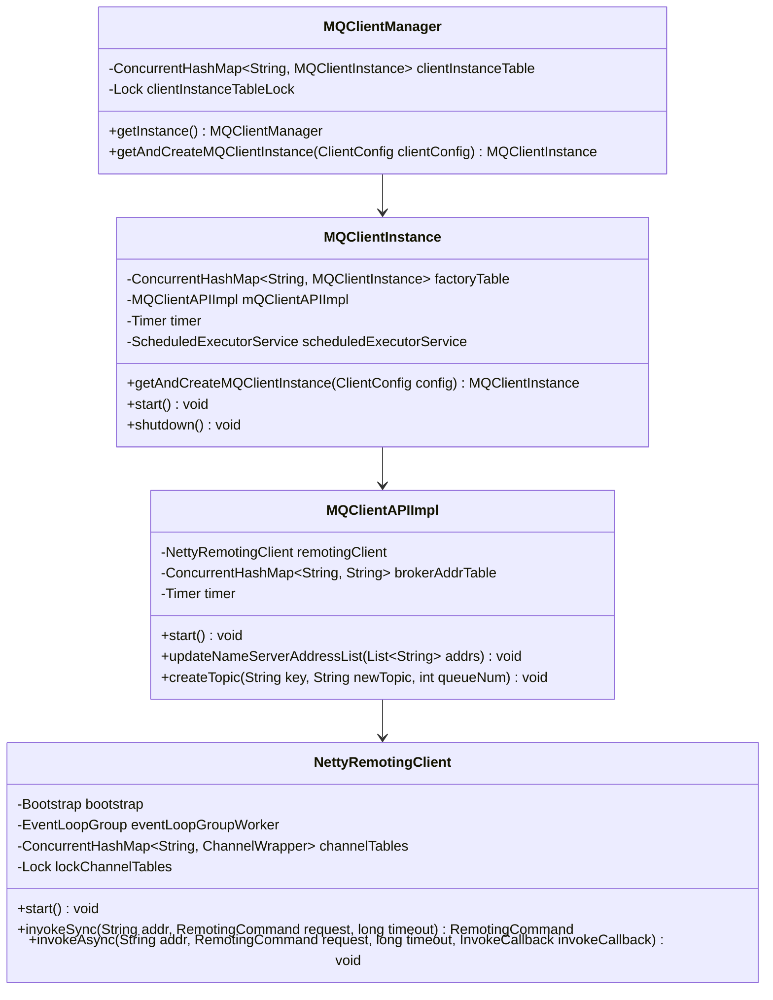
```mermaid
classDiagram
    class MQClientInstance {
        -ConcurrentHashMap~String, MQClientInstance~ factoryTable
        -MQClientAPIImpl mQClientAPIImpl
        -Timer timer
        -ScheduledExecutorService scheduledExecutorService
        +getAndCreateMQClientInstance(ClientConfig config) MQClientInstance
        +start() void
        +shutdown() void
    }

    class MQClientManager {
        -ConcurrentHashMap~String, MQClientInstance~ clientInstanceTable
        -Lock clientInstanceTableLock
        +getInstance() MQClientManager
        +getAndCreateMQClientInstance(ClientConfig clientConfig) MQClientInstance
    }

    class MQClientAPIImpl {
        -NettyRemotingClient remotingClient
        -ConcurrentHashMap~String, String~ brokerAddrTable
        -Timer timer
        +start() void
        +updateNameServerAddressList(List~String~ addrs) void
        +createTopic(String key, String newTopic, int queueNum) void
    }

    class NettyRemotingClient {
        -Bootstrap bootstrap
        -EventLoopGroup eventLoopGroupWorker
        -ConcurrentHashMap~String, ChannelWrapper~ channelTables
        -Lock lockChannelTables
        +start() void
        +invokeSync(String addr, RemotingCommand request, long timeout) RemotingCommand
        +invokeAsync(String addr, RemotingCommand request, long timeout, InvokeCallback invokeCallback) void
    }

    MQClientManager --> MQClientInstance
    MQClientInstance --> MQClientAPIImpl
    MQClientAPIImpl --> NettyRemotingClient
```

### 7.2 连接生命周期管理

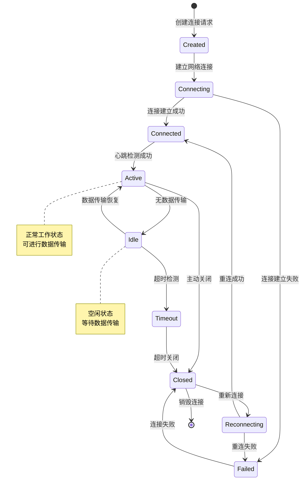
```mermaid
stateDiagram-v2
    [*] --> Created: 创建连接请求
    Created --> Connecting: 建立网络连接
    Connecting --> Connected: 连接建立成功
    Connecting --> Failed: 连接建立失败

    Connected --> Active: 心跳检测成功
    Active --> Idle: 无数据传输
    Idle --> Active: 数据传输恢复
    Idle --> Timeout: 超时检测

    Active --> Closed: 主动关闭
    Timeout --> Closed: 超时关闭
    Failed --> Closed: 连接失败

    Closed --> Reconnecting: 重新连接
    Reconnecting --> Connected: 重连成功
    Reconnecting --> Failed: 重连失败

    Closed --> [*]: 销毁连接

    note right of Active
        正常工作状态
        可进行数据传输
    end note

    note right of Idle
        空闲状态
        等待数据传输
    end note
```

## 8. 容错机制架构图

### 8.1 延迟容错机制

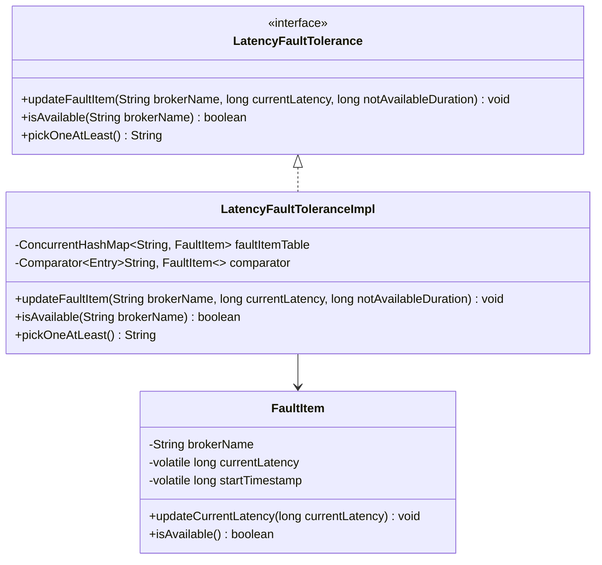
```mermaid
classDiagram
    class LatencyFaultTolerance {
        <<interface>>
        +updateFaultItem(String brokerName, long currentLatency, long notAvailableDuration) void
        +isAvailable(String brokerName) boolean
        +pickOneAtLeast() String
    }

    class LatencyFaultToleranceImpl {
        -ConcurrentHashMap~String, FaultItem~ faultItemTable
        -Comparator~Entry~String, FaultItem~~ comparator
        +updateFaultItem(String brokerName, long currentLatency, long notAvailableDuration) void
        +isAvailable(String brokerName) boolean
        +pickOneAtLeast() String
    }

    class FaultItem {
        -String brokerName
        -volatile long currentLatency
        -volatile long startTimestamp
        +updateCurrentLatency(long currentLatency) void
        +isAvailable() boolean
    }

    LatencyFaultTolerance <|.. LatencyFaultToleranceImpl
    LatencyFaultToleranceImpl --> FaultItem
```

### 8.2 容错策略流程

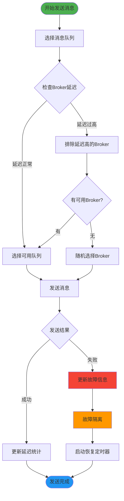
```mermaid
flowchart TD
    Start([开始发送消息]) --> SelectQueue[选择消息队列]
    SelectQueue --> CheckLatency{检查Broker延迟}

    CheckLatency -->|延迟正常| SelectAvailable[选择可用队列]
    CheckLatency -->|延迟过高| ExcludeBroker[排除延迟高的Broker]

    ExcludeBroker --> CheckAvailable{有可用Broker?}
    CheckAvailable -->|有| SelectAvailable
    CheckAvailable -->|无| RandomSelect[随机选择Broker]

    SelectAvailable --> SendRequest[发送消息]
    RandomSelect --> SendRequest

    SendRequest --> CheckResult{发送结果}
    CheckResult -->|成功| UpdateSuccess[更新延迟统计]
    CheckResult -->|失败| UpdateFault[更新故障信息]

    UpdateSuccess --> End([发送完成])
    UpdateFault --> FaultIsolation[故障隔离]
    FaultIsolation --> RecoveryTimer[启动恢复定时器]
    RecoveryTimer --> End

    style Start fill:#4caf50
    style End fill:#2196f3
    style UpdateFault fill:#f44336
    style FaultIsolation fill:#ff9800
```

## 9. 监控和追踪架构图

### 9.1 钩子机制架构

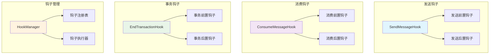
```mermaid
graph TB
    subgraph "发送钩子"
        SendHook[SendMessageHook]
        SendPreHook[发送前置钩子]
        SendPostHook[发送后置钩子]
    end

    subgraph "消费钩子"
        ConsumeHook[ConsumeMessageHook]
        ConsumePreHook[消费前置钩子]
        ConsumePostHook[消费后置钩子]
    end

    subgraph "事务钩子"
        TransactionHook[EndTransactionHook]
        TransactionPreHook[事务前置钩子]
        TransactionPostHook[事务后置钩子]
    end

    subgraph "钩子管理"
        HookManager[HookManager]
        HookRegistry[钩子注册表]
        HookExecutor[钩子执行器]
    end

    SendHook --> SendPreHook
    SendHook --> SendPostHook
    ConsumeHook --> ConsumePreHook
    ConsumeHook --> ConsumePostHook
    TransactionHook --> TransactionPreHook
    TransactionHook --> TransactionPostHook

    HookManager --> HookRegistry
    HookManager --> HookExecutor

    style SendHook fill:#e1f5fe
    style ConsumeHook fill:#f3e5f5
    style TransactionHook fill:#e8f5e8
    style HookManager fill:#fff3e0
```

### 9.2 消息轨迹架构

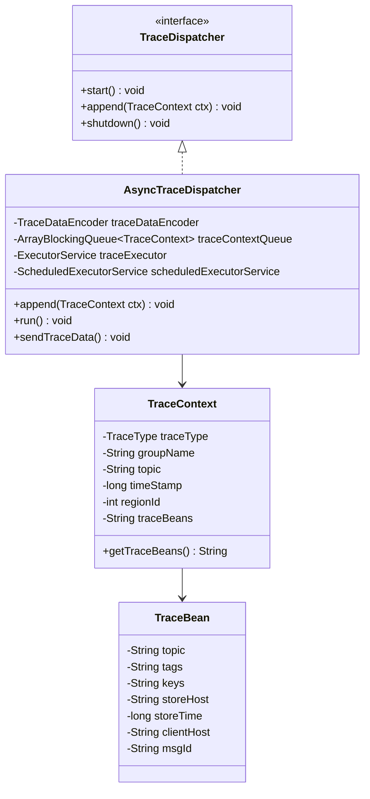
```mermaid
classDiagram
    class TraceDispatcher {
        <<interface>>
        +start() void
        +append(TraceContext ctx) void
        +shutdown() void
    }

    class AsyncTraceDispatcher {
        -TraceDataEncoder traceDataEncoder
        -ArrayBlockingQueue~TraceContext~ traceContextQueue
        -ExecutorService traceExecutor
        -ScheduledExecutorService scheduledExecutorService
        +append(TraceContext ctx) void
        +run() void
        +sendTraceData() void
    }

    class TraceContext {
        -TraceType traceType
        -String groupName
        -String topic
        -long timeStamp
        -int regionId
        -String traceBeans
        +getTraceBeans() String
    }

    class TraceBean {
        -String topic
        -String tags
        -String keys
        -String storeHost
        -long storeTime
        -String clientHost
        -String msgId
    }

    TraceDispatcher <|.. AsyncTraceDispatcher
    AsyncTraceDispatcher --> TraceContext
    TraceContext --> TraceBean
```

## 10. 性能优化架构图

### 10.1 批量处理架构

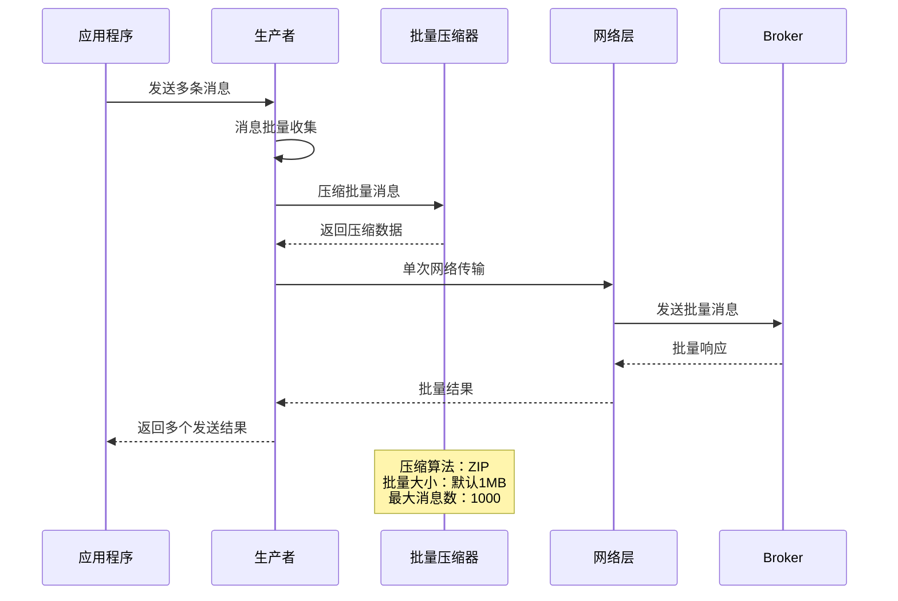
```mermaid
sequenceDiagram
    participant App as 应用程序
    participant Producer as 生产者
    participant BatchCompressor as 批量压缩器
    participant Network as 网络层
    participant Broker as Broker

    App->>Producer: 发送多条消息
    Producer->>Producer: 消息批量收集
    Producer->>BatchCompressor: 压缩批量消息
    BatchCompressor-->>Producer: 返回压缩数据
    Producer->>Network: 单次网络传输
    Network->>Broker: 发送批量消息
    Broker-->>Network: 批量响应
    Network-->>Producer: 批量结果
    Producer-->>App: 返回多个发送结果

    Note over BatchCompressor: 压缩算法：ZIP<br/>批量大小：默认1MB<br/>最大消息数：1000
```

### 10.2 内存管理架构

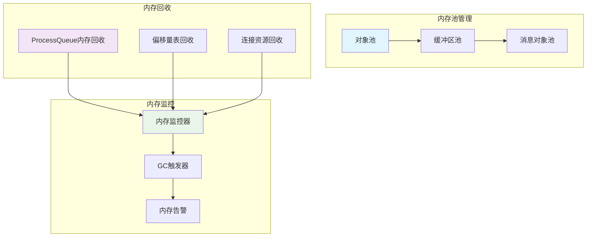
```mermaid
graph TB
    subgraph "内存池管理"
        ObjectPool[对象池]
        BufferPool[缓冲区池]
        MessagePool[消息对象池]
    end

    subgraph "内存回收"
        ProcessQueueGC[ProcessQueue内存回收]
        OffsetTableGC[偏移量表回收]
        ConnectionGC[连接资源回收]
    end

    subgraph "内存监控"
        MemoryMonitor[内存监控器]
        GCTrigger[GC触发器]
        MemoryAlarm[内存告警]
    end

    ObjectPool --> BufferPool
    BufferPool --> MessagePool

    ProcessQueueGC --> MemoryMonitor
    OffsetTableGC --> MemoryMonitor
    ConnectionGC --> MemoryMonitor

    MemoryMonitor --> GCTrigger
    GCTrigger --> MemoryAlarm

    style ObjectPool fill:#e1f5fe
    style ProcessQueueGC fill:#f3e5f5
    style MemoryMonitor fill:#e8f5e8
```

## 11. 安全架构图

### 11.1 ACL安全机制

```mermaid
flowchart TD
    ClientStart([客户端启动]) --> CheckACL{启用ACL?}

    CheckACL -->|否| NormalAuth[普通认证]
    CheckACL -->|是| LoadAccessKey[加载访问密钥]

    LoadAccessKey --> ValidateKey{密钥验证}
    ValidateKey -->|失败| AuthFailed[认证失败]
    ValidateKey -->|成功| SignRequest[对请求签名]

    SignRequest --> SendWithAuth[发送带签名的请求]
    NormalAuth --> SendRequest[发送普通请求]

    SendWithAuth --> ServerVerify[服务端验证]
    SendRequest --> ServerProcess[服务端处理]

    ServerVerify --> VerifySuccess{验证成功?}
    VerifySuccess -->|是| ServerProcess
    VerifySuccess -->|否| AuthFailed

    ServerProcess --> Success([请求成功])
    AuthFailed --> Failed([请求失败])

    style ClientStart fill:#4caf50
    style Success fill:#2196f3
    style Failed fill:#f44336
    style AuthFailed fill:#ff9800
```

### 11.2 TLS加密通信

```mermaid
graph TB
    subgraph "TLS握手过程"
        TLSHandshake[TLS握手]
        CertExchange[证书交换]
        KeyExchange[密钥交换]
        SessionEstablish[建立安全会话]
    end

    subgraph "加密通信"
        DataEncrypt[数据加密]
        Transmit[安全传输]
        DataDecrypt[数据解密]
    end

    subgraph "证书管理"
        CertStore[证书存储]
        CertValidation[证书验证]
        CertRenewal[证书更新]
    end

    TLSHandshake --> CertExchange
    CertExchange --> KeyExchange
    KeyExchange --> SessionEstablish
    SessionEstablish --> DataEncrypt
    DataEncrypt --> Transmit
    Transmit --> DataDecrypt

    CertStore --> CertValidation
    CertValidation --> CertRenewal

    style TLSHandshake fill:#e1f5fe
    style DataEncrypt fill:#f3e5f5
    style CertStore fill:#e8f5e8
```

## 12. 部署架构图

### 12.1 客户端部署模式

```mermaid
graph TB
    subgraph "单机部署"
        SingleApp[单机应用]
        SingleClient[单个客户端实例]
        SingleMQClient[单一MQClientInstance]
    end

    subgraph "集群部署"
        ClusterApp1[应用节点1]
        ClusterApp2[应用节点2]
        ClusterApp3[应用节点N]

        ClientInstance1[客户端实例1]
        ClientInstance2[客户端实例2]
        ClientInstance3[客户端实例N]
    end

    subgraph "服务端"
        NameServer1[NameServer1]
        NameServer2[NameServer2]
        NameServer3[NameServer3]

        Broker1[Broker1]
        Broker2[Broker2]
        Broker3[Broker3]
    end

    SingleApp --> SingleClient
    SingleClient --> SingleMQClient

    ClusterApp1 --> ClientInstance1
    ClusterApp2 --> ClientInstance2
    ClusterApp3 --> ClientInstance3

    SingleMQClient --> NameServer1
    SingleMQClient --> Broker1
    SingleMQClient --> Broker2

    ClientInstance1 --> NameServer1
    ClientInstance1 --> NameServer2
    ClientInstance1 --> Broker1
    ClientInstance1 --> Broker2

    ClientInstance2 --> NameServer2
    ClientInstance2 --> NameServer3
    ClientInstance2 --> Broker2
    ClientInstance2 --> Broker3

    ClientInstance3 --> NameServer3
    ClientInstance3 --> NameServer1
    ClientInstance3 --> Broker3
    ClientInstance3 --> Broker1

    style SingleApp fill:#e1f5fe
    style ClusterApp1 fill:#f3e5f5
    style ClusterApp2 fill:#f3e5f5
    style ClusterApp3 fill:#f3e5f5
    style NameServer1 fill:#e8f5e8
    style Broker1 fill:#fff3e0
```

### 12.2 高可用部署架构

```mermaid
graph TB
    subgraph "应用层"
        App1[应用实例1]
        App2[应用实例2]
        App3[应用实例3]
    end

    subgraph "客户端层"
        ClientPool1[客户端连接池1]
        ClientPool2[客户端连接池2]
        ClientPool3[客户端连接池3]
    end

    subgraph "NameServer集群"
        NS1[NameServer1<br/>主节点]
        NS2[NameServer2<br/>备用节点]
        NS3[NameServer3<br/>备用节点]
    end

    subgraph "Broker集群"
        BM1[Broker-Master1<br/>主节点]
        BM2[Broker-Master2<br/>主节点]
        BS1[Broker-Slave1<br/>从节点]
        BS2[Broker-Slave2<br/>从节点]
    end

    App1 --> ClientPool1
    App2 --> ClientPool2
    App3 --> ClientPool3

    ClientPool1 --> NS1
    ClientPool1 --> NS2
    ClientPool1 --> BM1
    ClientPool1 --> BM2

    ClientPool2 --> NS2
    ClientPool2 --> NS3
    ClientPool2 --> BM1
    ClientPool2 --> BM2

    ClientPool3 --> NS3
    ClientPool3 --> NS1
    ClientPool3 --> BM1
    ClientPool3 --> BM2

    BM1 -.-> BS1
    BM2 -.-> BS2

    NS1 -.-> NS2
    NS2 -.-> NS3
    NS3 -.-> NS1

    style App1 fill:#e1f5fe
    style App2 fill:#e1f5fe
    style App3 fill:#e1f5fe
    style NS1 fill:#4caf50
    style NS2 fill:#ff9800
    style NS3 fill:#ff9800
    style BM1 fill:#2196f3
    style BM2 fill:#2196f3
    style BS1 fill:#9e9e9e
    style BS2 fill:#9e9e9e
```

## 13. 总结

RocketMQ Client 模块的架构设计体现了以下核心特点：

1. **分层清晰**：从门面层到网络层，职责明确，层次分明
2. **模块化设计**：各组件独立，松耦合，易于扩展和维护
3. **高性能优化**：通过异步处理、批量操作、连接复用等技术提升性能
4. **高可靠性**：完善的容错机制和重试策略保证系统稳定性
5. **可扩展性**：通过钩子机制和策略模式支持功能扩展
6. **安全可靠**：支持ACL认证和TLS加密，保障通信安全
7. **易于使用**：简洁的门面接口，降低使用门槛

这些架构设计使得 RocketMQ Client 能够在各种复杂的生产环境中稳定运行，为分布式消息处理提供可靠的基础支撑。