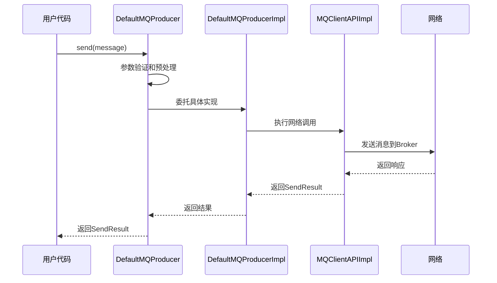
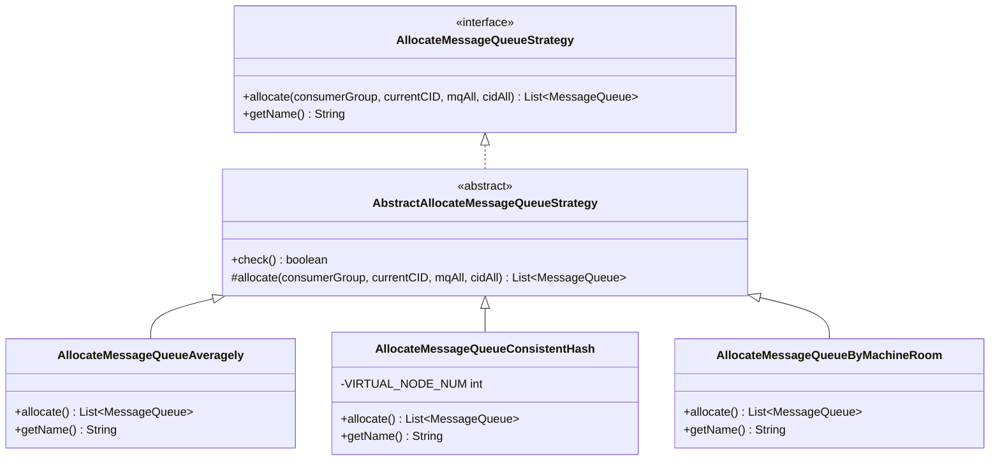
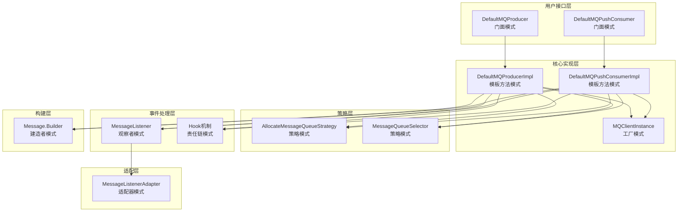

# RocketMQ Client 模块设计模式分析

## 概述

RocketMQ Client 模块广泛运用了多种经典设计模式，这些模式不仅提高了代码的可读性和可维护性，还大大增强了系统的可扩展性和灵活性。本文档深入分析了 Client 模块中使用的主要设计模式及其具体实现。

## 1. 门面模式 (Facade Pattern)

### 1.1 模式定义

门面模式为复杂的子系统提供了一个统一的简化接口，隐藏了内部实现的复杂性，让客户端更容易使用。

### 1.2 在 Client 模块中的应用

#### 1.2.1 DefaultMQProducer 门面

```java
public class DefaultMQProducer extends ClientConfig implements MQProducer {
    private final DefaultMQProducerImpl defaultMQProducerImpl;

    public DefaultMQProducer() {
        this(null, (MQProducerImpl) new DefaultMQProducerImpl(this));
    }

    public DefaultMQProducer(final String producerGroup) {
        this(producerGroup, (MQProducerImpl) new DefaultMQProducerImpl(this));
    }

    // 简化的发送接口
    public SendResult send(Message msg) throws MQClientException {
        return defaultMQProducerImpl.send(msg);
    }

    public void send(Message msg, SendCallback sendCallback) throws MQClientException {
        defaultMQProducerImpl.send(msg, sendCallback);
    }

    public void sendOneway(Message msg) throws MQClientException {
        defaultMQProducerImpl.sendOneway(msg);
    }

    public TransactionSendResult sendMessageInTransaction(Message msg,
        LocalTransactionExecuter tranExecuter, final Object arg) throws MQClientException {
        return defaultMQProducerImpl.sendMessageInTransaction(msg, tranExecuter, arg);
    }
}
```

**设计亮点**：

1. **接口简化**：将复杂的发送逻辑封装为简单的方法调用
2. **配置继承**：继承 `ClientConfig` 提供统一的配置管理
3. **实现隐藏**：用户无需了解内部的 `DefaultMQProducerImpl` 复杂实现
4. **职责分离**：门面负责接口，实现类负责具体逻辑

#### 1.2.2 DefaultMQPushConsumer 门面

```java
public class DefaultMQPushConsumer extends ClientConfig implements MQPushConsumer {
    private final DefaultMQPushConsumerImpl defaultMQPushConsumerImpl;

    // 简化的订阅接口
    public void subscribe(String topic, String subExpression) throws MQClientException {
        defaultMQPushConsumerImpl.subscribe(topic, subExpression);
    }

    public void subscribe(final String topic, final String fullClassName,
        final String filterClassSource) throws MQClientException {
        defaultMQPushConsumerImpl.subscribe(topic, fullClassName, filterClassSource);
    }

    public void registerMessageListener(MessageListenerConcurrently listener) {
        defaultMQPushConsumerImpl.registerMessageListener(listener);
    }

    public void registerMessageListener(MessageListenerOrderly listener) {
        defaultMQPushConsumerImpl.registerMessageListener(listener);
    }

    // 简化的生命周期管理
    public void start() throws MQClientException {
        this.defaultMQPushConsumerImpl.start();
    }

    public void shutdown() {
        this.defaultMQPushConsumerImpl.shutdown();
    }
}
```

**门面模式的优势**：

1. **降低复杂度**：用户只需调用简单的方法，无需了解内部复杂机制
2. **提高易用性**：统一的API风格，学习成本低
3. **解耦**：用户代码与内部实现完全解耦
4. **演进友好**：内部实现可以随时更改，不影响用户代码

### 1.3 门面模式时序图



## 2. 策略模式 (Strategy Pattern)

### 2.1 模式定义

策略模式定义了一系列算法，把它们一个个封装起来，并且使它们可相互替换。

### 2.2 在 Client 模块中的应用

#### 2.2.1 消息队列分配策略

```java
// 策略接口
public interface AllocateMessageQueueStrategy {
    /**
     * 分配消息队列
     * @param consumerGroup 消费者组
     * @param currentCID 当前消费者ID
     * @param mqAll 所有消息队列
     * @param cidAll 所有消费者ID
     * @return 分配给当前消费者的队列列表
     */
    List<MessageQueue> allocate(
        final String consumerGroup,
        final String currentCID,
        final List<MessageQueue> mqAll,
        final List<String> cidAll
    );

    /**
     * 策略名称
     */
    String getName();
}
```

**具体策略实现**：

##### 2.2.1.1 平均分配策略

```java
public class AllocateMessageQueueAveragely extends AbstractAllocateMessageQueueStrategy {
    @Override
    public List<MessageQueue> allocate(String consumerGroup, String currentCID,
        List<MessageQueue> mqAll, List<String> cidAll) {

        List<MessageQueue> result = new ArrayList<MessageQueue>();
        if (!check(consumerGroup, currentCID, mqAll, cidAll)) {
            return result;
        }

        int index = cidAll.indexOf(currentCID);
        int mod = mqAll.size() % cidAll.size();
        int averageSize = mqAll.size() <= cidAll.size() ? 1 :
            (mod > 0 ? mqAll.size() / cidAll.size() + 1 : mqAll.size() / cidAll.size());
        int startIndex = (mod > 0 && index < mod) ? averageSize * index :
            averageSize * index + mod;
        int endIndex = startIndex + averageSize;
        for (int i = startIndex; i < endIndex; i++) {
            result.add(mqAll.get(i % mqAll.size()));
        }
        return result;
    }

    @Override
    public String getName() {
        return "AVG";
    }
}
```

##### 2.2.1.2 一致性哈希策略

```java
public class AllocateMessageQueueConsistentHash extends AbstractAllocateMessageQueueStrategy {
    private final static int VIRTUAL_NODE_NUM = 4;

    @Override
    public List<MessageQueue> allocate(String consumerGroup, String currentCID,
        List<MessageQueue> mqAll, List<String> cidAll) {

        List<MessageQueue> result = new ArrayList<MessageQueue>();
        if (!check(consumerGroup, currentCID, mqAll, cidAll)) {
            return result;
        }

        // 构建虚拟节点
        TreeMap<Long, String> virtualNodeTreeMap = new TreeMap<>();
        for (String cid : cidAll) {
            for (int i = 0; i < VIRTUAL_NODE_NUM; i++) {
                String virtualNodeName = cid + "-" + i;
                virtualNodeTreeMap.put(hash(virtualNodeName), virtualNodeName);
            }
        }

        // 分配队列
        for (MessageQueue mq : mqAll) {
            String brokerName = mq.getBrokerName();
            long mqHash = hash(brokerName);

            SortedMap<Long, String> subMap = virtualNodeTreeMap.tailMap(mqHash);
            String targetConsumer = null;
            if (!subMap.isEmpty()) {
                targetConsumer = subMap.get(subMap.firstKey());
            } else {
                targetConsumer = virtualNodeTreeMap.get(virtualNodeTreeMap.firstKey());
            }

            if (targetConsumer != null && targetConsumer.startsWith(currentCID)) {
                result.add(mq);
            }
        }
        return result;
    }

    @Override
    public String getName() {
        return "CONSISTENT_HASH";
    }
}
```

#### 2.2.2 消息队列选择策略

```java
public interface MessageQueueSelector {
    /**
     * 选择消息队列
     * @param mqs 可用的消息队列列表
     * @param msg 要发送的消息
     * @param arg 用户参数
     * @return 选中的消息队列
     */
    MessageQueue select(final List<MessageQueue> mqs, final Message msg, final Object arg);
}
```

**具体选择策略**：

##### 2.2.2.1 哈希选择策略

```java
public class SelectMessageQueueByHash implements MessageQueueSelector {
    @Override
    public MessageQueue select(List<MessageQueue> mqs, Message msg, Object arg) {
        int value = arg.hashCode();
        if (value < 0) {
            value = Math.abs(value);
        }
        value = value % mqs.size();
        return mqs.get(value);
    }
}
```

##### 2.2.2.2 随机选择策略

```java
public class SelectMessageQueueByRandom implements MessageQueueSelector {
    private final Random random = new Random(System.currentTimeMillis());

    @Override
    public MessageQueue select(List<MessageQueue> mqs, Message msg, Object arg) {
        int value = random.nextInt(mqs.size());
        return mqs.get(value);
    }
}
```

### 2.3 策略模式类图



### 2.4 策略模式的优势

1. **算法可替换**：运行时可以切换不同的分配策略
2. **易于扩展**：添加新策略只需实现接口
3. **开闭原则**：对修改关闭，对扩展开放
4. **算法独立**：各个策略相互独立，互不影响

## 3. 工厂模式 (Factory Pattern)

### 3.1 模式定义

工厂模式提供了创建对象的接口，隐藏了对象创建的复杂性。

### 3.2 在 Client 模块中的应用

#### 3.2.1 MQClientInstance 工厂

```java
public class MQClientManager {
    private static final InternalLogger log = ClientLogger.getLog();
    private static final ConcurrentHashMap<String, MQClientInstance> factoryTable =
        new ConcurrentHashMap<>();
    private static final AtomicLong factoryIndexGenerator = new AtomicLong(0);

    // 单例管理器
    private static class MQClientManagerHolder {
        private static final MQClientManager instance = new MQClientManager();
    }

    public static MQClientManager getInstance() {
        return MQClientManagerHolder.instance;
    }

    // 工厂方法
    public MQClientInstance getAndCreateMQClientInstance(final ClientConfig clientConfig) {
        // 生成客户端ID
        String clientId = clientConfig.buildMQClientId();

        MQClientInstance instance = factoryTable.get(clientId);
        if (null == instance) {
            // 双重检查锁定
            lock.lock();
            try {
                instance = factoryTable.get(clientId);
                if (null == instance) {
                    // 创建新实例
                    instance = new MQClientInstance(
                        clientConfig.cloneClientConfig(),
                        this.factoryIndexGenerator.getAndIncrement(),
                        clientId,
                        RPCHook
                    );
                    factoryTable.put(clientId, instance);
                }
            } finally {
                lock.unlock();
            }
        }
        return instance;
    }

    // 移除实例
    public void removeClientInstance(final String clientId) {
        factoryTable.remove(clientId);
    }
}
```

**工厂模式特点**：

1. **单例管理**：相同配置的客户端共享实例
2. **线程安全**：使用双重检查锁定确保线程安全
3. **资源复用**：避免重复创建网络连接和线程池
4. **生命周期管理**：统一管理客户端实例的创建和销毁

#### 3.2.2 MQClientInstance 构造工厂

```java
public class MQClientInstance {
    public MQClientInstance(ClientConfig clientConfig, int instanceIndex, String clientId, RPCHook rpcHook) {
        // 初始化配置
        this.clientConfig = clientConfig;
        this.instanceIndex = instanceIndex;
        this.clientId = clientId;
        this.rpcHook = rpcHook;

        // 创建网络API组件
        this.mQClientAPIImpl = new MQClientAPIImpl(
            this.nettyClientConfig,
            this.remotingClient,
            this.clientRPCHook
        );

        // 创建服务组件
        this.pullMessageService = new PullMessageService(this);
        this.rebalanceService = new RebalanceService(this);
        this.defaultMQProducer = new DefaultMQProducer(MixAll.DEFAULT_PRODUCER_GROUP, this);

        // 创建线程池
        this.scheduledExecutorService = Executors.newSingleThreadScheduledExecutor(
            new ThreadFactoryImpl("MQClientInstanceScheduledExecutorThread"));

        // 创建负载均衡组件
        this.topicPublishInfoCache = new TopicPublishInfoCache(this);
        this.consumerIdsChangeListener = new ConsumerIdsChangeListener();

        // 注册客户端处理器
        this.registerClientRPCHook();
    }
}
```

### 3.3 工厂模式的优势

1. **对象创建封装**：隐藏复杂的对象创建逻辑
2. **资源复用**：相同配置共享实例，节约资源
3. **统一管理**：集中管理对象的生命周期
4. **配置一致性**：确保相同配置的客户端实例一致

## 4. 观察者模式 (Observer Pattern)

### 4.1 模式定义

观察者模式定义了对象间的一对多依赖关系，当一个对象的状态发生改变时，所有依赖于它的对象都会得到通知并自动更新。

### 4.2 在 Client 模块中的应用

#### 4.2.1 消息监听器

```java
// 消息监听器接口
public interface MessageListener {
}

// 并发消息监听器
public interface MessageListenerConcurrently extends MessageListener {
    /**
     * 消费消息
     * @param msgs 消息列表
     * @param context 消费上下文
     * @return 消费结果
     */
    ConsumeConcurrentlyStatus consumeMessage(
        final List<MessageExt> msgs,
        final ConsumeConcurrentlyContext context
    );
}

// 顺序消息监听器
public interface MessageListenerOrderly extends MessageListener {
    /**
     * 消费消息
     * @param msgs 消息列表
     * @param context 消费上下文
     * @return 消费结果
     */
    ConsumeOrderlyStatus consumeMessage(
        final List<MessageExt> msgs,
        final ConsumeOrderlyContext context
    );
}
```

#### 4.2.2 监听器注册与通知机制

```java
public class DefaultMQPushConsumerImpl implements MQConsumerInner {
    // 注册并发消息监听器
    public void registerMessageListener(MessageListenerConcurrently listener) {
        this.registerMessageListener(listener);
        this.defaultMQPushConsumer.setMessageListener(listener);
    }

    // 注册顺序消息监听器
    public void registerMessageListener(MessageListenerOrderly listener) {
        this.registerMessageListener(listener);
        this.defaultMQPushConsumer.setMessageListener(listener);
    }

    // 消息到达时通知监听器
    public void consumeMessageDirectly(final MessageExt msg, final String brokerName) {
        // 创建消费上下文
        ConsumeMessageContext consumeMessageContext = null;

        // 通知监听器
        MessageListener listener = this.getMessageListenerInner();
        if (listener instanceof MessageListenerConcurrently) {
            MessageListenerConcurrently listenerConcurrently =
                (MessageListenerConcurrently) listener;

            // 调用并发监听器
            ConsumeConcurrentlyStatus status = listenerConcurrently.consumeMessage(
                Collections.singletonList(msg),
                new ConsumeConcurrentlyContext(messageQueue)
            );
        } else if (listener instanceof MessageListenerOrderly) {
            MessageListenerOrderly listenerOrderly =
                (MessageListenerOrderly) listener;

            // 调用顺序监听器
            ConsumeOrderlyStatus status = listenerOrderly.consumeMessage(
                Collections.singletonList(msg),
                new ConsumeOrderlyContext(messageQueue)
            );
        }
    }
}
```

#### 4.2.3 钩子机制

```java
// 发送消息钩子
public interface SendMessageHook {
    String hookName();

    void executeBefore(SendMessageContext context);

    void executeAfter(SendMessageContext context);
}

// 消费消息钩子
public interface ConsumeMessageHook {
    String hookName();

    void executeBefore(ConsumeMessageContext context);

    void executeAfter(ConsumeMessageContext context);
}

// 钩子管理器
public class DefaultMQProducerImpl {
    // 发送消息钩子列表
    private final ArrayList<SendMessageHook> sendMessageHookList = new ArrayList<>();

    // 注册钩子
    public void registerSendMessageHook(final SendMessageHook hook) {
        if (hook != null) {
            this.sendMessageHookList.add(hook);
        }
    }

    // 执行前置钩子
    private void executeSendMessageHookBefore(final SendMessageContext context) {
        if (this.hasSendMessageHook()) {
            for (SendMessageHook hook : this.sendMessageHookList) {
                hook.executeBefore(context);
            }
        }
    }

    // 执行后置钩子
    private void executeSendMessageHookAfter(final SendMessageContext context) {
        if (this.hasSendMessageHook()) {
            for (SendMessageHook hook : this.sendMessageHookList) {
                hook.executeAfter(context);
            }
        }
    }
}
```

### 4.3 观察者模式的优势

1. **解耦**：消息生产者与消费者完全解耦
2. **扩展性**：可以注册多个监听器
3. **灵活性**：支持动态注册和注销监听器
4. **异步通知**：支持异步通知机制

## 5. 模板方法模式 (Template Method Pattern)

### 5.1 模式定义

模板方法模式定义了一个算法的骨架，将一些步骤延迟到子类中实现。

### 5.2 在 Client 模块中的应用

#### 5.2.1 ClientConfig 配置模板

```java
public abstract class ClientConfig {
    // 通用配置
    private String namesrvAddr = "";
    private String clientIP = RemotingUtil.getLocalAddress();
    private String instanceName = System.getProperty("rocketmq.client.name", "DEFAULT");
    private int clientCallbackExecutorThreads = Runtime.getRuntime().availableProcessors();
    private int pollNameServerInterval = 1000 * 30;
    private int heartbeatBrokerInterval = 1000 * 30;
    private boolean clientIPincer = false;

    // 模板方法：配置更新
    public void updateClientConfig() {
        // 1. 验证配置
        validateConfiguration();

        // 2. 更新配置
        updateConfiguration();

        // 3. 通知配置变化
        notifyConfigurationChange();

        // 4. 子类特定处理
        applySpecificConfiguration();
    }

    // 通用步骤实现
    private void validateConfiguration() {
        if (this.namesrvAddr != null && this.namesrvAddr.length() > 0) {
            // 验证NameServer地址
            String[] addrArray = this.namesrvAddr.split(";");
            for (String addr : addrArray) {
                if (addr == null || addr.trim().isEmpty()) {
                    throw new IllegalArgumentException("Invalid name server address");
                }
            }
        }
    }

    private void updateConfiguration() {
        // 更新通用配置
        // ...
    }

    private void notifyConfigurationChange() {
        // 通知配置变化
        // ...
    }

    // 抽象方法：子类特定配置
    protected abstract void applySpecificConfiguration();

    // getter/setter方法
    public String getNamesrvAddr() { return namesrvAddr; }
    public void setNamesrvAddr(String namesrvAddr) { this.namesrvAddr = namesrvAddr; }
    // ...
}
```

#### 5.2.2 抽象分配策略模板

```java
public abstract class AbstractAllocateMessageQueueStrategy implements AllocateMessageQueueStrategy {
    // 模板方法：分配消息队列
    public List<MessageQueue> allocate(String consumerGroup, String currentCID,
        List<MessageQueue> mqAll, List<String> cidAll) {

        // 1. 前置检查
        if (!check(consumerGroup, currentCID, mqAll, cidAll)) {
            return Collections.emptyList();
        }

        // 2. 子类实现具体分配算法
        List<MessageQueue> result = doAllocate(consumerGroup, currentCID, mqAll, cidAll);

        // 3. 后置处理
        return postAllocate(result);
    }

    // 通用检查逻辑
    protected boolean check(String consumerGroup, String currentCID,
        List<MessageQueue> mqAll, List<String> cidAll) {

        if (consumerGroup == null || consumerGroup.isEmpty()) {
            return false;
        }

        if (currentCID == null || currentCID.isEmpty()) {
            return false;
        }

        if (mqAll == null || mqAll.isEmpty()) {
            return false;
        }

        if (cidAll == null || cidAll.isEmpty()) {
            return false;
        }

        return true;
    }

    // 抽象方法：具体分配算法
    protected abstract List<MessageQueue> doAllocate(String consumerGroup, String currentCID,
        List<MessageQueue> mqAll, List<String> cidAll);

    // 后置处理
    protected List<MessageQueue> postAllocate(List<MessageQueue> result) {
        return result;
    }
}
```

**具体策略实现**：

```java
public class AllocateMessageQueueAveragely extends AbstractAllocateMessageQueueStrategy {
    @Override
    protected List<MessageQueue> doAllocate(String consumerGroup, String currentCID,
        List<MessageQueue> mqAll, List<String> cidAll) {

        // 具体的平均分配算法实现
        int index = cidAll.indexOf(currentCID);
        int mod = mqAll.size() % cidAll.size();
        int averageSize = mqAll.size() <= cidAll.size() ? 1 :
            (mod > 0 ? mqAll.size() / cidAll.size() + 1 : mqAll.size() / cidAll.size());
        int startIndex = (mod > 0 && index < mod) ? averageSize * index :
            averageSize * index + mod;
        int endIndex = startIndex + averageSize;

        List<MessageQueue> result = new ArrayList<MessageQueue>();
        for (int i = startIndex; i < endIndex && i < mqAll.size(); i++) {
            result.add(mqAll.get(i));
        }
        return result;
    }

    @Override
    public String getName() {
        return "AVG";
    }
}
```

### 5.3 模板方法模式的优势

1. **代码复用**：公共逻辑在基类中实现，避免重复
2. **扩展性**：子类只需实现差异化的部分
3. **一致性**：保证各子类处理流程的一致性
4. **控制反转**：基类控制算法流程，子类实现具体步骤

## 6. 建造者模式 (Builder Pattern)

### 6.1 模式定义

建造者模式将复杂对象的构建与其表示分离，使得同样的构建过程可以创建不同的表示。

### 6.2 在 Client 模块中的应用

#### 6.2.1 消息建造者

```java
public class Message {
    private String topic;
    private byte[] body;
    private String tags;
    private String keys;
    private Integer flag;
    private Map<String, String> properties;
    private Long storeTimestamp;
    private Long bornTimestamp;
    private Integer sysFlag;
    private String bornHost;
    private String storeHost;
    private Integer queueId;
    private Integer reconsumeTimes;
    private Integer batch;

    // 私有构造函数
    private Message(Builder builder) {
        this.topic = builder.topic;
        this.body = builder.body;
        this.tags = builder.tags;
        this.keys = builder.keys;
        this.flag = builder.flag;
        this.properties = builder.properties;
    }

    // 建造者类
    public static class Builder {
        private String topic;
        private byte[] body;
        private String tags;
        private String keys;
        private Integer flag;
        private Map<String, String> properties = new HashMap<>();

        public Builder topic(String topic) {
            this.topic = topic;
            return this;
        }

        public Builder body(byte[] body) {
            this.body = body;
            return this;
        }

        public Builder tags(String tags) {
            this.tags = tags;
            return this;
        }

        public Builder keys(String keys) {
            this.keys = keys;
            return this;
        }

        public Builder flag(Integer flag) {
            this.flag = flag;
            return this;
        }

        public Builder property(String key, String value) {
            this.properties.put(key, value);
            return this;
        }

        public Message build() {
            return new Message(this);
        }
    }

    // 静态建造者方法
    public static Builder builder() {
        return new Builder();
    }

    // 传统构造方法（向后兼容）
    public Message() {}

    public Message(String topic, byte[] body) {
        this(topic, "", "", body, true, null);
    }

    public Message(String topic, String tags, String keys, byte[] body) {
        this(topic, tags, keys, body, true, null);
    }
}
```

#### 6.2.2 使用建造者模式

```java
// 传统方式
Message message1 = new Message("TopicTest", "TagA", "Key123", "Hello RocketMQ".getBytes());

// 建造者模式方式
Message message2 = Message.builder()
    .topic("TopicTest")
    .tags("TagA")
    .keys("Key123")
    .body("Hello RocketMQ".getBytes())
    .property("prop1", "value1")
    .property("prop2", "value2")
    .build();
```

### 6.3 建造者模式的优势

1. **可读性**：链式调用提高代码可读性
2. **灵活性**：可选参数的灵活组合
3. **不可变对象**：构建完成后对象不可修改
4. **参数验证**：在build()方法中进行参数验证

## 7. 责任链模式 (Chain of Responsibility Pattern)

### 7.1 模式定义

责任链模式将请求的发送者和接收者解耦，多个对象都有机会处理这个请求。

### 7.2 在 Client 模块中的应用

#### 7.2.1 钩子链

```java
public class DefaultMQProducerImpl {
    // 钩子链
    private final ArrayList<SendMessageHook> sendMessageHookList = new ArrayList<>();
    private final ArrayList<RPCHook> rpcHookList = new ArrayList<>();

    // 执行钩子链
    private void executeSendMessageHookBefore(final SendMessageContext context) {
        if (this.hasSendMessageHook()) {
            for (SendMessageHook hook : this.sendMessageHookList) {
                try {
                    hook.executeBefore(context);
                } catch (Throwable e) {
                    // 异常不影响后续钩子执行
                    log.warn("Failed to execute sendMessageHookBefore", e);
                }
            }
        }
    }

    private void executeSendMessageHookAfter(final SendMessageContext context) {
        if (this.hasSendMessageHook()) {
            for (SendMessageHook hook : this.sendMessageHookList) {
                try {
                    hook.executeAfter(context);
                } catch (Throwable e) {
                    // 异常不影响后续钩子执行
                    log.warn("Failed to execute sendMessageHookAfter", e);
                }
            }
        }
    }
}
```

#### 7.2.2 消息处理链

```java
public class ConsumeMessageConcurrentlyService implements ConsumeMessageService {
    // 消息处理链
    private void processConsumeResult(final ConsumeConcurrentlyStatus status,
        final ConsumeConcurrentlyContext context,
        final ConsumeRequest consumeRequest) {

        // 1. 处理成功
        if (status == ConsumeConcurrentlyStatus.CONSUME_SUCCESS) {
            // 移除已消费消息
            consumeRequest.getProcessQueue().removeMessage(consumeRequest.getMsgs());
            // 提交偏移量
            this.defaultMQPushConsumerImpl.getOffsetStore().updateOffset(
                consumeRequest.getMessageQueue(),
                consumeRequest.getProcessQueue().commit(),
                true);
            return;
        }

        // 2. 处理失败
        int reconsumeTimes = consumeRequest.getMsgs().get(0).getReconsumeTimes();
        if (status == ConsumeConcurrentlyStatus.RECONSUME_LATER) {
            // 重试
            this.submitConsumeRequestLater(consumeRequest.getMsgs(),
                consumeRequest.getProcessQueue(),
                consumeRequest.getMessageQueue(),
                reconsumeTimes + 1);
        } else {
            // 处理其他失败情况
            this.handleFailedMessage(consumeRequest);
        }

        // 3. 通知后续处理器
        notifyPostConsume(status, context);
    }
}
```

### 7.3 责任链模式的优势

1. **解耦**：发送者和接收者解耦
2. **灵活性**：可以动态添加或移除处理器
3. **扩展性**：容易添加新的处理器
4. **责任分离**：每个处理器只负责自己的职责

## 8. 适配器模式 (Adapter Pattern)

### 8.1 模式定义

适配器模式将一个类的接口转换成客户希望的另一个接口，使得原本由于接口不兼容而不能一起工作的那些类可以一起工作。

### 8.2 在 Client 模块中的应用

#### 8.2.1 消息监听器适配器

```java
// 适配器类：将并发监听器适配为通用监听器
public class MessageListenerConcurrentlyAdapter implements MessageListener {
    private final MessageListenerConcurrently concurrentlyListener;

    public MessageListenerConcurrentlyAdapter(MessageListenerConcurrently concurrentlyListener) {
        this.concurrentlyListener = concurrentlyListener;
    }

    // 适配方法
    public ConsumeConcurrentlyStatus consumeMessage(List<MessageExt> msgs,
        ConsumeConcurrentlyContext context) {
        return concurrentlyListener.consumeMessage(msgs, context);
    }
}

// 适配器类：将顺序监听器适配为通用监听器
public class MessageListenerOrderlyAdapter implements MessageListener {
    private final MessageListenerOrderly orderlyListener;

    public MessageListenerOrderlyAdapter(MessageListenerOrderly orderlyListener) {
        this.orderlyListener = orderlyListener;
    }

    // 适配方法（转换返回值）
    public ConsumeConcurrentlyStatus consumeMessage(List<MessageExt> msgs,
        ConsumeConcurrentlyContext context) {
        ConsumeOrderlyContext orderlyContext = new ConsumeOrderlyContext(context.getMessageQueue());
        ConsumeOrderlyStatus status = orderlyListener.consumeMessage(msgs, orderlyContext);

        // 状态转换
        if (status == ConsumeOrderlyStatus.SUCCESS) {
            return ConsumeConcurrentlyStatus.CONSUME_SUCCESS;
        } else {
            return ConsumeConcurrentlyStatus.RECONSUME_LATER;
        }
    }
}
```

#### 8.2.2 配置适配器

```java
// 适配器：将Properties配置适配为ClientConfig
public class PropertiesConfigAdapter {
    public static ClientConfig adapt(Properties properties) {
        ClientConfig config = new ClientConfig();

        if (properties.containsKey("namesrv.addr")) {
            config.setNamesrvAddr(properties.getProperty("namesrv.addr"));
        }

        if (properties.containsKey("client.ip")) {
            config.setClientIP(properties.getProperty("client.ip"));
        }

        if (properties.containsKey("instance.name")) {
            config.setInstanceName(properties.getProperty("instance.name"));
        }

        // 适配其他配置项
        return config;
    }
}
```

### 8.3 适配器模式的优势

1. **接口兼容**：使不兼容的接口能够协同工作
2. **复用性**：复用现有的类而无需修改
3. **透明性**：客户端无需知道适配过程
4. **解耦**：将接口问题与业务逻辑解耦

## 9. 设计模式总结

### 9.1 模式应用统计

| 设计模式 | 应用场景 | 主要类 | 优势 |
|---------|---------|--------|------|
| 门面模式 | 简化复杂API | DefaultMQProducer, DefaultMQPushConsumer | 降低使用复杂度 |
| 策略模式 | 算法可插拔 | AllocateMessageQueueStrategy | 运行时切换算法 |
| 工厂模式 | 对象创建管理 | MQClientManager | 统一管理对象生命周期 |
| 观察者模式 | 事件通知 | MessageListener, Hook机制 | 解耦生产者和消费者 |
| 模板方法模式 | 算法骨架 | ClientConfig, AbstractAllocateMessageQueueStrategy | 代码复用，一致性 |
| 建造者模式 | 复杂对象构建 | Message.Builder | 提高可读性和灵活性 |
| 责任链模式 | 请求处理链 | Hook链, 消息处理链 | 灵活处理流程 |
| 适配器模式 | 接口适配 | MessageListenerAdapter | 接口兼容性 |

### 9.2 设计模式协同作用



### 9.3 最佳实践建议

1. **模式选择**：根据具体问题选择合适的设计模式
2. **过度设计**：避免为使用模式而使用模式
3. **性能考虑**：某些模式可能带来性能开销
4. **可读性**：确保代码的可读性和可维护性
5. **文档记录**：记录设计模式的使用原因和方式

### 9.4 设计模式的价值

这些设计模式的应用使 RocketMQ Client 模块具有以下特点：

1. **高内聚低耦合**：模块间依赖关系清晰
2. **易于扩展**：新增功能不影响现有代码
3. **易于维护**：代码结构清晰，职责明确
4. **可复用性**：组件可以复用到其他场景
5. **健壮性**：异常处理和容错机制完善

通过合理运用设计模式，RocketMQ Client 成为了一个设计精良、功能强大、易于使用的客户端库，为消息中间件的使用提供了优秀的工程实践范例。