# RocketMQ Client 模块调用流程分析

## 概述

本文档详细分析了 RocketMQ Client 模块中各种操作的调用流程，包括消息发送、消息消费、重平衡、连接管理等核心功能的完整执行过程。通过深入理解这些流程，开发者可以更好地使用 RocketMQ Client 并进行问题排查。

## 1. 消息发送流程分析

### 1.1 同步消息发送流程

#### 1.1.1 整体流程图

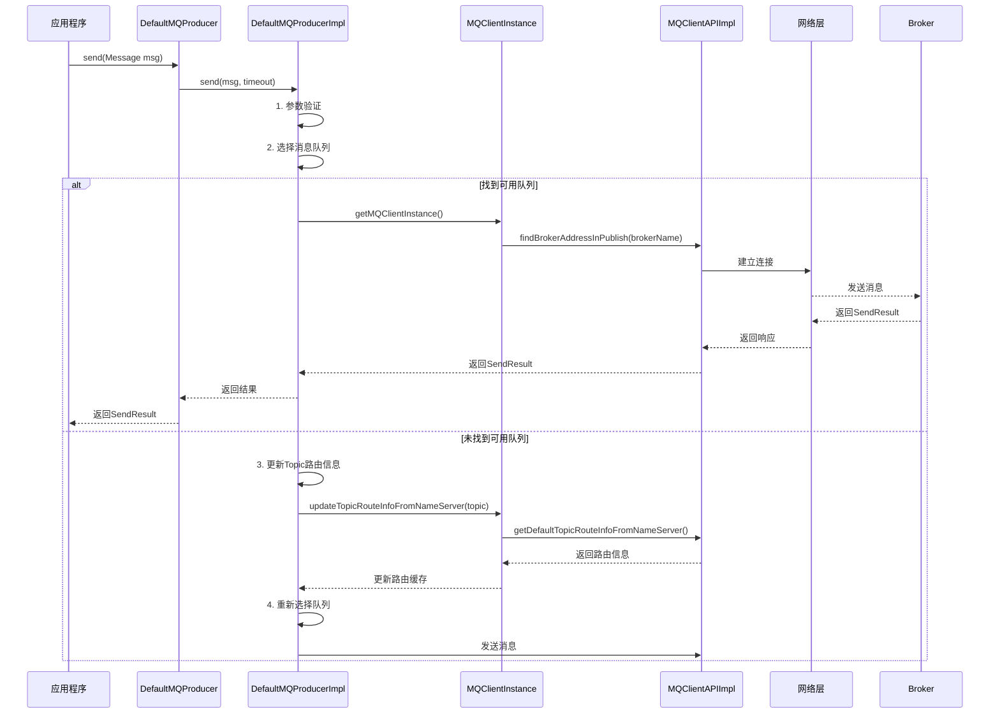

#### 1.1.2 详细代码流程分析

##### 第一步：消息发送入口

```java
// DefaultMQProducer.java
public SendResult send(Message msg) throws MQClientException {
    return this.defaultMQProducerImpl.send(msg);
}

// DefaultMQProducerImpl.java
public SendResult send(Message msg) throws MQClientException {
    return send(msg, this.defaultMQProducer.getSendMsgTimeout());
}

public SendResult send(Message msg, long timeout) throws MQClientException {
    try {
        // 1. 发送前检查
        this.makeSureStateOK();
        Validators.checkMessage(msg, this.defaultMQProducer);

        // 2. 选择消息队列并发送
        return this.sendDefaultImpl(msg, CommunicationMode.SYNC, null, timeout);
    } catch (MQClientException | RemotingException | MQBrokerException | InterruptedException e) {
        throw new MQClientException("Failed to send message", e);
    }
}
```

##### 第二步：消息验证和预处理

```java
private SendResult sendDefaultImpl(Message msg, CommunicationMode communicationMode,
    SendCallback sendCallback, long timeout) throws MQClientException {

    // 1. 获取Topic路由信息
    TopicPublishInfo topicPublishInfo = this.tryToFindTopicPublishInfo(msg.getTopic());
    if (topicPublishInfo != null && topicPublishInfo.ok()) {
        // 2. 选择消息队列
        MessageQueue mq = null;
        Exception exception = null;
        SendResult sendResult = null;

        // 3. 重试机制
        int timesTotal = communicationMode == CommunicationMode.SYNC ? 1 + this.defaultMQProducer.getRetryTimesWhenSendFailed() : 1;
        int times = 0;
        String[] brokersSent = new String[timesTotal];

        for (; times < timesTotal; times++) {
            String lastBrokerName = null == mq ? null : mq.getBrokerName();
            MessageQueue mqSelected = this.selectOneMessageQueue(topicPublishInfo, lastBrokerName);
            if (mqSelected != null) {
                mq = mqSelected;
                brokersSent[times] = mq.getBrokerName();

                try {
                    // 4. 发送消息
                    sendResult = this.sendKernelImpl(msg, mq, communicationMode, sendCallback, topicPublishInfo, timeout);
                    break;
                } catch (RemotingException e) {
                    // 异常处理
                }
            }
        }

        return sendResult;
    }

    throw new MQClientException("No route info of this topic");
}
```

##### 第三步：队列选择算法

```java
public MessageQueue selectOneMessageQueue(final TopicPublishInfo tpInfo, final String lastBrokerName) {
    // 1. 容错策略：选择可用队列
    if (this.defaultMQProducer.isSendLatencyFaultEnable()) {
        try {
            int index = tpInfo.getSendWhichQueue().getAndIncrement();
            for (int i = 0; i < tpInfo.getMessageQueueList().size(); i++) {
                int pos = Math.abs(index++) % tpInfo.getMessageQueueList().size();
                MessageQueue mq = tpInfo.getMessageQueueList().get(pos);

                // 检查队列是否可用
                if (latencyFaultTolerance.isAvailable(mq.getBrokerName())) {
                    if (null == lastBrokerName || !lastBrokerName.equals(mq.getBrokerName())) {
                        return mq;
                    }
                }
            }

            // 如果没有可用队列，随机选择一个
        } catch (Exception e) {
            // 异常处理
        }
    }

    // 2. 默认轮询策略
    int index = tpInfo.getSendWhichQueue().getAndIncrement();
    int pos = Math.abs(index) % tpInfo.getMessageQueueList().size();
    return tpInfo.getMessageQueueList().get(pos);
}
```

##### 第四步：网络发送实现

```java
private SendResult sendKernelImpl(final Message msg, final MessageQueue mq,
    final CommunicationMode communicationMode, final SendCallback sendCallback,
    final TopicPublishInfo topicPublishInfo, final long timeout) throws MQClientException {

    String brokerAddr = this.mQClientFactory.findBrokerAddressInPublish(mq.getBrokerName());
    if (null == brokerAddr) {
        tryToFindTopicPublishInfo(mq.getTopic());
        brokerAddr = this.mQClientFactory.findBrokerAddressInPublish(mq.getBrokerName());
    }

    // 1. 构建请求头
    SendMessageRequestHeader requestHeader = new SendMessageRequestHeader();
    requestHeader.setProducerGroup(this.defaultMQProducer.getProducerGroup());
    requestHeader.setTopic(msg.getTopic());
    requestHeader.setDefaultTopic(this.defaultMQProducer.getCreateTopicKey());
    requestHeader.setDefaultTopicQueueNums(this.defaultMQProducer.getDefaultTopicQueueNums());
    requestHeader.setQueueId(mq.getQueueId());
    requestHeader.setSysFlag(0);
    requestHeader.setBornTimestamp(System.currentTimeMillis());
    requestHeader.setFlag(msg.getFlag());
    requestHeader.setProperties(MessageDecoder.messageProperties2String(msg.getProperties()));
    requestHeader.setReconsumeTimes(0);
    requestHeader.setUnitMode(this.isUnitMode());
    requestHeader.setBatch(msg instanceof MessageBatch);

    // 2. 执行钩子
    if (this.hasSendMessageHook()) {
        context = new SendMessageContext();
        context.setProducer(this);
        context.setProducerGroup(this.defaultMQProducer.getProducerGroup());
        context.setCommunicationMode(communicationMode);
        context.setBornHost(this.defaultMQProducer.getClientIP());
        context.setBrokerAddr(brokerAddr);
        context.setMessage(msg);
        context.setMq(mq);
        this.executeSendMessageHookBefore(context);
    }

    // 3. 发送消息
    SendResult sendResult = null;
    switch (communicationMode) {
        case ASYNC:
            sendResult = this.mQClientFactory.getMQClientAPIImpl().sendMessage(
                brokerAddr, mq.getBrokerName(), msg, requestHeader, timeout, communicationMode, sendCallback, topicPublishInfo, this.mQClientFactory);
            break;
        case ONEWAY:
            this.mQClientFactory.getMQClientAPIImpl().sendMessageOneway(
                brokerAddr, mq.getBrokerName(), msg, requestHeader, timeout, this.mQClientFactory);
            break;
        case SYNC:
            sendResult = this.mQClientFactory.getMQClientAPIImpl().sendMessage(
                brokerAddr, mq.getBrokerName(), msg, requestHeader, timeout, communicationMode, null, topicPublishInfo, this.mQClientFactory);
            break;
        default:
            break;
    }

    // 4. 执行后置钩子
    if (this.hasSendMessageHook()) {
        context.setSendResult(sendResult);
        this.executeSendMessageHookAfter(context);
    }

    return sendResult;
}
```

### 1.2 异步消息发送流程

#### 1.2.1 流程图

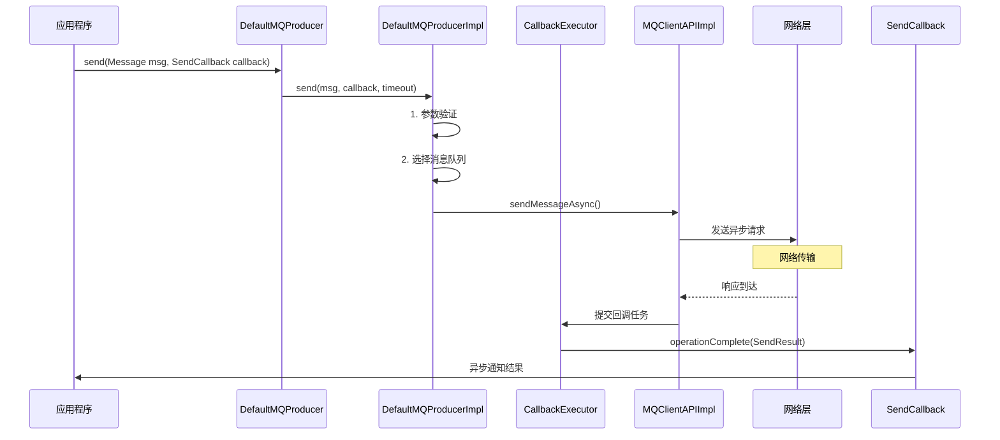

#### 1.2.2 异步回调处理

```java
public void send(Message msg, SendCallback sendCallback, long timeout)
    throws MQClientException, RemotingException, InterruptedException {

    try {
        // 1. 验证参数
        this.makeSureStateOK();
        Validators.checkMessage(msg, this.defaultMQProducer);

        // 2. 异步发送
        this.sendDefaultImpl(msg, CommunicationMode.ASYNC, sendCallback, timeout);
    } catch (Exception e) {
        // 3. 异步异常处理
        if (sendCallback != null) {
            sendCallback.onException(e);
        }
    }
}

// API层异步发送实现
public void sendMessageAsync(String addr, String brokerName, Message msg,
    SendMessageRequestHeader requestHeader, long timeoutMillis, SendCallback sendCallback,
    TopicPublishInfo topicPublishInfo, MQClientInstance instance) {

    final RemotingCommand request = createSendMsgRequestCommand(msg, requestHeader);

    // 包装回调
    RemotingCommand responseFuture = this.remotingClient.invokeAsync(addr, request, timeoutMillis, new InvokeCallback() {
        @Override
        public void operationComplete(ResponseFuture responseFuture) {
            RemotingCommand response = responseFuture.getResponseCommand();
            if (response != null) {
                try {
                    SendResult sendResult = processSendResponse(brokerName, msg, response);
                    if (sendCallback != null) {
                        sendCallback.onSuccess(sendResult);
                    }
                } catch (Exception e) {
                    if (sendCallback != null) {
                        sendCallback.onException(e);
                    }
                }
            } else {
                if (sendCallback != null) {
                    sendCallback.onException(new RemotingException("send failed"));
                }
            }
        }
    });
}
```

### 1.3 事务消息发送流程

#### 1.3.1 事务消息流程图

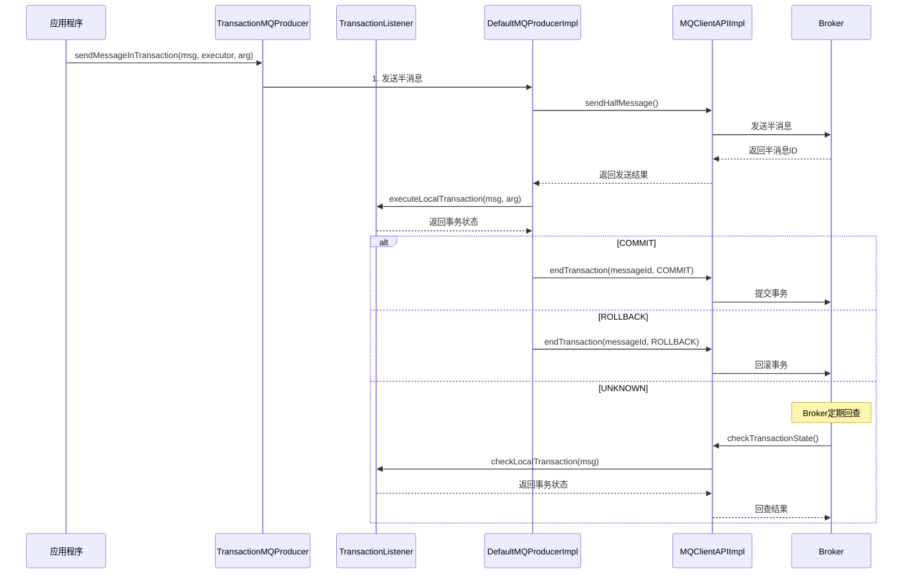

#### 1.3.2 事务消息实现

```java
public TransactionSendResult sendMessageInTransaction(final Message msg,
    final LocalTransactionExecuter localTransactionExecuter, final Object arg) throws MQClientException {

    try {
        // 1. 验证事务监听器
        if (null == this.transactionListener) {
            throw new MQClientException("TransactionListener is null");
        }

        // 2. 发送半消息
        msg.setTopic(NamespaceUtil.wrapNamespace(this.getNamespace(), msg.getTopic()));
        SendResult sendResult = this.mQClientFactory.getMQClientAPIImpl().sendMessage(
            brokerAddr, brokerName, msg, requestHeader, timeout, null, null, this.mQClientFactory);

        // 3. 执行本地事务
        LocalTransactionState localTransactionState = this.transactionListener.executeLocalTransaction(msg, arg);

        // 4. 提交事务状态
        switch (localTransactionState) {
            case COMMIT_MESSAGE:
                this.mQClientFactory.getMQClientAPIImpl().endTransactionOneway(brokerAddr, requestHeader, null, this.mQClientFactory);
                break;
            case ROLLBACK_MESSAGE:
                this.mQClientFactory.getMQClientAPIImpl().endTransactionOneway(brokerAddr, requestHeader, null, this.mQClientFactory);
                break;
            case UNKNOW:
                // 未知状态，等待Broker回查
                break;
            default:
                break;
        }

        return new TransactionSendResult(sendResult, localTransactionState);
    } catch (Exception e) {
        throw new MQClientException("send message in transaction failed", e);
    }
}
```

## 2. 消息消费流程分析

### 2.1 推送消费流程

#### 2.1.1 消费者启动流程

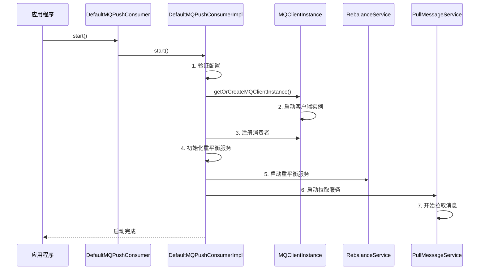

#### 2.1.2 消息拉取与消费流程

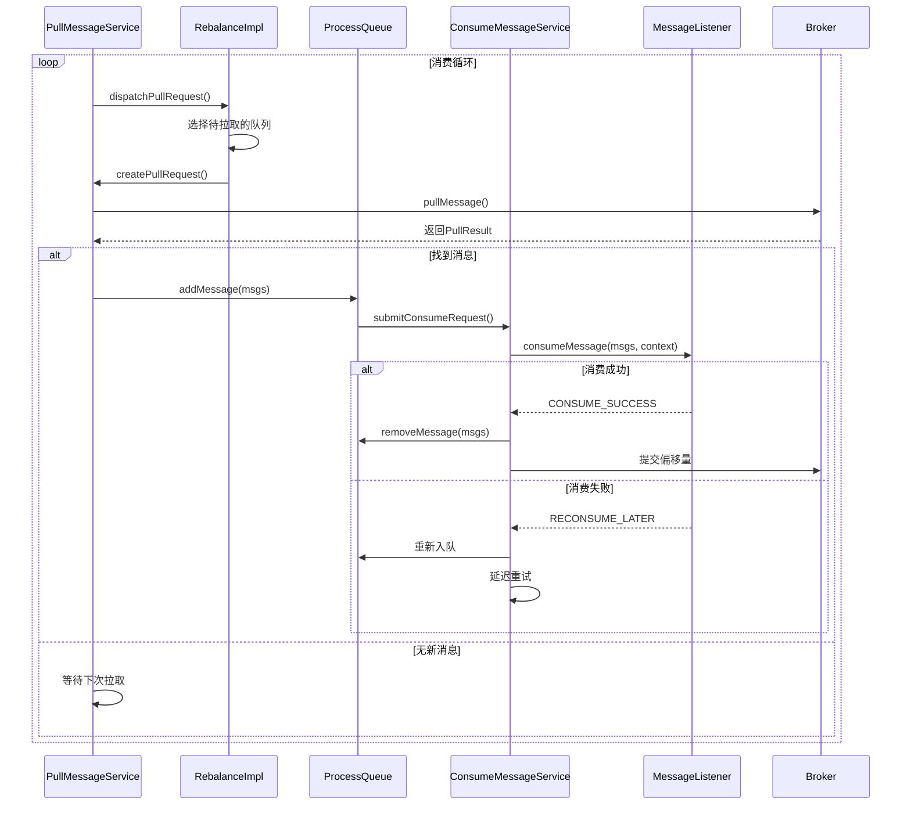

#### 2.1.3 消息拉取实现

```java
public class PullMessageService extends ServiceThread {
    @Override
    public void run() {
        log.info(this.getServiceName() + " service started");

        while (!this.isStopped()) {
            try {
                PullRequest pullRequest = this.pullRequestQueue.take();
                this.pullMessage(pullRequest);
            } catch (InterruptedException e) {
                log.warn("Pull Message Service has been interrupted");
            } catch (Exception e) {
                log.error("Pull Message Service has exception", e);
            }
        }

        log.info(this.getServiceName() + " service end");
    }

    private void pullMessage(final PullRequest pullRequest) {
        final MQConsumerInner consumer = this.mQClientFactory.selectConsumer(pullRequest.getConsumerGroup());
        if (consumer != null) {
            DefaultMQPushConsumerImpl impl = (DefaultMQPushConsumerImpl) consumer;
            impl.pullMessage(pullRequest);
        } else {
            log.warn("No matched consumer for the PullRequest");
        }
    }
}

// DefaultMQPushConsumerImpl.pullMessage
public void pullMessage(final PullRequest pullRequest) {
    // 1. 检查消费状态
    if (!this.consumeOrderly) {
        // 并发消费逻辑
    } else {
        // 顺序消费逻辑
    }

    // 2. 执行拉取
    PullCallback pullCallback = new PullCallback() {
        @Override
        public void onSuccess(PullResult pullResult) {
            switch (pullResult.getPullStatus()) {
                case FOUND:
                    // 处理拉取到的消息
                    PullRequest pullRequestClone = new PullRequest();
                    pullRequestClone.setMessageQueue(pullRequest.getMessageQueue());
                    pullRequestClone.setNextOffset(pullResult.getNextBeginOffset());
                    pullRequestClone.setProcessedMsgCount(pullResult.getMsgFoundList().size());
                    pullRequestClone.setMsgFoundList(pullResult.getMsgFoundList());

                    // 提交到消费线程池
                    DefaultMQPushConsumerImpl.this.consumeMessageService.submitConsumeRequest(
                        pullResult.getMsgFoundList(),
                        processQueue,
                        pullRequest.getMessageQueue());
                    break;
                case NO_NEW_MSG:
                case NO_MATCHED_MSG:
                    // 无新消息，更新偏移量
                    pullRequest.setNextOffset(pullResult.getNextBeginOffset());
                    break;
                case OFFSET_ILLEGAL:
                    // 偏移量非法，重置
                    break;
                default:
                    break;
            }

            // 继续下一次拉取
            DefaultMQPushConsumerImpl.this.executePullRequestImmediately(pullRequest);
        }

        @Override
        public void onException(Throwable e) {
            // 异常处理
            DefaultMQPushConsumerImpl.this.executePullRequestLater(pullRequest, pullTimeDelayMillsWhenException);
        }
    };

    // 执行拉取
    this.pullAPIWrapper.pullKernelImpl(
        pullRequest.getMessageQueue(),
        subExpression,
        subscriptionData.getExpressionType(),
        subscriptionData.getSubVersion(),
        pullRequest.getNextOffset(),
        this.defaultMQPushConsumer.getPullBatchSize(),
        sysFlag,
        commitOffsetValue,
        BROKER_SUSPEND_MAX_TIME_MILLIS,
        CONSUMER_TIMEOUT_MILLIS_WHEN_SUSPEND,
        CommunicationMode.ASYNC,
        pullCallback
    );
}
```

#### 2.1.4 消息消费处理

```java
public class ConsumeMessageConcurrentlyService implements ConsumeMessageService {
    @Override
    public void submitConsumeRequest(final List<MessageExt> msgs,
        final ProcessQueue processQueue, final MessageQueue messageQueue,
        final boolean dispatchToConsume) {

        final ConsumeRequest consumeRequest = new ConsumeRequest(msgs, processQueue, messageQueue);
        this.consumeExecutor.submit(consumeRequest);
    }

    class ConsumeRequest implements Runnable {
        private final List<MessageExt> msgs;
        private final ProcessQueue processQueue;
        private final MessageQueue messageQueue;

        @Override
        public void run() {
            if (this.processQueue.isDropped()) {
                log.warn("run, the message queue not be able to consume, because it's dropped.");
                return;
            }

            // 1. 创建消费上下文
            ConsumeMessageContext context = new ConsumeMessageContext();
            context.setConsumerGroup(defaultMQPushConsumer.getConsumerGroup());
            context.setMessageQueue(messageQueue);
            context.setMsgList(msgs);

            // 2. 执行前置钩子
            ConsumeMessageStatus status = null;
            try {
                this.executeHookBefore(context);

                // 3. 调用消息监听器
                status = messageListener.consumeMessage(this.msgs, new ConsumeConcurrentlyContext(this.messageQueue));

                // 4. 执行后置钩子
                this.executeHookAfter(status, context);
            } catch (Throwable e) {
                // 异常处理
                status = ConsumeMessageStatus.RECONSUME_LATER;
                log.warn("consume message exception", e);
            }

            // 5. 处理消费结果
            DefaultMQPushConsumerImpl.this.processConsumeResult(status, context, this);
        }
    }
}
```

### 2.2 拉取消费流程

#### 2.2.1 轻量级拉取消费流程

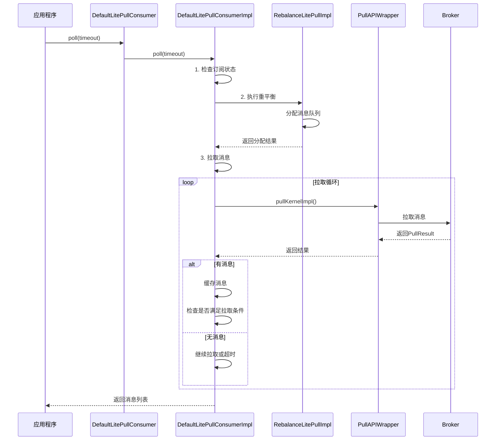

#### 2.2.2 轻量级拉取实现

```java
public class DefaultLitePullConsumerImpl implements MQConsumerInner {
    public synchronized List<MessageExt> poll(long timeout) {
        try {
            // 1. 检查状态
            this.checkServiceState();

            // 2. 执行重平衡
            this.mQClientFactory.rebalanceImmediately();

            // 3. 等待消息拉取
            long endTime = System.currentTimeMillis() + timeout;
            while (System.currentTimeMillis() < endTime) {
                if (!this.messageQueueListener.isMessageQueueChanged() &&
                    this.assignedMessageQueue.getPullFromQueue().isEmpty()) {
                    // 无消息，继续等待
                    Thread.sleep(10);
                    continue;
                }

                // 4. 尝试拉取消息
                List<MessageExt> result = this.pollMessage(endTime - System.currentTimeMillis());
                if (result != null && !result.isEmpty()) {
                    return result;
                }

                // 5. 检查是否需要继续等待
                if (System.currentTimeMillis() >= endTime) {
                    break;
                }
            }

            return Collections.emptyList();
        } catch (Exception e) {
            log.error("poll message exception", e);
            return Collections.emptyList();
        }
    }

    private List<MessageExt> pollMessage(long timeout) throws MQClientException {
        // 从分配的队列中拉取消息
        List<MessageExt> result = new ArrayList<>();
        Iterator<MessageQueue> iterator = this.assignedMessageQueue.getPullFromQueue().iterator();

        while (iterator.hasNext()) {
            MessageQueue messageQueue = iterator.next();
            ProcessQueue processQueue = this.assignedMessageQueue.getProcessQueue(messageQueue);

            if (processQueue != null && !processQueue.isDropped()) {
                // 从ProcessQueue获取缓存的消息
                List<MessageExt> messages = processQueue.takeMessages();
                if (!messages.isEmpty()) {
                    result.addAll(messages);

                    // 更新消费偏移量
                    if (this.autoCommit) {
                        this.updateConsumeOffset(messageQueue, processQueue.getOffset());
                    }
                }
            }
        }

        return result;
    }
}
```

### 2.3 顺序消费流程

#### 2.3.1 顺序消费特点

1. **队列级别锁定**：每个消息队列有独立的锁
2. **单线程消费**：一个队列同时只有一个线程消费
3. **严格顺序**：保证消息在队列内的严格顺序
4. **暂停恢复机制**：支持消费暂停和恢复

#### 2.3.2 顺序消费实现

```java
public class ConsumeMessageOrderlyService implements ConsumeMessageService {
    @Override
    public void submitConsumeRequest(final List<MessageExt> msgs,
        final ProcessQueue processQueue, final MessageQueue messageQueue,
        final boolean dispatchToConsume) {

        if (dispatchToConsume) {
            // 创建消费任务
            ConsumeRequest consumeRequest = new ConsumeRequest(processQueue, messageQueue);
            this.consumeExecutor.submit(consumeRequest);
        }
    }

    class ConsumeRequest implements Runnable {
        private final ProcessQueue processQueue;
        private final MessageQueue messageQueue;

        @Override
        public void run() {
            if (this.processQueue.isDropped()) {
                log.warn("processQueue is dropped");
                return;
            }

            // 获取队列锁，保证顺序消费
            final Object objLock = messageQueueLock.fetchLockObject(this.messageQueue);

            synchronized (objLock) {
                if (MessageModel.BROADCASTING.equals(ConsumeMessageOrderlyService.this.defaultMQPushConsumerImpl.messageModel())
                    || (this.processQueue.isLock() && !this.processQueue.isLockConsume())) {

                    final long beginTime = System.currentTimeMillis();
                    boolean lockResult = false;

                    try {
                        // 1. 获取锁
                        lockResult = ConsumeMessageOrderlyService.this.defaultMQPushConsumerImpl.getConsumerLockManager()
                            .lockMQMessageConsume(this.messageQueue, this.processQueue);

                        if (!lockResult) {
                            // 获取锁失败，延迟重试
                            ConsumeMessageOrderlyService.this.submitConsumeRequestLater(this.processQueue,
                                this.messageQueue, consumeRequest.getOneway());
                            return;
                        }

                        // 2. 计算消息数量
                        final int consumeBatchSize = ConsumeMessageOrderlyService.this.defaultMQPushConsumerImpl.getConsumeMessageBatchMaxSize();
                        List<MessageExt> msgs = this.processQueue.takeMessages(consumeBatchSize);

                        if (!msgs.isEmpty()) {
                            // 3. 消费消息
                            final ConsumeOrderlyContext context = new ConsumeOrderlyContext(this.messageQueue);

                            ConsumeOrderlyStatus status = null;
                            try {
                                // 执行前置钩子
                                ConsumeMessageOrderlyService.this.defaultMQPushConsumerImpl.getHookService()
                                    .executeConsumeMessageHookBefore(context, msgs);

                                // 执行消息监听器
                                status = messageListener.consumeMessage(msgs, context);

                                // 执行后置钩子
                                ConsumeMessageOrderlyService.this.defaultMQPushConsumerImpl.getHookService()
                                    .executeConsumeMessageHookAfter(context, msgs, status);
                            } catch (Throwable e) {
                                // 异常处理
                                status = ConsumeOrderlyStatus.SUSPEND_CURRENT_QUEUE_A_MOMENT;
                                log.error("consume message exception", e);
                            }

                            // 4. 处理消费结果
                            if (ConsumeOrderlyStatus.ROLLBACK == status ||
                                ConsumeOrderlyStatus.SUSPEND_CURRENT_QUEUE_A_MOMENT == status) {
                                // 挂起当前队列
                                this.processQueue.makeMessageToCosumeAgain(msgs);
                                this.submitConsumeRequestLater(processQueue, messageQueue, true);
                            } else {
                                // 消费成功，提交偏移量
                                this.processQueue.commit();
                                if (ConsumeMessageOrderlyService.this.defaultMQPushConsumerImpl.getOffsetStore() instanceof RemoteBrokerOffsetStore) {
                                    ConsumeMessageOrderlyService.this.defaultMQPushConsumerImpl.getOffsetStore()
                                        .updateOffset(this.messageQueue, this.processQueue.getCommitOffset(), false);
                                }
                            }
                        }
                    } finally {
                        // 5. 释放锁
                        if (lockResult) {
                            ConsumeMessageOrderlyService.this.defaultMQPushConsumerImpl.getConsumerLockManager()
                                .unlockMQMessageConsume(this.messageQueue, this.processQueue);
                        }
                    }
                } else {
                    // 队列未锁定或消费被挂起，延迟重试
                    this.submitConsumeRequestLater(processQueue, messageQueue, false);
                }
            }
        }
    }
}
```

## 3. 重平衡流程分析

### 3.1 重平衡触发机制

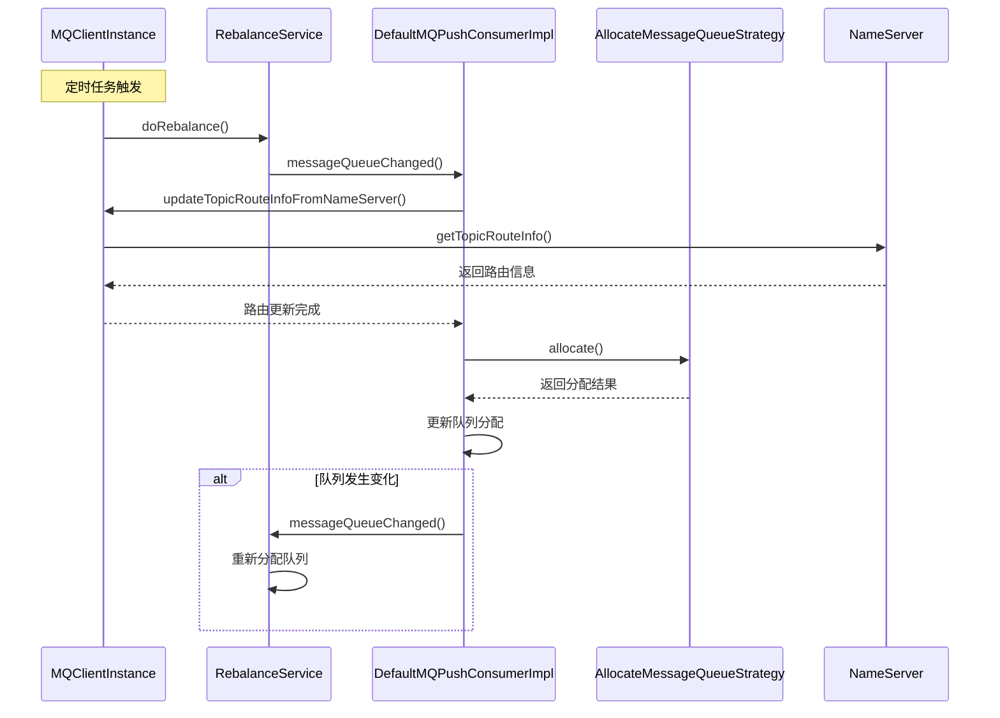

### 3.2 重平衡实现

```java
public class RebalanceService extends ServiceThread {
    @Override
    public void run() {
        log.info(this.getServiceName() + " service started");

        while (!this.isStopped()) {
            // 等待间隔
            this.waitForRunning(waitInterval);

            // 执行重平衡
            this.mqClientFactory.doRebalance();
        }

        log.info(this.getServiceName() + " service end");
    }
}

// MQClientInstance.doRebalance
public void doRebalance() {
    // 遍历所有消费者
    for (Map.Entry<String, MQConsumerInner> entry : this.consumerTable.entrySet()) {
        MQConsumerInner impl = entry.getValue();
        impl.doRebalance();
    }
}

// DefaultMQPushConsumerImpl.doRebalance
public void doRebalance() {
    if (this.consumeOrderly) {
        // 顺序消费重平衡
        Set<MessageQueue> allocateResult = this.rebalanceImpl.doRebalance(this.consumeOrderly);
        if (allocateResult != null) {
            Set<MessageQueue> oldSet = this.processQueueTable.keySet();
            Set<MessageQueue> newSet = allocateResult;

            // 处理新分配的队列
            for (MessageQueue mq : newSet) {
                if (!oldSet.contains(mq)) {
                    ProcessQueue pq = new ProcessQueue();
                    ProcessQueue pre = this.processQueueTable.putIfAbsent(mq, pq);
                    if (pre != null) {
                        log.info("doRebalance, {} already exists", mq);
                    } else {
                        // 创建拉取请求
                        PullRequest pullRequest = new PullRequest();
                        pullRequest.setConsumerGroup(this.consumerGroup);
                        pullRequest.setNextOffset(this.computePullFromWhere(mq));
                        pullRequest.setMessageQueue(mq);
                        pullRequest.setProcessQueue(pq);

                        // 提交拉取请求
                        this.pullMessageService.submitPullRequest(pullRequest);
                    }
                }
            }

            // 处理被撤销的队列
            for (MessageQueue mq : oldSet) {
                if (!newSet.contains(mq)) {
                    ProcessQueue pq = this.processQueueTable.remove(mq);
                    if (pq != null) {
                        pq.setDropped(true);
                    }
                    // 移除偏移量
                    this.offsetStore.removeOffset(mq);
                }
            }
        }
    } else {
        // 并发消费重平衡
        this.rebalanceImpl.doRebalance(false);
    }
}
```

## 4. 偏移量管理流程

### 4.1 偏移量存储策略

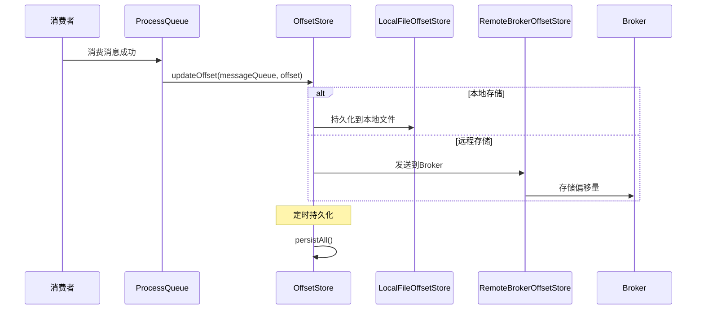

### 4.2 偏移量管理实现

```java
// 远程偏移量存储
public class RemoteBrokerOffsetStore implements OffsetStore {
    @Override
    public void updateOffset(MessageQueue mq, long offset, boolean increaseOnly) {
        if (mq != null) {
            AtomicLong offsetOld = this.offsetTable.get(mq);
            if (null == offsetOld) {
                offsetOld = this.offsetTable.putIfAbsent(mq, new AtomicLong(offset));
            }

            if (offsetOld != null) {
                if (increaseOnly) {
                    MixAll.compareAndIncreaseOnly(offsetOld, offset);
                } else {
                    offsetOld.set(offset);
                }
            }
        }
    }

    @Override
    public void persistAll(Set<MessageQueue> mqs) {
        if (null == mqs || mqs.isEmpty())
            return;

        Set<MessageQueue> persistMqs = new HashSet<>();
        for (MessageQueue mq : mqs) {
            AtomicLong offset = this.offsetTable.get(mq);
            if (offset != null) {
                persistMqs.add(mq);
            }
        }

        if (!persistMqs.isEmpty()) {
            try {
                this.mQClientFactory.getMQClientAPIImpl().updateConsumerOffset(
                    this.groupName, persistMqs, this.mQClientFactory.getClientConfig().getMqClientApiTimeout());
            } catch (Exception e) {
                log.error("updateConsumerOffset to broker exception", e);
            }
        }
    }
}

// 本地偏移量存储
public class LocalFileOffsetStore implements OffsetStore {
    @Override
    public void updateOffset(MessageQueue mq, long offset, boolean increaseOnly) {
        if (mq != null) {
            AtomicLong offsetOld = this.offsetTable.get(mq);
            if (null == offsetOld) {
                offsetOld = this.offsetTable.putIfAbsent(mq, new AtomicLong(offset));
            }

            if (offsetOld != null) {
                if (increaseOnly) {
                    MixAll.compareAndIncreaseOnly(offsetOld, offset);
                } else {
                    offsetOld.set(offset);
                }
            }
        }
    }

    @Override
    public void persistAll(Set<MessageQueue> mqs) {
        if (null == mqs || mqs.isEmpty())
            return;

        this.readFromLocalFile();

        // 构建持久化数据
        StringBuilder sb = new StringBuilder();
        for (MessageQueue mq : mqs) {
            AtomicLong offset = this.offsetTable.get(mq);
            if (offset != null) {
                sb.append(mq.getTopic()).append("#")
                  .append(mq.getBrokerName()).append("#")
                  .append(mq.getQueueId()).append("#")
                  .append(offset.get()).append("\n");
            }
        }

        // 持久化到文件
        this.writeToLocalFile(sb.toString());
    }
}
```

## 5. 连接管理流程

### 5.1 连接建立与管理

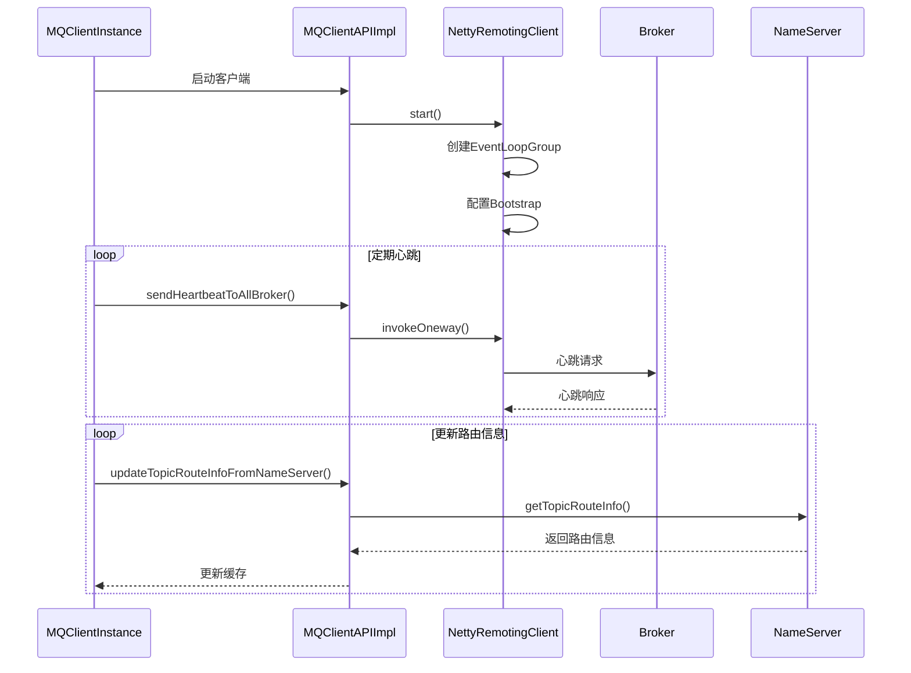

### 5.2 连接容错机制

```java
public class MQClientInstance {
    // 启动客户端
    public void start() throws MQClientException {
        synchronized (this) {
            switch (this.serviceState) {
                case CREATE_JUST:
                    this.serviceState = ServiceState.START_FAILED;
                    this.defaultMQProducer.getDefaultMQProducerImpl().start();

                    if (this.defaultMQPullConsumer != null) {
                        this.defaultMQPullConsumer.getDefaultMQPullConsumerImpl().start();
                    }

                    if (this.defaultMQPushConsumer != null) {
                        this.defaultMQPushConsumer.getDefaultMQPushConsumerImpl().start();
                    }

                    // 启动网络API
                    this.mQClientAPIImpl.start();

                    // 启动定时任务
                    this.startScheduledTask();

                    this.serviceState = ServiceState.RUNNING;
                    break;
                case RUNNING:
                    break;
                case SHUTDOWN_ALREADY:
                    break;
                case START_FAILED:
                    throw new MQClientException("The Factory service state is not running, but start failed");
                default:
                    break;
            }
        }
    }

    // 启动定时任务
    private void startScheduledTask() {
        // 定时更新NameServer地址
        this.scheduledExecutorService.scheduleAtFixedRate(new Runnable() {
            @Override
            public void run() {
                try {
                    MQClientInstance.this.mQClientAPIImpl.fetchNameServerAddr();
                } catch (Exception e) {
                    log.error("ScheduledTask fetchNameServerAddr exception", e);
                }
            }
        }, 1000 * 10, this.clientConfig.getPollNameServerInterval(), TimeUnit.MILLISECONDS);

        // 定时更新路由信息
        this.scheduledExecutorService.scheduleAtFixedRate(new Runnable() {
            @Override
            public void run() {
                try {
                    MQClientInstance.this.updateTopicRouteInfoFromNameServer();
                } catch (Exception e) {
                    log.error("ScheduledTask updateTopicRouteInfoFromNameServer exception", e);
                }
            }
        }, 1000 * 10, this.clientConfig.getHeartbeatBrokerInterval(), TimeUnit.MILLISECONDS);

        // 定时清理离线Broker
        this.scheduledExecutorService.scheduleAtFixedRate(new Runnable() {
            @Override
            public void run() {
                try {
                    MQClientInstance.this.cleanOfflineBroker();
                    MQClientInstance.this.sendHeartbeatToAllBrokerWithLock();
                } catch (Exception e) {
                    log.error("ScheduledTask sendHeartbeatToAllBroker exception", e);
                }
            }
        }, 1000, this.clientConfig.getHeartbeatBrokerInterval(), TimeUnit.MILLISECONDS);

        // 定时持久化消费偏移量
        this.scheduledExecutorService.scheduleAtFixedRate(new Runnable() {
            @Override
            public void run() {
                try {
                    MQClientInstance.this.persistAllConsumerOffset();
                } catch (Exception e) {
                    log.error("ScheduledTask persistAllConsumerOffset exception", e);
                }
            }
        }, 1000 * 10, this.clientConfig.getPersistConsumerOffsetInterval(), TimeUnit.MILLISECONDS);
    }
}
```

## 6. 异常处理流程

### 6.1 发送异常处理

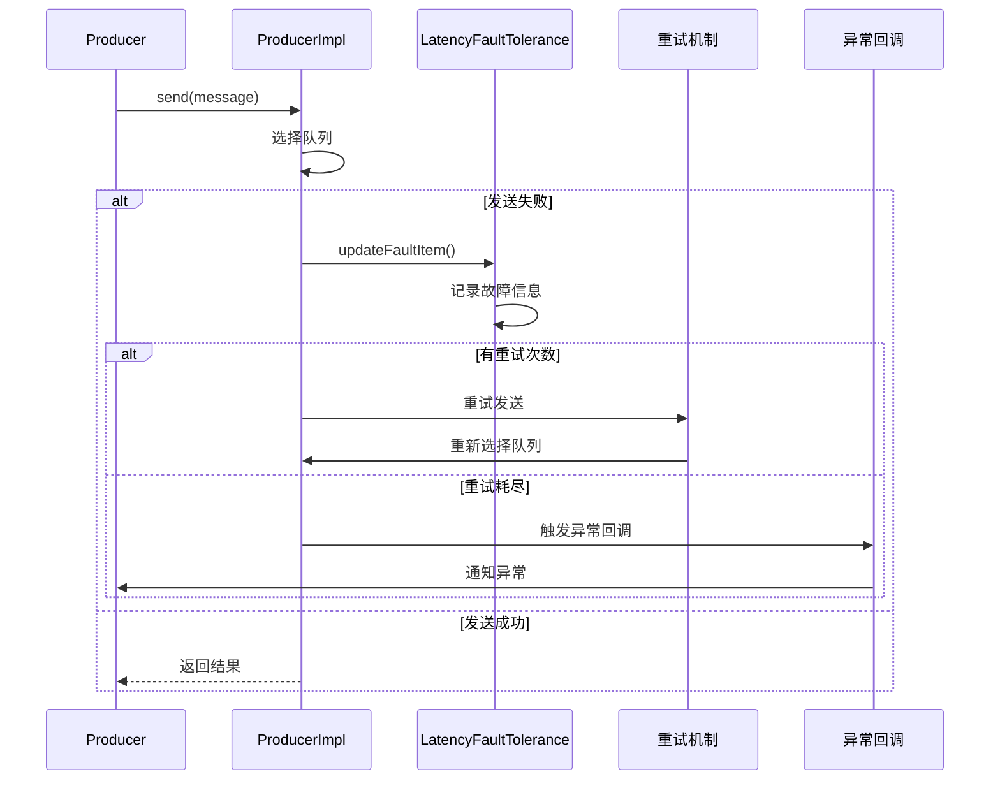

### 6.2 消费异常处理

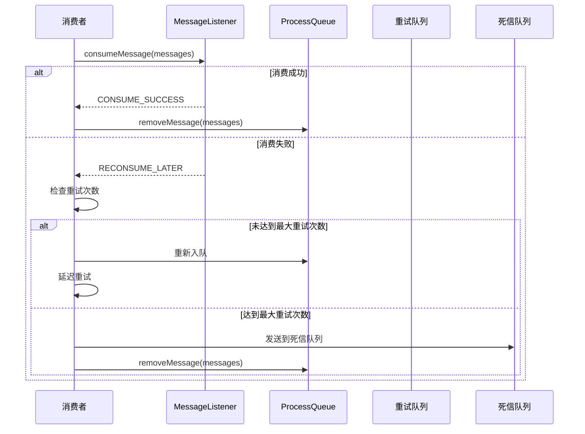

## 7. 性能优化点分析

### 7.1 发送性能优化

1. **异步发送**：使用 `SendCallback` 提高吞吐量
2. **批量发送**：使用 `MessageBatch` 减少网络调用
3. **消息压缩**：自动压缩大消息
4. **连接复用**：复用TCP连接
5. **容错机制**：避免访问故障Broker

### 7.2 消费性能优化

1. **批量消费**：一次处理多条消息
2. **线程池隔离**：I/O线程与业务线程分离
3. **内存管理**：控制ProcessQueue消息数量
4. **预取机制**：提前拉取消息缓存
5. **并行消费**：多线程并发处理

### 7.3 容错性能优化

1. **延迟容错**：记录Broker响应延迟
2. **故障隔离**：临时隔离故障节点
3. **负载均衡**：智能选择最优Broker
4. **快速恢复**：故障节点自动恢复

## 8. 调试和监控

### 8.1 关键监控指标

1. **发送成功率**：消息发送成功的比例
2. **消费延迟**：消息从发送到消费的时间
3. **TPS**：每秒处理的消息数量
4. **重试次数**：消息重试的统计
5. **异常统计**：各类异常的发生频率

### 8.2 调试方法

1. **日志分析**：分析客户端日志定位问题
2. **钩子监控**：通过Hook机制监控消息流转
3. **指标收集**：使用内置的统计功能
4. **网络抓包**：分析网络层面的通信问题
5. **断点调试**：在关键流程设置断点

通过深入理解 RocketMQ Client 的调用流程，开发者可以更好地使用消息队列，排查问题，并进行性能优化。这些流程分析为实际应用提供了坚实的技术基础。