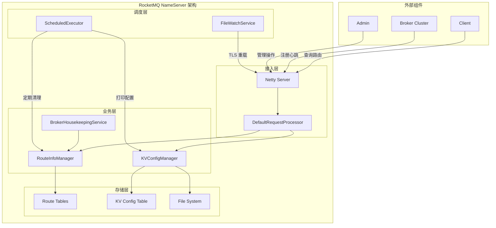

# RocketMQ NameServer 模块架构分析

## 概述

NameServer 是 RocketMQ 的注册发现中心，在 RocketMQ 集群中扮演着类似服务注册中心的角色。它为整个消息系统提供了服务发现、路由管理、配置管理等功能。本文档从架构设计的角度深入分析 NameServer 模块的实现原理和设计理念。

## 目录

- [核心职责](#核心职责)
- [架构设计](#架构设计)
- [核心组件分析](#核心组件分析)
- [设计模式应用](#设计模式应用)
- [关键数据结构](#关键数据结构)
- [并发控制机制](#并发控制机制)
- [性能优化策略](#性能优化策略)
- [容错与恢复机制](#容错与恢复机制)
- [架构优缺点分析](#架构优缺点分析)
- [源码关键点](#源码关键点)

## 核心职责

### 1. 服务注册与发现
- **Broker 注册**：接收 Broker 的注册请求，维护 Broker 的地址信息
- **路由管理**：管理 Topic 到 Broker 的路由映射关系
- **健康检查**：定期检查 Broker 的存活状态，清理失效的 Broker

### 2. 配置管理
- **KV 配置**：提供键值对配置的存储和管理
- **持久化**：将配置信息持久化到本地文件系统
- **动态更新**：支持运行时配置的动态修改

### 3. 路由信息服务
- **路由查询**：为客户端提供 Topic 路由信息查询
- **负载均衡**：提供多个 Broker 地址供客户端选择
- **集群管理**：维护 Broker 集群的信息

## 架构设计

### 整体架构



### 分层架构设计

#### 1. 接入层 (Access Layer)
- **NettyRemotingServer**：基于 Netty 的网络通信层
- **DefaultRequestProcessor**：请求处理器，处理所有客户端和 Broker 的请求
- **ClusterTestRequestProcessor**：集群测试专用处理器

#### 2. 业务逻辑层 (Business Layer)
- **RouteInfoManager**：路由信息管理的核心组件
- **KVConfigManager**：键值配置管理组件
- **BrokerHousekeepingService**：Broker 连接保活服务

#### 3. 存储层 (Storage Layer)
- **内存数据结构**：路由表、配置表的内存存储
- **文件系统**：配置信息的持久化存储

#### 4. 调度层 (Scheduler Layer)
- **定时任务调度**：定期清理、配置打印等任务
- **文件监听服务**：TLS 证书文件变更监听

## 核心组件分析

### 1. NamesrvController (核心控制器)

NamesrvController 是 NameServer 的核心控制器，负责协调各个组件的工作：

```java
public class NamesrvController {
    // 核心配置
    private final NamesrvConfig namesrvConfig;
    private final NettyServerConfig nettyServerConfig;

    // 核心组件
    private final KVConfigManager kvConfigManager;
    private final RouteInfoManager routeInfoManager;
    private final BrokerHousekeepingService brokerHousekeepingService;

    // 网络服务
    private RemotingServer remotingServer;

    // 线程池
    private final ScheduledExecutorService scheduledExecutorService;
    private ExecutorService remotingExecutor;
}
```

**关键职责：**
- **组件初始化**：初始化并管理所有核心组件
- **生命周期管理**：控制 NameServer 的启动、运行和关闭
- **任务调度**：管理定时任务的执行
- **配置管理**：协调配置的加载、更新和持久化

### 2. RouteInfoManager (路由信息管理器)

RouteInfoManager 是 NameServer 最核心的组件，负责管理所有路由信息：

```java
public class RouteInfoManager {
    // 核心数据结构
    private final HashMap<String/* topic */, Map<String /* brokerName */, QueueData>> topicQueueTable;
    private final HashMap<String/* brokerName */, BrokerData> brokerAddrTable;
    private final HashMap<String/* clusterName */, Set<String/* brokerName */>> clusterAddrTable;
    private final HashMap<String/* brokerAddr */, BrokerLiveInfo> brokerLiveTable;
    private final HashMap<String/* brokerAddr */, List<String>/* Filter Server */> filterServerTable;

    // 并发控制
    private final ReadWriteLock lock = new ReentrantReadWriteLock();
}
```

**核心功能分析：**

#### 路由表设计

1. **topicQueueTable**：Topic 路由表
   - Key：Topic 名称
   - Value：BrokerName → QueueData 的映射
   - 作用：存储 Topic 的队列分布信息

2. **brokerAddrTable**：Broker 地址表
   - Key：Broker 名称
   - Value：BrokerData（包含集群名、Broker地址映射）
   - 作用：存储 Broker 的地址信息

3. **clusterAddrTable**：集群地址表
   - Key：集群名称
   - Value：Broker 名称集合
   - 作用：维护集群与 Broker 的关系

4. **brokerLiveTable**：Broker 存活表
   - Key：Broker 地址
   - Value：BrokerLiveInfo（包含最后更新时间、Channel等）
   - 作用：监控 Broker 的存活状态

#### 关键方法分析

**registerBroker** - Broker 注册：
```java
public RegisterBrokerResult registerBroker(
    final String clusterName,
    final String brokerAddr,
    final String brokerName,
    final long brokerId,
    final String haServerAddr,
    final TopicConfigSerializeWrapper topicConfigWrapper,
    final List<String> filterServerList,
    final Channel channel)
```

**核心逻辑：**
1. 更新集群地址表（clusterAddrTable）
2. 更新 Broker 地址表（brokerAddrTable）
3. 更新 Topic 队列表（topicQueueTable）
4. 更新 Broker 存活表（brokerLiveTable）
5. 更新过滤器服务器表（filterServerTable）

**pickupTopicRouteData** - 获取 Topic 路由信息：
```java
public TopicRouteData pickupTopicRouteData(final String topic)
```

**核心逻辑：**
1. 从 topicQueueTable 获取队列数据
2. 从 brokerAddrTable 获取 Broker 数据
3. 从 filterServerTable 获取过滤器信息
4. 构建 TopicRouteData 返回

### 3. KVConfigManager (配置管理器)

KVConfigManager 提供键值对配置的管理功能：

```java
public class KVConfigManager {
    // 配置存储表
    private final HashMap<String/* Namespace */, HashMap<String/* Key */, String/* Value */>> configTable;

    // 并发控制
    private final ReadWriteLock lock = new ReentrantReadWriteLock();
}
```

**核心功能：**
- **配置加载**：启动时从文件加载配置
- **配置操作**：提供增删改查操作
- **配置持久化**：将配置变更保存到文件
- **命名空间管理**：支持命名空间隔离配置

### 4. BrokerHousekeepingService (Broker 保活服务)

BrokerHousekeepingService 负责监控 Broker 连接状态：

```java
public class BrokerHousekeepingService implements ChannelEventListener {
    @Override
    public void onChannelConnect(String remoteAddr, Channel channel) {
        // 连接建立时的处理
    }

    @Override
    public void onChannelClose(String remoteAddr, Channel channel) {
        // 连接关闭时的处理 - 清理路由信息
        this.namesrvController.getRouteInfoManager().onChannelDestroy(remoteAddr, channel);
    }

    @Override
    public void onChannelException(String remoteAddr, Channel channel) {
        // 连接异常时的处理 - 清理路由信息
        this.namesrvController.getRouteInfoManager().onChannelDestroy(remoteAddr, channel);
    }
}
```

## 设计模式应用

### 1. 单例模式 (Singleton)
- **RouteInfoManager**：全局唯一的路由信息管理器
- **KVConfigManager**：全局唯一的配置管理器
- **NamesrvController**：每个 NameServer 实例只有一个控制器

### 2. 观察者模式 (Observer)
- **BrokerHousekeepingService**：观察 Broker 连接事件
- **FileWatchService**：观察文件变更事件
- 事件驱动的架构设计

### 3. 策略模式 (Strategy)
- **DefaultRequestProcessor** vs **ClusterTestRequestProcessor**
- 根据配置选择不同的请求处理策略

### 4. 模板方法模式 (Template Method)
- **AsyncNettyRequestProcessor**：定义异步请求处理的模板
- 子类实现具体的处理逻辑

### 5. 代理模式 (Proxy)
- **RemotingServer**：作为网络通信的代理
- 封装底层网络实现细节

### 6. 工厂方法模式 (Factory Method)
- **RemotingCommand.createResponseCommand()**
- 统一的命令对象创建工厂

## 关键数据结构

### 1. BrokerData
```java
public class BrokerData {
    private String cluster;                    // 集群名称
    private String brokerName;                 // Broker 名称
    private HashMap<Long, String> brokerAddrs; // Broker ID → 地址映射
}
```

### 2. QueueData
```java
public class QueueData {
    private String brokerName;      // Broker 名称
    private int readQueueNums;      // 读队列数量
    private int writeQueueNums;     // 写队列数量
    private int perm;               // 权限
    private int topicSysFlag;       // Topic 系统标志
}
```

### 3. BrokerLiveInfo
```java
class BrokerLiveInfo {
    private long lastUpdateTimestamp;  // 最后更新时间
    private DataVersion dataVersion;   // 数据版本
    private Channel channel;           // 网络连接
    private String haServerAddr;       // HA 服务器地址
}
```

### 4. TopicRouteData
```java
public class TopicRouteData {
    private String orderTopicConf;                      // 顺序 Topic 配置
    private List<QueueData> queueDatas;                 // 队列数据
    private List<BrokerData> brokerDatas;               // Broker 数据
    private HashMap<String, List<String>> filterServerTable; // 过滤器表
}
```

## 并发控制机制

### 1. 读写锁 (ReadWriteLock)

RouteInfoManager 和 KVConfigManager 都使用 ReentrantReadWriteLock 进行并发控制：

```java
private final ReadWriteLock lock = new ReentrantReadWriteLock();

// 读操作
this.lock.readLock().lockInterruptibly();
try {
    // 读取数据
} finally {
    this.lock.readLock().unlock();
}

// 写操作
this.lock.writeLock().lockInterruptibly();
try {
    // 写入数据
} finally {
    this.lock.writeLock().unlock();
}
```

**设计优势：**
- 允许多个读操作并发执行
- 写操作时独占访问，保证数据一致性
- 支持中断响应，避免死锁

### 2. ConcurrentHashMap

虽然主要使用 HashMap + ReadWriteLock，但在某些场景下也可以考虑使用 ConcurrentHashMap 来优化性能。

### 3. 原子操作

对于简单状态更新，使用原子类保证操作的原子性。

## 性能优化策略

### 1. 内存优先设计

- **全内存存储**：路由信息全部存储在内存中，提供最快的访问速度
- **预热加载**：启动时预加载所有配置信息
- **避免磁盘 I/O**：运行时主要操作都在内存中完成

### 2. 定时任务优化

```java
// 每 10 秒清理一次不活跃的 Broker
this.scheduledExecutorService.scheduleAtFixedRate(
    NamesrvController.this.routeInfoManager::scanNotActiveBroker,
    5, 10, TimeUnit.SECONDS);

// 每 10 分钟打印一次配置信息
this.scheduledExecutorService.scheduleAtFixedRate(
    NamesrvController.this.kvConfigManager::printAllPeriodically,
    1, 10, TimeUnit.MINUTES);
```

### 3. 连接复用

- **长连接**：与 Broker 保持长连接，减少连接建立开销
- **连接池**：Netty 的连接池管理
- **心跳机制**：定期的心跳维护连接状态

### 4. 数据结构优化

- **合理初始容量**：HashMap 设置合理的初始容量和负载因子
- **避免频繁扩容**：减少 rehash 操作
- **缓存友好**：数据结构设计考虑缓存命中率

## 容错与恢复机制

### 1. Broker 故障检测

**心跳机制：**
- Broker 每 30 秒发送心跳包
- NameServer 每 10 秒检查一次 Broker 存活状态
- 超过 120 秒未收到心跳判定为失效

**自动清理：**
```java
public int scanNotActiveBroker() {
    int removeCount = 0;
    Iterator<Entry<String, BrokerLiveInfo>> it = this.brokerLiveTable.entrySet().iterator();
    while (it.hasNext()) {
        Entry<String, BrokerLiveInfo> next = it.next();
        long last = next.getValue().getLastUpdateTimestamp();
        if ((last + BROKER_CHANNEL_EXPIRED_TIME) < System.currentTimeMillis()) {
            RemotingUtil.closeChannel(next.getValue().getChannel());
            it.remove();
            this.onChannelDestroy(next.getKey(), next.getValue().getChannel());
            removeCount++;
        }
    }
    return removeCount;
}
```

### 2. 配置持久化

**及时持久化：**
```java
public void putKVConfig(final String namespace, final String key, final String value) {
    // 更新内存
    // ...
    this.persist(); // 立即持久化
}
```

**异常恢复：**
- 启动时从文件加载配置
- 支持配置文件损坏时的降级处理

### 3. 网络异常处理

**连接监听：**
- 监听连接建立、关闭、异常事件
- 自动清理失效连接的路由信息

**优雅关闭：**
```java
public void shutdown() {
    this.remotingServer.shutdown();
    this.remotingExecutor.shutdown();
    this.scheduledExecutorService.shutdown();
    if (this.fileWatchService != null) {
        this.fileWatchService.shutdown();
    }
}
```

## 架构优缺点分析

### 优点

1. **高性能**
   - 全内存存储，访问速度快
   - 读写锁优化并发性能
   - 异步网络处理

2. **简单可靠**
   - 架构简单，易于理解和维护
   - 无状态设计，易于扩展
   - 故障自动恢复

3. **可扩展性**
   - 支持水平扩展
   - 插件化的请求处理器
   - 灵活的配置管理

4. **轻量级**
   - 资源占用少
   - 启动快速
   - 运维简单

### 缺点

1. **单点风险**
   - 每个 NameServer 实例都是单点
   - 需要部署多个实例来实现高可用

2. **数据一致性**
   - 多实例间数据最终一致性
   - 可能存在短暂的数据不一致

3. **内存限制**
   - 大量 Topic 时内存占用较高
   - 需要合理规划内存使用

4. **功能局限**
   - 功能相对简单
   - 复杂的路由策略支持有限

## 源码关键点

### 1. 初始化流程

```java
public boolean initialize() {
    // 1. 加载配置
    this.kvConfigManager.load();

    // 2. 创建网络服务
    this.remotingServer = new NettyRemotingServer(this.nettyServerConfig, this.brokerHousekeepingService);

    // 3. 创建业务处理线程池
    this.remotingExecutor = Executors.newFixedThreadPool(nettyServerConfig.getServerWorkerThreads(),
        new ThreadFactoryImpl("RemotingExecutorThread_"));

    // 4. 注册请求处理器
    this.registerProcessor();

    // 5. 启动定时任务
    this.scheduledExecutorService.scheduleAtFixedRate(
        NamesrvController.this.routeInfoManager::scanNotActiveBroker, 5, 10, TimeUnit.SECONDS);

    return true;
}
```

### 2. 请求处理流程

```java
@Override
public RemotingCommand processRequest(ChannelHandlerContext ctx, RemotingCommand request) {
    switch (request.getCode()) {
        case RequestCode.REGISTER_BROKER:
            return this.registerBrokerWithFilterServer(ctx, request);
        case RequestCode.GET_ROUTEINFO_BY_TOPIC:
            return this.getRouteInfoByTopic(ctx, request);
        case RequestCode.PUT_KV_CONFIG:
            return this.putKVConfig(ctx, request);
        // ... 其他请求处理
    }
    return null;
}
```

### 3. 路由信息查询优化

```java
public TopicRouteData pickupTopicRouteData(final String topic) {
    try {
        this.lock.readLock().lockInterruptibly();

        // 1. 获取队列数据
        Map<String, QueueData> queueDataMap = this.topicQueueTable.get(topic);

        // 2. 获取 Broker 数据
        Set<String> brokerNameSet = new HashSet<>();
        List<BrokerData> brokerDataList = new LinkedList<>();

        // 3. 构建 TopicRouteData
        TopicRouteData topicRouteData = new TopicRouteData();
        topicRouteData.setQueueDatas(new ArrayList<>(queueDataMap.values()));
        topicRouteData.setBrokerDatas(brokerDataList);

        return topicRouteData;
    } finally {
        this.lock.readLock().unlock();
    }
}
```

## 总结

NameServer 作为 RocketMQ 的服务注册中心，采用了简洁而高效的设计架构。通过全内存存储、读写锁并发控制、定时任务调度等关键技术，实现了高性能、高可用的服务发现功能。虽然架构相对简单，但这种简单性正是其优势所在，使得 NameServer 具有良好的性能和可靠性。

通过深入理解 NameServer 的架构设计，我们可以学习到：
- 如何设计高性能的注册中心
- 读写锁在并发控制中的应用
- 定时任务在系统维护中的作用
- 简单架构设计的价值

这些设计思想和实现技巧对于构建类似的分布式系统组件具有重要的参考价值。