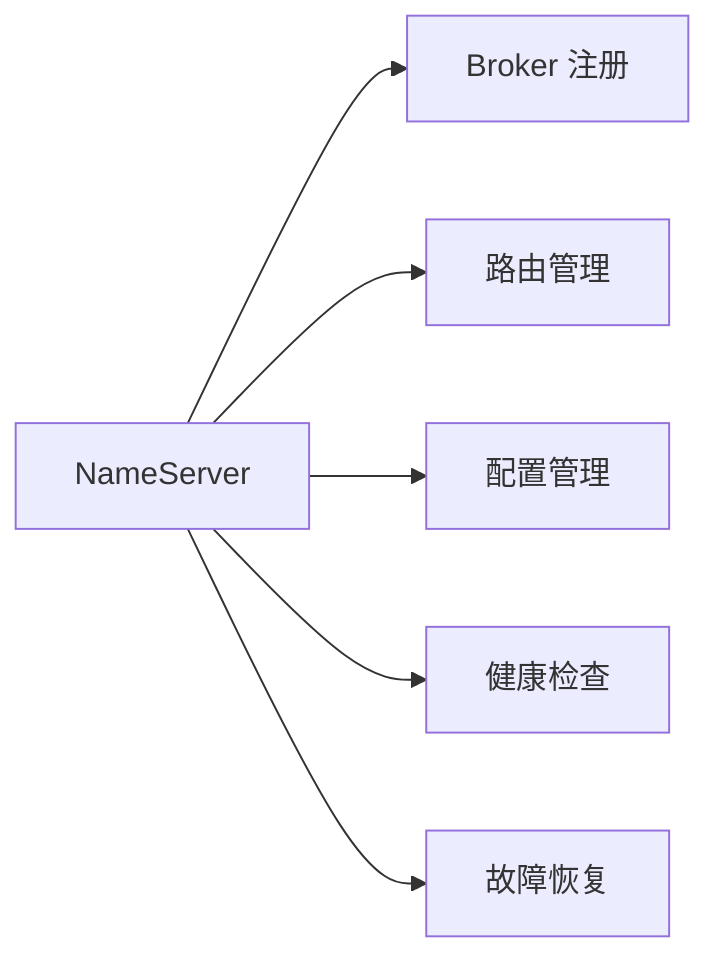

# RocketMQ NameServer 学习总结指南

## 概述

本学习总结指南是基于对 RocketMQ NameServer 模块深入分析的总结，旨在帮助开发者快速理解 NameServer 的核心概念、架构设计原理，并掌握实际应用中的关键技术和最佳实践。

## 目录

- [学习路线图](#学习路线图)
- [核心概念总结](#核心概念总结)
- [架构设计精髓](#架构设计精髓)
- [关键技术与实现](#关键技术与实现)
- [设计模式应用总结](#设计模式应用总结)
- [性能优化策略](#性能优化策略)
- [最佳实践指南](#最佳实践指南)
- [常见问题与解决方案](#常见问题与解决方案)
- [扩展开发指南](#扩展开发指南)
- [学习资源推荐](#学习资源推荐)

## 学习路线图

### 初级阶段 (1-2周)

**目标**：理解 NameServer 基本概念和架构

**学习内容**：
1. **基础概念**
   - 什么是 NameServer
   - NameServer 在 RocketMQ 中的作用
   - 与其他组件的关系

2. **核心功能**
   - 服务注册与发现
   - 路由信息管理
   - 配置管理

3. **架构概览**
   - 分层架构设计
   - 核心组件介绍
   - 数据流转过程

**实践任务**：
- 部署 NameServer 单机环境
- 观察 Broker 注册过程
- 查询 Topic 路由信息

**推荐阅读**：
- [README.md](README.md) - 整体架构分析
- [架构图解](architecture-diagrams.md) - 架构可视化理解

### 中级阶段 (2-3周)

**目标**：深入理解核心组件实现原理

**学习内容**：
1. **核心组件详解**
   - NamesrvController 实现原理
   - RouteInfoManager 路由管理
   - KVConfigManager 配置管理

2. **数据结构设计**
   - 路由表设计
   - 内存存储结构
   - 数据一致性保证

3. **并发控制**
   - 读写锁应用
   - 线程安全设计
   - 性能优化策略

**实践任务**：
- 阅读核心源码实现
- 分析数据结构设计
- 理解并发控制机制

**推荐阅读**：
- [设计模式分析](design-patterns.md) - 设计模式应用
- [流程分析](flow-analysis.md) - 核心流程详解

### 高级阶段 (2-4周)

**目标**：掌握高级特性和扩展开发

**学习内容**：
1. **高级特性**
   - 故障检测与恢复
   - 安全机制设计
   - 监控与运维

2. **性能优化**
   - 内存管理优化
   - 网络通信优化
   - 调度任务优化

3. **扩展开发**
   - 插件化架构
   - 自定义扩展点
   - 集群部署方案

**实践任务**：
- 开发自定义插件
- 性能测试与优化
- 生产环境部署

**推荐阅读**：
- [架构图解](architecture-diagrams.md) - 高级架构特性
- 源码深入分析（见各文档详细章节）

## 核心概念总结

### 1. NameServer 定位与职责

**核心定位**：
- **服务注册中心**：类似 Dubbo 的 Registry，Spring Cloud 的 Eureka
- **路由信息中心**：维护 Topic 与 Broker 的映射关系
- **配置管理中心**：提供键值对配置服务

**主要职责**：


### 2. 关键概念解析

**路由信息 (Route Information)**：
- **TopicRouteData**：Topic 路由数据的完整描述
- **QueueData**：队列信息（读写队列数量、权限等）
- **BrokerData**：Broker 信息（集群名、地址映射等）

**注册信息 (Registration Information)**：
- **BrokerLiveInfo**：Broker 存活信息（心跳时间、连接等）
- **DataVersion**：数据版本号（用于一致性检查）

**配置信息 (Configuration Information)**：
- **Namespace**：配置命名空间（逻辑隔离）
- **KV Config**：键值对配置项

### 3. 核心数据结构

```java
// 路由表结构
HashMap<String, Map<String, QueueData>> topicQueueTable
HashMap<String, BrokerData> brokerAddrTable
HashMap<String, Set<String>> clusterAddrTable
HashMap<String, BrokerLiveInfo> brokerLiveTable

// 配置表结构
HashMap<String, HashMap<String, String>> configTable
```

## 架构设计精髓

### 1. 分层架构设计

**设计原则**：
- **职责分离**：每层只关注自己的职责
- **依赖倒置**：高层模块不依赖低层模块
- **接口隔离**：通过接口定义层间交互

**分层结构**：
```
┌─────────────────────────────┐
│        接入层 (Access)       │
│    NettyServer + Processor   │
├─────────────────────────────┤
│       业务层 (Business)      │
│ Route + Config + Broker Mgr │
├─────────────────────────────┤
│        存储层 (Storage)      │
│     Memory + FileSystem      │
└─────────────────────────────┘
```

### 2. 无状态设计

**设计理念**：
- 每个 NameServer 实例完全独立
- 不与其他实例共享状态
- 支持水平扩展

**优势**：
- 部署简单，无需数据同步
- 故障隔离，单点不影响整体
- 扩展灵活，可动态增减实例

### 3. 内存优先设计

**设计特点**：
- 路由信息全内存存储
- 配置信息运行时内存访问
- 持久化仅用于异常恢复

**性能优势**：
- 访问速度极快（纳秒级）
- 避免磁盘 I/O 瓶颈
- 支持高并发访问

## 关键技术与实现

### 1. 网络通信技术

**Netty 框架应用**：
- **Reactor 模型**：Boss + Worker 线程模型
- **Pipeline 设计**：编码器、解码器、处理器链
- **异步非阻塞**：高并发性能保证

**关键实现**：
```java
// Netty Server Pipeline
ch.pipeline()
    .addLast(new NettyEncoder())
    .addLast(new NettyDecoder())
    .addLast(new IdleStateHandler(0, 0, 120))
    .addLast(new NettyConnectManageHandler())
    .addLast(new NettyServerHandler());
```

### 2. 并发控制技术

**读写锁应用**：
```java
private final ReadWriteLock lock = new ReentrantReadWriteLock();

// 读操作并发执行
this.lock.readLock().lockInterruptibly();
try {
    // 读取数据
} finally {
    this.lock.readLock().unlock();
}

// 写操作独占执行
this.lock.writeLock().lockInterruptibly();
try {
    // 写入数据
} finally {
    this.lock.writeLock().unlock();
}
```

**线程模型设计**：
- **Boss Thread**：处理连接建立
- **Worker Thread**：处理 I/O 读写
- **Business Thread Pool**：处理业务逻辑
- **Scheduled Thread Pool**：处理定时任务

### 3. 定时任务技术

**任务调度设计**：
```java
// Broker 健康检查（每10秒）
scheduledExecutorService.scheduleAtFixedRate(
    routeInfoManager::scanNotActiveBroker,
    5, 10, TimeUnit.SECONDS);

// 配置信息打印（每10分钟）
scheduledExecutorService.scheduleAtFixedRate(
    kvConfigManager::printAllPeriodically,
    1, 10, TimeUnit.MINUTES);
```

**心跳机制**：
- Broker 每30秒发送心跳
- NameServer 每10秒检查存活
- 超过120秒判定为失效

## 设计模式应用总结

### 1. 创建型模式

**单例模式**：
- NamesrvController：全局唯一控制器
- RouteInfoManager：全局路由管理器
- KVConfigManager：全局配置管理器

**工厂方法模式**：
- RemotingCommand 创建响应命令
- RequestProcessor 根据配置创建处理器

### 2. 结构型模式

**代理模式**：
- RemotingServer 代理网络通信
- 封装 Netty 实现细节

**装饰器模式**：
- AsyncNettyRequestProcessor 增强异步功能
- 为基础处理器添加异步支持

### 3. 行为型模式

**观察者模式**：
- BrokerHousekeepingService 监听连接事件
- FileWatchService 监听文件变更

**策略模式**：
- DefaultRequestProcessor vs ClusterTestRequestProcessor
- 根据配置选择处理策略

**模板方法模式**：
- RouteInfoManager 中加锁模板
- 统一的并发访问控制

## 性能优化策略

### 1. 内存优化

**数据结构优化**：
```java
// 合理的初始容量设置
new HashMap<String, Map<String, QueueData>>(1024);  // Topic表
new HashMap<String, BrokerData>(128);               // Broker表
new HashMap<String, Set<String>>(32);               // 集群表
new HashMap<String, BrokerLiveInfo>(256);           // 存活表
```

**内存使用策略**：
- 预分配容量，减少扩容开销
- 及时清理无效数据
- 避免内存泄漏

### 2. 并发优化

**读写分离**：
- 读操作可并发执行
- 写操作独占访问
- 合理控制锁粒度

**批量处理**：
- 批量更新路由信息
- 减少锁竞争次数
- 提高处理效率

### 3. 网络优化

**连接复用**：
- 长连接保持
- 连接池管理
- 心跳维护

**异步处理**：
- I/O 与业务逻辑分离
- 非阻塞处理模式
- 线程池隔离

## 最佳实践指南

### 1. 部署最佳实践

**集群部署**：
```yaml
# 推荐配置
nameserver集群: 3-5个节点
网络: 同机房部署，网络延迟 < 1ms
资源配置: CPU 2核，内存 4GB，磁盘 50GB
```

**配置优化**：
```properties
# JVM 参数
-Xms2g -Xmx2g
-XX:+UseG1GC
-XX:MaxGCPauseMillis=100

# NameServer 配置
listenPort=9876
serverWorkerThreads=8
serverCallbackExecutorThreads=0
serverSelectorThreads=3
serverOnewaySemaphoreValue=256
serverAsyncSemaphoreValue=64
serverChannelMaxIdleTimeSeconds=120
```

### 2. 运维最佳实践

**监控指标**：
- JVM 内存使用率
- 网络连接数
- 请求处理延迟
- 路由表大小

**告警策略**：
- 服务不可用告警
- 内存使用率 > 80% 告警
- 请求延迟 > 100ms 告警
- Broker 离线数量告警

**备份策略**：
- 配置文件定期备份
- 日志文件轮转
- 监控数据保存

### 3. 安全最佳实践

**网络安全**：
- 防火墙限制访问端口
- VPN 或专网部署
- DDoS 防护

**传输安全**：
- TLS 加密传输
- 证书定期更新
- 客户端认证

**访问控制**：
- IP 白名单
- 接口权限控制
- 操作审计日志

## 常见问题与解决方案

### 1. 路由信息不一致

**问题现象**：
- 不同 NameServer 返回的路由信息不一致
- 客户端获取到错误的路由信息

**解决方案**：
```java
// 检查所有 NameServer 实例的路由信息
for (String namesrv : namesrvList) {
    TopicRouteData routeData = getRouteInfo(namesrv, topic);
    // 比较路由信息一致性
}

// 强制触发 Broker 重新注册
// 重启 Broker 或重新发送注册请求
```

**预防措施**：
- 部署多实例 NameServer
- Broker 注册到所有 NameServer
- 定期检查路由信息一致性

### 2. 内存使用过高

**问题现象**：
- NameServer 内存持续增长
- 出现 OutOfMemoryError

**解决方案**：
```bash
# 1. 分析内存使用
jmap -histo <pid> | head -20

# 2. 检查路由表大小
grep "topicQueueTable SIZE" namesrv.log

# 3. 优化 JVM 参数
-XX:+HeapDumpOnOutOfMemoryError
-XX:HeapDumpPath=/path/to/dump
```

**预防措施**：
- 监控内存使用情况
- 合理设置 JVM 堆大小
- 定期清理无用数据

### 3. 网络连接问题

**问题现象**：
- Broker 无法连接 NameServer
- 客户端无法获取路由信息

**解决方案**：
```bash
# 1. 检查网络连通性
telnet <nameserver_ip> 9876

# 2. 检查防火墙设置
iptables -L -n | grep 9876

# 3. 检查端口占用
netstat -anp | grep 9876
```

**预防措施**：
- 定期检查网络连通性
- 配置防火墙白名单
- 设置连接超时参数

### 4. 配置丢失问题

**问题现象**：
- 重启后配置信息丢失
- 配置文件损坏

**解决方案**：
```java
// 1. 检查配置文件权限
ls -la kvConfig.json

// 2. 检查配置文件内容
cat kvConfig.json

// 3. 手动恢复配置
// 从备份文件恢复
```

**预防措施**：
- 定期备份配置文件
- 设置合适的文件权限
- 监控文件系统健康状态

## 扩展开发指南

### 1. 自定义请求处理器

**开发步骤**：
```java
// 1. 实现请求处理器
public class CustomRequestProcessor extends AsyncNettyRequestProcessor {
    @Override
    public RemotingCommand processRequest(ChannelHandlerContext ctx, RemotingCommand request) {
        switch (request.getCode()) {
            case RequestCode.CUSTOM_REQUEST:
                return processCustomRequest(ctx, request);
        }
        return null;
    }
}

// 2. 注册处理器
public void registerCustomProcessor() {
    NettyRequestProcessor processor = new CustomRequestProcessor();
    this.remotingServer.registerProcessor(RequestCode.CUSTOM_REQUEST, processor, this.remotingExecutor);
}
```

### 2. 自定义路由策略

**扩展路由管理**：
```java
public class CustomRouteInfoManager extends RouteInfoManager {
    @Override
    public TopicRouteData pickupTopicRouteData(final String topic) {
        // 实现自定义路由选择策略
        TopicRouteData routeData = super.pickupTopicRouteData(topic);

        // 自定义过滤逻辑
        routeData = applyCustomFilter(routeData);

        return routeData;
    }

    private TopicRouteData applyCustomFilter(TopicRouteData routeData) {
        // 实现自定义路由过滤逻辑
        return routeData;
    }
}
```

### 3. 自定义配置管理

**扩展配置管理**：
```java
public class CustomKVConfigManager extends KVConfigManager {
    private final RemoteConfigClient remoteClient;

    public CustomKVConfigManager(NamesrvController namesrvController) {
        super(namesrvController);
        this.remoteClient = new RemoteConfigClient();
    }

    @Override
    public String getKVConfig(final String namespace, final String key) {
        // 先从本地缓存获取
        String value = super.getKVConfig(namespace, key);

        if (value == null) {
            // 从远程配置中心获取
            value = remoteClient.getConfig(namespace, key);
            if (value != null) {
                putKVConfig(namespace, key, value);
            }
        }

        return value;
    }
}
```

### 4. 监控扩展

**自定义监控指标**：
```java
public class CustomMetrics {
    private final MeterRegistry meterRegistry;
    private final Counter requestCounter;
    private final Timer requestTimer;

    public CustomMetrics(MeterRegistry meterRegistry) {
        this.meterRegistry = meterRegistry;
        this.requestCounter = Counter.builder("nameserver.requests.total")
            .description("Total number of requests")
            .register(meterRegistry);
        this.requestTimer = Timer.builder("nameserver.requests.duration")
            .description("Request processing time")
            .register(meterRegistry);
    }

    public void recordRequest(String type, long duration) {
        requestCounter.increment(Tags.of("type", type));
        requestTimer.record(duration, TimeUnit.MILLISECONDS);
    }
}
```

## 学习资源推荐

### 官方资源

1. **RocketMQ 官方文档**
   - [Apache RocketMQ 官网](https://rocketmq.apache.org/)
   - [RocketMQ 官方文档](https://rocketmq.apache.org/docs/)

2. **源码分析资源**
   - [RocketMQ GitHub 仓库](https://github.com/apache/rocketmq)
   - [官方示例代码](https://github.com/apache/rocketmq-externals)

### 书籍推荐

1. **《RocketMQ 技术内幕》**
   - 深入解析 RocketMQ 实现原理
   - 包含 NameServer 详细分析

2. **《分布式消息中间件实战》**
   - 分布式系统设计原理
   - 消息中间件最佳实践

3. **《Java 并发编程实战》**
   - 并发编程理论基础
   - 线程安全设计原则

### 技术博客

1. **RocketMQ 源码分析系列**
   - 中间件博客深度解析
   - 核心组件实现细节

2. **分布式系统设计文章**
   - 注册中心设计模式
   - 一致性算法应用

### 在线课程

1. **分布式系统原理**
   - CAP 理论与实际应用
   - 分布式一致性算法

2. **Netty 网络编程**
   - 高性能网络编程
   - 异步 I/O 模型

### 实践项目

1. **实现简化版 NameServer**
   - 理解核心功能
   - 练习编程技能

2. **性能测试与优化**
   - 压测工具使用
   - 性能调优实践

3. **生产环境部署**
   - 容器化部署
   - 监控运维实践

## 总结

RocketMQ NameServer 作为一个轻量级但功能强大的注册中心，其设计体现了分布式系统中的多个重要原则：

### 设计亮点

1. **简洁而有效**：架构简单，但功能完备
2. **高性能设计**：内存优先，异步处理
3. **高可用支持**：集群部署，故障自愈
4. **易于扩展**：插件化设计，接口清晰

### 学习价值

通过学习 NameServer，可以掌握：
- 分布式注册中心设计原理
- 高性能网络编程技巧
- 并发编程最佳实践
- 分布式系统设计模式

### 实践应用

NameServer 的设计思想可以应用到：
- 其他注册中心的设计与实现
- 分布式配置管理系统
- 高性能服务发现组件
- 微服务架构中的基础设施

建议读者按照学习路线图循序渐进，结合理论学习和实践操作，深入理解 NameServer 的设计精髓，并将这些经验应用到自己的项目实践中。