# RocketMQ NameServer 架构图解

## 概述

本文档通过详细的架构图解，直观展示 RocketMQ NameServer 的整体架构、组件关系、数据流、部署方式等关键设计要素，帮助读者更好地理解 NameServer 的架构设计思想。

## 目录

- [整体架构图](#整体架构图)
- [组件关系图](#组件关系图)
- [数据流架构图](#数据流架构图)
- [部署架构图](#部署架构图)
- [网络架构图](#网络架构图)
- [存储架构图](#存储架构图)
- [线程模型图](#线程模型图)
- [安全架构图](#安全架构图)
- [监控架构图](#监控架构图)
- [扩展架构图](#扩展架构图)

## 整体架构图

### NameServer 系统架构

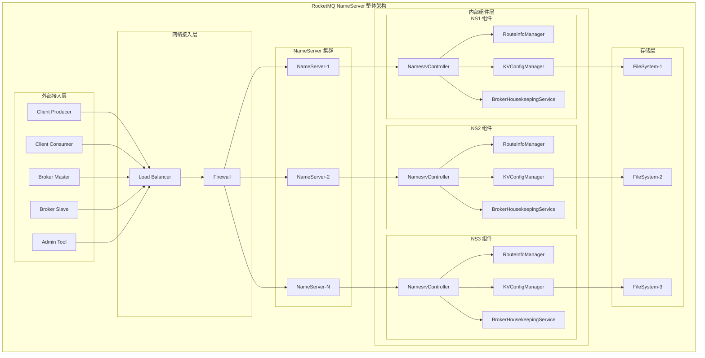

### NameServer 核心架构层次

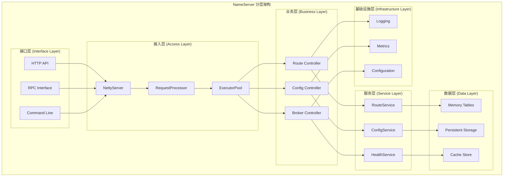

## 组件关系图

### 核心组件关系

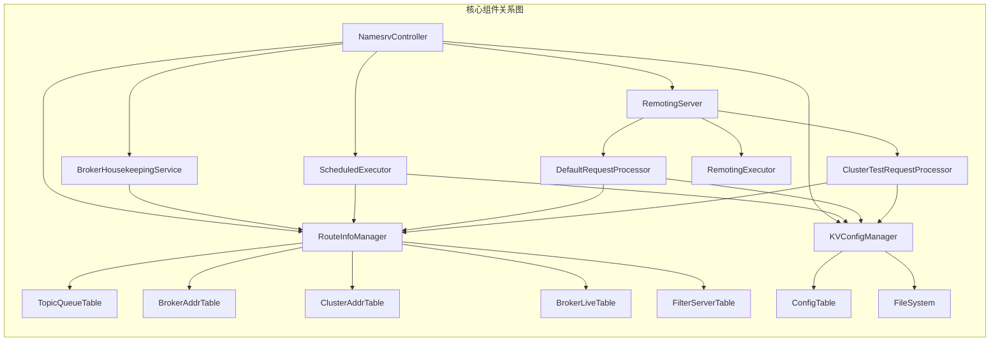

### 组件依赖关系

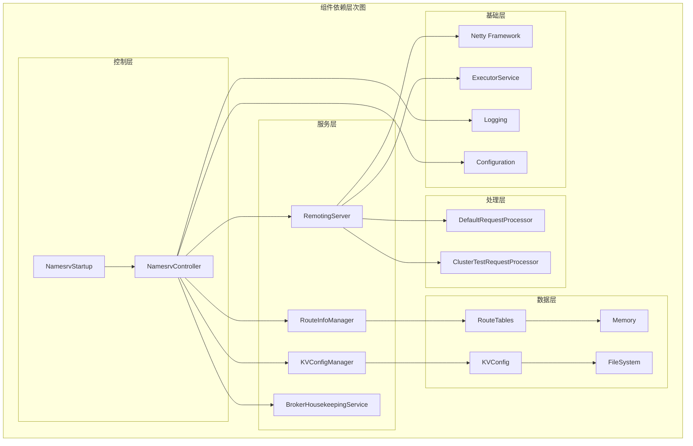

## 数据流架构图

### Broker 注册数据流

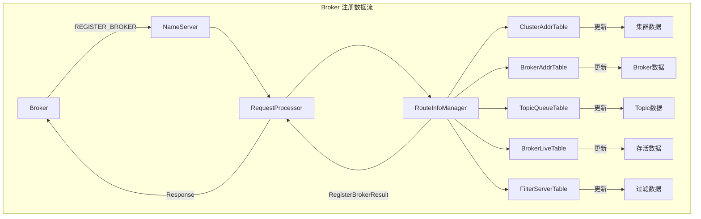

### 路由查询数据流

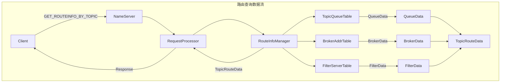

### 配置管理数据流

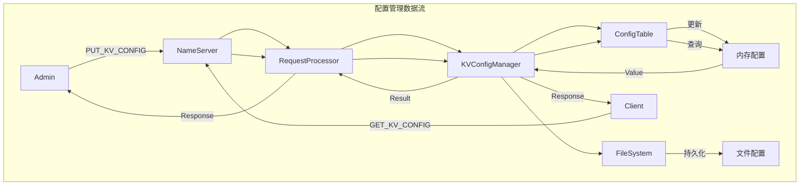

## 部署架构图

### 单机部署架构

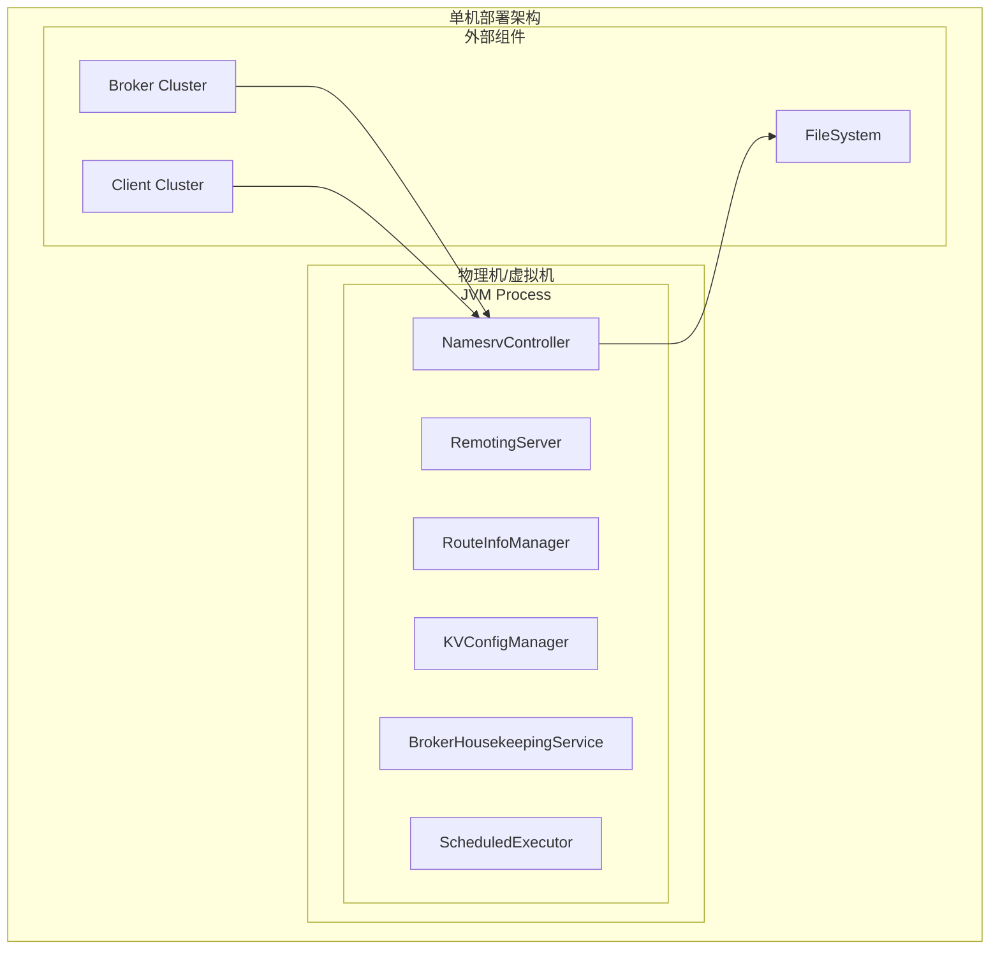

### 集群部署架构

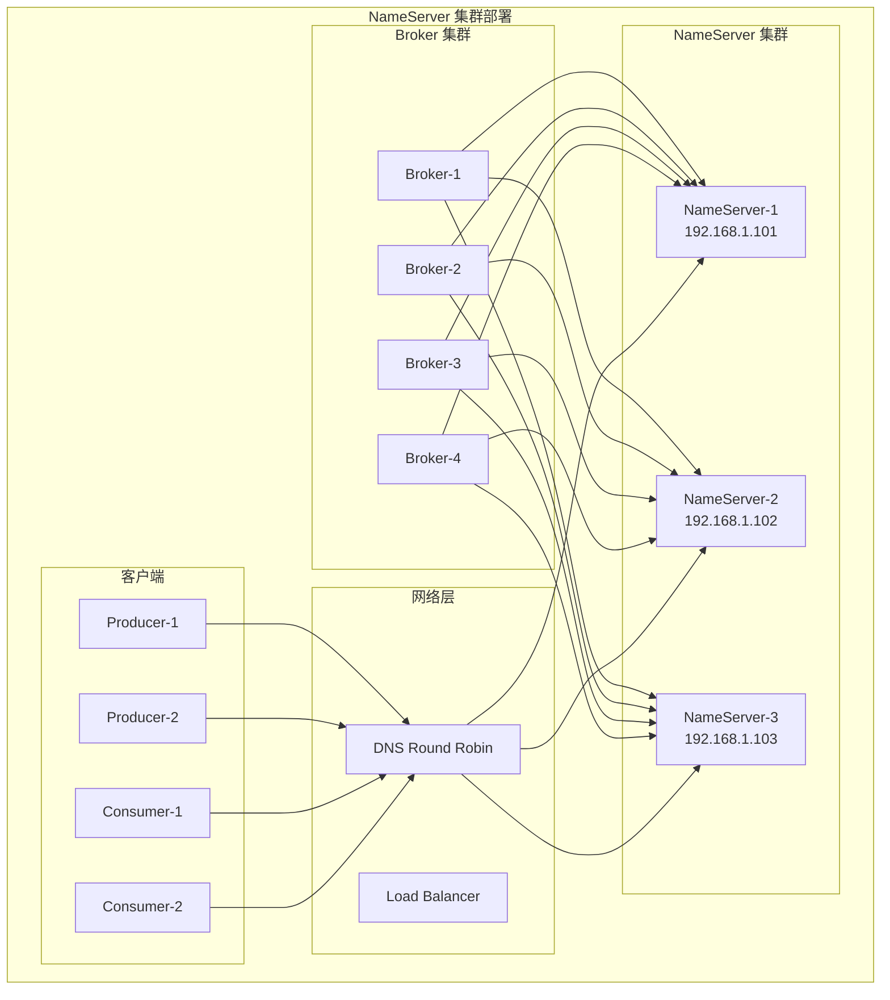

### 高可用部署架构

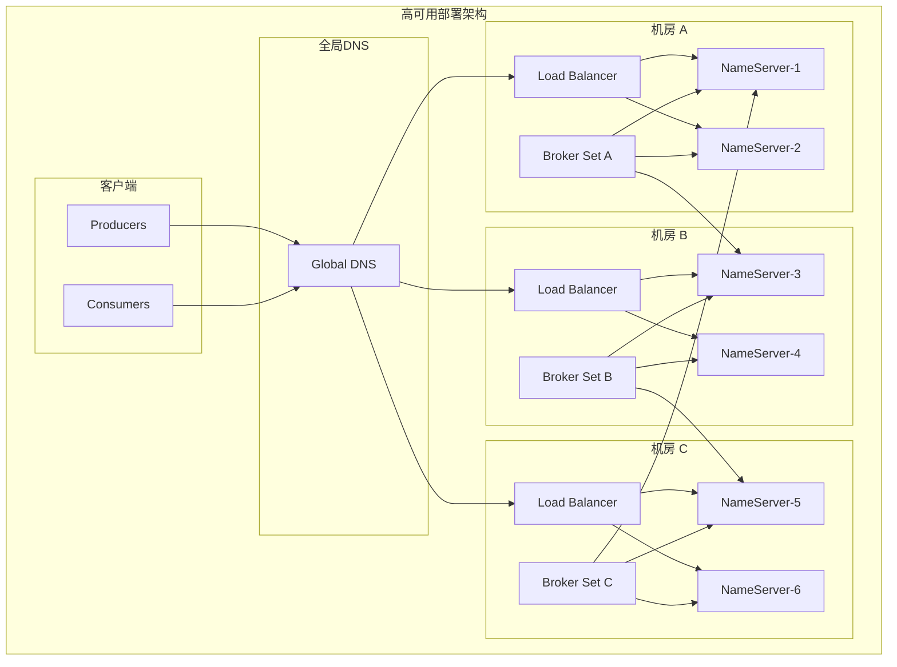

## 网络架构图

### 网络通信架构

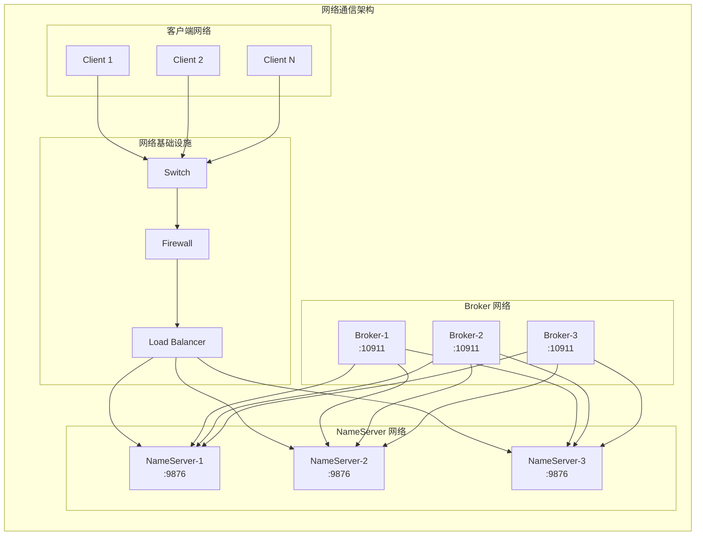

### Netty 网络架构

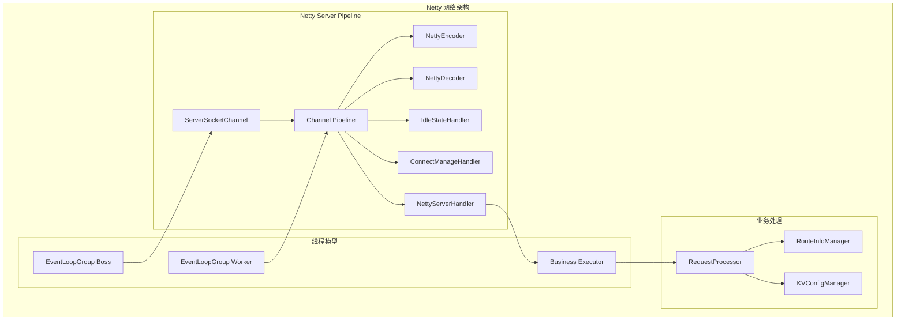

## 存储架构图

### 数据存储架构

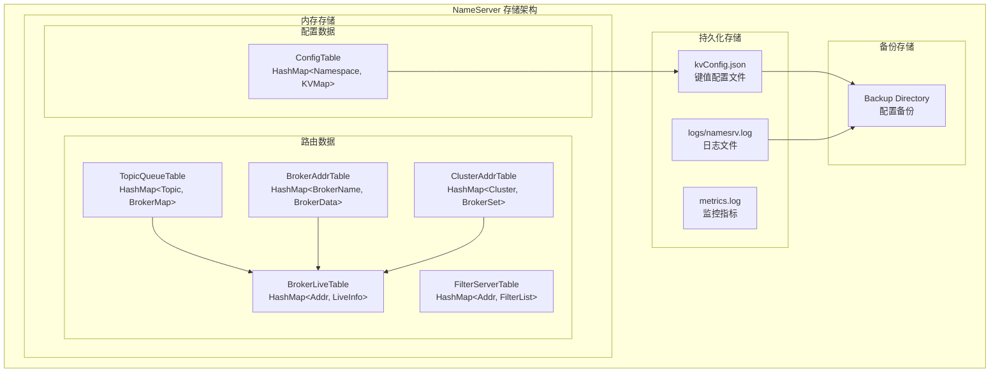

### 内存数据结构架构

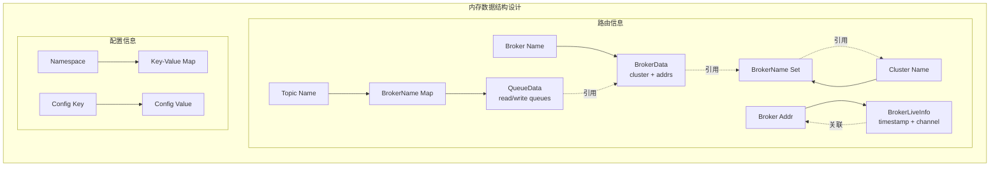

## 线程模型图

### 线程架构模型

```mermaid
graph TB
    subgraph "NameServer 线程模型"
        subgraph "Main Thread"
            MT[Main Thread]
            MT -->|启动| NC[NamesrvController]
        end

        subgraph "Netty Boss Thread"
            BT[Boss Thread<br/>EventLoopGroup(1)]
            BT -->|Accept| CC[Client Connections]
            BT -->|Accept| BC[Broker Connections]
        end

        subgraph "Netty Worker Threads"
            WT1[Worker Thread-1]
            WT2[Worker Thread-2]
            WTN[Worker Thread-N]

            WT1 -->|I/O| RQ1[Read Queue]
            WT2 -->|I/O| RQ2[Read Queue]
            WTN -->|I/O| RQN[Read Queue]
        end

        subgraph "Business Thread Pool"
            BT1[Business Thread-1]
            BT2[Business Thread-2]
            BTN[Business Thread-N]

            BT1 -->|Process| RP1[Request Processing]
            BT2 -->|Process| RP2[Request Processing]
            BTN -->|Process| RPN[Request Processing]
        end

        subgraph "Scheduled Thread Pool"
            ST1[Scheduled Thread-1<br/>Broker Health Check]
            ST2[Scheduled Thread-2<br/>Config Print]
        end

        subgraph "File Watch Thread"
            FWT[File Watch Thread<br/>TLS Cert Reload]
        end
    end

    NC --> BT
    NC --> WT1
    NC --> WT2
    NC --> WTN

    RQ1 --> BT1
    RQ2 --> BT2
    RQN --> BTN

    NC --> ST1
    NC --> ST2
    NC --> FWT
```

### 请求处理线程流程

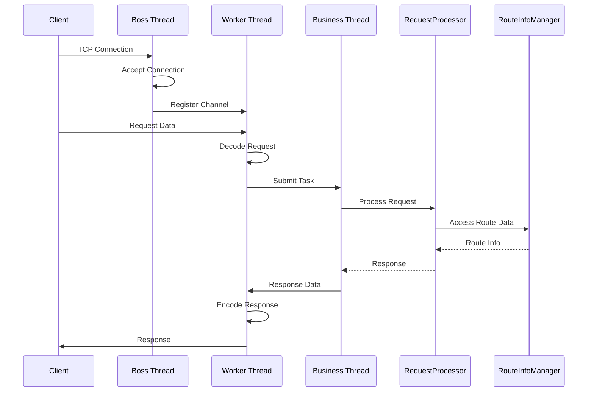

## 安全架构图

### 安全防护架构

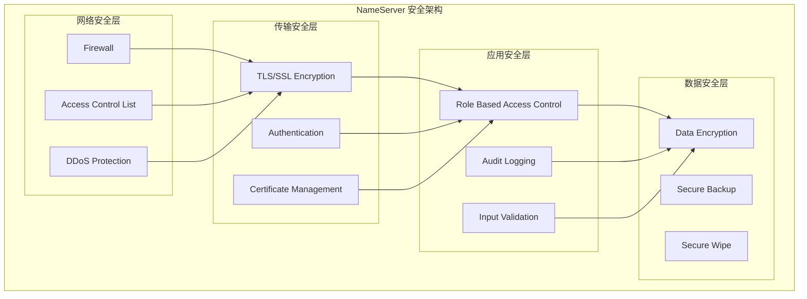

### TLS 安全架构

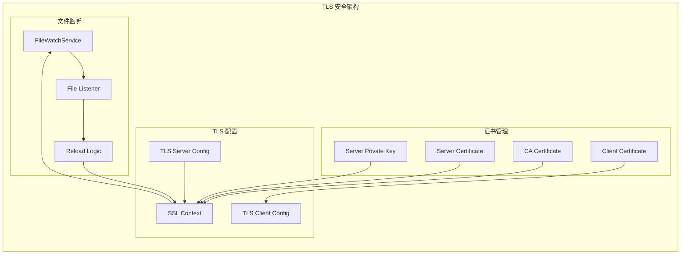

## 监控架构图

### 监控系统架构

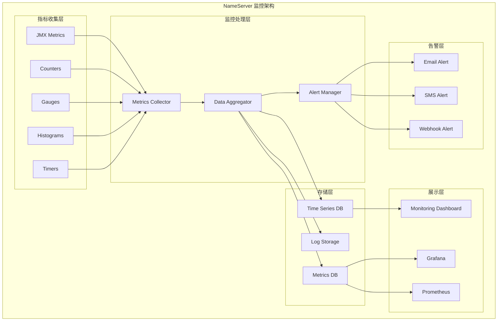

### 日志架构图

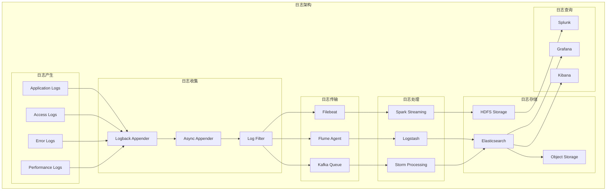

## 扩展架构图

### 插件化架构

```mermaid
graph TB
    subgraph "插件化架构"
        subgraph "核心框架"
            CORE[NameServer Core]
            API[Plugin API]
            LOADER[Plugin Loader]
            MANAGER[Plugin Manager]
        end

        subgraph "插件类型"
            AUTH[Auth Plugin]
            ROUTE[Route Plugin]
            METRIC[Metric Plugin]
            STORAGE[Storage Plugin]
            NETWORK[Network Plugin]
        end

        subgraph "插件实现"
            LDAP[LDAP Auth]
            JWT[JWT Auth]
            CONSOLE[Console Route]
            PROM[Prometheus Metric]
            INFLUX[InfluxDB Metric]
            REDIS[Redis Storage]
            ETCD[etcd Storage]
        end
    end

    CORE --> API
    API --> LOADER
    LOADER --> MANAGER

    MANAGER --> AUTH
    MANAGER --> ROUTE
    MANAGER --> METRIC
    MANAGER --> STORAGE
    MANAGER --> NETWORK

    AUTH --> LDAP
    AUTH --> JWT
    ROUTE --> CONSOLE
    METRIC --> PROM
    METRIC --> INFLUX
    STORAGE --> REDIS
    STORAGE --> ETCD
```

### 扩展点架构

```mermaid
graph LR
    subgraph "扩展点架构"
        subgraph "请求处理扩展"
            PRE[Pre Processor]
            POST[Post Processor]
            EXCEPTION[Exception Handler]
        end

        subgraph "数据扩展"
            ROUTE_EXT[Route Extension]
            CONFIG_EXT[Config Extension]
            FILTER[Filter Extension]
        end

        subgraph "存储扩展"
            MEMORY[Memory Store]
            DISK[Disk Store]
            DISTRIBUTED[Distributed Store]
        end

        subgraph "网络扩展"
            PROTOCOL[Protocol Extension]
            SERIALIZER[Serializer Extension]
            COMPRESS[Compress Extension]
        end
    end

    PRE --> ROUTE_EXT
    POST --> CONFIG_EXT
    EXCEPTION --> FILTER

    ROUTE_EXT --> MEMORY
    CONFIG_EXT --> DISK
    FILTER --> DISTRIBUTED

    MEMORY --> PROTOCOL
    DISK --> SERIALIZER
    DISTRIBUTED --> COMPRESS
```

## 容器化架构图

### Docker 容器架构

```mermaid
graph TB
    subgraph "Docker 容器化部署"
        subgraph "容器编排"
            K8S[Kubernetes]
            DOCKER[Docker Compose]
            SWARM[Docker Swarm]
        end

        subgraph "NameServer 容器"
            NS1[NameServer Pod-1]
            NS2[NameServer Pod-2]
            NS3[NameServer Pod-3]
        end

        subgraph "存储卷"
            CONFIG[Config Volume]
            LOGS[Logs Volume]
            DATA[Data Volume]
        end

        subgraph "服务发现"
            SVC[Service]
            INGRESS[Ingress]
            DNS[CoreDNS]
        end

        subgraph "监控"
            PROM[Prometheus]
            GRAFANA[Grafana]
            ALERT[AlertManager]
        end
    end

    K8S --> NS1
    K8S --> NS2
    K8S --> NS3

    NS1 --> CONFIG
    NS2 --> CONFIG
    NS3 --> CONFIG

    NS1 --> LOGS
    NS2 --> LOGS
    NS3 --> LOGS

    SVC --> NS1
    SVC --> NS2
    SVC --> NS3

    PROM --> NS1
    PROM --> NS2
    PROM --> NS3

    GRAFANA --> PROM
    ALERT --> PROM
```

### 微服务架构

```mermaid
graph TB
    subgraph "微服务架构"
        subgraph "API Gateway"
            GATEWAY[API Gateway]
            LB[Load Balancer]
        end

        subgraph "NameServer 微服务"
            NS_CORE[NameServer Core Service]
            NS_ROUTE[Route Service]
            NS_CONFIG[Config Service]
            NS_HEALTH[Health Service]
        end

        subgraph "数据服务"
            REDIS[Redis Cache]
            MYSQL[MySQL DB]
            ETCD[etcd Cluster]
        end

        subgraph "监控服务"
            JAEGER[Jaeger Tracing]
            PROM[Prometheus]
            GRAFANA[Grafana]
        end

        subgraph "配置服务"
            NACOS[Nacos Config]
            APOLLO[Apollo Config]
        end
    end

    GATEWAY --> LB
    LB --> NS_CORE
    LB --> NS_ROUTE
    LB --> NS_CONFIG
    LB --> NS_HEALTH

    NS_CORE --> REDIS
    NS_ROUTE --> MYSQL
    NS_CONFIG --> ETCD
    NS_HEALTH --> REDIS

    NS_CORE --> JAEGER
    NS_ROUTE --> PROM
    NS_CONFIG --> GRAFANA

    NS_CORE --> NACOS
    NS_ROUTE --> APOLLO
```

## 总结

通过以上架构图解，我们可以清晰地看到 RocketMQ NameServer 的设计精髓：

### 架构特点

1. **简洁高效**：架构简单，职责明确，性能优异
2. **高可用性**：支持集群部署，故障自动恢复
3. **可扩展性**：插件化设计，易于扩展功能
4. **安全性**：多层次安全防护，支持 TLS 加密

### 设计优势

1. **无状态设计**：每个 NameServer 实例独立，易于水平扩展
2. **内存优先**：全内存存储，提供极快的访问速度
3. **异步处理**：网络 I/O 和业务处理分离，提高并发能力
4. **自动恢复**：故障检测和自动清理机制

这些架构设计使得 NameServer 能够作为高性能、高可靠的注册中心，为 RocketMQ 集群提供稳定的服务发现和路由管理功能。