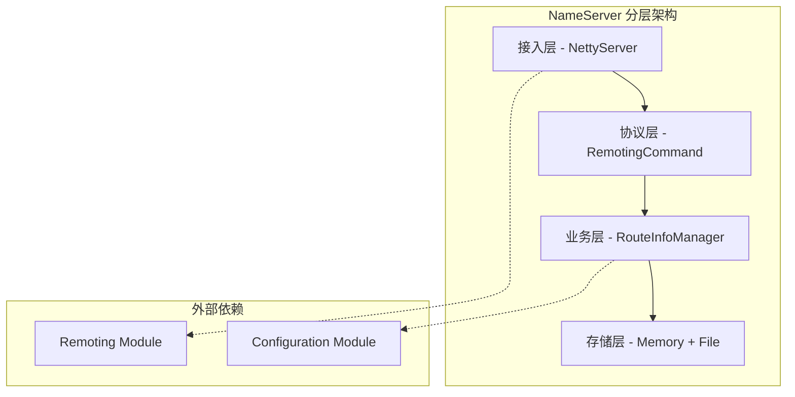

# RocketMQ NameServer 设计模式分析

## 概述

RocketMQ NameServer 模块在设计中巧妙地运用了多种设计模式，这些模式不仅提高了代码的可维护性和可扩展性，还体现了优秀的面向对象设计原则。本文档详细分析 NameServer 中使用的各种设计模式及其应用场景。

## 目录

- [创建型模式](#创建型模式)
- [结构型模式](#结构型模式)
- [行为型模式](#行为型模式)
- [架构模式](#架构模式)
- [设计原则体现](#设计原则体现)
- [模式组合应用](#模式组合应用)
- [最佳实践总结](#最佳实践总结)

## 创建型模式

### 1. 单例模式 (Singleton Pattern)

**应用场景：**
- **NamesrvController**：每个 NameServer 实例只有一个控制器
- **RouteInfoManager**：全局唯一的路由信息管理器
- **KVConfigManager**：全局唯一的配置管理器

**实现示例 - NamesrvController：**
```java
public class NamesrvController {
    // 单例实例（在 NamesrvStartup 中创建）
    private static NamesrvController namesrvController;

    // 私有构造函数
    private NamesrvController(NamesrvConfig namesrvConfig, NettyServerConfig nettyServerConfig) {
        this.namesrvConfig = namesrvConfig;
        this.nettyServerConfig = nettyServerConfig;
        // 初始化组件
        this.kvConfigManager = new KVConfigManager(this);
        this.routeInfoManager = new RouteInfoManager();
    }

    // 获取单例实例
    public static NamesrvController getInstance() {
        return namesrvController;
    }
}
```

**优势分析：**
- **资源共享**：避免多个实例造成的资源浪费
- **状态一致性**：保证全局状态的一致性
- **访问统一**：提供统一的访问入口

**注意事项：**
- **线程安全**：在并发环境下需要考虑线程安全问题
- **生命周期管理**：需要合理管理单例的生命周期

### 2. 工厂方法模式 (Factory Method Pattern)

**应用场景：**
- **RemotingCommand**：统一创建响应命令对象
- **RequestProcessor**：根据配置创建不同的处理器

**实现示例 - RemotingCommand：**
```java
public class RemotingCommand {
    // 工厂方法创建响应命令
    public static RemotingCommand createResponseCommand(Class<? extends CommandCustomHeader> responseHeaderClass) {
        RemotingCommand cmd = new RemotingCommand();
        cmd.setCode(ResponseCode.SUCCESS);
        cmd.markResponseType();

        if (responseHeaderClass != null) {
            try {
                CommandCustomHeader responseHeader = responseHeaderClass.newInstance();
                cmd.setCustomHeader(responseHeader);
            } catch (InstantiationException | IllegalAccessException e) {
                return null;
            }
        }

        return cmd;
    }

    // 重载方法
    public static RemotingCommand createResponseCommand(int code, String remark) {
        RemotingCommand cmd = new RemotingCommand();
        cmd.setCode(code);
        cmd.setRemark(remark);
        cmd.markResponseType();
        return cmd;
    }
}
```

**在 DefaultRequestProcessor 中的应用：**
```java
public class DefaultRequestProcessor extends AsyncNettyRequestProcessor {
    @Override
    public RemotingCommand processRequest(ChannelHandlerContext ctx, RemotingCommand request) {
        switch (request.getCode()) {
            case RequestCode.GET_KV_CONFIG:
                // 使用工厂方法创建响应
                final RemotingCommand response = RemotingCommand.createResponseCommand(GetKVConfigResponseHeader.class);
                // 处理业务逻辑
                return response;

            case RequestCode.PUT_KV_CONFIG:
                // 创建不带特定头的响应
                final RemotingCommand response2 = RemotingCommand.createResponseCommand(null);
                // 处理业务逻辑
                return response2;
        }
        return null;
    }
}
```

### 3. 建造者模式 (Builder Pattern)

**应用场景：**
- **KVConfigSerializeWrapper**：配置序列化包装器的构建
- **TopicRouteData**：路由数据的构建

**实现示例 - 配置构建：**
```java
public class KVConfigSerializeWrapper {
    private HashMap<String, HashMap<String, String>> configTable;

    // 建造者模式的简化实现
    public static class Builder {
        private KVConfigSerializeWrapper wrapper = new KVConfigSerializeWrapper();

        public Builder withConfigTable(HashMap<String, HashMap<String, String>> configTable) {
            wrapper.configTable = configTable;
            return this;
        }

        public KVConfigSerializeWrapper build() {
            return wrapper;
        }
    }
}
```

## 结构型模式

### 1. 代理模式 (Proxy Pattern)

**应用场景：**
- **RemotingServer**：作为网络通信的代理层
- **NettyRemotingServer**：Netty 网络服务的具体实现

**实现分析：**
```java
// 抽象代理接口
public interface RemotingService {
    void start();
    void shutdown();
    void registerRPCHook(RPCHook rpcHook);
    void registerProcessor(int requestCode, NettyRequestProcessor processor, ExecutorService executor);
}

// 代理实现
public class NettyRemotingServer extends NettyRemotingAbstract implements RemotingServer {
    private final NettyServerConfig nettyServerConfig;
    private final ExecutorService publicExecutor;

    // 代理网络操作
    @Override
    public void start() {
        // 启动 Netty 服务器
        this.defaultEventExecutorGroup = new DefaultEventExecutorGroup(
            nettyServerConfig.getServerWorkerThreads(),
            new ThreadFactoryImpl("NettyServerCodecThread_"));

        prepareSharableHandlers();
        ServerBootstrap childHandler =
            this.serverBootstrap.group(this.eventLoopGroupBoss, this.eventLoopGroupWorker)
                .channel(useEpoll() ? EpollServerSocketChannel.class : NioServerSocketChannel.class)
                .option(ChannelOption.SO_BACKLOG, 1024)
                .childHandler(new ChannelInitializer<SocketChannel>() {
                    @Override
                    public void initChannel(SocketChannel ch) throws Exception {
                        ch.pipeline()
                            .addLast(defaultEventExecutorGroup,
                                new NettyEncoder(),
                                new NettyDecoder(),
                                new IdleStateHandler(0, 0, nettyServerConfig.getServerChannelMaxIdleTimeSeconds()),
                                new NettyConnectManageHandler(),
                                new NettyServerHandler());
                    }
                });

        // 绑定端口并启动
        ChannelFuture sync = this.serverBootstrap.bind().sync();
        log.info("RemotingServer started on port: {}", this.port);
    }
}
```

**代理优势：**
- **封装复杂性**：隐藏底层 Netty 实现细节
- **统一接口**：提供统一的远程服务接口
- **功能增强**：可以在代理层添加额外功能

### 2. 适配器模式 (Adapter Pattern)

**应用场景：**
- **ChannelEventListener**：Netty 事件监听器的适配
- **BrokerHousekeepingService**：适配 Netty 事件到业务逻辑

**实现示例 - BrokerHousekeepingService：**
```java
public class BrokerHousekeepingService implements ChannelEventListener {
    private final NamesrvController namesrvController;

    public BrokerHousekeepingService(NamesrvController namesrvController) {
        this.namesrvController = namesrvController;
    }

    // 适配 Netty 连接事件
    @Override
    public void onChannelConnect(String remoteAddr, Channel channel) {
        // 连接建立时的适配处理
        log.info("Connection established: {}", remoteAddr);
    }

    @Override
    public void onChannelClose(String remoteAddr, Channel channel) {
        // 适配连接关闭事件到路由清理逻辑
        this.namesrvController.getRouteInfoManager().onChannelDestroy(remoteAddr, channel);
    }

    @Override
    public void onChannelException(String remoteAddr, Channel channel) {
        // 适配连接异常事件到路由清理逻辑
        this.namesrvController.getRouteInfoManager().onChannelDestroy(remoteAddr, channel);
    }

    @Override
    public void onChannelIdle(String remoteAddr, Channel channel) {
        // 适配连接空闲事件
        log.warn("Channel idle: {}", remoteAddr);
    }
}
```

### 3. 装饰器模式 (Decorator Pattern)

**应用场景：**
- **AsyncNettyRequestProcessor**：为基础请求处理器添加异步功能
- **FileWatchService**：为基础文件监听添加重载功能

**实现示例 - 异步处理器装饰器：**
```java
public abstract class AsyncNettyRequestProcessor implements NettyRequestProcessor {

    // 装饰器模式：为基础处理器添加异步线程池
    protected ExecutorService asyncExecutor;

    public void setAsyncExecutor(ExecutorService asyncExecutor) {
        this.asyncExecutor = asyncExecutor;
    }

    // 模板方法，子类实现具体业务逻辑
    public abstract RemotingCommand processRequest(ChannelHandlerContext ctx, RemotingCommand request)
        throws RemotingCommandException;

    // 默认拒绝请求
    public boolean rejectRequest() {
        return false;
    }
}

// 具体实现类
public class DefaultRequestProcessor extends AsyncNettyRequestProcessor {
    @Override
    public RemotingCommand processRequest(ChannelHandlerContext ctx, RemotingCommand request)
        throws RemotingCommandException {
        // 具体的请求处理逻辑
        switch (request.getCode()) {
            case RequestCode.REGISTER_BROKER:
                return this.registerBrokerWithFilterServer(ctx, request);
            // ... 其他处理逻辑
        }
        return null;
    }
}
```

## 行为型模式

### 1. 观察者模式 (Observer Pattern)

**应用场景：**
- **BrokerHousekeepingService**：观察 Broker 连接状态变化
- **FileWatchService**：观察文件系统变化
- **ChannelEventListener**：Netty 通道事件监听

**实现示例 - 文件监听：**
```java
public class FileWatchService {
    public interface Listener {
        void onChanged(String path);
    }

    private final String[] watchPaths;
    private final Listener listener;

    public FileWatchService(String[] watchPaths, Listener listener) {
        this.watchPaths = watchPaths;
        this.listener = listener;
    }

    // 文件变更时通知所有观察者
    private void notifyListeners(String path) {
        listener.onChanged(path);
    }
}

// 在 NamesrvController 中的应用
FileWatchService fileWatchService = new FileWatchService(
    new String[] {
        TlsSystemConfig.tlsServerCertPath,
        TlsSystemConfig.tlsServerKeyPath,
        TlsSystemConfig.tlsServerTrustCertPath
    },
    new FileWatchService.Listener() {
        @Override
        public void onChanged(String path) {
            if (path.equals(TlsSystemConfig.tlsServerTrustCertPath)) {
                log.info("The trust certificate changed, reload the ssl context");
                reloadServerSslContext();
            }
            // 处理其他文件变更
        }
    });
```

### 2. 策略模式 (Strategy Pattern)

**应用场景：**
- **RequestProcessor**：根据配置选择不同的请求处理策略
- **SerializeType**：序列化策略选择

**实现示例 - 请求处理器策略：**
```java
public abstract class NettyRequestProcessor {
    public abstract RemotingCommand processRequest(ChannelHandlerContext ctx, RemotingCommand request)
        throws RemotingCommandException;
    public abstract boolean rejectRequest();
}

// 策略1：默认请求处理器
public class DefaultRequestProcessor extends AsyncNettyRequestProcessor {
    @Override
    public RemotingCommand processRequest(ChannelHandlerContext ctx, RemotingCommand request) {
        // 默认处理策略
        switch (request.getCode()) {
            case RequestCode.PUT_KV_CONFIG:
                return this.putKVConfig(ctx, request);
            // ... 其他处理
        }
        return null;
    }
}

// 策略2：集群测试处理器
public class ClusterTestRequestProcessor extends AsyncNettyRequestProcessor {
    @Override
    public RemotingCommand processRequest(ChannelHandlerContext ctx, RemotingCommand request) {
        // 集群测试特殊处理策略
        // ... 特殊处理逻辑
        return null;
    }
}

// 策略选择器
private void registerProcessor() {
    NettyRequestProcessor processor;
    if (namesrvConfig.isClusterTest()) {
        // 选择集群测试策略
        processor = new ClusterTestRequestProcessor(this, namesrvConfig.getProductEnvName());
    } else {
        // 选择默认策略
        processor = new DefaultRequestProcessor(this);
    }

    this.remotingServer.registerDefaultProcessor(processor, this.remotingExecutor);
}
```

### 3. 模板方法模式 (Template Method Pattern)

**应用场景：**
- **AsyncNettyRequestProcessor**：定义异步请求处理模板
- **RouteInfoManager**：定义路由操作模板

**实现示例 - 路由信息操作模板：**
```java
public class RouteInfoManager {
    // 模板方法：定义标准的写入操作流程
    private <T> T executeWithWriteLock(Callable<T> operation) {
        try {
            this.lock.writeLock().lockInterruptibly();
            try {
                return operation.call();
            } finally {
                this.lock.writeLock().unlock();
            }
        } catch (Exception e) {
            log.error("Execute with write lock failed", e);
            return null;
        }
    }

    // 模板方法：定义标准的读取操作流程
    private <T> T executeWithReadLock(Callable<T> operation) {
        try {
            this.lock.readLock().lockInterruptibly();
            try {
                return operation.call();
            } finally {
                this.lock.readLock().unlock();
            }
        } catch (Exception e) {
            log.error("Execute with read lock failed", e);
            return null;
        }
    }

    // 使用模板方法的具体实现
    public void deleteTopic(final String topic) {
        executeWithWriteLock(() -> {
            this.topicQueueTable.remove(topic);
            return null;
        });
    }

    public TopicList getAllTopicList() {
        return executeWithReadLock(() -> {
            TopicList topicList = new TopicList();
            topicList.getTopicList().addAll(this.topicQueueTable.keySet());
            return topicList;
        });
    }
}
```

### 4. 命令模式 (Command Pattern)

**应用场景：**
- **RemotingCommand**：封装请求/响应操作
- **RequestCode**：定义操作命令类型

**实现示例：**
```java
public class RemotingCommand {
    private int code;              // 命令码
    private LanguageCode language; // 语言类型
    private int version;           // 版本
    private int opaque;            // 请求标识
    private int flag;              // 标志位
    private String remark;         // 备注
    private HashMap<String, String> extFields; // 扩展字段
    private transient CommandCustomHeader customHeader; // 自定义头
    private byte[] body;           // 消息体

    // 执行命令的方法
    public RemotingCommand execute() {
        // 命令执行逻辑
        return this;
    }

    // 创建响应命令
    public RemotingCommand createResponseCommand() {
        RemotingCommand response = new RemotingCommand();
        response.setCode(this.code);
        response.setOpaque(this.opaque);
        response.markResponseType();
        return response;
    }
}

// 命令类型定义
public class RequestCode {
    public static final int REGISTER_BROKER = 103;                    // 注册 Broker
    public static final int UNREGISTER_BROKER = 104;                  // 注销 Broker
    public static final int GET_ROUTEINFO_BY_TOPIC = 105;            // 获取 Topic 路由信息
    public static final int GET_BROKER_CLUSTER_INFO = 106;            // 获取集群信息
    public static final int PUT_KV_CONFIG = 107;                      // 设置 KV 配置
    public static final int GET_KV_CONFIG = 108;                      // 获取 KV 配置
    public static final int DELETE_KV_CONFIG = 109;                   // 删除 KV 配置
    // ... 更多命令类型
}
```

### 5. 状态模式 (State Pattern)

**应用场景：**
- **BrokerLiveInfo**：Broker 连接状态管理
- **Channel 状态**：网络连接状态处理

**实现示例 - Broker 状态管理：**
```java
class BrokerLiveInfo {
    private long lastUpdateTimestamp;  // 最后更新时间
    private DataVersion dataVersion;   // 数据版本
    private Channel channel;           // 网络连接
    private String haServerAddr;       // HA 服务器地址

    // 状态检查方法
    public boolean isAlive() {
        long currentTime = System.currentTimeMillis();
        return (currentTime - lastUpdateTimestamp) < 120000; // 2分钟超时
    }

    public boolean isActive() {
        return channel != null && channel.isActive();
    }

    // 状态更新方法
    public void updateHeartbeat() {
        this.lastUpdateTimestamp = System.currentTimeMillis();
    }

    public void updateDataVersion(DataVersion newDataVersion) {
        this.dataVersion = newDataVersion;
        this.lastUpdateTimestamp = System.currentTimeMillis();
    }
}

// 在路由管理器中的应用
public int scanNotActiveBroker() {
    int removeCount = 0;
    Iterator<Entry<String, BrokerLiveInfo>> it = this.brokerLiveTable.entrySet().iterator();
    while (it.hasNext()) {
        Entry<String, BrokerLiveInfo> next = it.next();
        BrokerLiveInfo brokerInfo = next.getValue();

        // 状态判断
        if (!brokerInfo.isAlive()) {
            // 状态变化处理：从活跃变为不活跃
            RemotingUtil.closeChannel(brokerInfo.getChannel());
            it.remove();
            this.onChannelDestroy(next.getKey(), brokerInfo.getChannel());
            removeCount++;
        }
    }
    return removeCount;
}
```

## 架构模式

### 1. 分层架构 (Layered Architecture)

**架构层次：**



**层次职责：**
- **接入层**：处理网络通信、协议编解码
- **协议层**：定义请求响应协议
- **业务层**：实现路由管理、配置管理
- **存储层**：内存数据存储、文件持久化

### 2. 事件驱动架构 (Event-Driven Architecture)

**事件流处理：**
```java
// 事件生产者
public class BrokerHousekeepingService implements ChannelEventListener {
    @Override
    public void onChannelClose(String remoteAddr, Channel channel) {
        // 发布连接关闭事件
        this.namesrvController.getRouteInfoManager().onChannelDestroy(remoteAddr, channel);
    }
}

// 事件消费者
public class RouteInfoManager {
    public void onChannelDestroy(String remoteAddr, Channel channel) {
        // 处理连接销毁事件
        // 1. 清理 brokerLiveTable
        // 2. 清理 filterServerTable
        // 3. 清理 brokerAddrTable
        // 4. 清理 clusterAddrTable
        // 5. 清理 topicQueueTable
    }
}
```

### 3. 微服务架构 (Microservices Architecture)

**服务特征：**
- **单一职责**：专注于服务注册与发现
- **无状态**：每个 NameServer 实例独立运行
- **水平扩展**：支持部署多个实例
- **独立部署**：可独立启动和升级

## 设计原则体现

### 1. 单一职责原则 (SRP)

**体现：**
- **RouteInfoManager**：只负责路由信息管理
- **KVConfigManager**：只负责配置管理
- **BrokerHousekeepingService**：只负责连接保活
- **DefaultRequestProcessor**：只负责请求处理

### 2. 开闭原则 (OCP)

**体现：**
```java
// 扩展新的请求处理器
public class CustomRequestProcessor extends AsyncNettyRequestProcessor {
    @Override
    public RemotingCommand processRequest(ChannelHandlerContext ctx, RemotingCommand request) {
        // 新的处理逻辑
        return null;
    }
}

// 策略模式支持扩展
private void registerProcessor() {
    NettyRequestProcessor processor;
    if (customCondition) {
        processor = new CustomRequestProcessor(); // 新的策略
    } else {
        processor = new DefaultRequestProcessor(); // 默认策略
    }
    this.remotingServer.registerDefaultProcessor(processor, this.remotingExecutor);
}
```

### 3. 里氏替换原则 (LSP)

**体现：**
```java
// 所有实现都可以互相替换
NettyRequestProcessor processor1 = new DefaultRequestProcessor(controller);
NettyRequestProcessor processor2 = new ClusterTestRequestProcessor(controller);

// 统一接口调用
this.remotingServer.registerDefaultProcessor(processor1, executor);
this.remotingServer.registerDefaultProcessor(processor2, executor);
```

### 4. 接口隔离原则 (ISP)

**体现：**
- **RemotingService**：定义基础的远程服务接口
- **RemotingServer**：扩展服务器特定接口
- **RemotingClient**：扩展客户端特定接口
- **ChannelEventListener**：专门的事件监听接口

### 5. 依赖倒置原则 (DIP)

**体现：**
```java
// 高层模块依赖抽象
public class DefaultRequestProcessor extends AsyncNettyRequestProcessor {
    private final NamesrvController namesrvController; // 依赖抽象控制器

    public DefaultRequestProcessor(NamesrvController namesrvController) {
        this.namesrvController = namesrvController; // 依赖注入
    }
}

// 控制器依赖抽象接口
public class NamesrvController {
    private final RemotingServer remotingServer; // 依赖 RemotingServer 抽象接口
}
```

## 模式组合应用

### 1. 单例 + 模板方法 + 策略模式

**应用场景：** NamesrvController 的设计

```java
public class NamesrvController {
    // 单例
    private static NamesrvController instance;

    // 模板方法：初始化流程
    public boolean initialize() {
        this.loadConfiguration();    // 加载配置
        this.initializeComponents(); // 初始化组件
        this.registerProcessors();   // 注册处理器（策略模式）
        this.startScheduledTasks();  // 启动定时任务
        return true;
    }

    // 策略模式：处理器选择
    private void registerProcessors() {
        NettyRequestProcessor processor = createProcessor();
        this.remotingServer.registerDefaultProcessor(processor, this.remotingExecutor);
    }

    private NettyRequestProcessor createProcessor() {
        if (namesrvConfig.isClusterTest()) {
            return new ClusterTestRequestProcessor(this, namesrvConfig.getProductEnvName());
        } else {
            return new DefaultRequestProcessor(this);
        }
    }
}
```

### 2. 观察者 + 代理模式

**应用场景：** BrokerHousekeepingService

```java
public class BrokerHousekeepingService implements ChannelEventListener {
    // 观察者：实现事件监听接口
    @Override
    public void onChannelClose(String remoteAddr, Channel channel) {
        // 代理：代理路由清理操作
        this.namesrvController.getRouteInfoManager().onChannelDestroy(remoteAddr, channel);
    }
}
```

### 3. 工厂方法 + 命令模式

**应用场景：** RemotingCommand 的创建和处理

```java
public class DefaultRequestProcessor {
    public RemotingCommand processRequest(ChannelHandlerContext ctx, RemotingCommand request) {
        switch (request.getCode()) {
            case RequestCode.GET_KV_CONFIG:
                // 工厂方法创建响应命令
                RemotingCommand response = RemotingCommand.createResponseCommand(GetKVConfigResponseHeader.class);
                // 命令模式：执行具体命令
                return executeGetKVConfig(response, request);
        }
        return null;
    }
}
```

## 最佳实践总结

### 1. 设计模式应用原则

**适度应用：**
- 不要过度设计，避免为了用模式而用模式
- 在复杂场景下应用模式，提高代码质量
- 保持代码的简洁性和可读性

**组合使用：**
- 多种模式组合使用，发挥各自优势
- 考虑模式的兼容性和协调性
- 形成一致的设计风格

### 2. 架构设计经验

**分层清晰：**
- 每层职责明确，避免层次混乱
- 通过接口定义层间交互
- 支持层的独立演进

**接口设计：**
- 接口职责单一，避免臃肿
- 接口命名清晰，体现意图
- 接口版本管理，支持演进

### 3. 并发控制设计

**读写分离：**
- 读多写少场景使用读写锁
- 合理控制锁的粒度
- 避免死锁和性能问题

**状态管理：**
- 使用不可变对象减少同步
- 合理使用线程安全的集合
- 避免共享可变状态

### 4. 扩展性设计

**插件化架构：**
- 通过接口支持扩展
- 使用策略模式支持算法扩展
- 考虑配置驱动的扩展

**向后兼容：**
- 保持 API 的向后兼容性
- 使用版本管理功能演进
- 提供平滑的升级路径

## 总结

RocketMQ NameServer 模块通过巧妙运用多种设计模式，构建了一个结构清晰、功能强大、易于扩展的分布式注册中心。这些设计模式的应用不仅体现了优秀的软件工程实践，也为类似的分布式系统设计提供了宝贵的参考价值。

通过深入分析这些设计模式，我们可以学习到：
- 如何在实际项目中合理应用设计模式
- 如何组合使用多种模式解决复杂问题
- 如何在设计时考虑扩展性和维护性
- 如何通过模式提高代码的可读性和可重用性

这些经验和技巧对于构建高质量的分布式系统具有重要的指导意义。