# RocketMQ NameServer 流程分析

## 概述

本文档通过详细的流程分析和序列图，深入剖析 RocketMQ NameServer 的核心业务流程，包括启动流程、Broker 注册流程、路由查询流程、配置管理流程以及故障处理流程等。

## 目录

- [启动流程分析](#启动流程分析)
- [Broker 注册流程](#broker-注册流程)
- [路由信息查询流程](#路由信息查询流程)
- [配置管理流程](#配置管理流程)
- [故障检测与恢复流程](#故障检测与恢复流程)
- [请求处理流程](#请求处理流程)
- [数据同步流程](#数据同步流程)
- [性能优化流程](#性能优化流程)

## 启动流程分析

### 1. NameServer 启动主流程

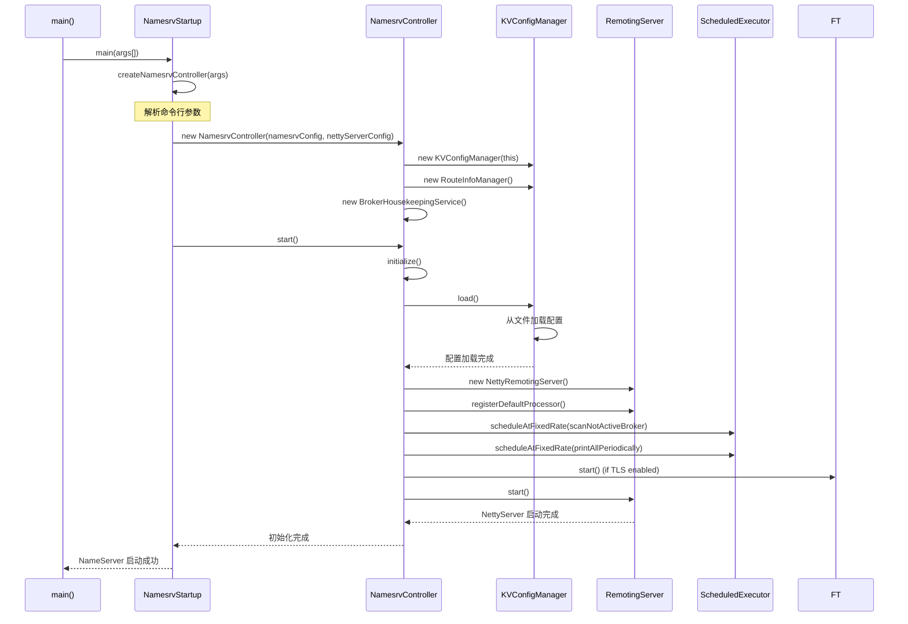
```mermaid
sequenceDiagram
    participant Main as main()
    participant NSU as NamesrvStartup
    participant NC as NamesrvController
    participant KVM as KVConfigManager
    participant RS as RemotingServer
    participant SE as ScheduledExecutor

    Main->>NSU: main(args[])
    NSU->>NSU: createNamesrvController(args)
    Note over NSU: 解析命令行参数
    NSU->>NC: new NamesrvController(namesrvConfig, nettyServerConfig)
    NC->>KVM: new KVConfigManager(this)
    NC->>KVM: new RouteInfoManager()
    NC->>NC: new BrokerHousekeepingService()

    NSU->>NC: start()
    NC->>NC: initialize()

    NC->>KVM: load()
    KVM->>KVM: 从文件加载配置
    KVM-->>NC: 配置加载完成

    NC->>RS: new NettyRemotingServer()
    NC->>RS: registerDefaultProcessor()

    NC->>SE: scheduleAtFixedRate(scanNotActiveBroker)
    NC->>SE: scheduleAtFixedRate(printAllPeriodically)
    NC->>FT: start() (if TLS enabled)

    NC->>RS: start()
    RS-->>NC: NettyServer 启动完成
    NC-->>NSU: 初始化完成
    NSU-->>Main: NameServer 启动成功
```

### 2. NameServer 初始化详细流程

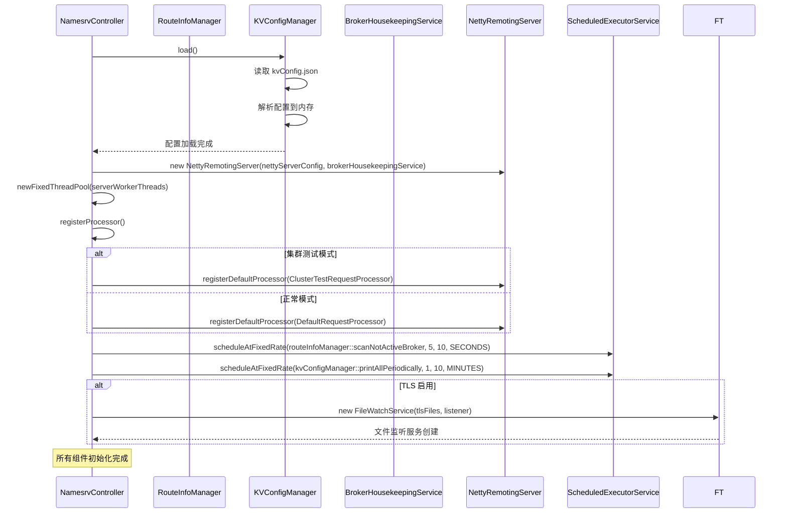
```mermaid
sequenceDiagram
    participant NC as NamesrvController
    participant RC as RouteInfoManager
    participant KVM as KVConfigManager
    participant BHS as BrokerHousekeepingService
    participant NRS as NettyRemotingServer
    participant SE as ScheduledExecutorService

    NC->>KVM: load()
    KVM->>KVM: 读取 kvConfig.json
    KVM->>KVM: 解析配置到内存
    KVM-->>NC: 配置加载完成

    NC->>NRS: new NettyRemotingServer(nettyServerConfig, brokerHousekeepingService)
    NC->>NC: newFixedThreadPool(serverWorkerThreads)

    NC->>NC: registerProcessor()
    alt 集群测试模式
        NC->>NRS: registerDefaultProcessor(ClusterTestRequestProcessor)
    else 正常模式
        NC->>NRS: registerDefaultProcessor(DefaultRequestProcessor)
    end

    NC->>SE: scheduleAtFixedRate(routeInfoManager::scanNotActiveBroker, 5, 10, SECONDS)
    NC->>SE: scheduleAtFixedRate(kvConfigManager::printAllPeriodically, 1, 10, MINUTES)

    alt TLS 启用
        NC->>FT: new FileWatchService(tlsFiles, listener)
        FT-->>NC: 文件监听服务创建
    end

    Note over NC: 所有组件初始化完成
```

## Broker 注册流程

### 1. Broker 注册主流程

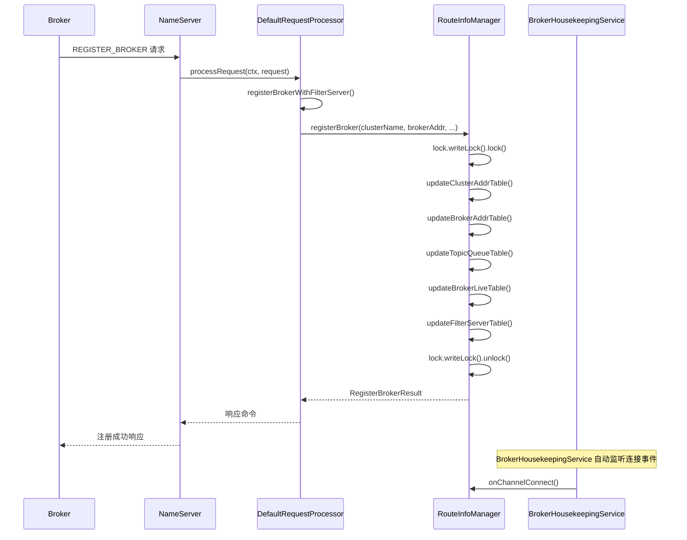
```mermaid
sequenceDiagram
    participant B as Broker
    participant NS as NameServer
    participant DRP as DefaultRequestProcessor
    participant RIM as RouteInfoManager
    participant BHS as BrokerHousekeepingService

    B->>NS: REGISTER_BROKER 请求
    NS->>DRP: processRequest(ctx, request)
    DRP->>DRP: registerBrokerWithFilterServer()
    DRP->>RIM: registerBroker(clusterName, brokerAddr, ...)

    RIM->>RIM: lock.writeLock().lock()
    RIM->>RIM: updateClusterAddrTable()
    RIM->>RIM: updateBrokerAddrTable()
    RIM->>RIM: updateTopicQueueTable()
    RIM->>RIM: updateBrokerLiveTable()
    RIM->>RIM: updateFilterServerTable()
    RIM->>RIM: lock.writeLock().unlock()

    RIM-->>DRP: RegisterBrokerResult
    DRP-->>NS: 响应命令
    NS-->>B: 注册成功响应

    Note over BHS: BrokerHousekeepingService 自动监听连接事件
    BHS->>RIM: onChannelConnect()
```

### 2. Broker 注册详细处理流程

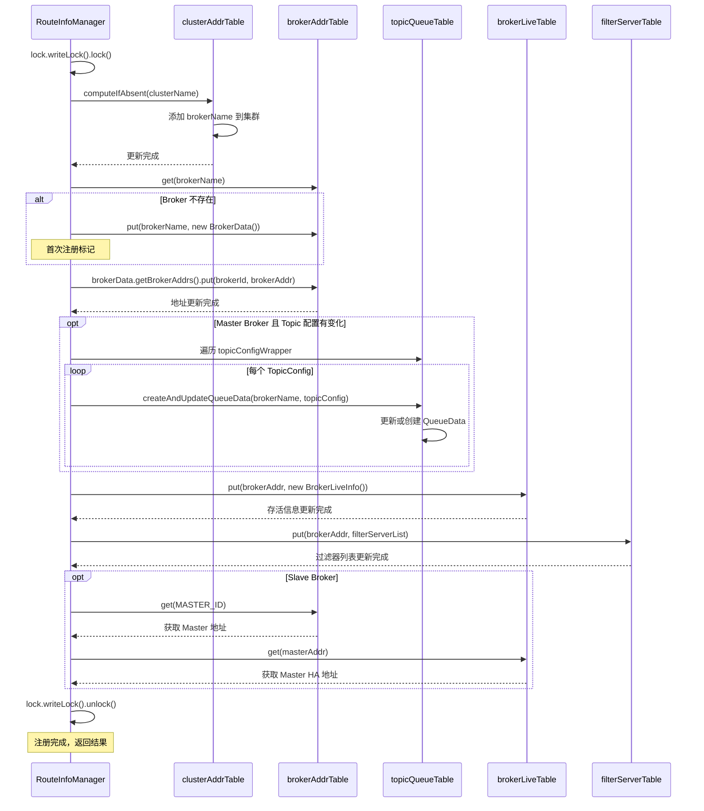
```mermaid
sequenceDiagram
    participant RIM as RouteInfoManager
    participant CAT as clusterAddrTable
    participant BAT as brokerAddrTable
    participant TQT as topicQueueTable
    participant BLT as brokerLiveTable
    participant FST as filterServerTable

    RIM->>RIM: lock.writeLock().lock()

    RIM->>CAT: computeIfAbsent(clusterName)
    CAT->>CAT: 添加 brokerName 到集群
    CAT-->>RIM: 更新完成

    RIM->>BAT: get(brokerName)
    alt Broker 不存在
        RIM->>BAT: put(brokerName, new BrokerData())
        Note over RIM: 首次注册标记
    end

    RIM->>BAT: brokerData.getBrokerAddrs().put(brokerId, brokerAddr)
    BAT-->>RIM: 地址更新完成

    opt Master Broker 且 Topic 配置有变化
        RIM->>TQT: 遍历 topicConfigWrapper
        loop 每个 TopicConfig
            RIM->>TQT: createAndUpdateQueueData(brokerName, topicConfig)
            TQT->>TQT: 更新或创建 QueueData
        end
    end

    RIM->>BLT: put(brokerAddr, new BrokerLiveInfo())
    BLT-->>RIM: 存活信息更新完成

    RIM->>FST: put(brokerAddr, filterServerList)
    FST-->>RIM: 过滤器列表更新完成

    opt Slave Broker
        RIM->>BAT: get(MASTER_ID)
        BAT-->>RIM: 获取 Master 地址
        RIM->>BLT: get(masterAddr)
        BLT-->>RIM: 获取 Master HA 地址
    end

    RIM->>RIM: lock.writeLock().unlock()
    Note over RIM: 注册完成，返回结果
```

### 3. Broker 注销流程

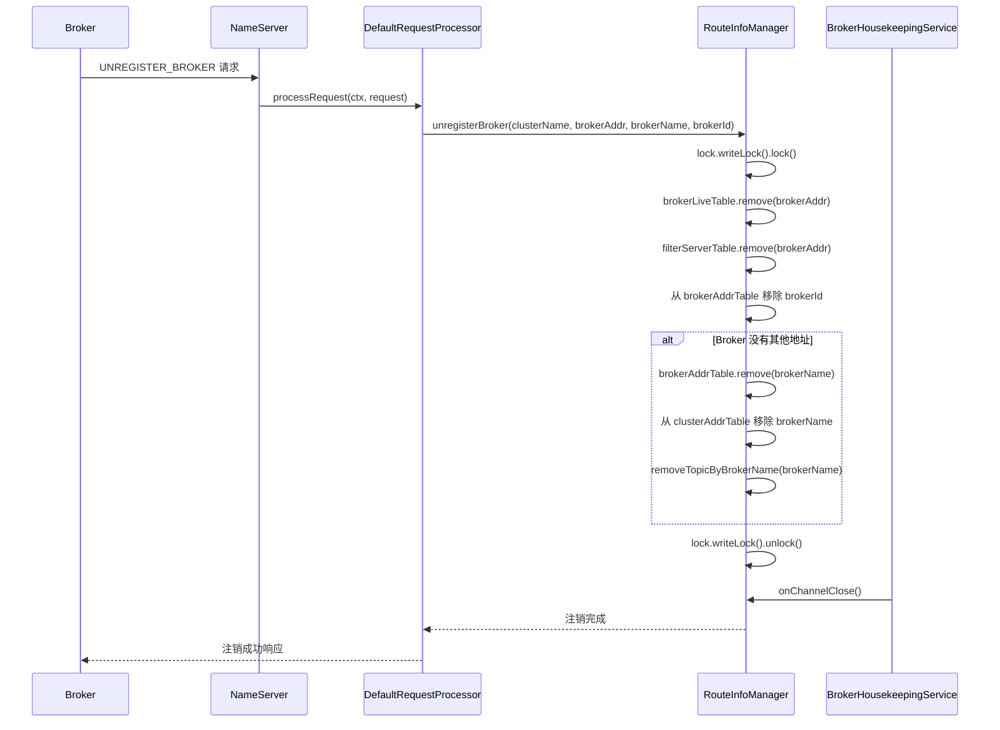
```mermaid
sequenceDiagram
    participant B as Broker
    participant NS as NameServer
    participant DRP as DefaultRequestProcessor
    participant RIM as RouteInfoManager
    participant BHS as BrokerHousekeepingService

    B->>NS: UNREGISTER_BROKER 请求
    NS->>DRP: processRequest(ctx, request)
    DRP->>RIM: unregisterBroker(clusterName, brokerAddr, brokerName, brokerId)

    RIM->>RIM: lock.writeLock().lock()
    RIM->>RIM: brokerLiveTable.remove(brokerAddr)
    RIM->>RIM: filterServerTable.remove(brokerAddr)

    RIM->>RIM: 从 brokerAddrTable 移除 brokerId
    alt Broker 没有其他地址
        RIM->>RIM: brokerAddrTable.remove(brokerName)
        RIM->>RIM: 从 clusterAddrTable 移除 brokerName
        RIM->>RIM: removeTopicByBrokerName(brokerName)
    end

    RIM->>RIM: lock.writeLock().unlock()

    BHS->>RIM: onChannelClose()
    RIM-->>DRP: 注销完成
    DRP-->>B: 注销成功响应
```

## 路由信息查询流程

### 1. Topic 路由查询流程

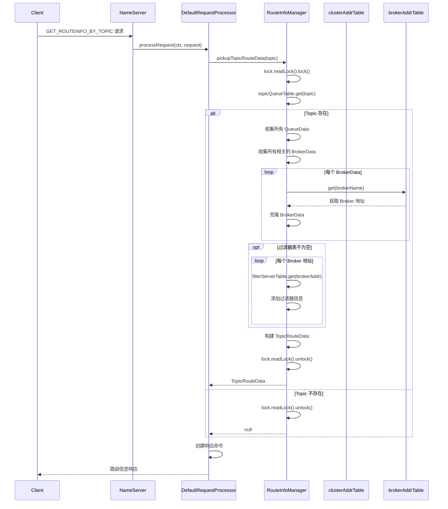
```mermaid
sequenceDiagram
    participant C as Client
    participant NS as NameServer
    participant DRP as DefaultRequestProcessor
    participant RIM as RouteInfoManager
    participant CAT as clusterAddrTable
    participant BAT as brokerAddrTable

    C->>NS: GET_ROUTEINFO_BY_TOPIC 请求
    NS->>DRP: processRequest(ctx, request)
    DRP->>RIM: pickupTopicRouteData(topic)

    RIM->>RIM: lock.readLock().lock()

    RIM->>RIM: topicQueueTable.get(topic)
    alt Topic 存在
        RIM->>RIM: 收集所有 QueueData
        RIM->>RIM: 收集所有相关的 BrokerData

        loop 每个 BrokerData
            RIM->>BAT: get(brokerName)
            BAT-->>RIM: 获取 Broker 地址
            RIM->>RIM: 克隆 BrokerData
        end

        opt 过滤器表不为空
            loop 每个 Broker 地址
                RIM->>RIM: filterServerTable.get(brokerAddr)
                RIM->>RIM: 添加过滤器信息
            end
        end

        RIM->>RIM: 构建 TopicRouteData
        RIM->>RIM: lock.readLock().unlock()
        RIM-->>DRP: TopicRouteData
    else Topic 不存在
        RIM->>RIM: lock.readLock().unlock()
        RIM-->>DRP: null
    end

    DRP->>DRP: 创建响应命令
    DRP-->>C: 路由信息响应
```

### 2. 集群信息查询流程

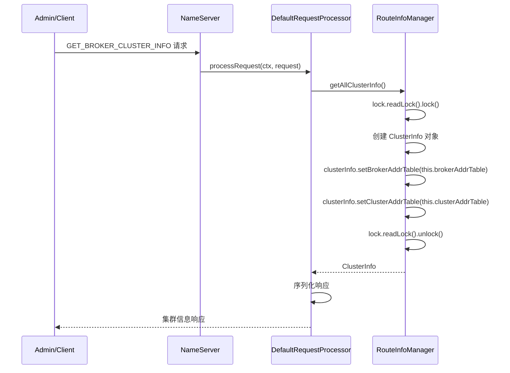
```mermaid
sequenceDiagram
    participant A as Admin/Client
    participant NS as NameServer
    participant DRP as DefaultRequestProcessor
    participant RIM as RouteInfoManager

    A->>NS: GET_BROKER_CLUSTER_INFO 请求
    NS->>DRP: processRequest(ctx, request)
    DRP->>RIM: getAllClusterInfo()

    RIM->>RIM: lock.readLock().lock()
    RIM->>RIM: 创建 ClusterInfo 对象
    RIM->>RIM: clusterInfo.setBrokerAddrTable(this.brokerAddrTable)
    RIM->>RIM: clusterInfo.setClusterAddrTable(this.clusterAddrTable)
    RIM->>RIM: lock.readLock().unlock()

    RIM-->>DRP: ClusterInfo
    DRP->>DRP: 序列化响应
    DRP-->>A: 集群信息响应
```

### 3. Topic 列表查询流程

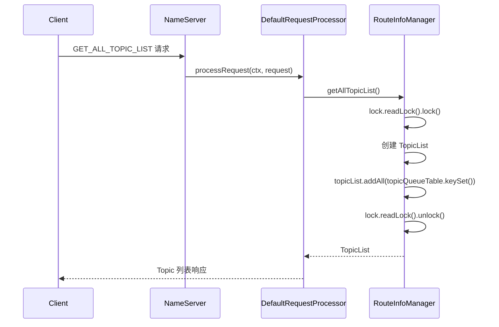
```mermaid
sequenceDiagram
    participant C as Client
    participant NS as NameServer
    participant DRP as DefaultRequestProcessor
    participant RIM as RouteInfoManager

    C->>NS: GET_ALL_TOPIC_LIST 请求
    NS->>DRP: processRequest(ctx, request)
    DRP->>RIM: getAllTopicList()

    RIM->>RIM: lock.readLock().lock()
    RIM->>RIM: 创建 TopicList
    RIM->>RIM: topicList.addAll(topicQueueTable.keySet())
    RIM->>RIM: lock.readLock().unlock()

    RIM-->>DRP: TopicList
    DRP-->>C: Topic 列表响应
```

## 配置管理流程

### 1. KV 配置设置流程

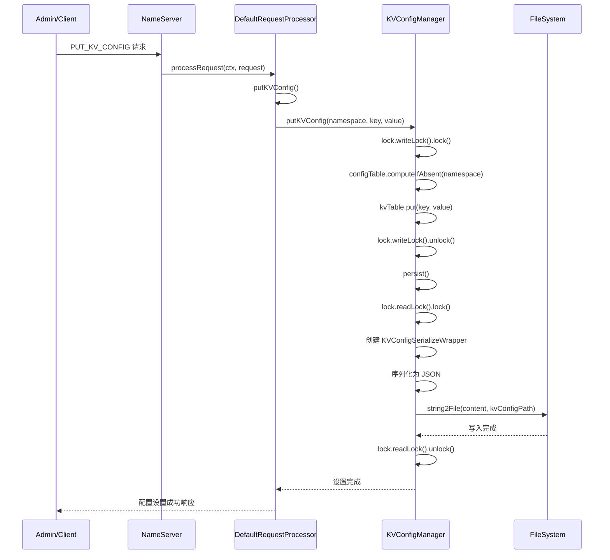
```mermaid
sequenceDiagram
    participant A as Admin/Client
    participant NS as NameServer
    participant DRP as DefaultRequestProcessor
    participant KVM as KVConfigManager
    participant FS as FileSystem

    A->>NS: PUT_KV_CONFIG 请求
    NS->>DRP: processRequest(ctx, request)
    DRP->>DRP: putKVConfig()

    DRP->>KVM: putKVConfig(namespace, key, value)

    KVM->>KVM: lock.writeLock().lock()
    KVM->>KVM: configTable.computeIfAbsent(namespace)
    KVM->>KVM: kvTable.put(key, value)
    KVM->>KVM: lock.writeLock().unlock()

    KVM->>KVM: persist()
    KVM->>KVM: lock.readLock().lock()
    KVM->>KVM: 创建 KVConfigSerializeWrapper
    KVM->>KVM: 序列化为 JSON
    KVM->>FS: string2File(content, kvConfigPath)
    FS-->>KVM: 写入完成
    KVM->>KVM: lock.readLock().unlock()

    KVM-->>DRP: 设置完成
    DRP-->>A: 配置设置成功响应
```

### 2. KV 配置查询流程

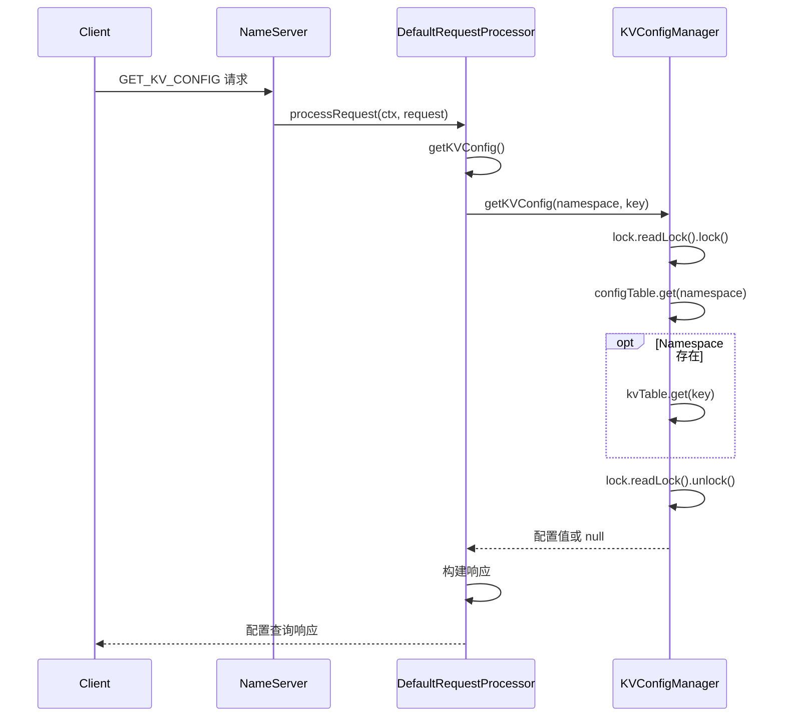
```mermaid
sequenceDiagram
    participant C as Client
    participant NS as NameServer
    participant DRP as DefaultRequestProcessor
    participant KVM as KVConfigManager

    C->>NS: GET_KV_CONFIG 请求
    NS->>DRP: processRequest(ctx, request)
    DRP->>DRP: getKVConfig()

    DRP->>KVM: getKVConfig(namespace, key)

    KVM->>KVM: lock.readLock().lock()
    KVM->>KVM: configTable.get(namespace)
    opt Namespace 存在
        KVM->>KVM: kvTable.get(key)
    end
    KVM->>KVM: lock.readLock().unlock()

    KVM-->>DRP: 配置值或 null
    DRP->>DRP: 构建响应
    DRP-->>C: 配置查询响应
```

### 3. KV 配置删除流程

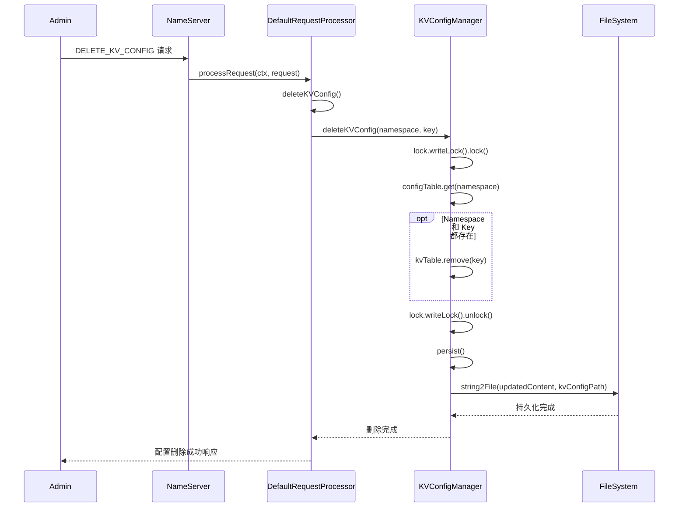
```mermaid
sequenceDiagram
    participant A as Admin
    participant NS as NameServer
    participant DRP as DefaultRequestProcessor
    participant KVM as KVConfigManager
    participant FS as FileSystem

    A->>NS: DELETE_KV_CONFIG 请求
    NS->>DRP: processRequest(ctx, request)
    DRP->>DRP: deleteKVConfig()

    DRP->>KVM: deleteKVConfig(namespace, key)

    KVM->>KVM: lock.writeLock().lock()
    KVM->>KVM: configTable.get(namespace)
    opt Namespace 和 Key 都存在
        KVM->>KVM: kvTable.remove(key)
    end
    KVM->>KVM: lock.writeLock().unlock()

    KVM->>KVM: persist()
    KVM->>FS: string2File(updatedContent, kvConfigPath)
    FS-->>KVM: 持久化完成

    KVM-->>DRP: 删除完成
    DRP-->>A: 配置删除成功响应
```

## 故障检测与恢复流程

### 1. Broker 心跳检测流程

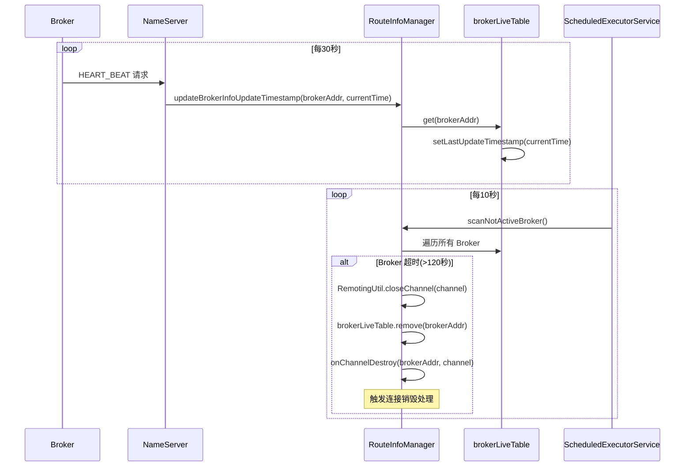
```mermaid
sequenceDiagram
    participant B as Broker
    participant NS as NameServer
    participant RIM as RouteInfoManager
    participant BLT as brokerLiveTable
    participant SE as ScheduledExecutorService

    loop 每30秒
        B->>NS: HEART_BEAT 请求
        NS->>RIM: updateBrokerInfoUpdateTimestamp(brokerAddr, currentTime)
        RIM->>BLT: get(brokerAddr)
        BLT->>BLT: setLastUpdateTimestamp(currentTime)
    end

    loop 每10秒
        SE->>RIM: scanNotActiveBroker()
        RIM->>BLT: 遍历所有 Broker
        alt Broker 超时(>120秒)
            RIM->>RIM: RemotingUtil.closeChannel(channel)
            RIM->>RIM: brokerLiveTable.remove(brokerAddr)
            RIM->>RIM: onChannelDestroy(brokerAddr, channel)
            Note over RIM: 触发连接销毁处理
        end
    end
```

### 2. Broker 连接异常处理流程

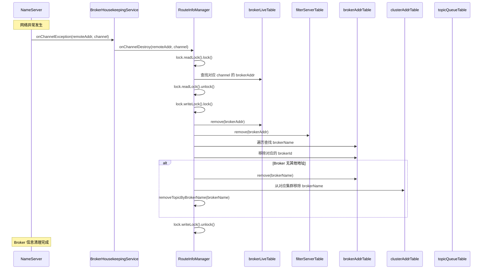
```mermaid
sequenceDiagram
    participant NS as NameServer
    participant BHS as BrokerHousekeepingService
    participant RIM as RouteInfoManager
    participant BLT as brokerLiveTable
    participant FST as filterServerTable
    participant BAT as brokerAddrTable
    participant CAT as clusterAddrTable
    participant TQT as topicQueueTable

    Note over NS: 网络异常发生
    NS->>BHS: onChannelException(remoteAddr, channel)
    BHS->>RIM: onChannelDestroy(remoteAddr, channel)

    RIM->>RIM: lock.readLock().lock()
    RIM->>BLT: 查找对应 channel 的 brokerAddr
    RIM->>RIM: lock.readLock().unlock()

    RIM->>RIM: lock.writeLock().lock()
    RIM->>BLT: remove(brokerAddr)
    RIM->>FST: remove(brokerAddr)

    RIM->>BAT: 遍历查找 brokerName
    RIM->>BAT: 移除对应的 brokerId
    alt Broker 无其他地址
        RIM->>BAT: remove(brokerName)
        RIM->>CAT: 从对应集群移除 brokerName
        RIM->>RIM: removeTopicByBrokerName(brokerName)
    end

    RIM->>RIM: lock.writeLock().unlock()
    Note over NS: Broker 信息清理完成
```

### 3. Topic 清理流程

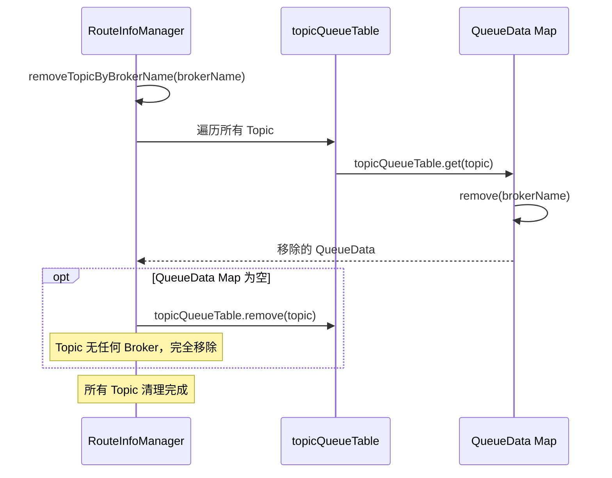
```mermaid
sequenceDiagram
    participant RIM as RouteInfoManager
    participant TQT as topicQueueTable
    participant QDM as QueueData Map

    RIM->>RIM: removeTopicByBrokerName(brokerName)

    RIM->>TQT: 遍历所有 Topic
    TQT->>QDM: topicQueueTable.get(topic)
    QDM->>QDM: remove(brokerName)
    QDM-->>RIM: 移除的 QueueData

    opt QueueData Map 为空
        RIM->>TQT: topicQueueTable.remove(topic)
        Note over RIM: Topic 无任何 Broker，完全移除
    end

    Note over RIM: 所有 Topic 清理完成
```

## 请求处理流程

### 1. 请求处理总流程

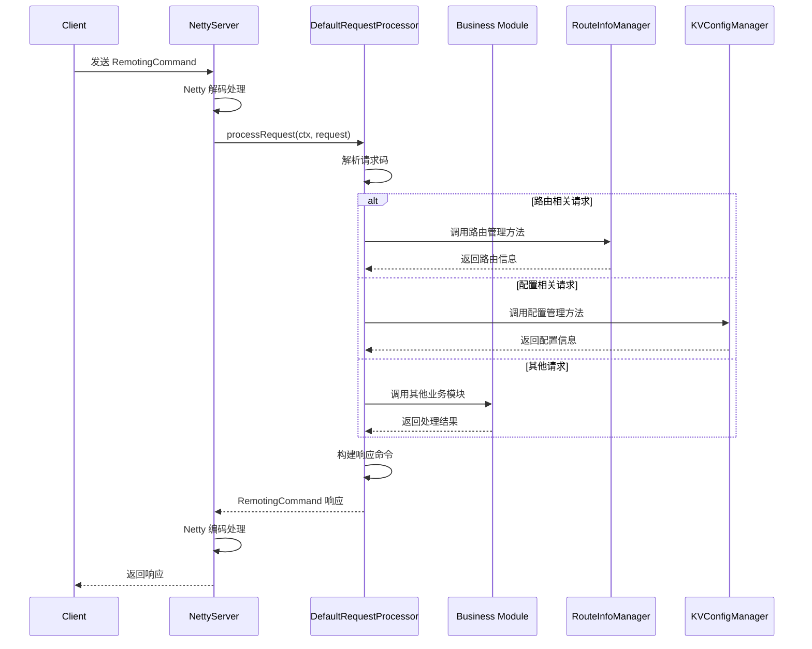
```mermaid
sequenceDiagram
    participant C as Client
    participant NS as NettyServer
    participant DRP as DefaultRequestProcessor
    participant BM as Business Module
    participant RIM as RouteInfoManager
    participant KVM as KVConfigManager

    C->>NS: 发送 RemotingCommand
    NS->>NS: Netty 解码处理
    NS->>DRP: processRequest(ctx, request)

    DRP->>DRP: 解析请求码
    alt 路由相关请求
        DRP->>RIM: 调用路由管理方法
        RIM-->>DRP: 返回路由信息
    else 配置相关请求
        DRP->>KVM: 调用配置管理方法
        KVM-->>DRP: 返回配置信息
    else 其他请求
        DRP->>BM: 调用其他业务模块
        BM-->>DRP: 返回处理结果
    end

    DRP->>DRP: 构建响应命令
    DRP-->>NS: RemotingCommand 响应
    NS->>NS: Netty 编码处理
    NS-->>C: 返回响应
```

### 2. 并发请求处理流程

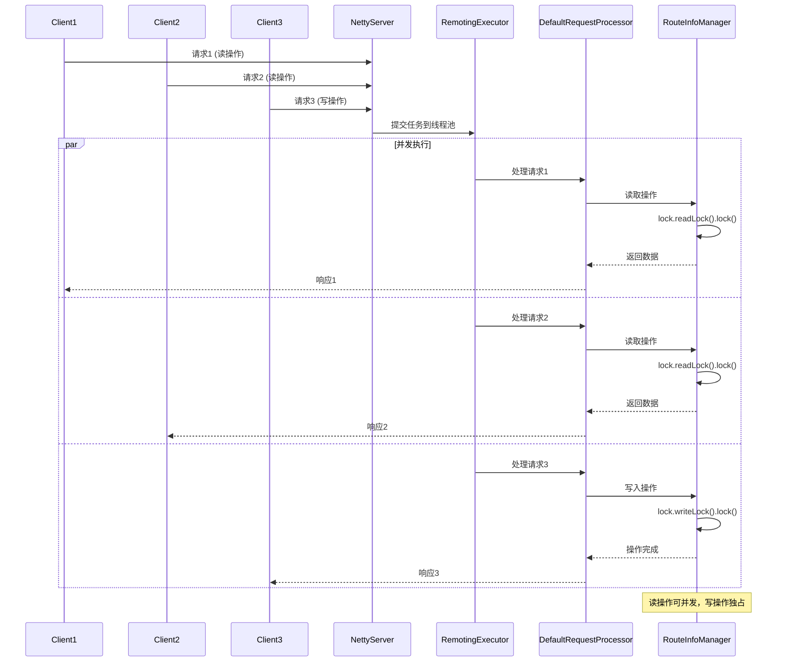
```mermaid
sequenceDiagram
    participant C1 as Client1
    participant C2 as Client2
    participant C3 as Client3
    participant NS as NettyServer
    participant REP as RemotingExecutor
    participant DRP as DefaultRequestProcessor
    participant RIM as RouteInfoManager

    C1->>NS: 请求1 (读操作)
    C2->>NS: 请求2 (读操作)
    C3->>NS: 请求3 (写操作)

    NS->>REP: 提交任务到线程池
    par 并发执行
        REP->>DRP: 处理请求1
        DRP->>RIM: 读取操作
        RIM->>RIM: lock.readLock().lock()
        RIM-->>DRP: 返回数据
        DRP-->>C1: 响应1
    and
        REP->>DRP: 处理请求2
        DRP->>RIM: 读取操作
        RIM->>RIM: lock.readLock().lock()
        RIM-->>DRP: 返回数据
        DRP-->>C2: 响应2
    and
        REP->>DRP: 处理请求3
        DRP->>RIM: 写入操作
        RIM->>RIM: lock.writeLock().lock()
        RIM-->>DRP: 操作完成
        DRP-->>C3: 响应3
    end

    Note over RIM: 读操作可并发，写操作独占
```

## 数据同步流程

### 1. 配置数据持久化流程

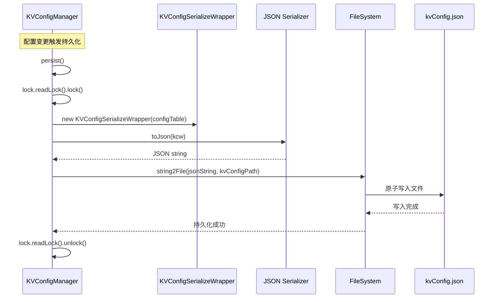
```mermaid
sequenceDiagram
    participant KVM as KVConfigManager
    participant KCW as KVConfigSerializeWrapper
    participant JSON as JSON Serializer
    participant FS as FileSystem
    participant File as kvConfig.json

    Note over KVM: 配置变更触发持久化
    KVM->>KVM: persist()

    KVM->>KVM: lock.readLock().lock()
    KVM->>KCW: new KVConfigSerializeWrapper(configTable)
    KVM->>JSON: toJson(kcw)
    JSON-->>KVM: JSON string

    KVM->>FS: string2File(jsonString, kvConfigPath)
    FS->>File: 原子写入文件
    File-->>FS: 写入完成
    FS-->>KVM: 持久化成功

    KVM->>KVM: lock.readLock().unlock()
```

### 2. 配置数据加载流程

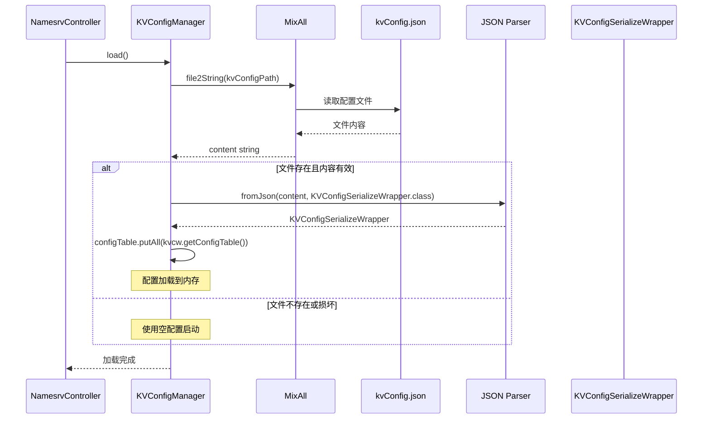
```mermaid
sequenceDiagram
    participant NC as NamesrvController
    participant KVM as KVConfigManager
    participant MA as MixAll
    participant File as kvConfig.json
    participant JSON as JSON Parser
    participant KCW as KVConfigSerializeWrapper

    NC->>KVM: load()
    KVM->>MA: file2String(kvConfigPath)
    MA->>File: 读取配置文件
    File-->>MA: 文件内容
    MA-->>KVM: content string

    alt 文件存在且内容有效
        KVM->>JSON: fromJson(content, KVConfigSerializeWrapper.class)
        JSON-->>KVM: KVConfigSerializeWrapper
        KVM->>KVM: configTable.putAll(kvcw.getConfigTable())
        Note over KVM: 配置加载到内存
    else 文件不存在或损坏
        Note over KVM: 使用空配置启动
    end

    KVM-->>NC: 加载完成
```

## 性能优化流程

### 1. 批量路由信息处理流程

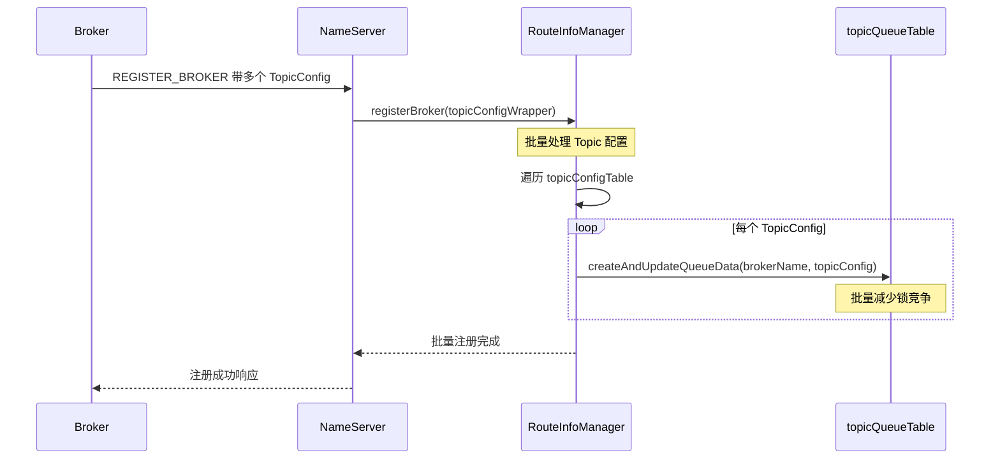
```mermaid
sequenceDiagram
    participant B as Broker
    participant NS as NameServer
    participant RIM as RouteInfoManager
    participant TQT as topicQueueTable

    B->>NS: REGISTER_BROKER 带多个 TopicConfig
    NS->>RIM: registerBroker(topicConfigWrapper)

    Note over RIM: 批量处理 Topic 配置
    RIM->>RIM: 遍历 topicConfigTable
    loop 每个 TopicConfig
        RIM->>TQT: createAndUpdateQueueData(brokerName, topicConfig)
        Note over TQT: 批量减少锁竞争
    end

    RIM-->>NS: 批量注册完成
    NS-->>B: 注册成功响应
```

### 2. 定时任务优化流程

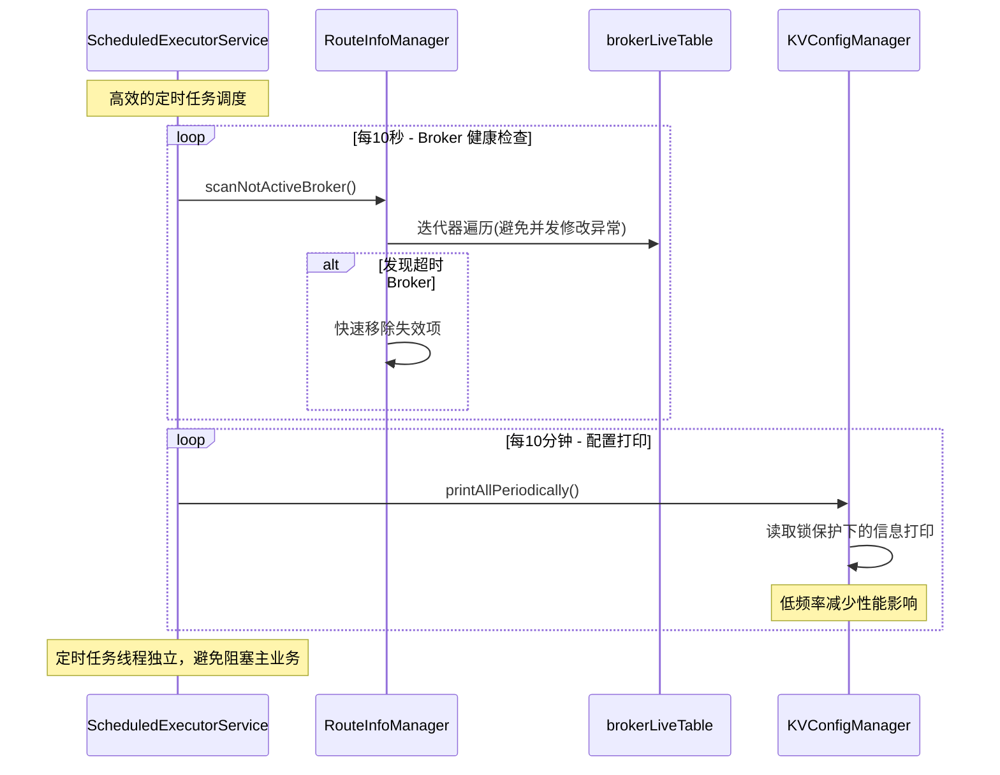
```mermaid
sequenceDiagram
    participant SE as ScheduledExecutorService
    participant RIM as RouteInfoManager
    participant BLT as brokerLiveTable
    participant KVM as KVConfigManager

    Note over SE: 高效的定时任务调度
    loop 每10秒 - Broker 健康检查
        SE->>RIM: scanNotActiveBroker()
        RIM->>BLT: 迭代器遍历(避免并发修改异常)
        alt 发现超时 Broker
            RIM->>RIM: 快速移除失效项
        end
    end

    loop 每10分钟 - 配置打印
        SE->>KVM: printAllPeriodically()
        KVM->>KVM: 读取锁保护下的信息打印
        Note over KVM: 低频率减少性能影响
    end

    Note over SE: 定时任务线程独立，避免阻塞主业务
```

### 3. 内存使用优化流程

```mermaid
sequenceDiagram
    participant RIM as RouteInfoManager
    participant TQT as topicQueueTable
    participant BAT as brokerAddrTable
    participant CAT as clusterAddrTable
    participant BLT as brokerLiveTable

    Note over RIM: 内存优化的数据结构设计
    RIM->>TQT: new HashMap<>(1024)    -- 预分配容量
    RIM->>BAT: new HashMap<>(128)     -- 合理初始大小
    RIM->>CAT: new HashMap<>(32)      -- 集群数量相对较少
    RIM->>BLT: new HashMap<>(256)     -- Broker 地址容量

    Note over RIM: 运行时内存管理
    loop 定期清理
        RIM->>RIM: 扫描空集合
        RIM->>RIM: 移除无效引用
        Note over RIM: 减少内存碎片
    end
```

## 异常处理流程

### 1. 网络异常处理流程

```mermaid
sequenceDiagram
    participant C as Client
    participant NS as NettyServer
    participant DRP as DefaultRequestProcessor
    participant EH as ExceptionHandler
    participant LOG as Logger

    C->>NS: 发送请求
    NS->>DRP: processRequest()

    alt 业务异常
        DRP->>DRP: 业务逻辑异常
        DRP->>EH: handleBusinessException()
        EH->>LOG: error("Business exception", e)
        DRP->>DRP: 构建错误响应
        DRP-->>C: 错误响应
    else 网络异常
        NS->>EH: handleNetworkException()
        EH->>LOG: error("Network exception", e)
        NS-->>C: 连接关闭
    else 解码异常
        NS->>EH: handleDecodeException()
        EH->>LOG: error("Decode exception", e)
        NS-->>C: 协议错误响应
    end
```

### 2. 数据一致性异常处理

```mermaid
sequenceDiagram
    participant RIM as RouteInfoManager
    participant BLT as brokerLiveTable
    participant BAT as brokerAddrTable
    participant Monitor as ConsistencyMonitor

    RIM->>RIM: 执行数据更新操作
    alt 检测到数据不一致
        RIM->>Monitor: reportInconsistency()
        Monitor->>MONITOR: 记录不一致指标
        RIM->>RIM: 数据修复逻辑
        RIM->>BLT: 验证 brokerLiveTable
        RIM->>BAT: 验证 brokerAddrTable
        Note over RIM: 自动修复或告警
    end
```

## 总结

通过以上流程分析，我们可以看到 RocketMQ NameServer 采用了精巧的设计来保证系统的稳定性和高性能：

### 关键设计特点

1. **分层清晰**：请求处理、业务逻辑、数据管理分层明确
2. **并发控制**：合理使用读写锁，保证数据一致性和并发性能
3. **故障恢复**：完善的故障检测和自动恢复机制
4. **性能优化**：内存优先设计，定时任务优化，批量处理优化

### 流程优化策略

1. **快速失败**：异常情况快速返回，避免资源浪费
2. **异步处理**：网络 I/O 和业务处理异步执行
3. **批量操作**：减少锁竞争，提高处理效率
4. **定期维护**：定时清理无效数据，保持系统健康

这些流程设计使得 NameServer 能够作为高可靠、高性能的服务注册中心，为整个 RocketMQ 集群提供稳定的服务发现和路由管理功能。