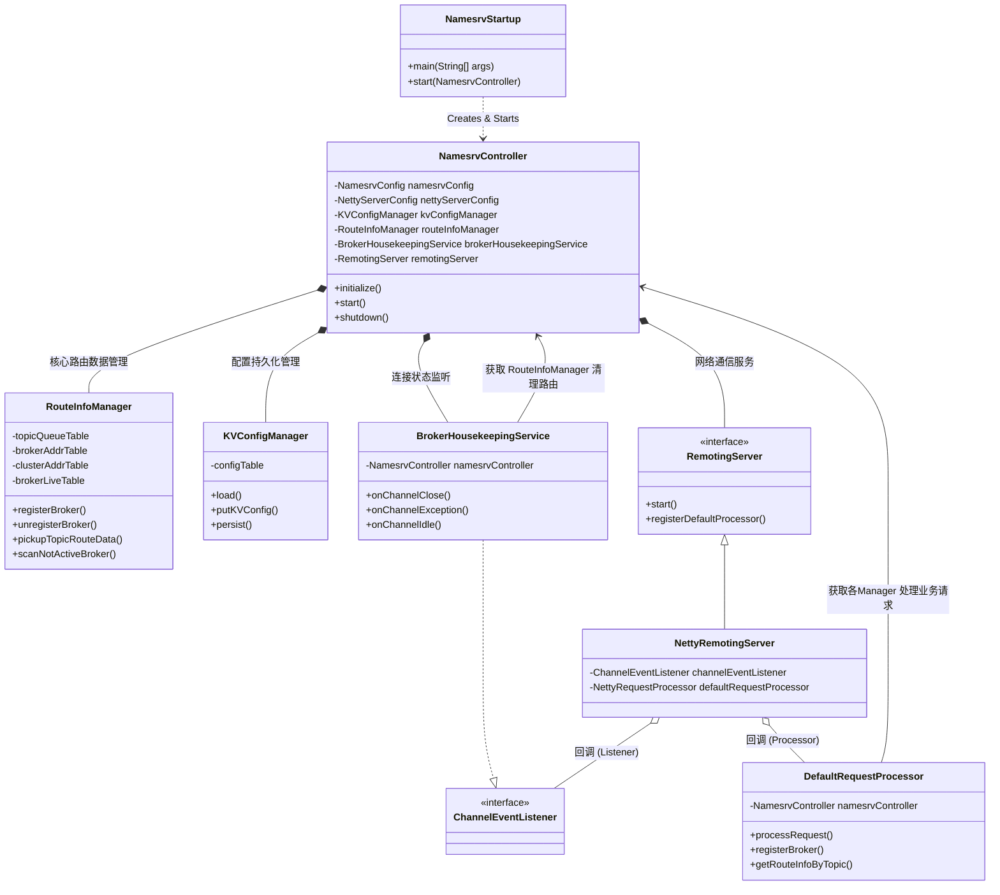
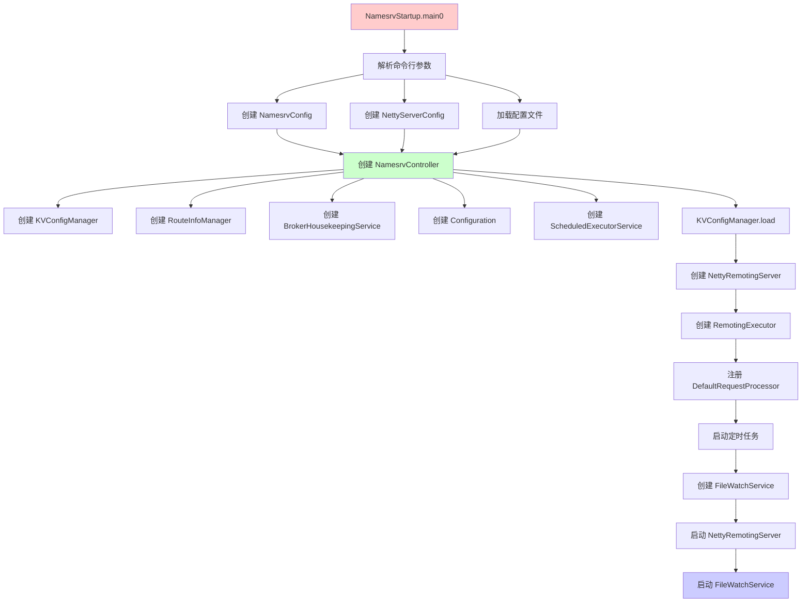
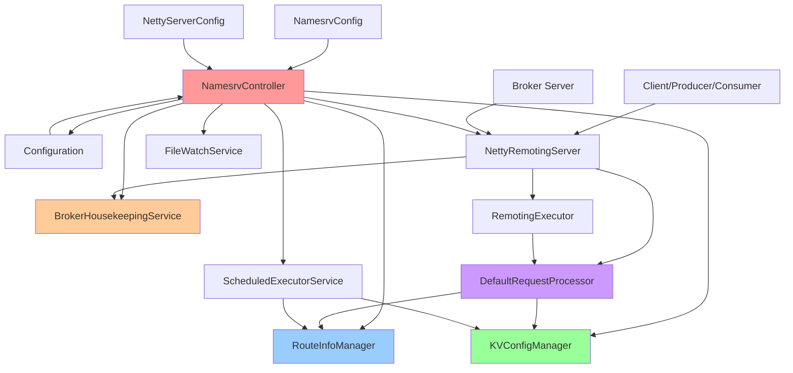
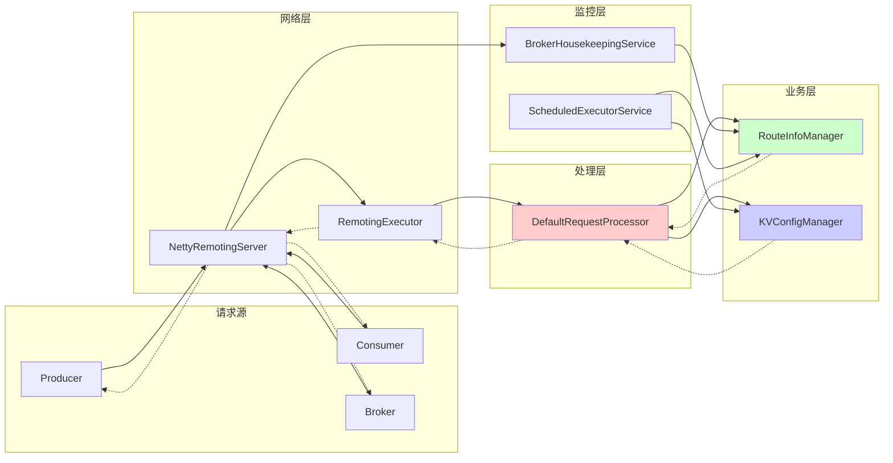
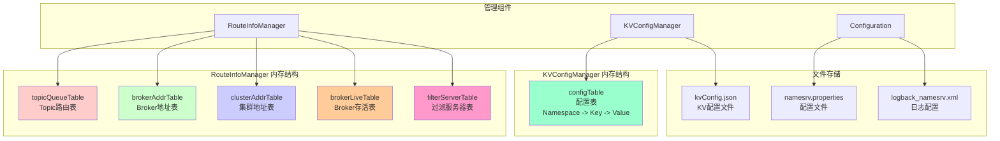
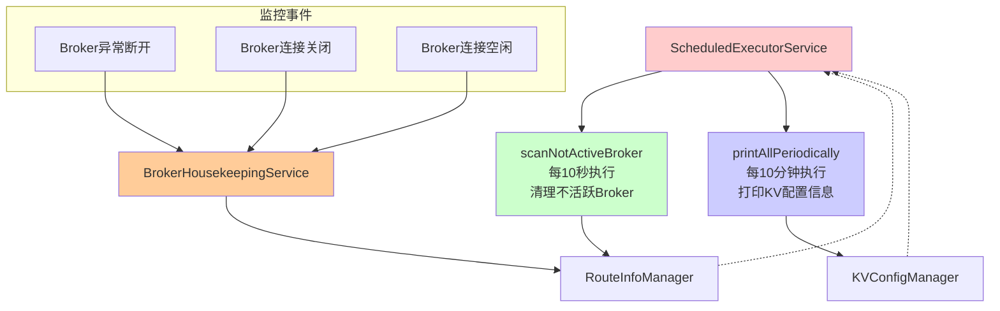

# RocketMQ NameServer 核心架构

RocketMQ NameServer 的核心架构是围绕 `NamesrvController` 构建的，它作为中央控制器管理着各个组件的生命周期。

## 依赖关系图

## 核心组件说明

1.  **`NamesrvController`**: 核心控制器。负责初始化、启动和关闭 NameServer。它持有所有核心组件的引用，充当“上下文”对象。
2.  **`RouteInfoManager`**: **最核心的组件**。管理所有的路由信息（Topic 路由、Broker 列表、集群信息、活跃 Broker 状态）。它纯内存存储，不持久化。
3.  **`BrokerHousekeepingService`**: 负责“打扫卫生”。实现了 `ChannelEventListener` 接口，监听 Broker 的连接状态（关闭、异常、空闲）。一旦连接断开，它会通过 Controller 调用 `RouteInfoManager` 清理该 Broker 的路由信息。
4.  **`DefaultRequestProcessor`**: 业务请求处理器。处理来自 Broker（注册、心跳）和 Producer/Consumer（获取路由信息）的请求。它依赖 Controller 来获取 `RouteInfoManager` 进行读写操作。
5.  **`KVConfigManager`**: 负责一些通用 KV 配置的增删改查和持久化（如顺序消息配置）。
6.  **`RemotingServer` (NettyRemotingServer)**: 基于 Netty 的网络通信层。它将网络事件通知给 `BrokerHousekeepingService`，将网络请求转发给 `DefaultRequestProcessor`。

## 组件初始化顺序和依赖关系

### 启动流程依赖图

### 整体架构依赖图

### 运行时调用关系图

### 数据存储依赖图

### 定时任务依赖图

### 核心依赖层级总结

1. **配置层**: `NamesrvConfig`, `NettyServerConfig`
2. **控制层**: `NamesrvController` (中央协调器)
3. **管理层**: `RouteInfoManager`, `KVConfigManager`, `BrokerHousekeepingService`
4. **网络层**: `NettyRemotingServer`, `RemotingExecutor`
5. **处理层**: `DefaultRequestProcessor`
6. **调度层**: `ScheduledExecutorService`

### 关键依赖特点

- **中心化设计**: `NamesrvController` 作为依赖注入的核心容器
- **分层架构**: 清晰的分层依赖关系，避免循环依赖
- **事件驱动**: 通过接口实现松耦合的事件处理机制
- **异步处理**: 网络请求和定时任务异步执行

### 数据流向

- **请求流**: Client → Netty → DefaultRequestProcessor → Manager Components
- **响应流**: Manager Components → DefaultRequestProcessor → Netty → Client
- **监控流**: Netty → BrokerHousekeepingService → RouteInfoManager

