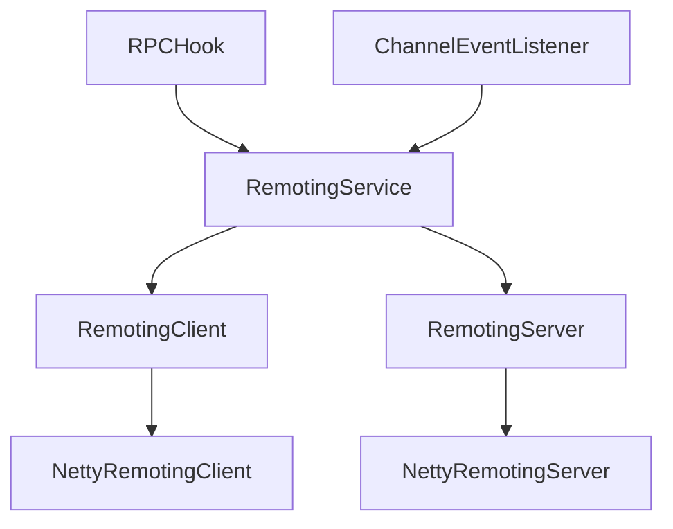
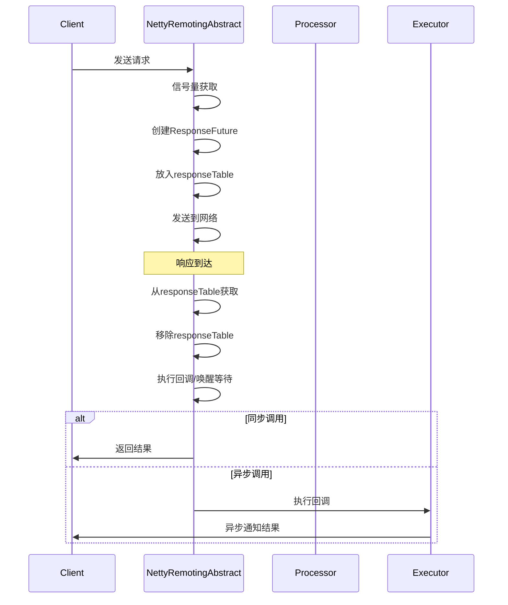

# RocketMQ Remoting 模块架构分析

## 概述

RocketMQ Remoting 模块是整个消息队列系统的远程通信核心，基于 Netty 框架构建，提供了高性能、异步的远程调用能力。该模块采用了清晰的分层架构设计，实现了客户端和服务端的通信抽象。

## 目录结构

```
remoting/
├── src/main/java/org/apache/rocketmq/remoting/
│   ├── annotation/                    # 自定义注解
│   │   ├── CFNotNull.java            # 非空校验注解
│   │   └── CFNullable.java           # 可空注解
│   ├── common/                        # 通用工具类
│   │   ├── Pair.java                 # 键值对工具类
│   │   ├── RemotingHelper.java       # Remoting辅助工具
│   │   ├── RemotingUtil.java         # Remoting工具类
│   │   ├── ServiceThread.java        # 服务线程基类
│   │   └── TlsMode.java             # TLS模式枚举
│   ├── exception/                     # 异常类
│   │   ├── RemotingCommandException.java
│   │   ├── RemotingConnectException.java
│   │   ├── RemotingException.java     # 基础异常
│   │   ├── RemotingSendRequestException.java
│   │   ├── RemotingTimeoutException.java
│   │   └── RemotingTooMuchRequestException.java
│   ├── netty/                         # Netty实现层
│   │   ├── AsyncNettyRequestProcessor.java    # 异步请求处理器
│   │   ├── FileRegionEncoder.java            # 文件区域编码器
│   │   ├── NettyClientConfig.java            # 客户端配置
│   │   ├── NettyDecoder.java                 # Netty解码器
│   │   ├── NettyEncoder.java                 # Netty编码器
│   │   ├── NettyEvent.java                   # Netty事件
│   │   ├── NettyEventType.java               # 事件类型枚举
│   │   ├── NettyLogger.java                  # Netty日志
│   │   ├── NettyRemotingAbstract.java        # 抽象基类
│   │   ├── NettyRemotingClient.java          # Netty客户端实现
│   │   ├── NettyRemotingServer.java          # Netty服务端实现
│   │   ├── NettyRequestProcessor.java        # Netty请求处理器
│   │   ├── NettyServerConfig.java            # 服务端配置
│   │   ├── ResponseFuture.java               # 响应Future
│   │   └── TlsHelper.java                    # TLS助手
│   ├── protocol/                      # 协议层
│   │   ├── RemotingCommand.java              # 核心命令类
│   │   ├── RemotingCommandType.java         # 命令类型枚举
│   │   ├── RemotingSerializable.java        # 序列化接口
│   │   ├── SerializeType.java               # 序列化类型枚举
│   │   └── RocketMQSerializable.java        # RocketMQ序列化实现
│   ├── ChannelEventListener.java          # 通道事件监听器
│   ├── CommandCustomHeader.java          # 命令自定义头
│   ├── InvokeCallback.java               # 调用回调接口
│   ├── RemotingClient.java               # 客户端接口
│   ├── RemotingServer.java               # 服务端接口
│   ├── RemotingService.java              # 服务基础接口
│   └── RPCHook.java                      # RPC钩子接口
└── src/test/java/                       # 测试代码
```

## 架构设计

### 1. 整体架构思想

RocketMQ Remoting 模块采用了经典的**分层架构**和**面向接口编程**的设计思想：

- **职责分离**：每一层只负责自己的职责，层与层之间通过接口通信
- **可扩展性**：通过接口抽象，支持不同的实现方式
- **高性能**：基于异步非阻塞的 Netty 框架
- **容错性**：完善的异常处理和容错机制

### 2. 分层架构详解

#### 2.1 接口抽象层 (Interface Layer)



##### 2.1.1 RemotingService - 基础服务接口

```java
public interface RemotingService {
    void start();                    // 启动服务
    void shutdown();                 // 关闭服务
    void registerRPCHook(RPCHook);  // 注册RPC钩子
}
```

**设计思想**：
- 最基础的抽象，只定义生命周期管理
- 钩子机制支持AOP横切关注点（监控、日志、追踪）

##### 2.1.2 RemotingClient - 客户端接口

```java
public interface RemotingClient extends RemotingService {
    // 三种调用模式
    RemotingCommand invokeSync(...);      // 同步调用
    void invokeAsync(...);                // 异步调用
    void invokeOneway(...);               // 单向调用

    // NameServer管理
    void updateNameServerAddressList(...);

    // 处理器注册
    void registerProcessor(requestCode, processor, executor);
}
```

**核心设计理念**：
1. **多种调用模式**：满足不同场景需求
   - `invokeSync`：等待结果，适用于需要立即响应的场景
   - `invokeAsync`：异步回调，适用于高并发场景
   - `invokeOneway`：单向发送，适用于通知类场景

2. **NameServer 地址管理**：动态更新服务发现
3. **处理器注册**：支持自定义请求处理逻辑

##### 2.1.3 RemotingServer - 服务端接口

```java
public interface RemotingServer extends RemotingService {
    // 处理器管理
    void registerProcessor(requestCode, processor, executor);
    void registerDefaultProcessor(processor, executor);  // 默认处理器
    Pair<NettyRequestProcessor, ExecutorService> getProcessorPair(requestCode);

    // 基于Channel的调用
    RemotingCommand invokeSync(Channel channel, ...);
    void invokeAsync(Channel channel, ...);
    void invokeOneway(Channel channel, ...);
}
```

**服务端特有功能**：
- **默认处理器**：处理未注册的请求类型
- **处理器映射**：requestCode -> (processor + executor)
- **直接Channel调用**：服务端主动调用客户端

#### 2.2 协议抽象层 (Protocol Layer)

##### 2.2.1 RemotingCommand - 核心命令类

`RemotingCommand` 是整个 Remoting 模块的核心数据结构：

```java
public class RemotingCommand {
    // 核心字段
    private int code;                    // 请求/响应码
    private LanguageCode language;       // 语言标识
    private int version = 0;             // 版本号
    private int opaque = requestId.getAndIncrement(); // 请求ID
    private int flag = 0;                // 标记位(RPC类型/单向)
    private String remark;               // 备注信息
    private HashMap<String, String> extFields;  // 扩展字段
    private transient CommandCustomHeader customHeader; // 自定义头
    private transient byte[] body;       // 消息体

    // 序列化相关
    private SerializeType serializeTypeCurrentRPC;
}
```

**设计亮点**：

1. **请求ID生成**：使用 `AtomicInteger` 保证唯一性
2. **语言无关**：`LanguageCode` 支持多语言客户端
3. **扩展性**：
   - `extFields`：通用的键值对扩展
   - `customHeader`：类型安全的自定义扩展头
4. **序列化灵活性**：支持多种序列化方式

##### 2.2.2 多序列化策略支持

```java
public enum SerializeType {
    JSON((byte) 0),      // JSON格式，可读性好，调试方便
    ROCKETMQ((byte) 1);  // 自定义二进制，性能更高
}
```

**策略模式的应用**：
- 通过枚举定义不同的序列化策略
- 支持运行时切换序列化方式
- 配置驱动：可通过系统属性或环境变量配置

#### 2.3 Netty 实现抽象层

##### 2.3.1 NettyRemotingAbstract 核心设计

`NettyRemotingAbstract` 是整个 Netty 实现的核心抽象类：

```java
public abstract class NettyRemotingAbstract {
    // 1. 限流保护
    protected final Semaphore semaphoreOneway;    // 单向请求信号量
    protected final Semaphore semaphoreAsync;     // 异步请求信号量

    // 2. 响应管理
    protected final ConcurrentMap<Integer, ResponseFuture> responseTable;

    // 3. 处理器路由
    protected final HashMap<Integer, Pair<NettyRequestProcessor, ExecutorService>> processorTable;

    // 4. 默认处理器
    protected Pair<NettyRequestProcessor, ExecutorService> defaultRequestProcessor;

    // 5. 事件执行器
    protected final NettyEventExecutor nettyEventExecutor;
}
```

**设计亮点**：

1. **流量控制**：通过信号量限制并发请求数，防止内存溢出
2. **异步响应管理**：`responseTable` 管理 pending 的异步请求
3. **处理器路由**：`requestCode` -> `(processor + executor)` 的映射
4. **事件隔离**：独立的 NettyEventExecutor 处理连接事件

##### 2.3.2 ResponseFuture 异步响应机制

```java
public class ResponseFuture {
    private final int opaque;                      // 请求ID
    private final Channel processChannel;          // 通信通道
    private final long timeoutMillis;              // 超时时间
    private final InvokeCallback invokeCallback;   // 回调函数
    private final CountDownLatch countDownLatch;   // 同步等待器
    private final SemaphoreReleaseOnlyOnce once;   // 信号量控制
    private final AtomicBoolean executeCallbackOnlyOnce; // 防重复执行

    private volatile RemotingCommand responseCommand; // 响应命令
    private volatile boolean sendRequestOK = true;    // 发送状态
    private volatile Throwable cause;                 // 异常信息
}
```

**ResponseFuture 设计精髓**：

1. **异步转同步**：`CountDownLatch` 支持同步等待
2. **回调机制**：`InvokeCallback` 支持异步处理
3. **超时控制**：记录开始时间，支持超时检测
4. **资源管理**：`SemaphoreReleaseOnlyOnce` 确保信号量只释放一次
5. **幂等性**：`AtomicBoolean` 保证回调只执行一次

##### 2.3.3 请求处理流程模板

`NettyRemotingAbstract` 定义了通用的请求处理流程：



#### 2.4 Netty 具体实现层

##### 2.4.1 NettyRemotingClient - 客户端实现

```java
public class NettyRemotingClient extends NettyRemotingAbstract implements RemotingClient {
    // 核心组件
    private final NettyClientConfig nettyClientConfig;
    private final Bootstrap bootstrap = new Bootstrap();
    private final EventLoopGroup eventLoopGroupWorker;
    private final Lock lockChannelTables = new ReentrantLock();

    // 连接管理
    private final ConcurrentMap<String, ChannelWrapper> channelTables = new ConcurrentHashMap<>();
    private final Timer timer = new Timer("ClientHousekeepingService", true);

    // NameServer管理
    private volatile List<String> nameServerAddressList = new ArrayList<>();
    private final AtomicReference<String> namesrvAddrChoosed = new AtomicReference<>();
}
```

**客户端设计亮点**：

1. **连接池管理**：`channelTables` 缓存到不同地址的连接
2. **NameServer 轮询**：支持多 NameServer 地址的负载均衡
3. **自动重连**：Timer 定时检查和恢复连接
4. **线程安全**：各种锁机制保证并发安全

##### 2.4.2 Pipeline 设计

客户端的 Netty Pipeline 设计体现了**职责链模式**：

```java
bootstrap.handler(new ChannelInitializer<SocketChannel>() {
    @Override
    public void initChannel(SocketChannel ch) {
        ChannelPipeline pipeline = ch.pipeline();

        // 空闲检测
        pipeline.addLast(IdleStateHandler(0, 0, nettyClientConfig.getClientChannelMaxIdleTimeSeconds()));

        // 编解码器
        pipeline.addLast(new NettyEncoder());
        pipeline.addLast(new NettyDecoder());

        // 心跳和连接管理
        pipeline.addLast(new NettyClientConnectManageHandler());

        // 业务处理
        pipeline.addLast(new NettyClientHandler());
    }
});
```

**Pipeline 各层职责**：

1. **IdleStateHandler**：空闲检测，触发心跳
2. **NettyEncoder/Decoder**：协议编解码
3. **NettyClientConnectManageHandler**：连接事件管理
4. **NettyClientHandler**：业务逻辑处理

### 3. 核心设计模式

#### 3.1 模板方法模式

- **NettyRemotingAbstract** 定义通用处理流程
- 子类实现具体的网络通信逻辑
- 保证了代码复用性和一致性

#### 3.2 策略模式

- **SerializeType** 支持多种序列化策略
- 运行时可切换，扩展性好
- 符合开闭原则

#### 3.3 工厂方法模式

- **RemotingCommand** 的创建方法
- 类型安全的对象创建
- 统一的创建入口

#### 3.4 观察者模式

- **RPCHook** 钩子机制
- **ChannelEventListener** 事件监听
- 支持横切关注点的处理

#### 3.5 责任链模式

- Netty Pipeline 的处理器链
- 职责清晰，易于扩展
- 职责单一原则

### 4. 高性能设计

#### 4.1 异步非阻塞

- 基于 Netty 的事件驱动
- 全异步处理，提高吞吐量
- 避免线程阻塞

#### 4.2 资源管理

- 信号量限流保护
- 对象池复用
- 零拷贝技术（FileRegionEncoder）

#### 4.3 线程模型

- I/O 线程和业务线程分离
- 线程池隔离，避免阻塞
- 合理的线程池配置

### 5. 容错设计

#### 5.1 连接管理

- 自动重连机制
- 连接池管理
- 心跳检测

#### 5.2 超时控制

- 请求超时机制
- 异步响应超时
- 超时重试

#### 5.3 流量控制

- 信号量限流
- 防止内存溢出
- 优雅降级

### 6. 架构优势

1. **高内聚低耦合**：清晰的模块边界，易于维护
2. **高扩展性**：支持自定义处理器、序列化方式
3. **高性能**：基于 Netty 的异步非阻塞设计
4. **高可靠性**：完善的容错和恢复机制
5. **易用性**：简洁的 API 接口，支持多种调用方式

### 7. 总结

RocketMQ Remoting 模块是一个设计精良、高性能的远程通信框架。它采用清晰的分层架构，基于 Netty 构建，提供了同步、异步和单向三种通信方式。模块具有良好的扩展性和容错能力，能够满足大规模分布式系统的通信需求。

通过合理的抽象设计，它既保持了简洁的接口，又提供了足够的灵活性和性能优化空间。这个模块的设计充分体现了现代分布式系统中远程通信的最佳实践，是 RocketMQ 能够支撑高并发、低延迟消息传递的重要基础。