# RocketMQ Remoting 架构图

## 概述

本文档包含 RocketMQ Remoting 模块的详细架构图和设计图，帮助理解其整体结构和组件关系。

## 1. 整体架构图

### 1.1 分层架构图

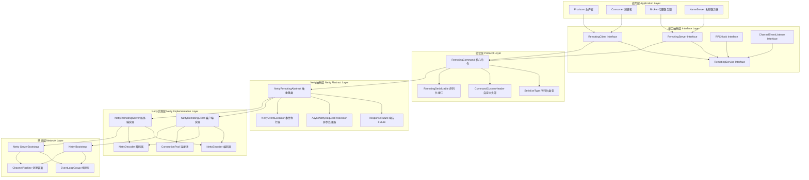

### 1.2 组件关系图

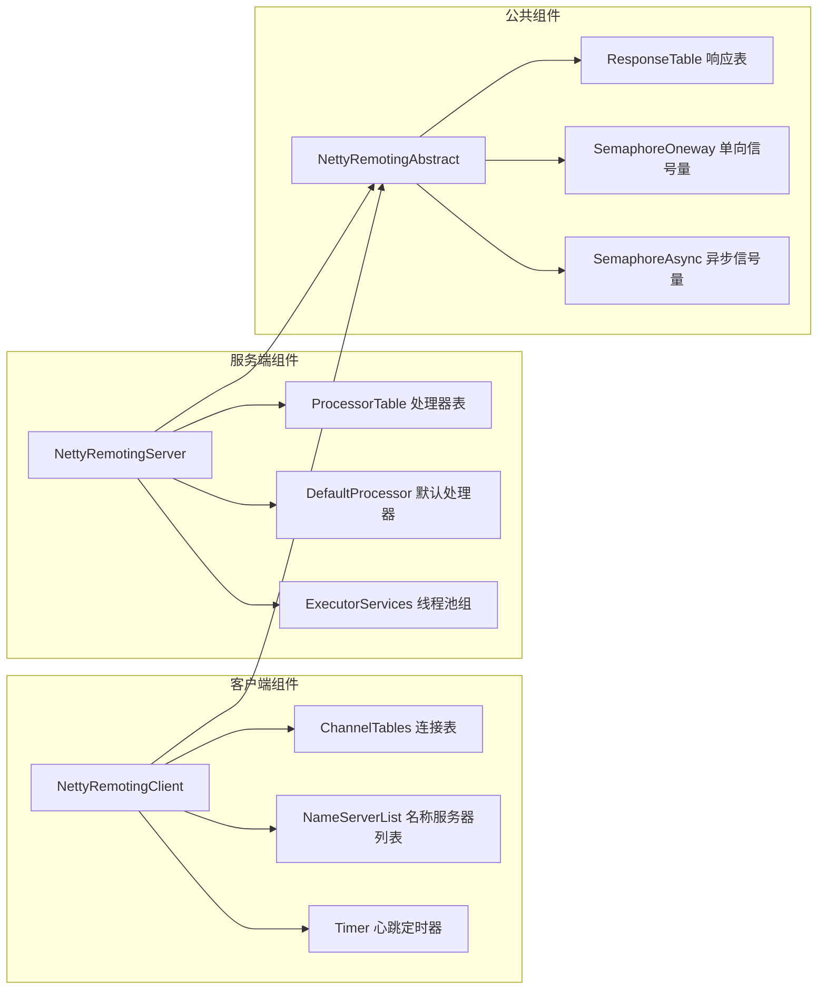

## 2. 调用流程图

### 2.1 同步调用流程

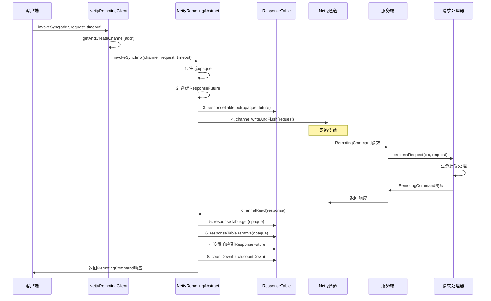

### 2.2 异步调用流程

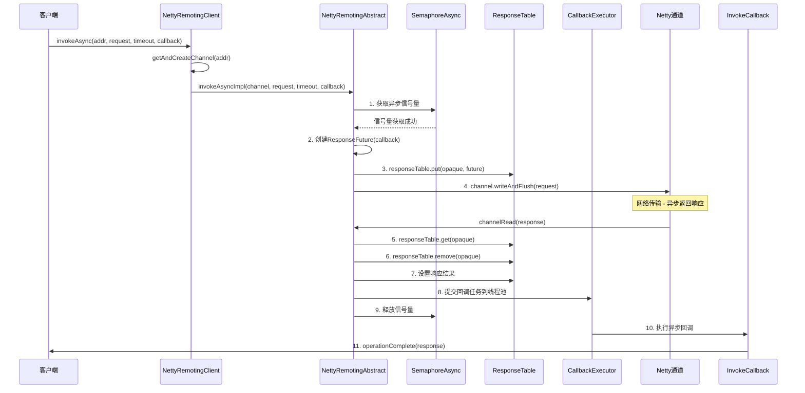

### 2.3 服务端请求处理流程

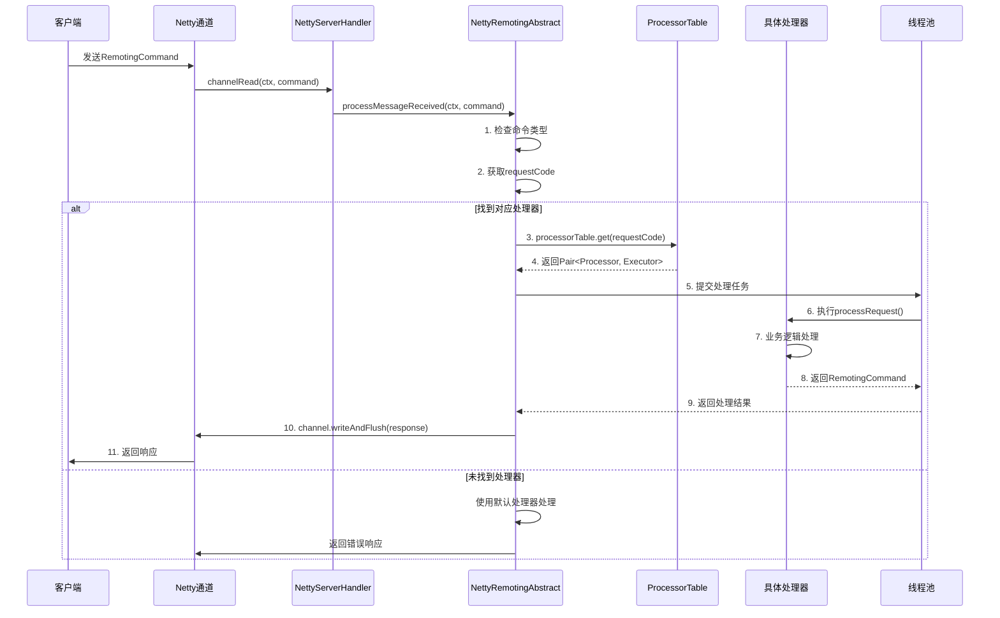

## 3. 数据结构图

### 3.1 RemotingCommand 结构

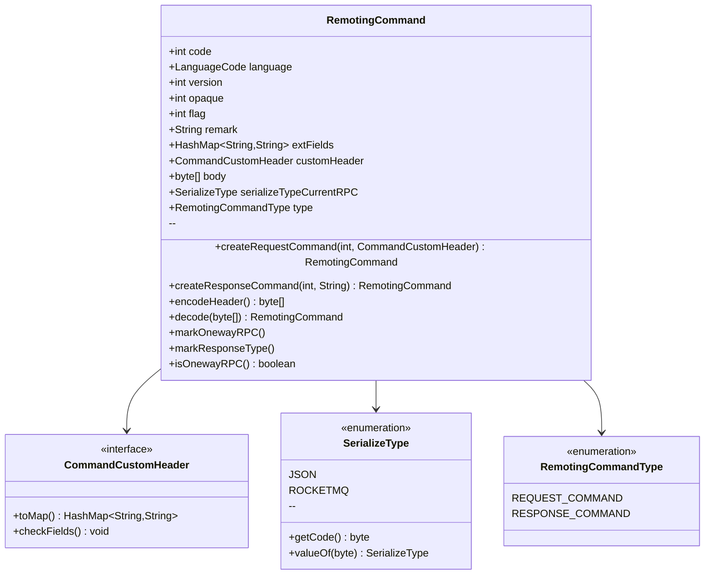

### 3.2 ResponseFuture 结构

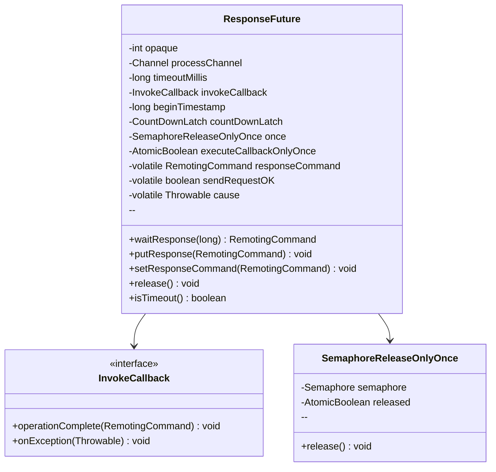

### 3.3 处理器映射结构

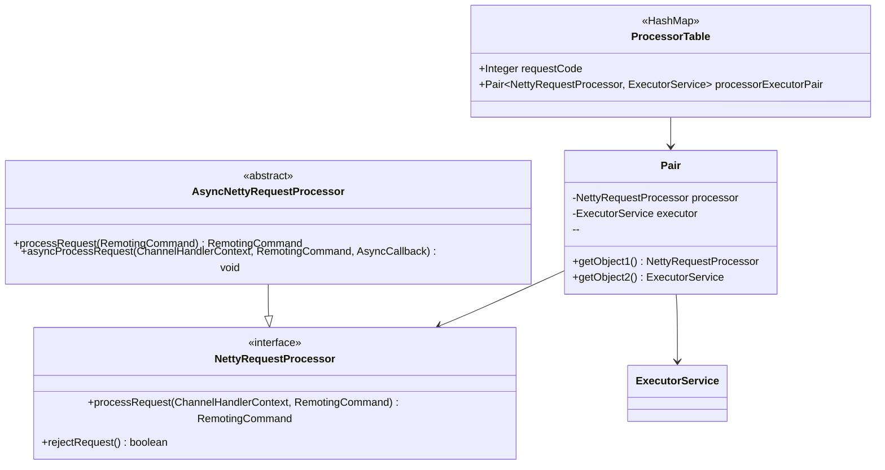

## 4. Netty Pipeline 图

### 4.1 客户端 Pipeline

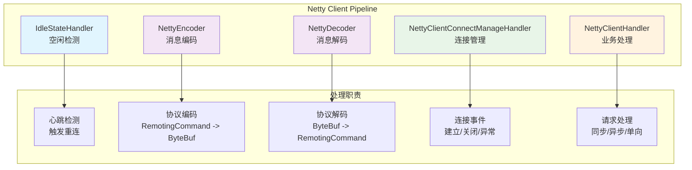

### 4.2 服务端 Pipeline

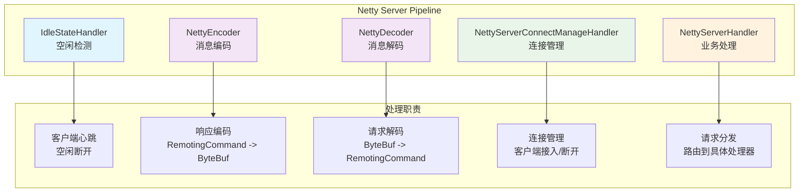

## 5. 性能优化架构图

### 5.1 连接池管理

```mermaid
graph TB
    subgraph "连接池架构"
        CP[ChannelTables<br/>连接表]
        LM[LockChannelTables<br/>连接表锁]
        HT[HousekeepingService<br/>心跳维护]
        CR[ConnectionReaper<br/>连接清理]
    end

    subgraph "连接生命周期"
        LC[连接创建<br/>createChannel()]
        KV[连接验证<br/>validateChannel()]
        MA[连接维护<br/>maintainConnection()]
        CL[连接清理<br/>closeChannel()]
    end

    subgraph "连接状态"
        ACT[活跃连接]
        IDL[空闲连接]
        EXP[过期连接]
        ERR[错误连接]
    end

    CP --> LC
    LC --> KV
    KV --> MA
    MA --> CL

    HT --> MA
    CR --> CL

    MA --> ACT
    MA --> IDL
    CL --> EXP
    CL --> ERR
```

### 5.2 内存管理架构

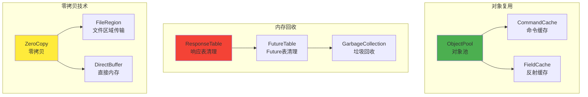

## 6. 异常处理架构图

### 6.1 异常分类和处理

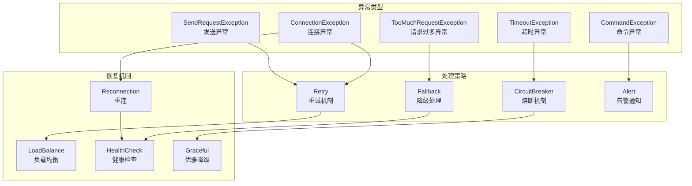

## 7. 线程模型架构图

### 7.1 客户端线程模型

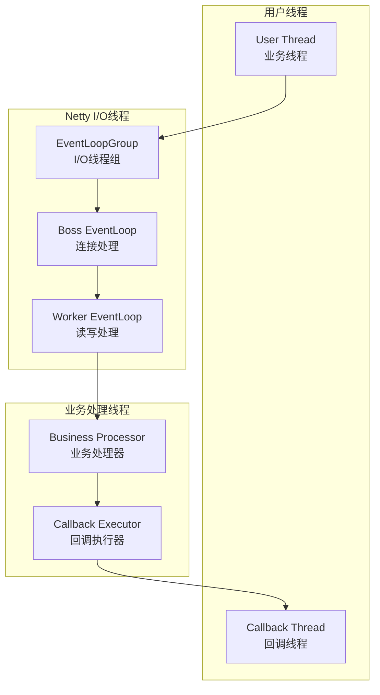

### 7.2 服务端线程模型

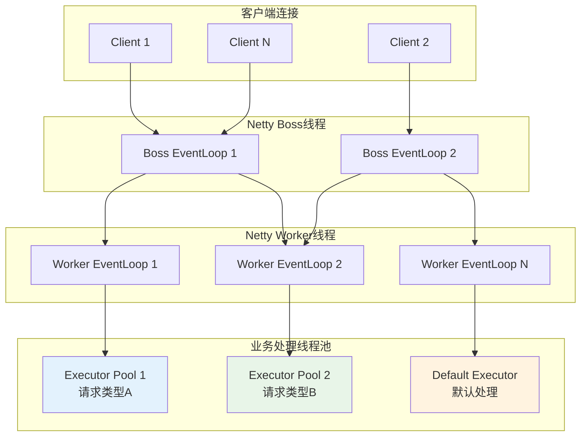

## 8. 总结

RocketMQ Remoting 模块的架构设计体现了以下核心特点：

1. **分层清晰**：从接口层到网络层，职责明确，层次分明
2. **模块化设计**：各组件独立，松耦合，易于扩展和维护
3. **高性能优化**：通过连接池、对象池、零拷贝等技术提升性能
4. **容错机制**：完善的异常处理和恢复机制保证系统稳定性
5. **线程模型优化**：合理的线程池隔离和异步处理提升并发能力

这些架构设计使得 RocketMQ Remoting 模块能够在大规模分布式系统中提供稳定、高效、可扩展的远程通信服务。