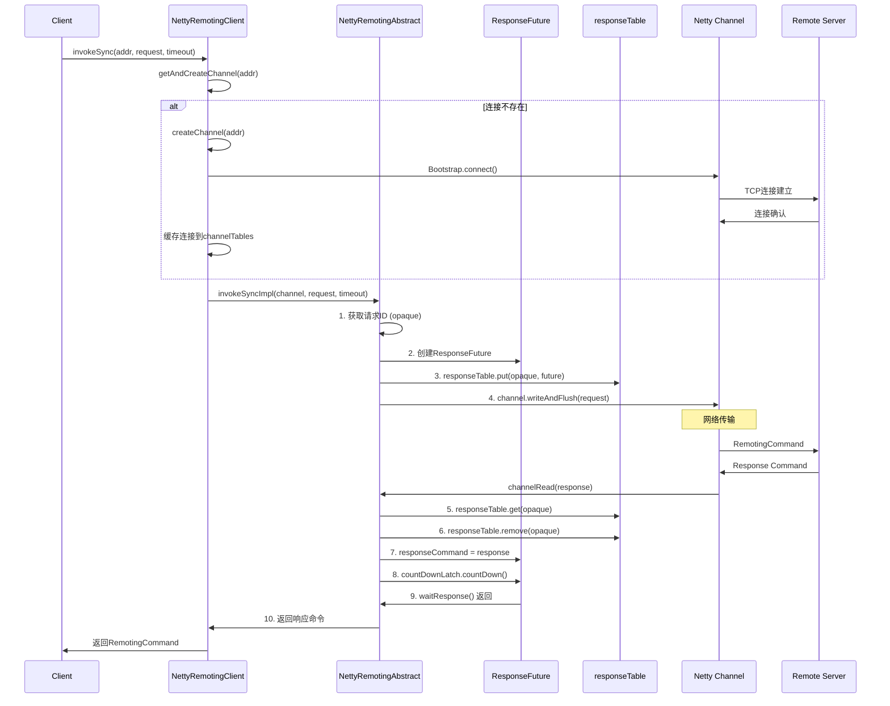
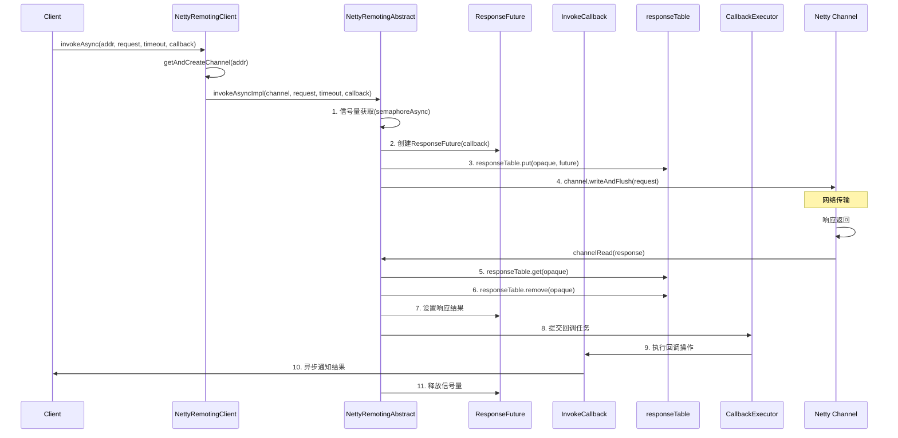
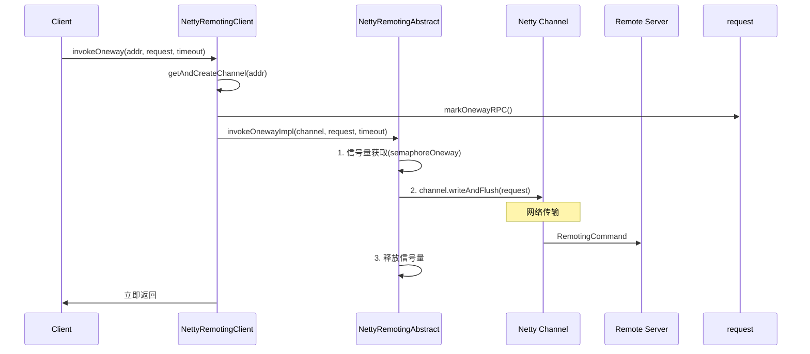
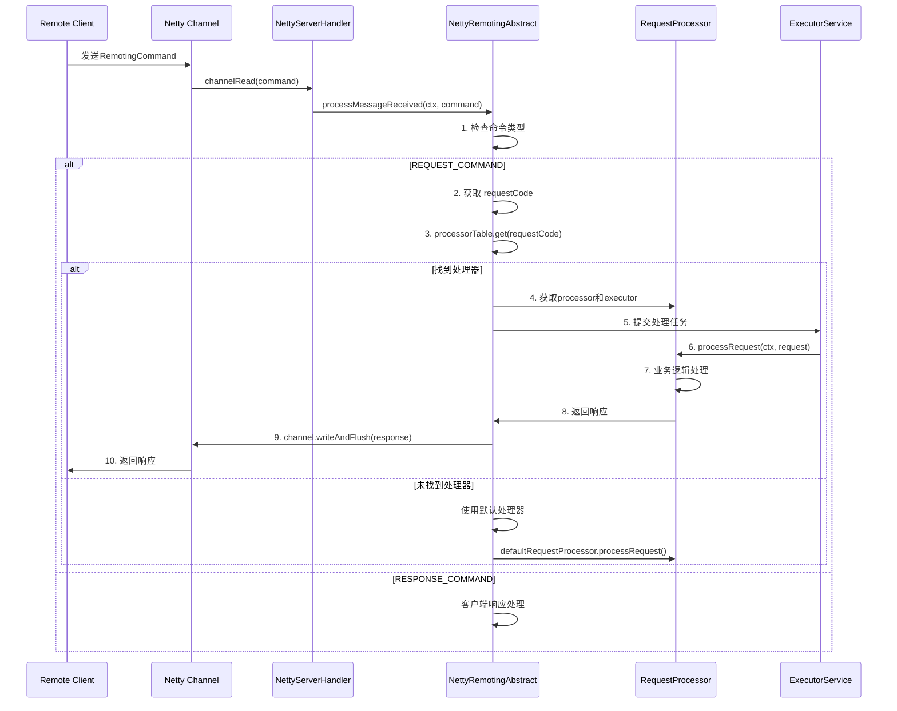
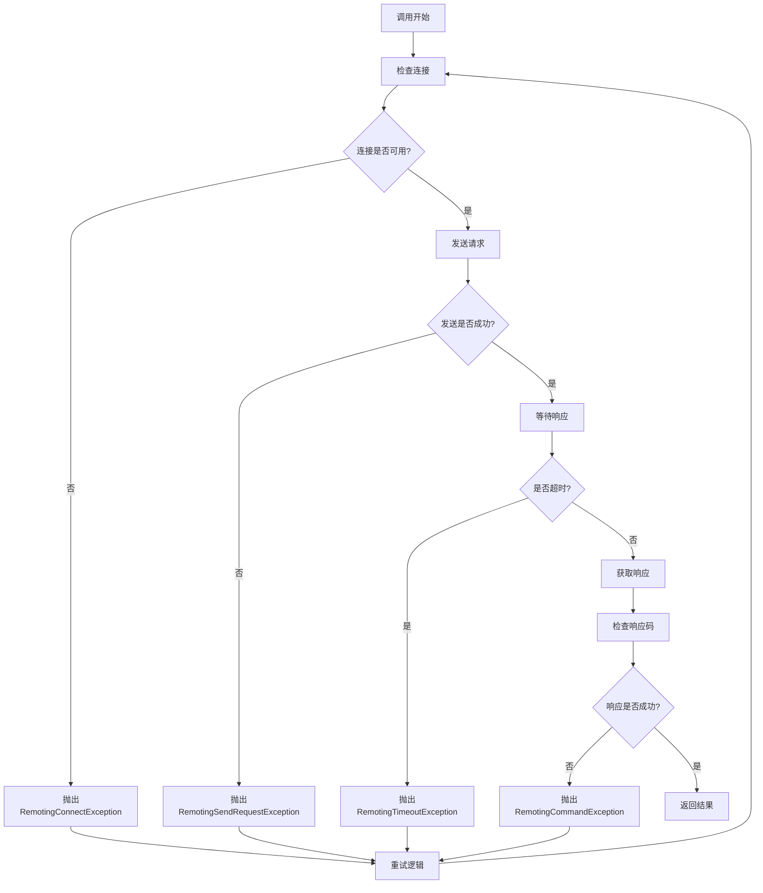

# RocketMQ Remoting 调用流程分析

## 概述

本文档详细分析 RocketMQ Remoting 模块的各种调用流程，包括同步调用、异步调用、单向调用等，帮助理解其内部工作机制。

## 1. 同步调用流程

### 1.1 调用入口

```java
public class NettyRemotingClient {
    @Override
    public RemotingCommand invokeSync(final String addr, final RemotingCommand request,
        final long timeoutMillis) throws InterruptedException, RemotingConnectException,
        RemotingSendRequestException, RemotingTimeoutException {

        // 1. 获取或创建连接
        final Channel channel = this.getAndCreateChannel(addr);

        // 2. 执行同步调用
        return this.invokeSyncImpl(channel, request, timeoutMillis);
    }
}
```

### 1.2 详细流程图



### 1.3 关键步骤详解

#### 步骤1: 连接管理

```java
private Channel getAndCreateChannel(final String addr) throws RemotingConnectException {
    ChannelWrapper cw = this.channelTables.get(addr);

    if (cw != null && cw.isOK()) {
        return cw.getChannel();
    }

    // 双重检查锁定
    this.lockChannelTables.lock();
    try {
        cw = this.channelTables.get(addr);
        if (cw != null && cw.isOK()) {
            return cw.getChannel();
        }

        // 创建新连接
        Channel channel = this.createChannel(addr);
        ChannelWrapper wrapper = new ChannelWrapper(channel);
        this.channelTables.put(addr, wrapper);
        return channel;
    } finally {
        this.lockChannelTables.unlock();
    }
}
```

#### 步骤2: ResponseFuture 创建

```java
public ResponseFuture(Channel channel, int opaque, long timeoutMillis, InvokeCallback invokeCallback,
    SemaphoreReleaseOnlyOnce once) {
    this.opaque = opaque;
    this.processChannel = channel;
    this.timeoutMillis = timeoutMillis;
    this.invokeCallback = invokeCallback;
    this.once = once;
    this.beginTimestamp = System.currentTimeMillis();
}
```

#### 步骤3: 同步等待

```java
public RemotingCommand waitResponse(final long timeoutMillis) throws InterruptedException {
    this.countDownLatch.await(timeoutMillis, TimeUnit.MILLISECONDS);
    return this.responseCommand;
}
```

## 2. 异步调用流程

### 2.1 调用入口

```java
public class NettyRemotingClient {
    @Override
    public void invokeAsync(final String addr, final RemotingCommand request, final long timeoutMillis,
        final InvokeCallback invokeCallback) throws InterruptedException, RemotingConnectException,
        RemotingTooMuchRequestException, RemotingTimeoutException, RemotingSendRequestException {

        // 1. 获取连接
        final Channel channel = this.getAndCreateChannel(addr);

        // 2. 执行异步调用
        this.invokeAsyncImpl(channel, request, timeoutMillis, invokeCallback);
    }
}
```

### 2.2 详细流程图



### 2.3 关键步骤详解

#### 步骤1: 信号量控制

```java
protected final Semaphore semaphoreAsync;

public void invokeAsyncImpl(final Channel channel, final RemotingCommand request,
    final long timeoutMillis, final InvokeCallback invokeCallback) throws RemotingTooMuchRequestException {

    // 获取异步调用信号量
    boolean acquired = this.semaphoreAsync.tryAcquire(timeoutMillis, TimeUnit.MILLISECONDS);
    if (acquired) {
        final SemaphoreReleaseOnlyOnce once = new SemaphoreReleaseOnlyOnce(this.semaphoreAsync);
        // 创建带信号量控制的ResponseFuture
        final ResponseFuture responseFuture = new ResponseFuture(channel, opaque, timeoutMillis, invokeCallback, once);
        // 执行后续逻辑...
    } else {
        throw new RemotingTooMuchRequestException("invokeAsyncImpl invoke too fast");
    }
}
```

#### 步骤2: 回调执行

```java
private void processResponseCommand(final ChannelHandlerContext ctx, final RemotingCommand cmd) {
    final ResponseFuture responseFuture = responseTable.get(cmd.getOpaque());

    if (responseFuture != null) {
        responseFuture.setResponseCommand(cmd);
        responseFuture.release();

        if (responseFuture.getInvokeCallback() != null) {
            // 异步执行回调
            executeInvokeCallback(responseFuture);
        } else {
            // 同步等待场景
            responseFuture.putResponse(cmd);
            responseTable.remove(cmd.getOpaque());
        }
    }
}

private void executeInvokeCallback(final ResponseFuture responseFuture) {
    boolean runInThisThread = false;
    ExecutorService executor = this.getCallbackExecutor();

    if (executor != null) {
        try {
            executor.submit(new Runnable() {
                @Override
                public void run() {
                    try {
                        responseFuture.getInvokeCallback().operationComplete(
                            responseFuture.getResponseCommand());
                    } catch (Exception e) {
                        log.warn("execute callback exception", e);
                    } finally {
                        responseFuture.release();
                    }
                }
            });
        } catch (Exception e) {
            runInThisThread = true;
            log.warn("execute callback in executor exception", e);
        }
    } else {
        runInThisThread = true;
    }

    if (runInThisThread) {
        // 降级处理：在当前线程执行
        try {
            responseFuture.getInvokeCallback().operationComplete(responseFuture.getResponseCommand());
        } catch (Exception e) {
            log.warn("execute callback exception", e);
        } finally {
            responseFuture.release();
        }
    }
}
```

## 3. 单向调用流程

### 3.1 调用入口

```java
public class NettyRemotingClient {
    @Override
    public void invokeOneway(final String addr, final RemotingCommand request, final long timeoutMillis)
        throws InterruptedException, RemotingConnectException, RemotingTooMuchRequestException,
        RemotingTimeoutException, RemotingSendRequestException {

        // 1. 获取连接
        final Channel channel = this.getAndCreateChannel(addr);

        // 2. 标记为单向调用
        request.markOnewayRPC();

        // 3. 执行单向调用
        this.invokeOnewayImpl(channel, request, timeoutMillis);
    }
}
```

### 3.2 详细流程图



### 3.3 关键步骤详解

#### 步骤1: 单向调用标记

```java
public class RemotingCommand {
    private static final int RPC_ONEWAY = 1; // 单向调用标记位

    public void markOnewayRPC() {
        int bits = 1 << RPC_ONEWAY;
        this.flag |= bits;
    }

    public boolean isOnewayRPC() {
        return (this.flag & 1 << RPC_ONEWAY) == 1 << RPC_ONEWAY;
    }
}
```

#### 步骤2: 信号量控制

```java
protected final Semaphore semaphoreOneway;

public void invokeOnewayImpl(final Channel channel, final RemotingCommand request,
    final long timeoutMillis) throws RemotingTooMuchRequestException, RemotingTimeoutException,
    RemotingSendRequestException {

    // 获取单向调用信号量
    boolean acquired = this.semaphoreOneway.tryAcquire(timeoutMillis, TimeUnit.MILLISECONDS);
    if (acquired) {
        try {
            channel.writeAndFlush(request).addListener(new ChannelFutureListener() {
                @Override
                public void operationComplete(ChannelFuture future) throws Exception {
                    if (!future.isSuccess()) {
                        log.warn("send a request command to channel <{}> failed.", channel.remoteAddress());
                    }
                }
            });
        } finally {
            this.semaphoreOneway.release();
        }
    } else {
        throw new RemotingTooMuchRequestException("invokeOnewayImpl invoke too fast");
    }
}
```

## 4. 服务端请求处理流程

### 4.1 请求接收

```java
@ChannelHandler.Sharable
public class NettyServerHandler extends SimpleChannelInboundHandler<RemotingCommand> {

    @Override
    protected void channelRead0(ChannelHandlerContext ctx, RemotingCommand msg) throws Exception {
        processMessageReceived(ctx, msg);
    }

    @Override
    public void exceptionCaught(ChannelHandlerContext ctx, Throwable cause) throws Exception {
        log.error("exceptionCaught {}", cause);
    }
}
```

### 4.2 请求处理流程图



### 4.3 处理器注册与路由

```java
public abstract class NettyRemotingAbstract {
    // 处理器映射表
    protected final HashMap<Integer/* request code */, Pair<NettyRequestProcessor, ExecutorService>> processorTable =
        new HashMap<Integer, Pair<NettyRequestProcessor, ExecutorService>>(64);

    // 默认处理器
    protected Pair<NettyRequestProcessor, ExecutorService> defaultRequestProcessor;

    public Pair<NettyRequestProcessor, ExecutorService> getProcessorPair(final int requestCode) {
        return processorTable.get(requestCode);
    }

    @Override
    public void registerProcessor(final int requestCode, final NettyRequestProcessor processor,
        final ExecutorService executor) {
        this.processorTable.put(requestCode, new Pair<NettyRequestProcessor, ExecutorService>(processor, executor));
    }

    @Override
    public void registerDefaultProcessor(final NettyRequestProcessor processor, final ExecutorService executor) {
        this.defaultRequestProcessor = new Pair<NettyRequestProcessor, ExecutorService>(processor, executor);
    }
}
```

### 4.4 异步处理器

```java
public abstract class AsyncNettyRequestProcessor implements NettyRequestProcessor {

    @Override
    public RemotingCommand processRequest(ChannelHandlerContext ctx, RemotingCommand request) throws Exception {
        // 默认同步实现，子类可重写为异步
        return processRequest(request);
    }

    public abstract RemotingCommand processRequest(RemotingCommand request) throws Exception;

    /**
     * 异步处理请求
     */
    public void asyncProcessRequest(ChannelHandlerContext ctx, RemotingCommand request,
        AsyncCallback asyncCallback) throws Exception {
        // 默认实现：同步转异步
        try {
            RemotingCommand response = processRequest(request);
            asyncCallback.complete(response);
        } catch (Exception e) {
            asyncCallback.exception(e);
        }
    }

    public interface AsyncCallback {
        void complete(RemotingCommand response);
        void exception(Throwable throwable);
    }
}
```

## 5. 异常处理流程

### 5.1 异常类型

```java
// 连接异常
public class RemotingConnectException extends RemotingException

// 发送请求异常
public class RemotingSendRequestException extends RemotingException

// 超时异常
public class RemotingTimeoutException extends RemotingException

// 请求过多异常
public class RemotingTooMuchRequestException extends RemotingException

// 命令异常
public class RemotingCommandException extends RemotingException
```

### 5.2 异常处理流程



### 5.3 重试机制

```java
private RemotingCommand invokeSyncImpl(final Channel channel, final RemotingCommand request,
    final long timeoutMillis) throws RemotingSendRequestException, RemotingTimeoutException {

    final int retryTimesWhenSendFailed = this.nettyClientConfig.getRetryTimesWhenSendFailed();
    int retryTimes = 0;
    RemotingCommand response = null;

    while (retryTimes < retryTimesWhenSendFailed) {
        try {
            // 执行同步调用
            response = this.invokeSyncOnce(channel, request, timeoutMillis);
            break;
        } catch (RemotingSendRequestException e) {
            retryTimes++;
            if (retryTimes >= retryTimesWhenSendFailed) {
                throw e;
            }
            log.warn("invokeSync failed, retryTimes: {}, address: {}", retryTimes, channel.remoteAddress());
            // 重新获取连接
            channel = this.getAndCreateChannel(channel.remoteAddress().toString());
        } catch (RemotingTimeoutException e) {
            // 超时不重试，直接抛出
            throw e;
        }
    }

    return response;
}
```

## 6. 性能优化点

### 6.1 连接复用

- **连接池管理**：通过 `channelTables` 缓存连接，避免频繁创建
- **长连接保持**：通过心跳机制保持连接活跃
- **连接健康检查**：定期检查连接状态，及时清理无效连接

### 6.2 内存管理

- **对象复用**：RemotingCommand 对象池复用
- **零拷贝**：使用 FileRegion 进行文件传输
- **内存回收**：及时清理 responseTable 中的过期对象

### 6.3 并发控制

- **信号量限流**：通过 semaphore 控制并发请求数
- **线程池隔离**：不同请求使用独立的线程池
- **异步处理**：避免阻塞 I/O 线程

### 6.4 序列化优化

- **高效序列化**：RocketMQ 自定义二进制序列化比 JSON 性能更高
- **序列化缓存**：反射 Field 信息缓存
- **延迟序列化**：按需序列化自定义头部

## 7. 总结

RocketMQ Remoting 模块通过精心设计的调用流程，实现了高性能、高可靠的远程通信：

1. **同步调用**：简单直观，适用于需要立即结果的场景
2. **异步调用**：高并发场景的最佳选择，通过回调机制避免阻塞
3. **单向调用**：适用于通知类场景，性能最优但不保证可达性
4. **服务端处理**：通过处理器路由和线程池隔离，实现高效请求处理
5. **异常处理**：完善的异常分类和重试机制，保证系统稳定性

这些调用流程的设计充分考虑了分布式系统的各种需求和约束，为 RocketMQ 的高性能消息传递提供了坚实的基础。