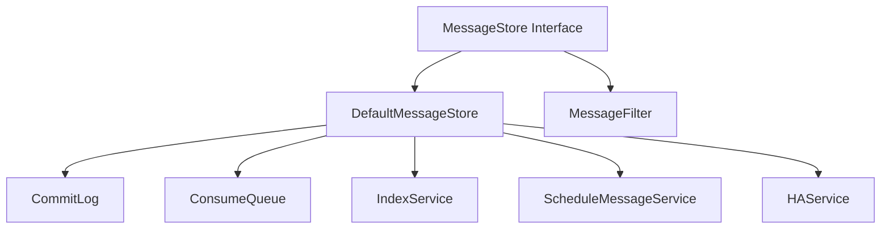
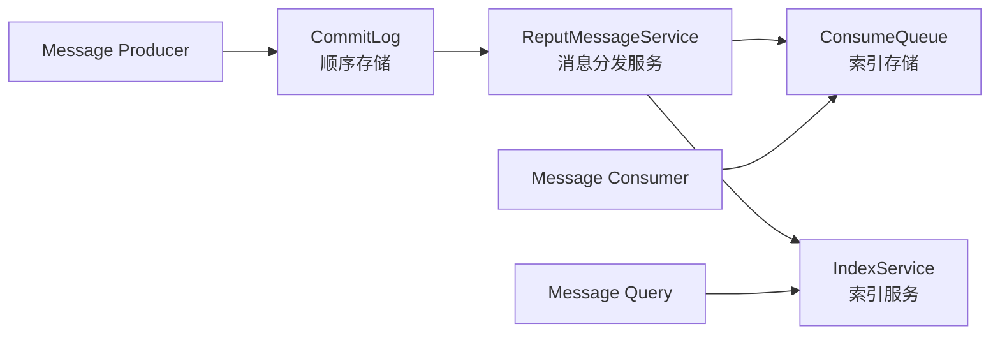
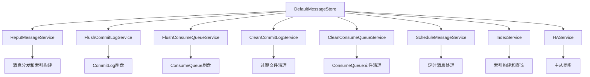
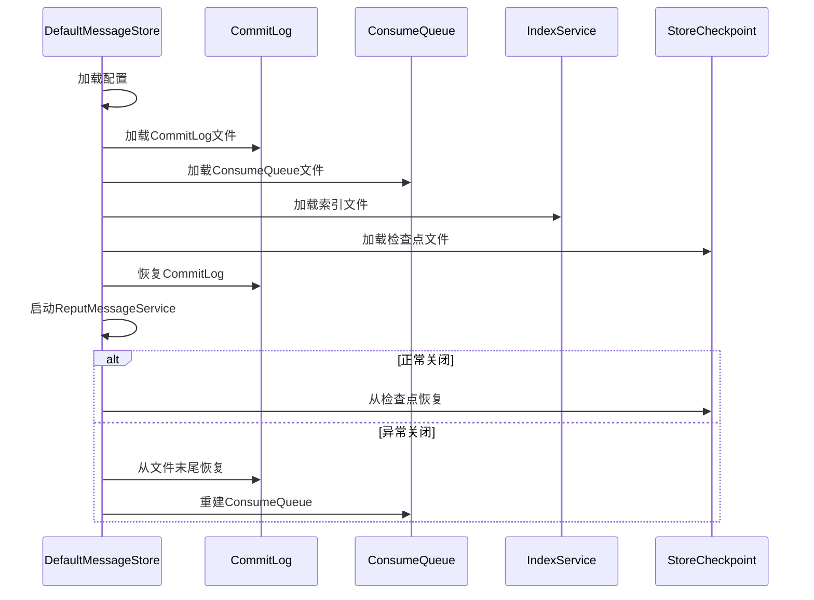

# RocketMQ Store 模块架构分析

## 概述

RocketMQ Store 模块是整个消息队列系统的存储核心，负责消息的持久化存储、索引管理、查询服务和数据恢复等功能。该模块采用了先进的存储架构设计，通过分离顺序存储和索引存储，实现了高性能的消息读写能力。

## 目录结构

```
store/
├── src/main/java/org/apache/rocketmq/store/
│   ├── config/                        # 配置类
│   │   ├── BrokerRole.java           # Broker角色枚举
│   │   ├── FlushDiskType.java        # 磁盘刷写类型
│   │   ├── MessageStoreConfig.java   # 存储配置
│   │   └── StorePathConfigHelper.java # 存储路径配置助手
│   ├── dledger/                       # DLedger 一致性协议
│   │   └── DLedgerCommitLog.java     # DLedger CommitLog实现
│   ├── ha/                           # 高可用模块
│   │   ├── HAConnection.java         # HA连接
│   │   ├── HAService.java           # HA服务
│   │   └── WaitNotifyObject.java    # 等待通知对象
│   ├── index/                         # 索引模块
│   │   ├── IndexFile.java            # 索引文件
│   │   ├── IndexHeader.java          # 索引文件头
│   │   ├── IndexService.java         # 索引服务
│   │   └── QueryOffsetResult.java    # 查询偏移量结果
│   ├── schedule/                      # 定时消息模块
│   │   ├── DelayOffsetSerializeWrapper.java # 延迟偏移量序列化包装器
│   │   └── ScheduleMessageService.java     # 定时消息服务
│   ├── stats/                         # 统计模块
│   │   ├── BrokerStats.java          # Broker统计
│   │   ├── BrokerStatsManager.java   # Broker统计管理器
│   │   └── LmqBrokerStatsManager.java # Lmq统计管理器
│   ├── util/                          # 工具类
│   │   └── LibC.java                 # 本地C库调用
│   ├── CommitLog.java                 # 提交日志核心类
│   ├── ConsumeQueue.java              # 消费队列核心类
│   ├── ConsumeQueueExt.java           # 扩展消费队列
│   ├── DefaultMessageStore.java       # 默认消息存储实现
│   ├── DefaultMessageFilter.java     # 默认消息过滤器
│   ├── GetMessageResult.java          # 获取消息结果
│   ├── MessageArrivingListener.java  # 消息到达监听器
│   ├── MessageExtBrokerInner.java    # Broker内部消息扩展
│   ├── MessageFilter.java             # 消息过滤器接口
│   ├── MessageStore.java              # 消息存储接口
│   ├── MappedFile.java                # 内存映射文件
│   ├── MappedFileQueue.java           # 内存映射文件队列
│   ├── MultiDispatch.java             # 多重分发
│   ├── MultiPathMappedFileQueue.java  # 多路径内存映射文件队列
│   ├── PutMessageLock.java            # 存放消息锁
│   ├── PutMessageReentrantLock.java   # 可重入存放消息锁
│   ├── PutMessageSpinLock.java        # 自旋存放消息锁
│   ├── PutMessageResult.java          # 存放消息结果
│   ├── QueryMessageResult.java        # 查询消息结果
│   ├── SelectMappedBufferResult.java  # 选择映射缓冲区结果
│   ├── StoreStatsService.java        # 存储统计服务
│   ├── TransientStorePool.java        # 瞬时存储池
│   └── [其他核心类...]               # 其他辅助类
└── src/test/java/                     # 测试代码
```

## 架构设计

### 1. 整体架构思想

RocketMQ Store 模块采用了**分层存储架构**和**服务化设计**的核心思想：

- **存储分离**：将顺序存储（CommitLog）和索引存储（ConsumeQueue）分离，实现高性能写入和快速查询
- **内存映射**：使用 MappedFile 实现零拷贝的高性能 I/O
- **服务化架构**：各个功能模块独立运行，通过服务线程处理
- **可扩展性**：支持多路径存储、DLedger 一致性协议等扩展

### 2. 分层架构详解

#### 2.1 接口抽象层 (Interface Layer)



##### 2.1.1 MessageStore - 存储核心接口

```java
public interface MessageStore {
    // 消息存储核心方法
    PutMessageResult putMessage(MessageExtBrokerInner msg);
    GetMessageResult getMessage(final String group, final String topic, final int queueId,
        final long offset, final int maxMsgNums, final MessageFilter messageFilter);

    // 查询相关
    QueryMessageResult queryMessage(String topic, String key, int maxNum, long begin, long end);
    long getMaxOffsetInQueue(String topic, int queueId);
    long getMinOffsetInQueue(String topic, int queueId);

    // 统计和监控
    StoreStatsService getStoreStatsService();
    void monitor();

    // 生命周期管理
    boolean load();
    void start() throws Exception;
    void shutdown();
    void destroy();

    // 配置和状态
    MessageStoreConfig getMessageStoreConfig();
    BrokerRole getBrokerRole();
    boolean isTransientStorePoolEnable();
}
```

**设计思想**：
- **功能完整性**：涵盖消息存储、查询、统计等完整功能
- **生命周期管理**：明确的启动、停止、销毁流程
- **可扩展性**：支持自定义过滤器和监控扩展
- **配置驱动**：通过配置类控制存储行为

#### 2.2 存储层架构 (Storage Layer)

##### 2.2.1 双层存储设计

RocketMQ 采用了独特的双层存储架构：



**CommitLog - 顺序存储层**：
- 所有消息按写入顺序存储在单一文件中
- 顺序写入提供最佳写入性能
- 支持内存映射和零拷贝技术
- 文件大小固定（默认1GB），自动轮转

**ConsumeQueue - 索引存储层**：
- 按主题-队列维度建立索引
- 每个条目20字节：8字节偏移量 + 4字节大小 + 8字节标签哈希
- 支持快速定位消息在 CommitLog 中的位置
- 文件按队列分离，便于并发访问

##### 2.2.2 MappedFile - 内存映射文件抽象

```java
public class MappedFile extends ReferenceResource {
    // 核心组件
    private final FileChannel fileChannel;      // 文件通道
    private final MappedByteBuffer mappedByteBuffer; // 内存映射缓冲区
    private final AtomicInteger wrotePosition = new AtomicInteger(0);     // 写入位置
    private final AtomicInteger committedPosition = new AtomicInteger(0); // 提交位置
    private final AtomicInteger flushedPosition = new AtomicInteger(0);   // 刷盘位置

    // 文件属性
    private final String fileName;              // 文件名
    private final int fileSize;                 // 文件大小
    private long storeTimestamp = 0;           // 存储时间戳
    private boolean firstCreateInQueue = false; // 是否是队列中第一个文件
}
```

**MappedFile 设计精髓**：

1. **三级位置管理**：
   - `wrotePosition`：已写入位置
   - `committedPosition`：已提交到内存的位置
   - `flushedPosition`：已刷盘到磁盘的位置

2. **资源管理**：
   - 继承 `ReferenceResource` 实现引用计数
   - 支持资源池化和复用
   - 优雅的清理和释放机制

3. **高性能 I/O**：
   - 使用 `MappedByteBuffer` 实现零拷贝
   - 利用操作系统页面缓存
   - 支持批量读写操作

#### 2.3 服务化架构 (Service Architecture)

##### 2.3.1 核心服务组件



##### 2.3.2 ReputMessageService - 消息分发服务

```java
class ReputMessageService extends ServiceThread {
    @Override
    public void run() {
        while (!this.isStopped()) {
            try {
                // 从 reputFromOffset 开始处理
                DoMessageResult result = DefaultMessageStore.this.doReput(this.reputFromOffset);

                // 更新处理偏移量
                if (result != null) {
                    this.reputFromOffset = result.getNextBeginOffset();
                }

                // 控制处理频率，避免CPU占用过高
                if (!this.isBreak()) {
                    Thread.sleep(1);
                }
            } catch (Exception e) {
                DefaultMessageStore.this.log.warn("reputMessageService exception", e);
            }
        }
    }
}
```

**核心职责**：
1. **消息分发**：从 CommitLog 读取消息并分发给 ConsumeQueue 和 IndexService
2. **异步处理**：与消息写入异步进行，不影响写入性能
3. **进度管理**：维护 `reputFromOffset` 确保消息不丢失
4. **频率控制**：通过休眠机制控制CPU使用率

##### 2.3.3 FlushCommitLogService - 刷盘服务

RocketMQ 支持三种刷盘模式：

```java
// 同步刷盘服务
class CommitRealTimeService extends FlushCommitLogService {
    @Override
    public void run() {
        while (!this.isStopped()) {
            // 获取刷盘间隔
            int interval = DefaultMessageStore.this.getMessageStoreConfig().getFlushIntervalCommitLog();

            // 执行刷盘
            this.flushCommitLog(false);

            // 等待下一次刷盘
            this.waitForRunning(interval);
        }
    }
}

// 异步刷盘服务
class FlushRealTimeService extends FlushCommitLogService {
    @Override
    public void run() {
        while (!this.isStopped()) {
            // 检查是否需要刷盘
            boolean flushCommitLogTimed = CommitLog.this.defaultMessageStore.getMessageStoreConfig().isFlushCommitLogTimed();
            int interval = CommitLog.this.defaultMessageStore.getMessageStoreConfig().getFlushIntervalCommitLog();

            // 执行刷盘
            this.flushCommitLog(flushCommitLogTimed);

            this.waitForRunning(interval);
        }
    }
}
```

**刷盘策略**：
- **同步刷盘**：消息写入后立即刷盘，保证数据安全
- **异步刷盘**：消息写入后暂存内存，定时刷盘，提高性能
- **批量刷盘**：支持批量刷盘减少磁盘 I/O 次数

### 3. 高可用架构

#### 3.1 HAService 主从同步

```java
public class HAService {
    // 核心组件
    private final GroupTransferService groupTransferService;
    private final HAClient haClient;
    private final HAConnection haConnection;

    // 同步相关
    private final AtomicLong push2SlaveMaxOffset = new AtomicLong(0);
    private final AtomicInteger connectionCount = new AtomicInteger(0);
}
```

**HA 架构设计**：

1. **主从角色**：
   - `SYNC_MASTER`：同步主节点，等待从节点确认
   - `ASYNC_MASTER`：异步主节点，不等待从节点
   - `SLAVE`：从节点，接收主节点的数据同步

2. **同步机制**：
   - 使用 Netty 进行网络传输
   - 基于偏移量的增量同步
   - 支持批量传输提高效率

3. **故障处理**：
   - 连接断开自动重连
   - 数据完整性校验
   - 主从切换支持

#### 3.2 DLedger 一致性协议

```java
public class DLedgerCommitLog extends CommitLog {
    private final DLedgerServer dLedgerServer;
    private final DLedgerConfig dLedgerConfig;

    // DLedger 相关配置
    private final String group;
    private final String selfId;
    private final String peers;
}
```

**DLedger 特性**：
- 基于 Raft 协议的强一致性
- 自动选主和故障转移
- 数据同步和日志复制
- 支持多数派写入

### 4. 索引和查询架构

#### 4.1 IndexService 索引服务

```java
public class IndexService {
    private final DefaultMessageStore defaultMessageStore;
    private final ScheduledExecutorService scheduledExecutorService;
    private final AtomicLong indexFileNumInMemory = new AtomicLong(0);
    private final List<IndexFile> indexFileList = new CopyOnWriteArrayList<>();

    // 索引文件大小：400万条记录约 40MB
    private static final int MAX_HASH_SLOT_NUM = 5000000;
    private static final int MAX_INDEX_NUM = 4000000 * 2;
}
```

**索引文件结构**：
```
IndexFile (40MB)
├── IndexHeader (40字节)
│   ├── beginTimestamp (8字节)
│   ├── endTimestamp (8字节)
│   ├── beginPhyOffset (8字节)
│   ├── endPhyOffset (8字节)
│   └── hashSlotCount (4字节)
├── Hash Slot Area (500万 * 4字节 = 20MB)
└── Index Link Area (400万 * 20字节 = 20MB)
```

**索引查询流程**：
1. 根据 key 计算哈希值找到哈希槽
2. 通过哈希槽定位到索引链表
3. 遍历索引链表找到匹配的消息
4. 根据物理偏移量从 CommitLog 读取消息

#### 4.2 定时消息架构

```java
public class ScheduleMessageService extends ConfigManager {
    // 18个延迟级别：1s 5s 10s 30s 1m 2m 3m 4m 5m 6m 7m 8m 9m 10m 20m 30m 1h 2h
    private static final int DELAY_LEVEL_COUNT = 18;
    private final ConcurrentMap<Integer /* level */, Long/* offset */> queueOffsetTable = new ConcurrentHashMap<>();

    // 延迟级别映射
    private String messageDelayLevel = "1s 5s 10s 30s 1m 2m 3m 4m 5m 6m 7m 8m 9m 10m 20m 30m 1h 2h";
}
```

**定时消息处理流程**：
1. 生产者发送带有延迟等级的消息
2. 消息存储到 SCHEDULE_TOPIC_XXXX 主题
3. ScheduleMessageService 定时扫描延迟队列
4. 到期后重新投递到原始主题
5. 消费者正常消费

### 5. 性能优化设计

#### 5.1 内存映射优化

- **零拷贝**：使用 `MappedByteBuffer` 避免数据拷贝
- **页面缓存**：利用操作系统页面缓存机制
- **预分配**：文件创建时预分配空间避免碎片
- **批量操作**：支持批量读写减少系统调用

#### 5.2 并发控制优化

- **分段锁**：不同主题队列使用不同锁减少竞争
- **CAS操作**：使用原子操作减少锁开销
- **无锁数据结构**：在高频路径使用无锁设计
- **线程池隔离**：不同服务使用独立线程池

#### 5.3 存储优化

- **顺序写入**：CommitLog 顺序写入提供最佳性能
- **批量刷盘**：合并多次刷盘请求减少 I/O
- **多路径存储**：支持多磁盘并行 I/O
- **压缩存储**：支持消息压缩减少存储空间

### 6. 数据恢复机制

#### 6.1 启动恢复流程



#### 6.2 数据一致性保证

- **事务消息**：支持两阶段提交保证一致性
- **CRC校验**：可选的消息完整性校验
- **文件锁**：防止多个进程同时访问
- **重复处理保护**：避免重复消费

### 7. 监控和统计

#### 7.1 StoreStatsService 统计服务

```java
public class StoreStatsService {
    // 吞吐量统计
    private final AtomicLong putTimesTotal = new AtomicLong(0);
    private final AtomicLong putMessageFailedTimes = new AtomicLong(0);
    private final AtomicLong getMessageTimesTotalFound = new AtomicLong(0);
    private final AtomicLong getMessageTimesTotalMiss = new AtomicLong(0);

    // 延迟统计
    private final ConcurrentHashMap<String/* Topic */, Long> putMessageDistributeTimeMap;
    private final TimerMeter putMessageEntireTimeMax;
    private final TimerMeter getMessageEntireTimeMax;

    // 存储统计
    private final AtomicLong commitLogDiskRatio = new AtomicLong(0);
    private final AtomicLong commitLogMinOffset = new AtomicLong(0);
    private final AtomicLong commitLogMaxOffset = new AtomicLong(0);
}
```

**统计维度**：
- **吞吐量**：消息存储和查询的 TPS
- **延迟**：存储和查询的响应时间分布
- **存储使用**：磁盘空间使用情况和趋势
- **错误率**：存储失败和异常统计

### 8. 架构优势

1. **高性能**：
   - 顺序存储提供最佳写入性能
   - 内存映射实现零拷贝 I/O
   - 分离式索引支持快速查询
   - 异步处理提高整体吞吐量

2. **高可靠性**：
   - 多副本同步保证数据安全
   - 事务消息支持分布式事务
   - 完善的恢复机制
   - CRC校验保证数据完整性

3. **高扩展性**：
   - 支持多路径存储
   - DLedger 一致性协议支持
   - 模块化设计便于扩展
   - 丰富的配置选项

4. **易维护性**：
   - 清晰的模块分离
   - 完善的监控和统计
   - 详细的日志记录
   - 友好的运维接口

### 9. 总结

RocketMQ Store 模块是一个设计精良、性能卓越的存储引擎。通过采用分层存储架构、内存映射技术、服务化设计等先进理念，实现了高性能、高可靠、高可扩展的消息存储能力。

该模块的核心设计思想包括：
- **存储与索引分离**：兼顾写入性能和查询效率
- **内存映射技术**：实现零拷贝的高性能 I/O
- **异步化架构**：通过服务化设计提高系统吞吐量
- **完善的容错机制**：保证数据安全和系统稳定性

这些设计使得 RocketMQ 能够在大规模分布式环境中提供可靠、高效的消息存储服务，是现代消息队列系统存储设计的典型范例。