# RocketMQ Store 架构图集合

## 概述

本文档包含了 RocketMQ Store 模块的详细架构图和设计图，通过可视化的方式展示存储系统的内部结构和组件关系，帮助开发者更好地理解存储架构的设计思想。

## 1. 整体架构图

### 1.1 Store 模块整体架构

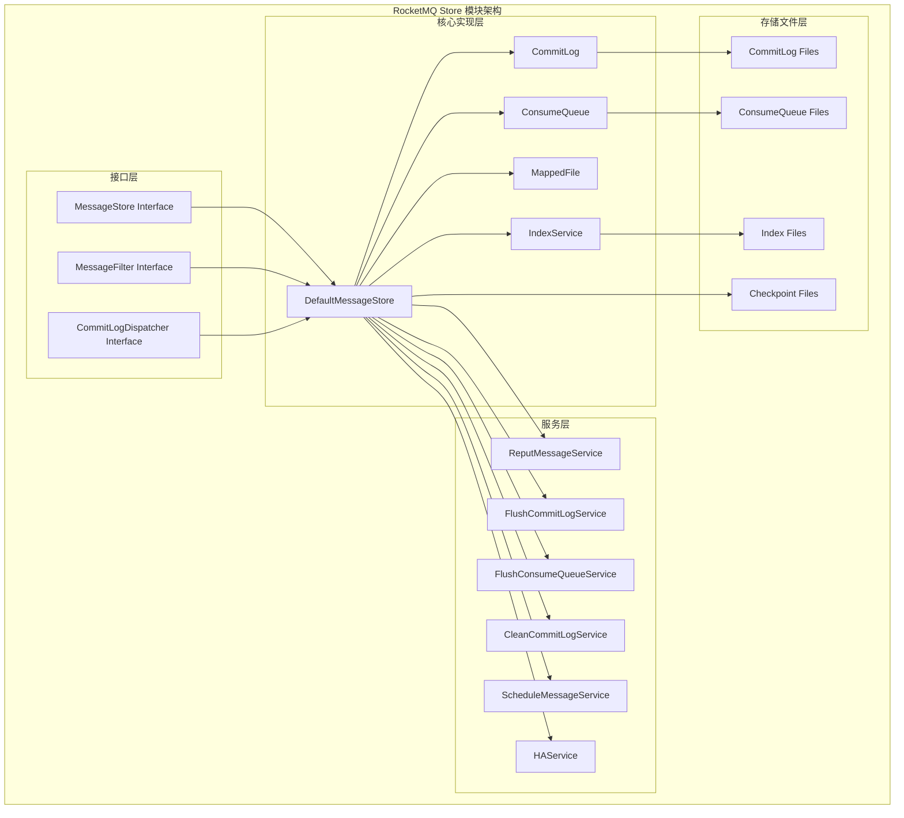

### 1.2 分层存储架构

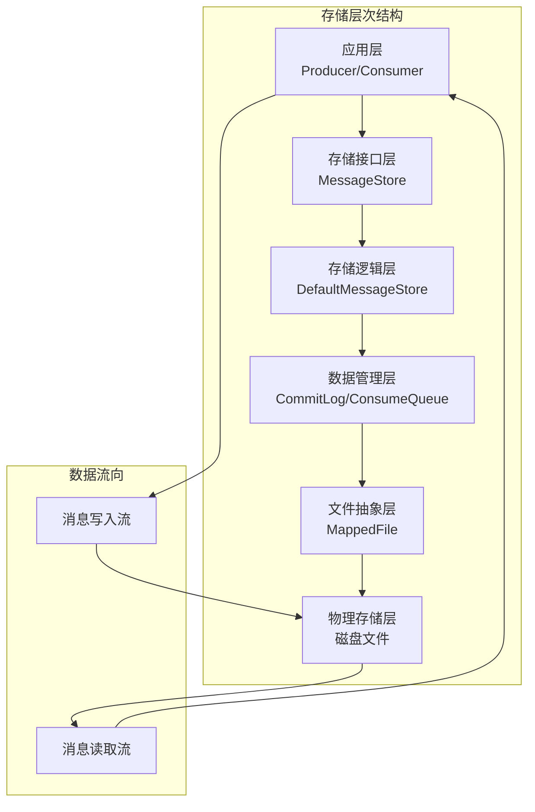

## 2. 数据存储架构图

### 2.1 双层存储设计

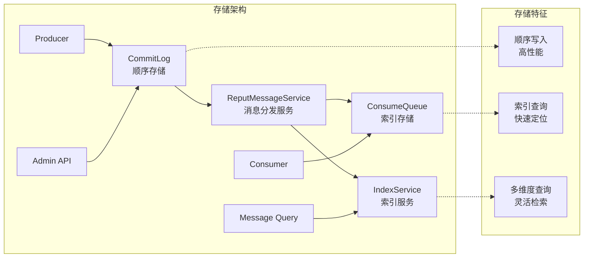

### 2.2 文件组织结构

```
/store
├── commitlog/                          # 提交日志目录
│   ├── 00000000000000000000           # 第1个CommitLog文件 (1GB)
│   ├── 00000000001073741824           # 第2个CommitLog文件 (1GB)
│   ├── 00000000002147483648           # 第3个CommitLog文件 (1GB)
│   └── ...                           # 更多CommitLog文件
├── consumequeue/                      # 消费队列目录
│   ├── TopicTest/                     # 主题A
│   │   ├── 0/                        # 队列0
│   │   │   ├── 00000000000000000000  # 第1个队列文件 (~6MB, 30万条)
│   │   │   └── 00000000000000120000  # 第2个队列文件
│   │   ├── 1/                        # 队列1
│   │   │   ├── 00000000000000000000
│   │   │   └── 00000000000000120000
│   │   └── ...                       # 更多队列
│   ├── TopicOrder/                    # 主题B
│   │   ├── 0/
│   │   └── 1/
│   └── ...                           # 更多主题
├── index/                            # 索引目录
│   ├── 00000000000000000000          # 第1个索引文件 (~40MB)
│   ├── 00000000000000000001          # 第2个索引文件
│   └── ...                           # 更多索引文件
├── abort                             # 异常关闭标记文件
├── checkpoint                        # 检查点文件
└── lock                              # 文件锁文件
```

### 2.3 CommitLog 文件结构

```
CommitLog File (1GB)
├── Message 1 (变长)
│   ├── TOTALSIZE (4字节)             # 消息总长度
│   ├── MAGICCODE (4字节)             # 消息魔数
│   ├── BODYCRC (4字节)               # 消息体CRC校验
│   ├── QUEUEID (4字节)               # 队列ID
│   ├── FLAG (4字节)                  # 消息标志
│   ├── BODYOFFSET (8字节)            # 消息体偏移量
│   ├── BODYLEN (4字节)               # 消息体长度
│   ├── STORETIMESTAMP (8字节)        # 存储时间戳
│   ├── BORNTIMESTAMP (8字节)         # 产生时间戳
│   ├── BORNHOST (8字节)              # 产生主机
│   ├── STOREHOST (8字节)             # 存储主机
│   ├── RECONSUMETIMES (4字节)        # 重试次数
│   ├── PreparedTransactionOffset (8字节) # 事务消息偏移量
│   ├── BODY (变长)                   # 消息体
│   └── PROPERTIES (变长)             # 消息属性
├── Message 2 (变长)
├── Message 3 (变长)
└── ...                              # 更多消息
```

### 2.4 ConsumeQueue 文件结构

```
ConsumeQueue File (~6MB)
├── Entry 1 (20字节)
│   ├── CommitLog Offset (8字节)      # 消息在CommitLog中的偏移量
│   ├── Message Size (4字节)          # 消息大小
│   └── Tags HashCode (8字节)         # 标签哈希码
├── Entry 2 (20字节)
├── Entry 3 (20字节)
└── ...                              # 更多条目 (最多30万条)
```

## 3. 内存管理架构图

### 3.1 MappedFile 内存结构

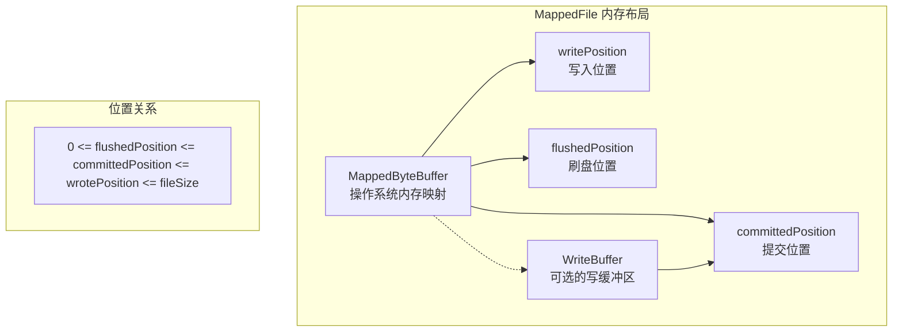

### 3.2 内存管理流程

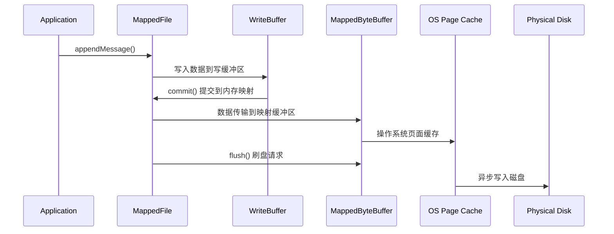

### 3.3 引用计数管理

```mermaid
graph TD
    subgraph "ReferenceResource 生命周期"
        A[创建<br/>refCount=1]
        B[hold()<br/>refCount++]
        C[使用资源]
        D[release()<br/>refCount--]
        E{refCount <= 0?}
        F[cleanup()<br/>资源清理]
        G[销毁]
    end

    A --> B
    B --> C
    C --> D
    D --> E
    E -->|是| F
    E -->|否| B
    F --> G
```

## 4. 服务架构图

### 4.1 服务线程架构

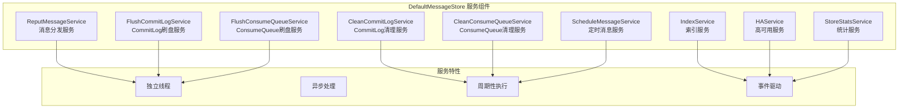

### 4.2 消息分发流程

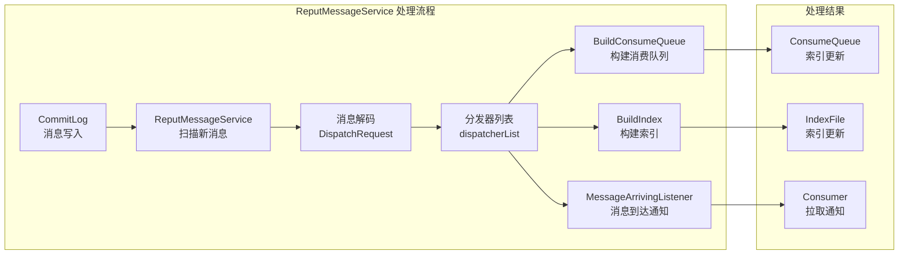

### 4.3 刷盘策略架构

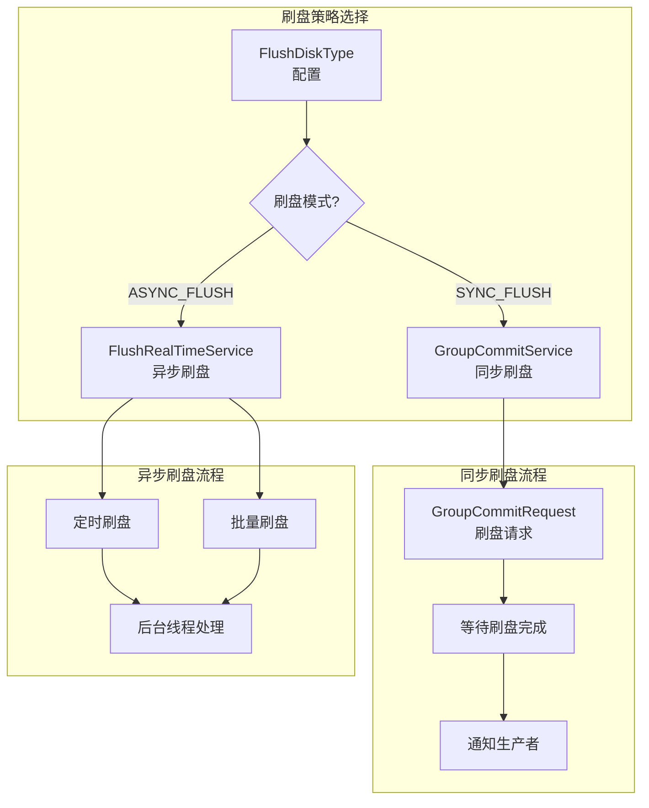

## 5. 高可用架构图

### 5.1 HA 主从同步架构

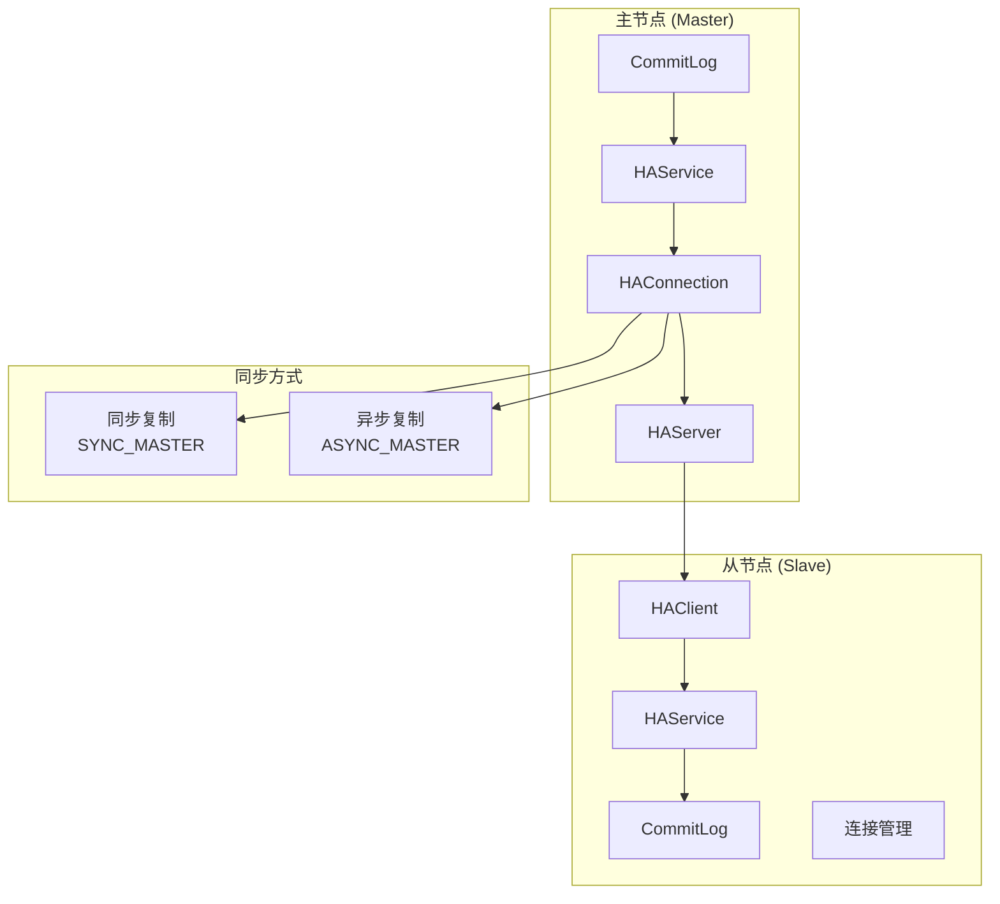

### 5.2 DLedger 一致性架构

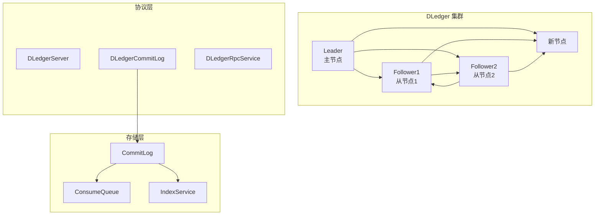

## 6. 索引架构图

### 6.1 IndexFile 文件结构

```
IndexFile (~40MB)
├── IndexHeader (40字节)
│   ├── beginTimestamp (8字节)         # 索引开始时间
│   ├── endTimestamp (8字节)           # 索引结束时间
│   ├── beginPhyOffset (8字节)         # 起始物理偏移量
│   ├── endPhyOffset (8字节)           # 结束物理偏移量
│   ├── hashSlotCount (4字节)          # 哈希槽数量
│   └── indexCount (4字节)             # 索引条目数量
├── Hash Slot Area (20MB)
│   ├── Slot[0] (4字节)                # 指向第一个索引条目
│   ├── Slot[1] (4字节)
│   ├── Slot[2] (4字节)
│   └── ...                          # 最多500万个哈希槽
└── Index Link Area (20MB)
    ├── IndexEntry[0] (20字节)         # 索引条目
    │   ├── KeyHash (4字节)           # 键哈希值
    │   ├── PhyOffset (8字节)         # 物理偏移量
    │   ├── TimeDiff (4字节)          # 时间差
    │   └── NextIndex (4字节)         # 下一个索引位置
    ├── IndexEntry[1] (20字节)
    └── ...                          # 最多400万个索引条目
```

### 6.2 索引查询流程

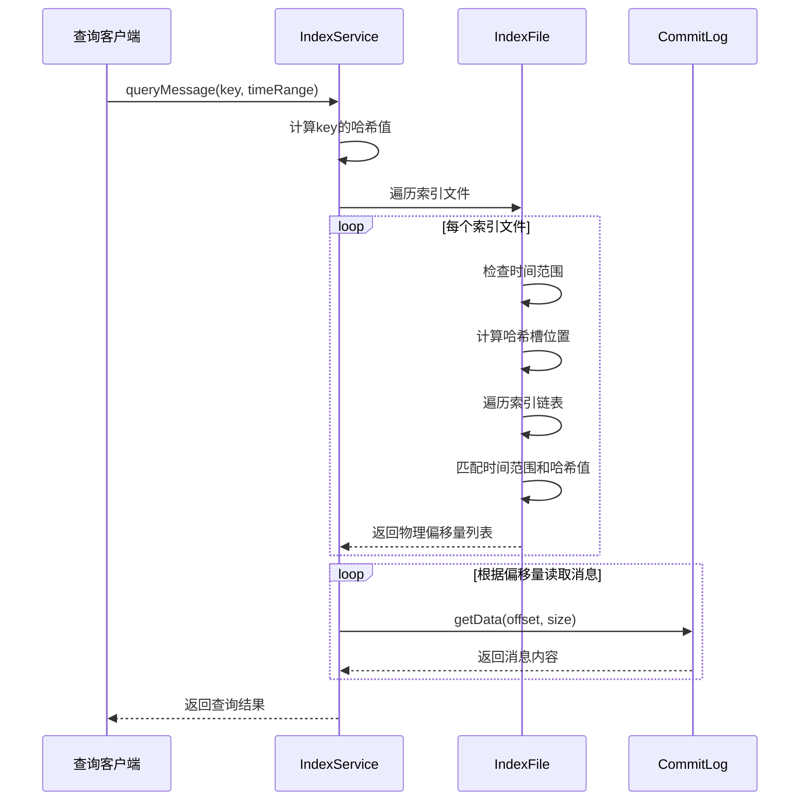

## 7. 定时消息架构图

### 7.1 定时消息处理流程

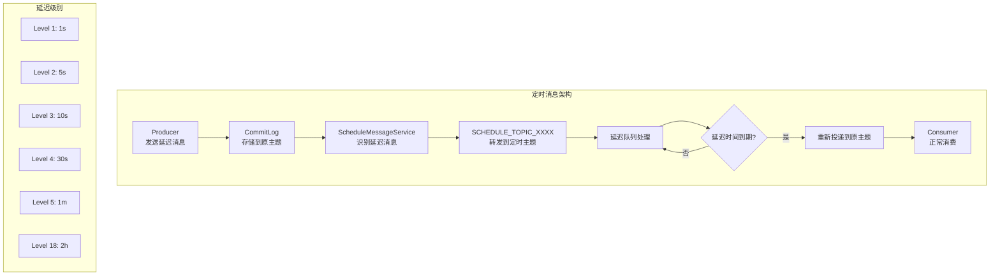

### 7.2 延迟队列组织

```
SCHEDULE_TOPIC_XXXX
├── Queue1 (延迟级别1: 1s)
├── Queue2 (延迟级别2: 5s)
├── Queue3 (延迟级别3: 10s)
├── Queue4 (延迟级别4: 30s)
├── Queue5 (延迟级别5: 1m)
├── Queue6 (延迟级别6: 2m)
├── Queue7 (延迟级别7: 3m)
├── Queue8 (延迟级别8: 4m)
├── Queue9 (延迟级别9: 5m)
├── Queue10 (延迟级别10: 6m)
├── Queue11 (延迟级别11: 7m)
├── Queue12 (延迟级别12: 8m)
├── Queue13 (延迟级别13: 9m)
├── Queue14 (延迟级别14: 10m)
├── Queue15 (延迟级别15: 20m)
├── Queue16 (延迟级别16: 30m)
├── Queue17 (延迟级别17: 1h)
└── Queue18 (延迟级别18: 2h)
```

## 8. 数据恢复架构图

### 8.1 启动恢复流程

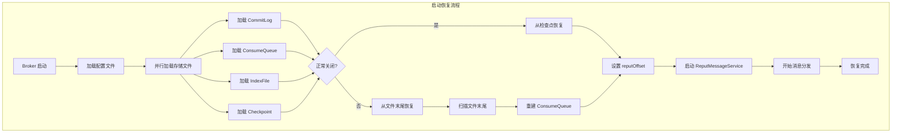

### 8.2 文件完整性检查

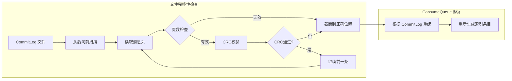

## 9. 性能优化架构图

### 9.1 并发控制架构

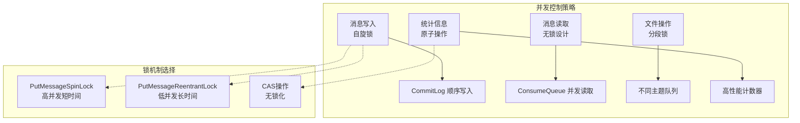

### 9.2 内存优化架构

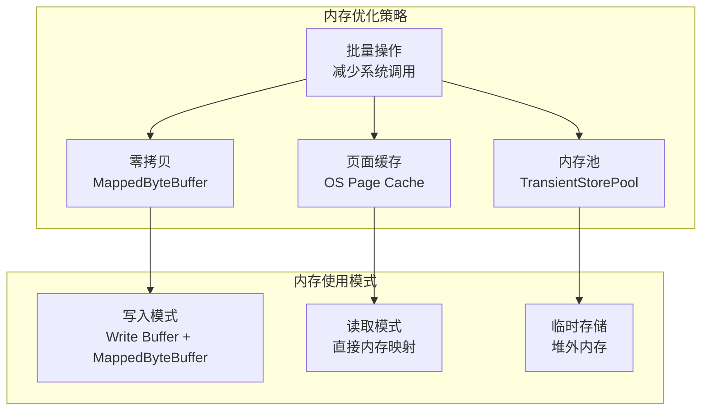

## 10. 监控和统计架构图

### 10.1 统计服务架构

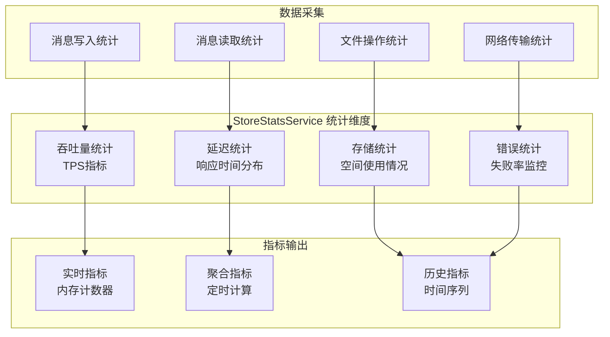

### 10.2 监控指标体系

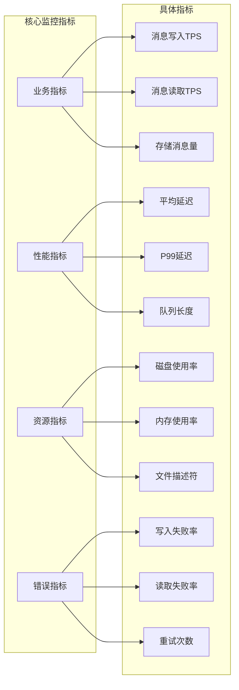

## 总结

通过这些架构图，我们可以清晰地看到 RocketMQ Store 模块的整体设计思想和实现细节：

1. **分层架构**：清晰的接口层、实现层和服务层划分
2. **存储优化**：双层存储设计兼顾性能和查询效率
3. **内存管理**：高效的内存映射和引用计数机制
4. **服务化设计**：独立的服务线程实现异步处理
5. **高可用支持**：主从同步和DLedger一致性协议
6. **索引系统**：多维度索引支持快速查询
7. **定时消息**：灵活的延迟消息处理机制
8. **数据恢复**：完善的故障恢复和数据一致性保证
9. **性能优化**：多层次的并发控制和内存优化
10. **监控统计**：全面的指标采集和监控体系

这些设计使得 RocketMQ Store 模块能够在高并发、大数据量的场景下提供稳定可靠的存储服务。