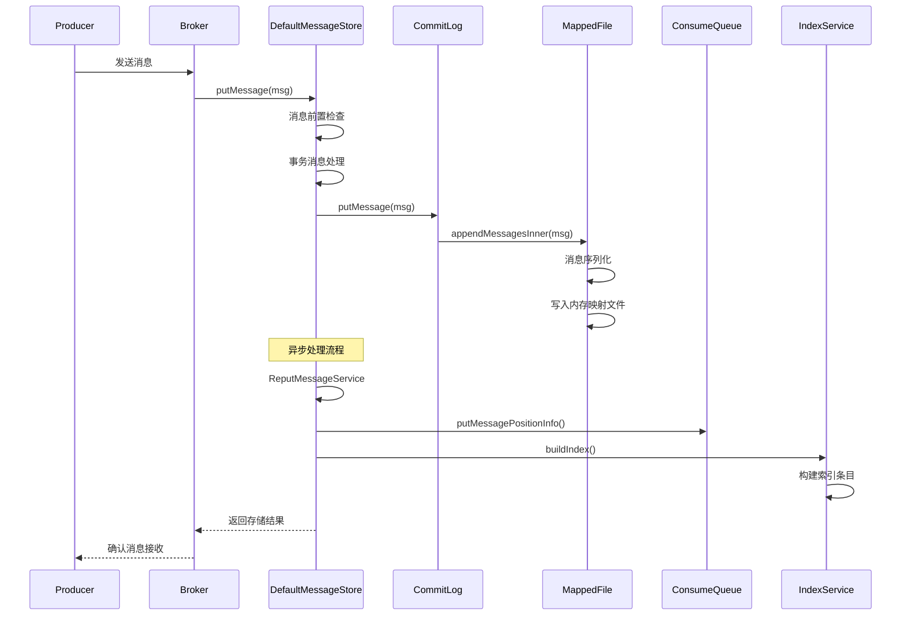
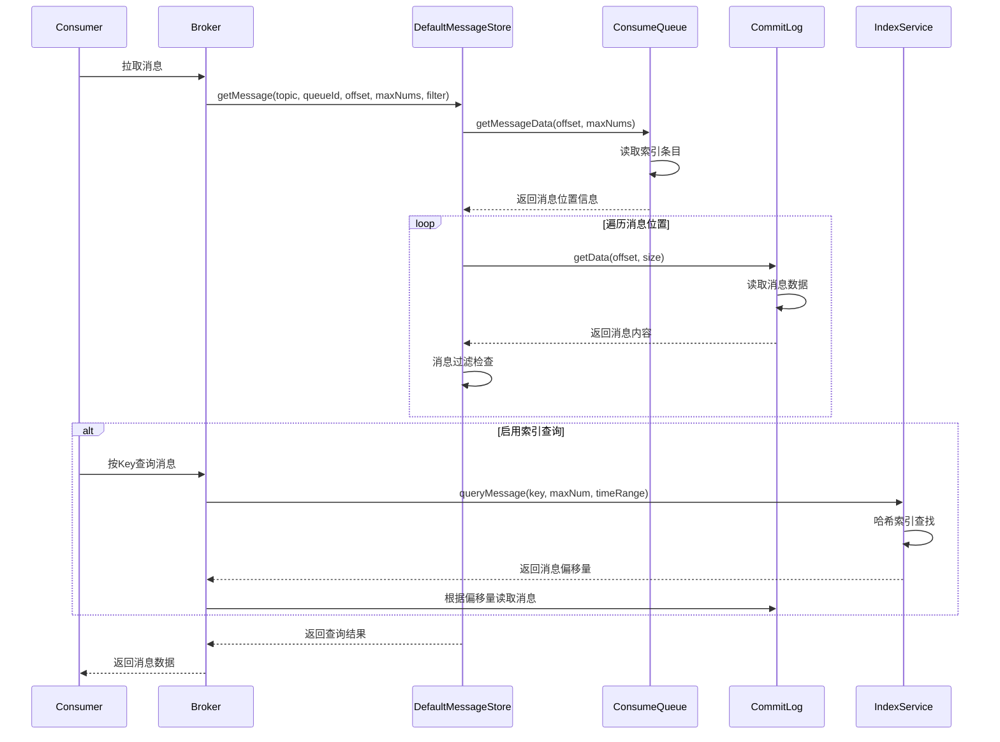
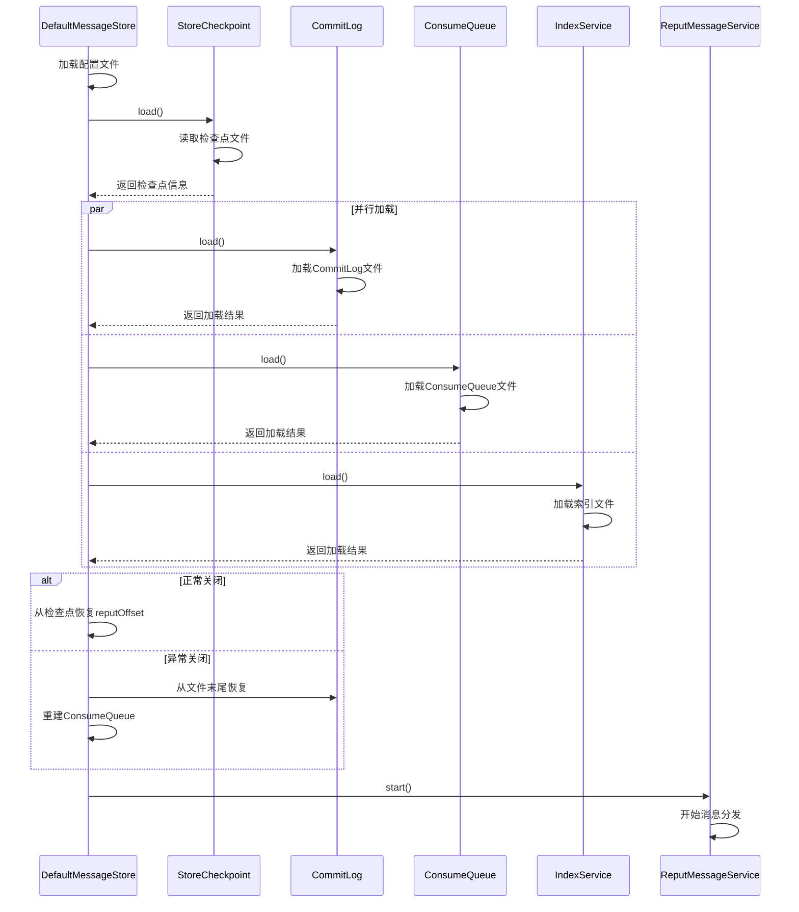

# RocketMQ Store 流程分析

## 概述

RocketMQ Store 模块作为消息队列系统的存储核心，涉及多个复杂的处理流程。本文档详细分析消息存储、查询、索引构建、数据恢复等关键流程，帮助开发者深入理解存储系统的工作机制。

## 1. 消息存储流程

### 1.1 整体存储流程



### 1.2 详细存储流程

#### 1.2.1 消息前置处理

```java
public class DefaultMessageStore {
    public PutMessageResult putMessage(MessageExtBrokerInner msg) {
        // 1. 存储状态检查
        if (this.shutdown) {
            log.warn("message store has shutdown, so putMessage is forbidden");
            return new PutMessageResult(PutMessageStatus.SERVICE_NOT_AVAILABLE, null);
        }

        // 2. Broker角色检查
        if (BrokerRole.SLAVE == this.messageStoreConfig.getBrokerRole()) {
            long value = this.printTimes.getAndIncrement();
            if ((value % 50000) == 0) {
                log.warn("message store is slave mode, so putMessage is forbidden");
            }
            return new PutMessageResult(PutMessageStatus.SERVICE_NOT_AVAILABLE, null);
        }

        // 3. 运行时标志检查
        if (!this.runningFlags.isWriteable()) {
            log.warn("message store is not writeable, so putMessage is forbidden");
            return new PutMessageResult(PutMessageStatus.SERVICE_NOT_AVAILABLE, null);
        }

        // 4. 消息主题长度检查
        if (msg.getTopic().length() > Byte.MAX_VALUE) {
            log.warn("PutMessage topic length too long");
            return new PutMessageResult(PutMessageStatus.MESSAGE_ILLEGAL, null);
        }

        // 5. 消息属性检查
        if (msg.getProperties() != null && msg.getProperties().size() > Short.MAX_VALUE) {
            log.warn("PutMessage properties size too large");
            return new PutMessageResult(PutMessageStatus.PROPERTIES_SIZE_EXCEEDED, null);
        }

        // 6. 事务消息处理
        PutMessageResult result = super.putMessage(msg);
        return result;
    }
}
```

#### 1.2.2 CommitLog 消息存储

```java
public class CommitLog {
    public PutMessageResult putMessage(final MessageExtBrokerInner msg) {
        // 1. 设置消息存储时间
        msg.setStoreTimestamp(System.currentTimeMillis());

        // 2. 设置消息体CRC（如果启用）
        if (this.messageStoreConfig.isCompression()) {
            msg.setBody(UtilAll.compressBytes(msg.getBody()));
        }

        // 3. 设置消息主题和队列ID
        final String topic = msg.getTopic();
        final int queueId = msg.getQueueId();

        // 4. 获取或创建映射文件
        MappedFile mappedFile = this.mappedFileQueue.getLastMappedFile();
        if (mappedFile == null) {
            log.error("create mapped file1 error, topic: " + msg.getTopic() + " clientAddr: " + msg.getBornHostString());
            beginTimeInLock = 0;
            return new PutMessageResult(PutMessageStatus.CREATE_MAPEDFILE_FAILED, null);
        }

        // 5. 写入消息到映射文件
        putMessageLock.lock(); // 自旋锁或可重入锁
        try {
            long beginLockTimestamp = this.defaultMessageStore.getSystemClock().now();
            this.beginTimeInLock = beginLockTimestamp;

            // 消息追加
            AppendMessageResult result = mappedFile.appendMessagesInner(msg, this.appendMessageCallback);

            // 6. 更新统计信息
            long elapsedTime = this.defaultMessageStore.getSystemClock().now() - beginLockTimestamp;
            if (elapsedTime > 500) {
                log.warn("CommitLog#putMessage: put message not in lock elapsed time(ms)={}, bodyLength={}",
                    elapsedTime, msg.getBody().length);
            }

            // 7. 处理存储结果
            switch (result.getStatus()) {
                case PUT_OK:
                    break;
                case END_OF_FILE:
                    unlockMappedFile = mappedFile;
                    // 创建新文件并重试
                    mappedFile = this.mappedFileQueue.getLastMappedFile(0);
                    if (null == mappedFile) {
                        log.error("create mapped file2 error, topic: " + msg.getTopic() + " clientAddr: " + msg.getBornHostString());
                        beginTimeInLock = 0;
                        return new PutMessageResult(PutMessageStatus.CREATE_MAPEDFILE_FAILED, result);
                    }
                    result = mappedFile.appendMessagesInner(msg, this.appendMessageCallback);
                    break;
                case MESSAGE_SIZE_EXCEEDED:
                case PROPERTIES_SIZE_EXCEEDED:
                    return new PutMessageResult(PutMessageStatus.MESSAGE_ILLEGAL, result);
                case UNKNOWN_ERROR:
                    return new PutMessageResult(PutMessageStatus.UNKNOWN_ERROR, result);
                default:
                    return new PutMessageResult(PutMessageStatus.UNKNOWN_ERROR, result);
            }

            elapsedTime = this.defaultMessageStore.getSystemClock().now() - beginLockTimestamp;
            // storeTime

            return new PutMessageResult(PutMessageStatus.PUT_OK, result);

        } finally {
            putMessageLock.unlock();
            if (elapsedTime > 500) {
                log.warn("[NOTIFYME]putMessage in lock cost time(ms)={}, bodyLength={} AppendMessageResult={}",
                    elapsedTime, msg.getBody().length, result);
            }
        }
    }
}
```

#### 1.2.3 消息序列化

```java
class DefaultAppendMessageCallback implements AppendMessageCallback {
    @Override
    public AppendMessageResult doAppend(final long fileFromOffset, final ByteBuffer byteBuffer,
        final int maxBlank, final MessageExtBrokerInner msgInner) {

        // 1. 消息物理偏移量
        long wroteOffset = fileFromOffset + byteBuffer.position();

        // 2. 生成消息ID
        String msgId = MessageDecoder.createMessageId(this.msgIdUtil, wroteOffset);

        // 3. 消息存储时间
        long storeTimestamp = msgInner.getStoreTimestamp();

        // 4. 消息体CRC
        int crc32 = UtilAll.crc32(msgInner.getBody());

        // 5. 消息属性处理
        synchronized (this.cqExtUnit) {
            this.resetByteBuffer(this.msgStoreItemMemoryBuffer, msgInner.getMsgStoreItemLength());

            // 6. 消息存储格式：
            // TOTALSIZE | MAGICCODE | BODYCRC | QUEUEID | FLAG | BODYOFFSET | BODYLEN |
            // STORETIMESTAMP | BORNTIMESTAMP | BORNHOST | STORETIMESTAMP | STOREHOST | RECONSUMETIMES |
            // PreparedTransactionOffset | BODY | PROPERTIES

            // 1) TOTALSIZE: 4字节
            this.msgStoreItemMemoryBuffer.putInt(int);

            // 2) MAGICCODE: 4字节
            this.msgStoreItemMemoryBuffer.putInt(CommitLog.MESSAGE_MAGIC_CODE);

            // 3) BODYCRC: 4字节
            this.msgStoreItemMemoryBuffer.putInt(msgInner.getBodyCRC());

            // 4) QUEUEID: 4字节
            this.msgStoreItemMemoryBuffer.putInt(msgInner.getQueueId());

            // 5) FLAG: 4字节
            this.msgStoreItemMemoryBuffer.putInt(msgInner.getFlag());

            // 6) BODYOFFSET: 8字节
            this.msgStoreItemMemoryBuffer.putLong(byteBuffer.position() + maxBlank +
                this.msgStoreItemMemoryBuffer.position());

            // 7) BODYLEN: 4字节
            this.msgStoreItemMemoryBuffer.putInt(msgInner.getBody().length);

            // 8) STORETIMESTAMP: 8字节
            this.msgStoreItemMemoryBuffer.putLong(storeTimestamp);

            // 9) BORNTIMESTAMP: 8字节
            this.msgStoreItemMemoryBuffer.putLong(msgInner.getBornTimestamp());

            // 10) BORNHOST: 8字节
            this.msgStoreItemMemoryBuffer.putLong(msgInner.getBornHostBytes());

            // 11) STORETIMESTAMP: 8字节 (重复)
            this.msgStoreItemMemoryBuffer.putLong(msgInner.getStoreHostBytes());

            // 12) RECONSUMETIMES: 4字节
            this.msgStoreItemMemoryBuffer.putInt(msgInner.getReconsumeTimes());

            // 13) PreparedTransactionOffset: 8字节
            this.msgStoreItemMemoryBuffer.putLong(msgInner.getPreparedTransactionOffset());

            // 14) BODY: 变长
            this.msgStoreItemMemoryBuffer.put(msgInner.getBody());

            // 15) PROPERTIES: 变长
            Map<String, String> properties = msgInner.getProperties();
            if (properties != null && !properties.isEmpty()) {
                // 属性序列化
                byte[] propertiesBytes = MessageDecoder.messageProperties2String(properties).getBytes(StandardCharsets.UTF_8);
                this.msgStoreItemMemoryBuffer.putInt(propertiesBytes.length);
                this.msgStoreItemMemoryBuffer.put(propertiesBytes);
            } else {
                this.msgStoreItemMemoryBuffer.putInt(0);
            }

            // 16. 更新消息长度
            int msgLen = byteBuffer.position() - wrotePosition;
            this.msgStoreItemMemoryBuffer.putInt(msgLen, wrotePosition);
        }

        // 7. 返回追加结果
        AppendMessageResult result = new AppendMessageResult(
            AppendMessageStatus.PUT_OK,
            wroteOffset,
            msgLen,
            msgId,
            System.currentTimeMillis(),
            queueOffset,
            0);

        return result;
    }
}
```

### 1.3 异步消息分发流程

#### 1.3.1 ReputMessageService 处理流程

```java
class ReputMessageService extends ServiceThread {
    private volatile long reputFromOffset = 0;

    @Override
    public void run() {
        while (!this.isStopped()) {
            try {
                // 1. 从 reputFromOffset 开始处理
                DoMessageResult result = DefaultMessageStore.this.doReput(this.reputFromOffset);

                // 2. 更新处理偏移量
                if (result != null) {
                    this.reputFromOffset = result.getNextBeginOffset();
                }

                // 3. 控制处理频率，避免CPU占用过高
                if (!this.isBreak()) {
                    Thread.sleep(1);
                }
            } catch (Exception e) {
                DefaultMessageStore.this.log.warn("reputMessageService exception", e);
            }
        }
    }

    public long getReputFromOffset() {
        return this.reputFromOffset;
    }

    public void setReputFromOffset(long reputFromOffset) {
        this.reputFromOffset = reputFromOffset;
    }
}
```

#### 1.3.2 消息分发处理

```java
public class DefaultMessageStore {
    public DoMessageResult doReput(final long reputFromOffset) {
        DoMessageResult result = new DoMessageResult();

        // 1. 从 reputFromOffset 开始读取消息
        SelectMappedBufferResult selectResult = this.commitLog.getData(reputFromOffset);
        if (selectResult != null) {
            try {
                this.readCommitLog = true;
                List<DispatchRequest> dispatchRequestList =
                    CommitLog.dispatchCheckDataForReput(selectResult);

                if (dispatchRequestList.isEmpty()) {
                    this.reputMessageService.notifyReputEnd(reputFromOffset, selectResult.getSize());
                    return new DoMessageResult(reputFromOffset + selectResult.getSize(), false);
                }

                // 2. 分发消息到 ConsumeQueue 和 IndexService
                for (DispatchRequest dispatchRequest : dispatchRequestList) {
                    // 统计分发次数
                    MessageExt messageExt = (MessageExt) dispatchRequest.getMessage();
                    DefaultMessageStore.this.updateStoreStatsService(dispatchRequest);

                    // 通知消息分发器
                    DefaultMessageStore.this.doDispatch(dispatchRequest);

                    // 通知消息到达监听器
                    if (BrokerRole.SLAVE != DefaultMessageStore.this.getMessageStoreConfig().getBrokerRole()) {
                        DefaultMessageStore.this.notifyMessageArriving(dispatchRequest);
                    }
                }

                result.setNextBeginOffset(reputFromOffset + selectResult.getSize());
                result.setDispatchSuccess(true);
            } finally {
                selectResult.release();
                this.readCommitLog = false;
            }
        } else {
            this.reputMessageService.notifyReputEnd(reputFromOffset, 0);
        }

        return result;
    }

    // 分发消息
    public void doDispatch(DispatchRequest request) {
        for (CommitLogDispatcher dispatcher : this.dispatcherList) {
            dispatcher.dispatch(request);
        }
    }
}
```

## 2. 消息查询流程

### 2.1 整体查询流程



### 2.2 ConsumeQueue 查询流程

```java
public class ConsumeQueue {
    public SelectMappedBufferResult getMessageData(final long offset, final int maxNum) {
        if (offset < this.getMinOffsetInQueue() || offset > this.getMaxOffsetInQueue()) {
            return null;
        }

        // 1. 计算文件位置
        long startOffset = offset * CQ_STORE_UNIT_SIZE;
        long maxPhysicalPos = this.getMaxPhysicOffset();
        int maxNumInFile = (int) ((maxPhysicalPos - startOffset) / CQ_STORE_UNIT_SIZE);
        maxNum = Math.min(maxNum, maxNumInFile);

        // 2. 查找对应的映射文件
        MappedFile mappedFile = this.mappedFileQueue.findMappedFileByOffset(startOffset);
        if (mappedFile != null) {
            int position = (int) (startOffset % this.mappedFileSize);

            // 3. 读取索引条目
            SelectMappedBufferResult result = mappedFile.selectMappedBuffer(position,
                maxNum * CQ_STORE_UNIT_SIZE);
            return result;
        }

        return null;
    }

    public CqExtUnit getExt(final long offset) {
        // 1. 查找扩展索引文件
        MappedFile mappedFile = this.consumeQueueExtMapper.findMappedFileByOffset(offset);
        if (mappedFile == null) {
            return null;
        }

        // 2. 读取扩展索引数据
        int pos = (int) (offset % this.mappedFileSize);
        SelectMappedBufferResult result = mappedFile.selectMappedBuffer(pos,
            ConsumeQueueExt.CqExtUnit.MIN_EXT_UNIT_SIZE);

        if (result != null) {
            try {
                // 3. 解析扩展索引
                ByteBuffer byteBuffer = result.getByteBuffer();
                CqExtUnit cqExtUnit = new CqExtUnit();
                cqExtUnit.setExtByteLength(byteBuffer.get());
                cqExtUnit.setFilterBitMap(byteBuffer.get());
                cqExtUnit.setMsgStoreTime(byteBuffer.getLong());
                cqExtUnit.setBatchSize(byteBuffer.getInt());

                return cqExtUnit;
            } finally {
                result.release();
            }
        }

        return null;
    }
}
```

### 2.3 CommitLog 消息读取流程

```java
public class CommitLog {
    public SelectMappedBufferResult getData(final long offset) {
        return this.getData(offset, offset == 0);
    }

    public SelectMappedBufferResult getData(final long offset, final boolean returnFirstOnNotFound) {
        // 1. 获取最大偏移量
        long maxOffsetInCommitLog = this.mappedFileQueue.getMaxOffset();

        // 2. 检查偏移量有效性
        if (offset < this.getMinOffset() || offset >= maxOffsetInCommitLog) {
            if (returnFirstOnNotFound) {
                return this.getData(this.getMinOffset());
            }
            return null;
        }

        // 3. 查找对应的映射文件
        MappedFile mappedFile = this.mappedFileQueue.findMappedFileByOffset(offset, offset == 0);
        if (mappedFile != null) {
            // 4. 计算文件内偏移量
            int pos = (int) (offset % this.mappedFileSize);

            // 5. 读取消息数据
            SelectMappedBufferResult result = mappedFile.selectMappedBuffer(pos);
            return result;
        }

        return null;
    }

    // 读取指定大小的数据
    public SelectMappedBufferResult getData(long offset, int size) {
        if (offset < this.getMinOffset() || offset + size > this.getMaxOffset()) {
            return null;
        }

        MappedFile mappedFile = this.mappedFileQueue.findMappedFileByOffset(offset);
        if (mappedFile != null) {
            int pos = (int) (offset % this.mappedFileSize);
            return mappedFile.selectMappedBuffer(pos, size);
        }

        return null;
    }
}
```

### 2.4 索引查询流程

#### 2.4.1 IndexService 查询

```java
public class IndexService {
    public QueryOffsetResult queryOffset(String topic, String key, int maxNum, long begin, long end) {
        QueryOffsetResult queryOffsetResult = new QueryOffsetResult();

        try {
            // 1. 计算key的哈希值
            int keyHashCode = key.hashCode();
            int indexHashSlotNum = this.indexHeader.getHashSlotCount();
            int indexNum = this.indexHeader.getIndexCount();

            // 2. 查找索引文件
            for (IndexFile indexFile : this.indexFileList) {
                // 检查时间范围
                long endTimeStamp = indexFile.getEndTimestamp();
                if (endTimeStamp < begin) {
                    continue;
                }
                long beginTimeStamp = indexFile.getBeginTimestamp();
                if (beginTimeStamp > end) {
                    continue;
                }

                // 3. 在索引文件中查找
                List<Long> phyOffsets = indexFile.selectPhyOffset(keyHashCode,
                    maxNum, begin, end, true);

                if (phyOffsets != null && !phyOffsets.isEmpty()) {
                    queryOffsetResult.getPhyOffsets().addAll(phyOffsets);
                }

                if (queryOffsetResult.getPhyOffsets().size() >= maxNum) {
                    break;
                }
            }
        } catch (Exception e) {
            log.error("queryOffset exception", e);
        }

        return queryOffsetResult;
    }
}
```

#### 2.4.2 IndexFile 查找

```java
public class IndexFile {
    public void load(final String fileName) {
        boolean success = true;
        try {
            File file = new File(fileName);
            MappedByteBuffer mappedByteBuffer = this.mappedFileQueue.getMappedByteBuffer(file);
            if (mappedByteBuffer == null) {
                log.error("load index file {}, but mappedByteBuffer is null", fileName);
                return;
            }

            // 1. 加载索引头
            this.indexHeader.load(mappedByteBuffer);

            // 2. 计算哈希槽和索引区域位置
            this.hashSlotNum = this.indexHeader.getHashSlotCount();
            this.indexNum = this.indexHeader.getIndexCount();

            this.hashSlotAddr = MappedFileUtil.getStartPositionOfHashSlot(
                this.indexHeader.getIndexCount(), this.hashSlotNum);
            this.indexAddr = this.indexHeader.getBeginTimestampAddress() +
                IndexHeader.INDEX_HEADER_SIZE;
        } catch (Exception e) {
            success = false;
            log.error("load index file {} error", fileName, e);
        }

        if (!success) {
            this.mappedFileQueue.destroyMappedFile();
        }
    }

    public List<Long> selectPhyOffset(final int hash, final int maxNum, final long begin,
        final long end, boolean lock) {
        List<Long> phyOffsets = new ArrayList<>(maxNum);

        // 1. 计算哈希槽位置
        int slotPos = hash % this.hashSlotNum;
        int absSlotPos = IndexHeader.INDEX_HEADER_SIZE + slotPos * 4;

        // 2. 获取哈希槽值
        int slotValue = this.mappedByteBuffer.getInt(absSlotPos);
        if (slotValue <= 0 || slotValue > this.indexNum) {
            return Collections.emptyList();
        }

        // 3. 遍历索引链表
        int nextIndex = slotValue;
        for (int i = 0; (i < maxNum) && (nextIndex > 0); i++) {
            int absIndexPos = this.indexAddr + (nextIndex - 1) * 20;

            // 读取索引条目
            int keyHash = this.mappedByteBuffer.getInt(absIndexPos);
            long phyOffset = this.mappedByteBuffer.getLong(absIndexPos + 4);
            long timeDiff = (this.mappedByteBuffer.getInt(absIndexPos + 12) & 0x00000000FFFFFFFFL);
            int prevIndex = this.mappedByteBuffer.getInt(absIndexPos + 16);

            // 时间范围检查
            if (timeDiff < 0) {
                break;
            }

            long time = timeDiff * 1000 + this.indexHeader.getBeginTimestamp();
            if (time >= begin && time <= end && keyHash == hash) {
                phyOffsets.add(phyOffset);
            }

            nextIndex = prevIndex;
        }

        return phyOffsets;
    }
}
```

## 3. 数据恢复流程

### 3.1 启动恢复流程



### 3.2 CommitLog 恢复流程

```java
public class CommitLog {
    public boolean load() {
        boolean result = true;

        // 1. 加载映射文件
        MappedFile mappedFile = this.mappedFileQueue.load();
        if (mappedFile != null) {
            result = mappedFile != null;
            log.info("load commit log " + (result ? "OK" : "Failed"));
        }

        return result;
    }

    // 恢复CommitLog
    public void recoverNormally() {
        boolean checkCRCOnRecover = this.defaultMessageStore.getMessageStoreConfig().isCheckCRCOnRecover();
        final List<MappedFile> mappedFiles = this.mappedFileQueue.getMappedFiles();

        if (!mappedFiles.isEmpty()) {
            // 1. 从最后一个文件开始检查
            int index = mappedFiles.size() - 3;
            if (index < 0) {
                index = 0;
            }

            MappedFile mappedFile = mappedFiles.get(index);
            ByteBuffer byteBuffer = mappedFile.sliceByteBuffer();
            long processOffset = mappedFile.getFileFromOffset();
            long mappedFileOffset = 0;
            long msgSize = 0;

            try {
                // 2. 遍历文件中的消息
                while (true) {
                    // 检查消息完整性
                    int dataSize = byteBuffer.getInt();
                    msgSize = dataSize + 4;

                    // 检查消息魔数
                    int magicCode = byteBuffer.getInt();
                    if (magicCode != MESSAGE_MAGIC_CODE && magicCode != BLANK_MAGIC_CODE) {
                        log.warn("recover normally, found illegal magic code: 0x{}", Integer.toHexString(magicCode));
                        break;
                    }

                    // CRC校验
                    if (checkCRCOnRecover) {
                        int crc = byteBuffer.getInt();
                        int bodyCRC = byteBuffer.getInt();
                        if (crc != bodyCRC) {
                            log.warn("recover normally, found illegal crc: {}, bodyCRC: {}", crc, bodyCRC);
                            break;
                        }
                    }

                    // 跳过消息体
                    int bodyLen = byteBuffer.getInt();
                    int msgBodyLen = byteBuffer.getInt();
                    if (msgBodyLen < 0) {
                        break;
                    }

                    // 位置更新
                    processOffset += msgSize;
                    mappedFileOffset += msgSize;
                    byteBuffer.position(byteBuffer.position() + msgSize);

                    // 检查是否超出文件大小
                    if (mappedFileOffset >= mappedFile.getFileSize()) {
                        index++;
                        if (index >= mappedFiles.size()) {
                            index = mappedFiles.size() - 1;
                            break;
                        }
                        mappedFile = mappedFiles.get(index);
                        byteBuffer = mappedFile.sliceByteBuffer();
                        mappedFileOffset = 0;
                    }
                }
            } catch (Exception e) {
                log.error("recover normally exception", e);
            }

            // 3. 设置恢复点
            processOffset += mappedFile.getFileFromOffset();
            this.mappedFileQueue.setFlushedWhere(processOffset);
            this.mappedFileQueue.setCommittedWhere(processOffset);
            this.mappedFileQueue.truncateDirtyFiles(processOffset);
        }
    }
}
```

### 3.3 ConsumeQueue 恢复流程

```java
public class ConsumeQueue {
    public boolean load() {
        boolean result = this.mappedFileQueue.load();
        log.info("load consume queue " + this.topic + "-" + this.queueId + " " + (result ? "OK" : "Failed"));

        // 1. 恢复正确偏移量
        this.correctLogicOffset(this.minLogicOffset);
        return result;
    }

    // 修正逻辑偏移量
    public void correctLogicOffset(long phyMinOffset) {
        // 1. 从最后一个文件开始检查
        MappedFile mappedFile = this.mappedFileQueue.getLastMappedFile();
        if (mappedFile != null) {
            // 2. 从文件末尾开始查找最后一个有效条目
            SelectMappedBufferResult selectMappedBufferResult = mappedFile.selectMappedBuffer(0);
            if (selectMappedBufferResult != null) {
                try {
                    int maxValidPos = 0;
                    int pos = 0;
                    ByteBuffer byteBuffer = selectMappedBufferResult.getByteBuffer();

                    while (pos + CQ_STORE_UNIT_SIZE <= selectMappedBufferResult.getSize()) {
                        long offsetPy = byteBuffer.getLong(pos + 0);
                        int sizePy = byteBuffer.getInt(pos + 8);
                        long tagsCode = byteBuffer.getLong(pos + 12);

                        // 检查消息有效性
                        if (offsetPy >= phyMinOffset) {
                            maxValidPos = pos;
                            pos += CQ_STORE_UNIT_SIZE;
                        } else {
                            break;
                        }
                    }

                    // 3. 设置正确偏移量
                    this.maxPhysicOffset = offsetPy + sizePy;
                    if (maxValidPos > 0) {
                        long where = (mappedFile.getFileFromOffset() + maxValidPos) / CQ_STORE_UNIT_SIZE;
                        if (where > 0) {
                            this.logicOffset = where - 1;
                        }
                    }
                } finally {
                    selectMappedBufferResult.release();
                }
            }

            // 4. 截断无效数据
            this.mappedFileQueue.truncateDirtyFiles(phyMinOffset);
        }
    }
}
```

## 4. 文件管理流程

### 4.1 文件创建和清理流程

```java
public class MappedFileQueue {
    // 创建新的映射文件
    public MappedFile getLastMappedFile(final long startOffset, boolean needCreate) {
        long createOffset = -1;
        MappedFile mappedFileLast = this.getLastMappedFile();

        if (mappedFileLast == null) {
            createOffset = startOffset - (startOffset % this.mappedFileSize);
        } else if (mappedFileLast.isFull()) {
            createOffset = mappedFileLast.getFileFromOffset() + this.mappedFileSize;
        }

        if (createOffset != -1 && needCreate) {
            String nextFilePath = this.storePath + File.separator + UtilAll.offset2FileName(createOffset);
            MappedFile mappedFile = null;

            try {
                // 使用异步分配服务创建文件
                if (this.allocateMappedFileService != null) {
                    mappedFile = this.allocateMappedFileService.putRequestAndReturnMappedFile(nextFilePath,
                        this.mappedFileSize);
                } else {
                    mappedFile = new MappedFile(nextFilePath, this.mappedFileSize);
                }

                if (mappedFile != null) {
                    if (this.mappedFiles.isEmpty()) {
                        mappedFile.setFirstCreateInQueue(true);
                    }
                    this.mappedFiles.add(mappedFile);
                }

                return mappedFile;
            } catch (IOException e) {
                log.error("create mapped file exception", e);
            }
        }

        return mappedFileLast;
    }

    // 清理过期文件
    public int deleteExpiredFileByTime(final long expiredTime) {
        int deleteFilesCount = 0;
        if (mappedFiles.isEmpty()) {
            return deleteFilesCount;
        }

        // 获取文件保留时间
        long interval = System.currentTimeMillis() - expiredTime;
        MappedFile mappedFile = null;
        Iterator<MappedFile> iterator = mappedFiles.iterator();

        while (iterator.hasNext()) {
            mappedFile = iterator.next();

            // 检查文件是否过期
            long fileLiveTime = mappedFile.getLastModifiedTimestamp() + interval;
            if (System.currentTimeMillis() >= fileLiveTime &&
                mappedFile.isFirstCreateInQueue() == false &&
                mappedFile.isAvailable()) {

                // 检查文件是否可以被删除
                if (this.isFileAvailable(mappedFile)) {
                    // 删除文件
                    if (mappedFile.destroy(1000 * 60)) {
                        iterator.remove();
                        deleteFilesCount++;
                        log.info("destroy expired file: {}", mappedFile.getFileName());
                    } else {
                        log.warn("destroy expired file failed: {}", mappedFile.getFileName());
                    }
                } else {
                    break;
                }
            } else {
                break;
            }
        }

        return deleteFilesCount;
    }
}
```

### 4.2 文件刷盘流程

```java
public class MappedFile {
    // 刷盘操作
    public int flush(final int flushLeastPages) {
        if (this.isAbleToFlush(flushLeastPages)) {
            if (this.hold()) {
                int value = getReadPosition();

                try {
                    // 强制刷盘
                    if (writeBuffer != null || this.fileChannel.position() != 0) {
                        this.fileChannel.force(false);
                    } else {
                        this.mappedByteBuffer.force();
                    }
                } catch (Throwable e) {
                    log.error("Error occurred when force data to disk.", e);
                }

                // 更新刷盘位置
                this.flushedPosition.set(value);
                this.release();
            } else {
                log.warn("in flush, hold failed, flush offset = " + this.flushedPosition.get());
                this.flushedPosition.set(getReadPosition());
            }
        }
        return this.getFlushedPosition();
    }

    // 提交操作（写入内存）
    public int commit(final int commitLeastPages) {
        if (writeBuffer == null) {
            // 没有写缓存，无需提交
            return this.readPosition.get();
        }

        if (this.isAbleToCommit(commitLeastPages)) {
            if (this.hold()) {
                commit0(commitLeastPages);
                this.release();
            } else {
                log.warn("in commit, hold failed, commit offset = " + this.committedPosition.get());
            }
        }

        // 所有数据已提交
        if (this.writeBuffer != null && this.transientStorePool != null &&
            this.fileSize == this.committedPosition.get()) {
            this.transientStorePool.returnBuffer(writeBuffer);
            this.writeBuffer = null;
        }

        return this.committedPosition.get();
    }

    // 执行提交操作
    protected void commit0(final int commitLeastPages) {
        int writePos = this.writeBuffer.position();
        int lastCommittedPosition = this.committedPosition.get();

        if (writePos - lastCommittedPosition > commitLeastPages) {
            try {
                // 将写缓冲区数据传输到文件映射缓冲区
                FileChannel fileChannel = this.mappedFile.getChannel();
                this.writeBuffer.flip();
                fileChannel.position(lastCommittedPosition);
                fileChannel.write(this.writeBuffer);
                this.committedPosition.set(writePos);
            } catch (Throwable e) {
                log.error("Error occurred when commit data to FileChannel.", e);
            }

            this.writeBuffer.clear();
        }
    }
}
```

## 5. 性能优化要点

### 5.1 内存映射优化

1. **页面缓存利用**：充分利用操作系统的页面缓存机制
2. **预分配文件**：文件创建时预分配空间避免文件系统碎片
3. **批量操作**：合并多个I/O操作减少系统调用
4. **零拷贝技术**：通过内存映射避免数据在用户空间和内核空间之间拷贝

### 5.2 并发控制优化

1. **读写分离**：消息写入和读取使用不同的锁机制
2. **分段锁**：不同主题队列使用不同的锁减少竞争
3. **无锁设计**：在高频路径使用CAS操作替代锁
4. **线程池隔离**：不同服务使用独立线程池避免互相影响

### 5.3 存储优化

1. **顺序写入**：CommitLog采用顺序写入模式提供最佳性能
2. **批量刷盘**：合并多次刷盘请求减少磁盘I/O
3. **文件预加载**：启动时预加载关键文件到内存
4. **异步处理**：消息分发和索引构建异步进行

## 6. 总结

RocketMQ Store 模块通过精心设计的处理流程，实现了高性能、高可靠的消息存储功能：

1. **消息存储流程**：通过分层存储和异步分发实现高性能写入
2. **消息查询流程**：通过索引结构和多级缓存实现快速查询
3. **数据恢复流程**：通过检查点机制和文件完整性校验保证数据安全
4. **文件管理流程**：通过智能的文件创建、清理和刷盘策略优化存储性能

这些流程设计充分体现了现代分布式存储系统的最佳实践，为RocketMQ提供了坚实的数据存储基础。